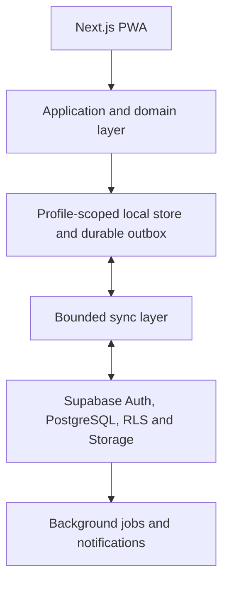
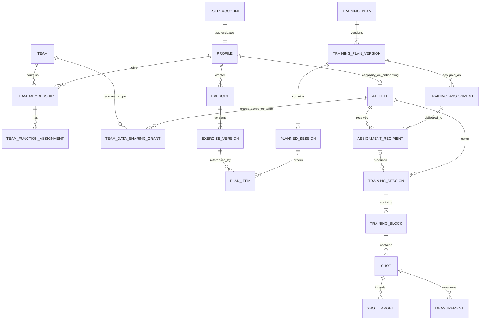

# Cloud, Identity and Collaboration Architecture

**Status:** Accepted  
**Version:** 1.0  
**Date:** 2026-08-11

**Revision note (2026-08-24, shared Training Session recording and corrections).**
The Exercise Library discovery resolved the Team recording-consent and historical
correction boundary. Section 17.2 now distinguishes an athlete's explicit prospective
Team-session recording permission from Team membership and lasting analytics access.
Sections 12-15 require append-only auditability for result corrections and ordinary
voiding, and notification of the completed Session's original, still-authorised
participants after a post-completion change. Ordinary voiding is not hard deletion;
before-and-after values remain protected by the recipient's current data-sharing grant.
The Exercise Library's Version 1 Athlete Note is separately private to its athlete and
is not exposed by Team participation or a Team data-sharing grant. Section 12.4 records
the separately approved, bounded offline upload path for one-device Team Exercise
Sessions. That path is a feature-specific extension built on the durable-outbox and
idempotent-sync backbone Stage B0.4 already requires — not a second, parallel sync
implementation. Its Team-specific authority revalidation and partial-bundle rejection
remain separate Exercise work. The Exercise Library capability mapping now follows the
existing Free / Personal Athlete / Team Workspace / Coaching layers in Section 17.5;
athlete-owned raw Team Session results remain viewable and exportable independently of
a Personal Athlete entitlement.

**Revision note (2026-08-18, consolidated) — superseded in part by the 2026-08-24
mandatory-identity revision below.** Its §12.1 reframing (an outbox as an illustrative,
non-required sketch) and its §18 Phase 3 replacement (an Assessment Adoption prototype as
the first cloud-authority exercise) no longer hold: a durable outbox is now a required
Stage B0.4 deliverable, and Local Adoption is no longer the forward path at all. The rest
of this note stands. `docs/adr/0019-cloud-identity-and-data-authority-transition.md`
is a **Proposed**, related architectural decision — it proposes, and does not yet
finally decide, the authority boundary for the Phase 3/4 transition below. This
document's Accepted status and its identity/product decisions (Sections 3-17) are
unchanged. The following bullets and phase steps are corrected **in place**, not merely
annotated with a disclaimer layered above unchanged text:

- §4.1's infrastructure list — IndexedDB is now described as a possible future option
  for an account-scoped read cache or offline outbox, never a prerequisite.
- §12.1's heading and list are retitled and reframed as an illustrative, undesigned
  future sketch — it no longer describes accepted, mandatory mechanics.
- §18 Phase 2 is retitled to name specifically the ADR-0015/0016/0017/0018 IndexedDB
  local-backend track, which remains distinct and currently blocked, and is never reused
  as the name for a future cache/outbox (new, separately numbered work if it is ever
  built).
- §18 Phase 3's original "Sync one session through an outbox" step is replaced — ADR-0019
  instead proposes an **Assessment Adoption development/staging prototype** (ADR-0019
  Decision 15 stage 11) as the first concrete cloud-authority exercise, stated as a proposal under
  a Proposed ADR, never as the already-decided MVP mechanism — and its "test offline
  mutation followed by reconnect" step, which contradicted this same section's own
  admission that no generic personal-cloud outbox exists for that phase, is replaced
  with tests appropriate to that prototype (online-required writes, not an offline
  mutation queue). The later Exercise-specific path in §12.4 is separate.

IndexedDB may still be selected later for a separately designed, account-scoped read
cache or offline outbox (ADR-0019 Decision 3 role C / Decision 10) — new, separately
numbered future work, never a reuse of ADR-0016 migration output or ADR-0017 activation
evidence.

**Revision note (2026-08-20, Team Seat hypothesis).** Section 17.5's provisional
commercial model now counts each active Team Membership as one uniform `Team Seat`,
independently of whether that person participates as a player or holds one or several
contextual team functions. This replaces the earlier split between eight athlete places
and four non-playing places. Optional Coaching capability remains a separate
workspace-level module assigned to named coaches; it is not a more expensive kind of
membership seat. Exact seat quantities, included allowances and prices remain deferred,
configurable commercial hypotheses for post-pilot validation.

**Revision note (2026-08-20, Team Foundation beta correction pass).**
`docs/TEAM_FOUNDATION_AND_ADMINISTRATION_BETA_SPECIFICATION.md` is now the canonical
product source of truth for the first Team Foundation beta and explicitly supersedes
several older claims below that predate it. §6.2/§6.3's function vocabulary and §17.2's
decisions 1, 4, and 5 are corrected **in place** in this revision, not merely annotated:

- §6.2/§6.3: **no Captain function is modeled.** The earlier "athlete and captain"/
  "athlete, captain and training lead" composition examples and the Captain row in the
  §6.3 function table are removed — the beta's three contextual functions are Team Admin,
  Coach, and Training Lead only (see `docs/DOMAIN_GLOSSARY.md`/`docs/adr/0022` Decision 2).
  On-ice captaincy, if ever surfaced in a future UI, would be a presentational label, not
  an application permission or a `TeamFunction`.
- §17.2 item 1: **team creation is not open to any confirmed account.** The beta gates it
  behind an explicitly granted, closed-pilot capability per profile (never a role or a
  self-service toggle) — a broader self-service creation model, if adopted after the
  pilot, is a distinct future product decision this document does not make on its own.
- §17.2 item 4: **consent is granted to a Team, not separately negotiated per named
  coach.** The athlete chooses a data scope and grants it to the Team as a whole (with an
  independent choice about historical sharing); any person who currently holds the
  Team-scoped Coach function may then use that Team's granted access — access is not a
  collection of per-coach grants requiring a fresh acceptance each time a new coach is
  named. Ending the Coach function (or the Team-scoped consent itself) ends access
  immediately, same as before. See
  `docs/TEAM_FOUNDATION_AND_ADMINISTRATION_BETA_SPECIFICATION.md` §13.
- §17.2 item 5 ("Captain default access") is replaced with a Training Lead default-access
  decision, since no Captain function exists: a Training Lead may see assignment/workflow
  status (whether an assigned training was completed, a limited volume indicator such as
  stones played) needed to coordinate training, but never an athlete's released
  performance analyses — that remains gated to the Coach function and the athlete's
  Team-scoped consent, unaffected by also holding Training Lead or Team Admin.

§17.2 item 7 (unclaimed athlete profiles) already describes a **later** target capability
explicitly deferred beyond this beta ("not part of the first personal-cloud release... the
later team and coaching implementation") and is not corrected further here — the beta
specification's own supersession note refers to a claim that this capability is *already
built*, which this document never claimed.

**Revision note (2026-08-21, remaining stale references corrected in place).** An
independent review found the prior revision's "corrected in place" claim was
incomplete: several further sections still treated Captain as an example permission-
bearing persona, or still described the future Coaching data-sharing grant as a
person-specific relationship negotiated with each named coach, contradicting §17.2
item 4's already-corrected Team-scoped model. Corrected in this revision:

- §3.3's role-composition example replaced "captain" with "Training Lead" (a person
  cannot hold a Captain function at all, so it was never a valid example of a
  contextual role) and now states explicitly that no Team Captain function exists.
- §5.1's identity-concepts table replaces `CoachingRelationship` (defined there as "a
  time-bounded athlete-to-coach relationship") with `TeamDataSharingGrant` — an
  athlete's chosen data scope shared with a **Team**, usable by whoever currently
  holds that Team's Coach function, never negotiated per named coach.
- §6.3's composable-functions example replaced `captain_training_lead` with
  `admin_coach`, since Captain is not a function this product models at all.
- §6.6's commercial-layers example replaced "a workspace administered by a captain"
  with "one of its Team Admins."
- §7.2/§7.3/§7.4 replace `CoachingRelationship` with `TeamDataSharingGrant`
  throughout, and state explicitly that the grant is athlete-to-Team, not
  athlete-to-coach.
- §17.2 item 6 ("Visibility after coaching ends") previously described continued
  access as depending on "a separate active coaching relationship" — restoring
  exactly the person-specific model item 4 (in the prior revision) already replaced
  with a Team-scoped grant. Corrected to state the same Team-scoped rule item 4 uses:
  access depends on currently holding Coach for a Team with a live grant, never on a
  relationship with the specific individual.
- §17.5's Individual Billing Account example and the closed-pilot evidence bullet
  both replaced "captain(s)" with "Team Admin(s)" — Captain is not a role this
  product administers billing or pilot evidence around.
- §17.5's Team Workspace Coaching model and entitlement-expiry items replace
  "person-specific `CoachingRelationship`" with the athlete's `TeamDataSharingGrant`
  to the Team, matching §7.3/§17.2 item 4/6.
- The Team Seat wording in §17.5's seat-consumption and workspace-scope lists now
  states explicitly that a Membership becomes non-operational because its **Team**
  is archived, not because of any status on the Membership record itself, matching
  `docs/TEAM_FOUNDATION_AND_ADMINISTRATION_BETA_SPECIFICATION.md` §14.

`docs/DOMAIN_GLOSSARY.md`'s **Coach** entry, which referenced `CoachingRelationship`
as the future grant's name, is corrected in the same pass to name
`TeamDataSharingGrant` instead.

**Revision note (2026-08-24, mandatory identity and Free Cloud Foundation).**
`docs/MANDATORY_IDENTITY_AND_FREE_CLOUD_FOUNDATION_SPECIFICATION.md` is now the canonical
product source for identity requirement, onboarding, Profile-scoped ownership, offline
behaviour after onboarding, and the Free Cloud Core; `docs/adr/0024-mandatory-identity-and-free-structured-cloud-foundation.md`
is the accepted (not implemented) architecture decision. Both **supersede** several
decisions previously recorded in this document, corrected **in place** below rather than
annotated above unchanged text:

- **§3.1 no longer promises accountless use.** Local-first is redefined as reliable
  offline training for a previously authenticated and onboarded Profile.
- **§5.2/§5.3.** Accountless use is withdrawn as a valid product path. §5.3 now records
  the mandatory identity gate and minimal onboarding.
- **§5.5's initial local-history import is withdrawn.** The existing unscoped local data
  is disposable early-test data and will be discarded once, explicitly — never adopted,
  claimed, imported or merged. Local Adoption (ADR-0019/0020) is not the forward path.
- **§4.2's authority table** now names Profile scope and the Free Cloud Core.
- **§6.6/§17.5.** Basic structured cloud persistence and basic restore move to **Free**.
  The paid personal tier sells value *derived* from stored data. Its final commercial
  name is **not decided**; `Personal Athlete` is a working label only.
- **§15.2's account deletion baseline** loses the "retain as local-only history" option:
  there is no usable local-only athlete after account deletion.
- **§17.1 items 1, 2 and 4** are corrected accordingly.
- **§18's phases** are re-sequenced behind Stages B0.1-B0.4.

Valid Team ownership, permission, notification, sharing and rights decisions elsewhere in
this document are **unchanged**. Nothing in this revision claims any of the target
behaviour is implemented — the runtime is still accountless-capable and `localStorage` is
still the sole production persistence authority.

## 1. Purpose

This document defines the target architecture for extending the current local-first
Release Time Tracker into a cloud-enabled Curling Performance Platform for athletes,
coaches, teams and, later, organisations.

It covers:

- identity and account ownership;
- local-first storage and cloud synchronisation;
- athletes, coaches, teams and contextual roles;
- performance-data ownership and sharing;
- exercises and the public exercise library;
- training plans, planned sessions and assignments;
- extensible shot targets and measurements;
- security boundaries and lifecycle rules;
- the staged migration from the current application.

This document is a target design, not an instruction to implement every capability at
once. The implementation sequence in Section 18 is intentionally incremental.

## 2. Related authoritative documents

This specification must be read together with:

- `PRODUCT_DIRECTION_AND_PRINCIPLES.md`;
- `SYSTEM_ARCHITECTURE.md`;
- `DOMAIN_GLOSSARY.md`;
- `TECHNICAL_DEBT_AND_ROADMAP.md`;
- all accepted Architecture Decision Records.

If this specification introduces a new accepted domain term, the Domain Glossary must
be updated in the same change that implements the term. If implementation changes an
architectural rule described here, this document and the relevant ADR must be updated.

## 3. Product and architecture principles

### 3.1 Offline-capable training after authenticated onboarding

**Corrected in the 2026-08-24 revision — this section previously promised accountless
use.** An athlete must be able to start, perform, finish and review supported training
without an internet connection or a functioning cloud service, **once that device has
completed authentication and personal Profile onboarding and holds trusted
Profile-scoped local state**. A permanent active connection is never required during
training, and missing connectivity must never block completing a training or starting
another one.

Identity itself is **not** optional. First authentication and first onboarding on a
device require connectivity, and a first-time, signed-out, or deleted-account device
cannot bypass the gate by going offline. See
`docs/MANDATORY_IDENTITY_AND_FREE_CLOUD_FOUNDATION_SPECIFICATION.md` §2 and §5.

### 3.2 Athlete-centred ownership

The athlete owns their personal performance history. Joining a team or accepting a
coach does not transfer ownership of sessions, shots, measurements, goals or athlete
feedback.

### 3.3 Contextual roles, not global user types

A person can be an athlete in one team, a Training Lead in the same team, a coach in
another team and an administrator of an organisation. `coach`, `training_lead` and
`admin` must not be global fields on the user account. There is no modeled Team
Captain function — on-ice captaincy, if ever surfaced, would be a presentational
label, never an application permission (see §6.2/§6.3 and `docs/adr/0022` Decision 2).

### 3.4 Shared content and personal performance are different domains

Teams may own their team configuration, training plans and team-created content.
Athletes retain ownership of their execution data. An assignment links the two without
copying ownership from one domain to the other.

### 3.5 Historical meaning must not change

Recorded shots remain historically stable. Exercises, planned sessions and training
plans are versioned so later edits cannot change what an athlete was instructed to do
or what they actually completed.

### 3.6 Domain concepts remain provider-neutral

Supabase, Vercel, Brower and future sensor providers are infrastructure or integration
choices. Their identifiers and APIs must not become core sporting concepts.

### 3.7 Progressive complexity

The first cloud release should solve individual backup and **basic restore after signing
in on a new device** (corrected 2026-08-24 — cross-device *continuation* of in-progress
work remains deferred; see §12 and §16). Microservices, a generic access-control language
and speculative high-volume infrastructure are out of scope.

**The Team Foundation collaboration baseline already exists** — Teams, invitations,
Memberships, the three composable contextual functions, and the administration/exit/Team
Admin succession lifecycles, with their SQL layer executed and verified (ADR-0022). What
follows the personal identity and Free Cloud foundation is the *remaining* collaboration
work: athlete data sharing via the Team-scoped `TeamDataSharingGrant` and the coaching
access derived from it (§7.3, Phase 5).

### 3.8 Identity, roles, permissions and commercial entitlements are separate

A user account identifies a person; it is not itself a paid product. Contextual team
functions describe responsibility, permission bundles describe allowed actions, and a
**commercial entitlement determines the active commercial tier or capability set** for a
person or workspace. Identity, `Profile`, permission bundles, Team functions, entitlement
and data ownership must not be collapsed into a single role or account type.

**An entitlement is not inherently paid** (corrected 2026-08-24): it covers both the
**default Free entitlement** and any **additional paid entitlement** — the paid personal
tier, Team Workspace, and later Coaching. Free is a genuine entitlement even though nothing
is paid for it. **The default Free entitlement is granted by completed personal
onboarding**, never by authentication or Profile creation alone (§5.3, §6.6, and
`docs/MANDATORY_IDENTITY_AND_FREE_CLOUD_FOUNDATION_SPECIFICATION.md` §3.4).

For a **paid** capability, access requires both the applicable domain permission and the
relevant **paid** entitlement being active. Payment never transfers ownership of athlete
performance data. A lapsed paid entitlement may make paid collaboration capabilities
unavailable or read-only, but must not prevent an athlete from accessing or exporting their
owned history, and must not withdraw the Free entitlement or the Free Cloud Core for data
already recorded.

**No entitlement implementation, schema or lifecycle exists yet** — see §17.5 for the
provisional commercial model and `docs/TECHNICAL_DEBT_AND_ROADMAP.md` for the current gap.

## 4. Target system shape



### 4.1 Recommended infrastructure

- Next.js remains the application shell and web delivery layer.
- **The existing ADR-0015/0016/0017/0018 IndexedDB migration/activation track is RETIRED
  as the forward production path** (2026-08-24 revision — the data it would carry forward
  is disposable; see §5.5 and §18 Phase 2). ADR-0015's unwired adapter remains valid
  infrastructure. **Stage B0.4's required durable outbox, and any local read cache, are a
  new, separately designed, Profile-scoped mechanism** — never a continuation or
  repurposing of that track, and never a reuse of ADR-0016's migration markers or
  ADR-0017's activation evidence. Which local store backs them is a Stage B0.3/B0.4
  decision.
- `localStorage` remains the sole production local store today, unscoped by identity.
- Supabase Auth provides account authentication.
- PostgreSQL stores cloud records and relationships.
- Row Level Security enforces access at the database boundary.
- Supabase Storage may later store media and large raw sensor artefacts.
- **Stage B0.4 requires a bounded, application-owned sync layer and a durable
  Profile-scoped outbox** connecting the local store and PostgreSQL — these are required
  Free Cloud Core mechanisms, not optional or illustrative ones. Their detailed design is
  deferred to B0.4, and the local storage technology backing them remains undecided
  (a B0.3/B0.4 decision; ADR-0015's adapter is available infrastructure but is not
  selected by ADR-0024).
- The product remains a modular monolith until measured scale requires separation.

### 4.2 Authority by data category

| Data category | Immediate authority | Cloud authority after sync |
|---|---|---|
| Active training capture | Local device (Profile-scoped) | Athlete cloud record |
| Personal sessions, shots and measurements | Local-first write (Profile-scoped) | Athlete cloud record — part of the **Free Cloud Core** |
| Account identity | Authentication service | Authentication service |
| Profile identity and ownership | Cloud (`Profile.id`, an application-owned UUID) | Cloud |
| Team memberships and roles | Cloud | Cloud |
| Assignments | Cloud, locally cached | Cloud |
| Public exercise publication state | Cloud | Cloud |
| Draft private exercises created offline | Local (Profile-scoped) | Creator cloud record after sync |

Team roles and public publication cannot be decided independently on two offline
devices. They are cloud-authoritative. Training capture must never wait for the cloud.

**All local authority above is Profile-scoped** (`Profile.id`, never the
authentication-provider user id) — see
`docs/MANDATORY_IDENTITY_AND_FREE_CLOUD_FOUNDATION_SPECIFICATION.md` §4 and
`docs/adr/0024-mandatory-identity-and-free-structured-cloud-foundation.md`. A record is
never described as cloud-backed before the server acknowledges it.

## 5. Identity model

### 5.1 Separate concepts

| Concept | Meaning |
|---|---|
| `UserAccount` | Authentication identity used to sign in — answers *who is acting*, never an ownership or scope key |
| `Profile` | A person represented on the platform. `Profile.id` is an application-owned UUID and **is** the ownership, authority, local-persistence and recorder/actor scope |
| `Athlete` | A capability on a Profile whose sporting performance can be tracked — established by completed personal onboarding (§5.3) |
| `TeamMembership` | A time-bounded relationship between a profile and a team |
| `TeamDataSharingGrant` | An athlete's chosen data scope shared with a **Team** (never negotiated separately per named coach) — usable by whoever currently holds that Team's `Coach` function |

These concepts must not be collapsed into one `User` table.

### 5.2 Account linkage

- **Every operational `Profile` is linked to exactly one `UserAccount`, and an onboarded
  account controls exactly one personal `Profile`** (corrected in the 2026-08-24 revision —
  this previously read "zero or one"). A zero-account Profile exists only as the deferred,
  **non-operational** administrative placeholder of §5.6: it cannot access the application,
  cannot be a Session participant, and cannot own newly recorded sporting records.
- A signed-in account controls exactly one personal `Profile`.
- **`Profile.id` is a stable application-owned UUID, never equal to or replaced by the
  authentication-provider user id** (already implemented for Team Foundation — see
  `docs/adr/0022-team-foundation-domain-and-persistence.md` Decision 1).
- An `Athlete` is a capability attached to a `Profile`, not an authentication role.
  **Completed personal onboarding establishes it** (§5.3). Arbitrary Team `Profile`
  creation still does not — ADR-0022 Decision 10 remains true of the implemented Team
  Foundation service.
- A profile may be both an athlete and a coach.
- Authentication-provider IDs are stored only in the identity adapter or account link.
- **Athlete-owned sporting data, local persistence scope, cloud authority and
  recorder/actor attribution are Profile-scoped**, never auth-account-scoped. This
  answers `docs/adr/0020-supabase-schema-rls-and-adoption-transactions.md`'s open
  `account_scope_id` question in favour of Profile scope — **without** making ADR-0020
  implementation-ready; its affected tables, RPCs, RLS rules, locks and proofs still
  need a later focused reconciliation.

### 5.3 Mandatory identity and minimal onboarding

**Replaces the former "Accountless use" section entirely (2026-08-24 revision).
Accountless use is withdrawn as a valid product path.** The canonical decision set is
`docs/MANDATORY_IDENTITY_AND_FREE_CLOUD_FOUNDATION_SPECIFICATION.md` §2-§3; the summary:

1. A `UserAccount` **and** a completed personal `Profile` are required. **No Profile
   means no access to the authenticated application.** Deliberately public marketing
   material may stay public.
2. A **Free** plan exists; Free users must still sign in. Free is a commercial tier, not
   an exemption from identity.
3. After successful authentication, exactly one personal `Profile` is created or
   resolved.
4. Before first application access the user must provide a **display name**, **accept the
   current Terms of Service**, and **accept or acknowledge the current Privacy Policy** as
   legally appropriate. Legal acceptance must be versionable and auditable; its schema is
   not designed here. **Marketing consent is separate, optional and off by default**, and
   is never bundled into required legal acceptance.
5. Completed onboarding grants the Profile **Athlete capability** and the **default Free
   entitlement**. It asks for no team, club, country, position, skill level or goals, and
   forces no permanent role choice.
6. **No training data may be created before onboarding completes.**
7. Every person who accesses the application — including every participating athlete,
   recorder and coach in a multi-athlete Team Session — has their own account and
   Profile. They do not all sign into the recorder's device, and the active recorder is
   derived automatically from the authenticated Profile on that device (no "Recorded by"
   selector).

**Not implemented.** This is Stage B0.2 work; see §18.

### 5.4 Initial authentication experience

**The closed-test sign-in methods are a six-digit email one-time code and Google
sign-in** (corrected in the 2026-08-24 revision: Google is part of the closed-test set,
not a later addition). After successful authentication, the session remains active on that
device and is refreshed automatically. A new code or re-authentication is normally
required only after explicit logout, on a new device or browser profile, after local
browser data has been cleared, or when the session can no longer be refreshed securely.

Magic links, passwords, Apple sign-in and additional providers remain deferred unless a
later platform requirement changes that decision. The authentication method must not
require the athlete to sign in whenever the app is opened.

**Current implementation (transitional):** only email OTP exists, and it is optional and
additive — see `docs/SYSTEM_ARCHITECTURE.md`'s "Optional Supabase Auth Shell". Google
sign-in and the access gate are Stage B0.2 work.

### 5.5 Legacy local data is disposable — there is no initial import

**Replaces the former "Initial local-history import" section entirely (2026-08-24
revision).** The existing unscoped local data was produced only during early testing and
is **explicitly disposable**. There is **no Legacy Local Adoption, claim, import, merge or
per-session migration flow** for it. Stage B0.3 (Profile-scoped Local Data — the scope key
is `Profile.id`, see §5.2) will discard it once, safely and explicitly.

Consequently, `docs/adr/0019-cloud-identity-and-data-authority-transition.md`'s Local
Adoption protocol and `docs/adr/0016-resumable-localstorage-to-indexeddb-copy-migration.md`'s
copy migration are **not the forward production path**. ADR-0015's unwired IndexedDB
adapter remains valid infrastructure. Dormant migration code is not deleted by this
decision.

What *is* required, for data created after onboarding, is ordinary synchronisation: stable
client-generated IDs before upload, automatic idempotent upload on reconnect, honest sync
status, and **basic restore after signing in on a new device — included in Free** (§6.6,
§12). Basic restore is not cross-device continuation of an in-progress Session, which
remains deferred.

### 5.6 Unclaimed athlete profiles (deferred administrative placeholder)

The target model supports a Coach or Team Admin creating an athlete profile before the
athlete has an account. **This is a deferred administrative placeholder, not a way to use
the platform, and it is bounded by four hard rules** (corrected 2026-08-24 — see
`docs/MANDATORY_IDENTITY_AND_FREE_CLOUD_FOUNDATION_SPECIFICATION.md` §2):

- **It cannot access the application.** There is no sign-in for an unclaimed placeholder,
  and no authenticated surface it can reach.
- **It cannot be selected as a Training Session participant.** Every participating athlete,
  recorder and coach in a Training or Exercise Session resolves to an authenticated Profile
  with a completed onboarding (§5.3, and
  `docs/EXERCISE_LIBRARY_AND_EXECUTION_SPECIFICATION.md` §8.1).
- **It cannot own or receive newly recorded performance results.** No new athlete-owned
  sporting history may be created against a placeholder — a Coach cannot record shots,
  attempts, measurements or evaluations "for" an unclaimed person.
- **Only administrative facts may attach to it** — a Team Membership, a pending assignment,
  administrative attribution — and those may be transferred to the athlete's own
  authenticated personal Profile during a future audited claim flow. **Transferring
  administrative records is never broadened into transferring performance-data ownership,
  because no performance data can exist there to transfer.**

This capability is not part of the first personal-cloud release; it belongs to the later
team and coaching implementation. Claiming and merging follow the accepted rules in Section
17.2, including explicit athlete confirmation, stable technical redirects and audited
server-side transactions. Unclaimed profiles for minors remain deferred until the
youth-account and guardian rules in Section 17.4 are accepted.

## 6. Team and organisation model

### 6.1 Core entities

- `Organisation` is an optional container for clubs, performance centres or national
  programmes.
- `Team` may belong to an organisation but does not require one.
- `TeamMembership` connects a profile to a team and records start, end and status.
- Historical memberships remain records but grant no current access.

### 6.2 Roster participation and team functions are independent

`TeamMembership` records whether the person participates as a roster athlete. Team
functions are assigned independently. This supports all of the following (no Captain
function exists — see the revision note above and `docs/adr/0022` Decision 2):

- athlete only;
- athlete and Training Lead;
- athlete, Team Admin and Training Lead;
- non-playing coach;
- playing coach;
- coach and training lead;
- organisation administrator who is not on the athlete roster.

### 6.3 Team functions

| Function | Primary responsibility | Default permission bundle |
|---|---|---|
| Member | Participate in the team | View team and own assignments |
| Training Lead | Prepare training | Manage exercises, plans and assignments |
| Coach | Develop athletes | Review granted performance data and give feedback |
| Team Admin | Administer access | Manage settings, roles and permissions |

Functions are composable. The product must not create combined role names that
conflate them, such as `player_coach` or `admin_coach` — participation and each
function remain independent fields, never fused into a single named role.

### 6.4 Coach distinction

A coach is defined by a development relationship with athletes, not by administrative
power. Coach-specific capabilities may include:

- reviewing athlete sessions and detailed measurements within the granted scope;
- comparing development across athletes where permitted;
- reviewing assignment completion and results;
- writing structured feedback;
- setting or proposing athlete goals;
- documenting technical observations;
- later, reviewing technique video.

A coach does not automatically gain permission to invite members, remove members,
change roles or administer the team. A Training Lead can organise and assign training
without being labelled a coach.

### 6.5 Permission vocabulary

The initial permission vocabulary should remain explicit and bounded:

```text
view_team
manage_team_details
manage_members
manage_roles
manage_team_exercises
manage_training_plans
assign_training
view_team_summary
view_athlete_sessions
view_athlete_measurements
review_assignments
comment_on_training
set_athlete_goals
```

Initial functions map to predefined permission bundles. Per-member custom permission
editing is deferred until a real use case requires it.

### 6.6 Provisional commercial capability layers

**Corrected in the 2026-08-24 revision: a Free layer now carries structured cloud
persistence.** The current product direction separates four commercial layers:

0. **Free:** the default entitlement of every Profile that has **completed personal
   onboarding** — granted by that completion, never by authentication or Profile creation
   alone (§5.3, and `docs/MANDATORY_IDENTITY_AND_FREE_CLOUD_FOUNDATION_SPECIFICATION.md`
   §3.4). Free is still a **signed-in** tier, not an accountless one: signing in is
   required but not sufficient. A Profile that is merely resolved or created — including one
   created by the current Team-specific bootstrap — holds **no** entitlement, no Athlete
   capability, and no eligibility to pass the application gate. Free includes recording,
   the athlete's own raw records, basic result and session summaries, export, **and the
   Free Cloud Core** — cloud persistence of all supported structured raw sporting and
   training data needed to reconstruct the athlete's history and compute future analytics,
   with no date cutoff, plus **basic restore after signing in on a new device**. See
   `docs/MANDATORY_IDENTITY_AND_FREE_CLOUD_FOUNDATION_SPECIFICATION.md` §6.
1. **The paid personal tier:** value *derived* from the stored data — longitudinal
   analytics, comparisons, trends, benchmarks, recommendations, supported automatic
   hardware capture, reusable personal Training Plans, and later personal video, sensor or
   AI-assisted capabilities. **Its final commercial name is not decided.** `Personal
   Athlete` is retained below as a working label only, and must not be treated as final.
2. **Team Workspace:** an additional paid entitlement for team administration and
   collaboration, including team exercises, training plans and assignments.
3. **Coaching:** an additional paid entitlement for developing other athletes, including
   cross-athlete review, structured feedback, goals and assignment review within the
   athlete's granted data scope.

Upgrading must expose existing Free history to paid analytics with no migration, re-import
or re-recording. Downgrading never deletes raw sporting history: Free recording and Free
cloud persistence continue, and only premium views and workflows become unavailable.
Re-upgrading restores paid analysis over the complete retained history. Large or
operationally expensive data — video, high-frequency sensor streams, large coordinate
traces, AI-generated artifacts — is **not** automatically covered by the Free Cloud Core
and may later carry its own entitlements, limits or retention rules.

These layers do not replace team functions. `Coach`, `Team Admin` and `Training Lead`
remain contextual functions even if the corresponding paid capability is inactive. The
subscriber or billing owner is also separate from the person who performs a function;
for example, a club may later pay for a workspace administered by one of its Team
Admins, who need not be the payer.

The provisional packaging, seat, payer and lifecycle decisions in Section 17.5 are
accepted as working hypotheses. Final prices and commercial launch details remain
deferred until after the closed team pilot. Every commercial boundary must remain
configurable and must not be hard-coded into the permission or data-ownership model.

## 7. Performance-data ownership and sharing

### 7.1 Ownership rules

| Record | Owner or controlling party |
|---|---|
| Athlete profile and personal history | Athlete |
| Training session executed by an athlete | Athlete |
| Shot, target snapshot and measurement | Athlete |
| Athlete feedback and private notes | Athlete |
| Coach feedback | Feedback author, visible within its declared relationship context |
| Team structure, roster and roles | Team |
| Team-created training plan | Team |
| Private exercise | Creator |
| Team exercise | Team |
| Public community exercise | Creator, subject to public-content terms |
| Platform-curated exercise | Platform, with source attribution where derived |

An athlete session created from a team assignment is still athlete-owned. The team owns
the assignment and plan version, not the athlete's resulting performance history.

### 7.2 Sharing levels

Personal performance data is private by default. Sharing is split into at least:

1. **Private:** only the athlete.
2. **Team summary:** selected aggregated indicators for authorised team members.
3. **Coaching access:** detailed sessions, measurements, trends and feedback, shared
   with a **Team** and usable by whoever currently holds that Team's Coach function —
   never negotiated separately with each individually named coach.

Team membership alone does not grant access to another athlete's detailed data.

For the Exercise Library Version 1, an Athlete Note attached to an individual Exercise
Result remains visible and writable only by that athlete. It is not part of Team-summary
or coaching access and is never created or edited by the active recorder on another
athlete's behalf. Shared operational notes, Coach Feedback on an Exercise Result and
deliberate athlete-controlled note sharing require separate future models rather than a
broader interpretation of `TeamDataSharingGrant`.

### 7.3 Specialised grants

Avoid a generic ACL engine. Use domain-specific grants:

- `AthleteTeamSummarySharing` for team-level summaries;
- `TeamDataSharingGrant` for detailed coaching access — granted by the athlete to a
  **Team**, not to a named coach; any person who currently holds that Team's Coach
  function may use it, and it takes effect immediately for a newly appointed coach
  with no separate per-coach acceptance step (see
  `docs/TEAM_FOUNDATION_AND_ADMINISTRATION_BETA_SPECIFICATION.md` §13);
- contextual team permissions for team-owned records.

Each grant records scope, granting athlete, the Team it is granted to, start time,
optional end time and revocation time — never a named individual coach as the
grantee.

### 7.4 Team exit

When an athlete leaves a team:

- the membership becomes historical;
- current team access ends;
- team-owned plans and administrative history remain with the team;
- the athlete retains all personal sessions and measurements;
- past assignment records retain the plan version and completion status;
- continued detailed coaching access requires the athlete's `TeamDataSharingGrant` to
  a Team the athlete is still an active member of.

## 8. Exercise model and exercise library

### 8.1 Canonical term

`Exercise` is the reusable platform entity describing how something should be trained.
The current glossary term `Drill` should become a synonym or product label, not a second
competing entity, unless a later sporting distinction justifies separate concepts.

### 8.2 Library surfaces

One search experience may combine several clearly labelled sources:

| Surface | Content |
|---|---|
| Curated Library | Platform-reviewed and recommended exercises |
| Community Library | Public exercises published by athletes and coaches |
| Team Library | Exercises visible only within a team |
| My Exercises | A profile's private drafts and exercises |

Public does not mean curated or platform-endorsed.

### 8.3 Exercise identity and versions

`Exercise` is the stable identity. `ExerciseVersion` is an immutable content version.
A version may contain:

- title and purpose;
- instructions;
- setup and equipment;
- measurement dimensions;
- repetition or shot structure;
- scoring guidance;
- safety or coaching notes;
- structured configuration for compatible execution flows.

Material changes create a new version. Historical assignments and sessions continue to
reference their original version.

### 8.4 Visibility and publication

Visibility and moderation are separate dimensions:

```text
visibility: private | team | public
publication_status: draft | published | archived
moderation_status: unreviewed | approved | rejected | restricted
source_type: platform | community
```

A private or team exercise can be copied into a new public exercise only through an
explicit publication action. Publication never happens automatically.

### 8.5 Community growth and curation

Community exercises can populate and improve the shared library through:

- public publishing;
- saves and actual use;
- repeated use;
- ratings or structured feedback;
- use across multiple teams;
- reporting and moderation;
- editorial review and featuring.

The original creator and source remain visible. If the platform adapts an exercise, the
new item records `forked_from_exercise_id` and preserves attribution.

### 8.6 Moderation boundary

Before open public publishing is released, the product needs:

- reporting;
- moderation states;
- archive and restriction actions;
- clear public-content terms;
- a rule for copying, adapting and featuring community exercises;
- an abuse and unsafe-instruction response process.

The first collaboration release may therefore support private and team exercises before
public community publishing.

## 9. Training plans, planned sessions and assignments

### 9.1 Preserve existing domain meaning

The Domain Glossary defines a `TrainingPlan` as a structured programme containing one or
more planned training sessions. A one-day exercise sequence is represented as one
`PlannedSession` within a plan. A plan may contain only one planned session.

### 9.2 Versioned structure

```text
TrainingPlan
  TrainingPlanVersion
    PlannedSession
      PlanItem
        ExerciseVersion
        sequence
        targets
        repetitions
        rest
        instructions
```

Published or assigned plan versions are immutable. Editing creates a new version.

### 9.3 Assignment model

```text
TrainingAssignment
  plan_version_id
  planned_session_id or full-plan scope
  assigned_by_profile_id
  assigned_at
  scheduled_for
  available_from
  due_at
  message
  status

AssignmentRecipient
  athlete_id
  delivery_status
  execution_status
  started_at
  completed_at
  resulting_session_id
```

The first implementation should assign one planned session on a specific date to one or
more athletes. Full multi-week plan scheduling can follow without changing the model.

### 9.4 Assignment lifecycle

Recommended execution states:

```text
assigned -> started -> completed
assigned -> skipped
assigned -> cancelled
assigned -> superseded
started  -> completed
started  -> skipped
```

Cancellation and superseding are explicit. Completed records are never silently
rewritten.

### 9.5 Team assignment expansion

When a planned session is assigned to a team, the recipient list is frozen at creation.
Members who join later do not automatically receive the historical assignment. An
authorised person may add them explicitly.

Each recipient receives an individual `AssignmentRecipient`. The plan content is not
duplicated in every athlete's cloud record. All recipients reference the same immutable
plan version while retaining individual execution state.

### 9.6 Offline delivery

The assignment list and all required exercise versions are cached locally before
training. Once cached, the athlete can:

- open the assignment offline;
- start and complete the session offline;
- capture all shots and measurements offline;
- sync status and results later.

The assignment remains visible in `Today` and `Upcoming` even if external push delivery
fails.

### 9.7 Updating an assigned plan

- Existing assignments keep their original plan version.
- An authorised person may explicitly supersede an unstarted assignment with a newer
  version.
- The athlete is informed that the assignment changed.
- Started or completed assignments are never silently moved to a new version.

## 10. Extensible training and measurement model

### 10.1 Core execution hierarchy

```text
TrainingSession
  TrainingBlock
    Shot
      ShotTarget
      Measurement
      AthleteFeedback
      CoachFeedback
```

The current `Session`, `TrainingBlock` and `Shot` concepts remain the foundation. Cloud
work must not invalidate existing history.

### 10.2 Shot targets

A shot can contain multiple target dimensions:

```text
ShotTarget
  metric_type
  target_value
  lower_bound
  upper_bound
  unit
  source
```

Examples include release time, rotation, line and tactical outcome.

### 10.3 Measurements

```text
Measurement
  metric_type
  numeric_value or structured_value
  unit
  source_type
  source_device_id
  captured_at
  quality_flags
  schema_version
```

Potential `metric_type` values include:

- `back_hog_time`;
- `hog_hog_time`;
- `line_deviation`;
- `release_angle`;
- `rotation_count`;
- `rotation_rate`;
- `curl_distance`.

Subjective perception remains separate from objective measurements even if both use a
similar numeric scale.

A Shotmaking score on curling's 0–4 scale is a `ShotOutcome`, not a Measurement. It
evaluates how completely the intended curling task was achieved; it does not measure a
physical property merely because it is numeric. A Shot may therefore carry both one
Shotmaking outcome score and independent Measurements such as release time or rotation
count, without duplicating the score as a Measurement `metric_type`.

### 10.4 Large raw data

Normalised metrics belong in PostgreSQL. Large trajectories, video and high-frequency
sensor streams belong in object storage with metadata references. Their retention and
processing costs must be treated separately from normal shot records.

## 11. High-level relational model



This ERD is conceptual. It does not prescribe exact table names, columns or PostgreSQL
types. Those belong in the database design and migration ADR after the current local
model has been inventoried.

**Corrected 2026-08-24.** Four things changed, all to match decisions already recorded
elsewhere in this document:

- **`COACHING_RELATIONSHIP` is removed.** It represented person-specific coaching consent,
  which §17.2 item 4 / §7.3 already replaced with `TeamDataSharingGrant`. The grant is
  **athlete-to-Team**: an Athlete grants a chosen data scope to a **Team**. There is no
  per-coach consent edge, no stored per-coach grant, and no person-specific consent
  relationship of any kind — and none may be reintroduced.
- **`TEAM_ROLE_ASSIGNMENT` is renamed `TEAM_FUNCTION_ASSIGNMENT`**, matching the accepted
  `TeamFunction` vocabulary (`team_admin`, `coach`, `training_lead`; no Captain).
- **No edge connects `TEAM_FUNCTION_ASSIGNMENT` to `TEAM_DATA_SHARING_GRANT`**, and none
  should be added. **Coaching access is derived at authorization time**, from the
  conjunction of two independently stored facts:
  1. a **current, active Team Membership holding the `coach` function for that Team**; and
  2. the **athlete's active `TeamDataSharingGrant` to that same Team**.

  Neither fact references the other, so a stored many-to-many relationship between them
  would misrepresent the model — and a generic edge would wrongly imply that *any* function
  assignment consumes grants. **`team_admin` or `training_lead` alone never consumes the
  grant** (§17.2 items 4-6). Losing either fact — the `coach` function ending, or the grant
  being withdrawn — ends access immediately, because the conjunction is re-evaluated on each
  authorization rather than materialised.
- **Account-to-Profile cardinality is mandatory; Profile-to-Athlete is not.** An onboarded
  operational account has **exactly one** personal `Profile`, and every operational
  `Profile` is linked to **exactly one** account (§5.2) — the former optional `o|--o|`
  account edge described the accountless model. **`PROFILE ||--o| ATHLETE` is deliberately
  zero-or-one**, because the `Athlete` capability is established by **completed personal
  onboarding** (§5.3), not by authentication or Profile creation:
  - **A Profile may exist with no `Athlete` capability.** Authentication may create or
    resolve a Profile before onboarding completes, and that Profile has none — it also holds
    no entitlement and cannot pass the application gate (§6.6 layer 0). The current
    **Team-specific Profile bootstrap** is a live example: it creates a Profile with no
    legal acceptance, no `Athlete` capability and no entitlement.
  - **Every Profile eligible to pass the authenticated application gate has completed
    personal onboarding, and therefore has exactly one `Athlete` capability.** The
    zero-Athlete case is confined to Profiles that have not (yet) completed onboarding.

**Deferred unclaimed administrative placeholders are deliberately not drawn.** They are
non-operational: they cannot access the application, cannot be selected as Session
participants, and cannot own or receive newly recorded sporting records (§5.6). Modelling
them as an ordinary `PROFILE` here would wrongly suggest they can own an `ATHLETE`
capability or a `TRAINING_SESSION`.

## 12. Synchronisation protocol

### 12.1 Required synchronisation behaviour and visible truth (Stage B0.4)

**Reframed in the 2026-08-24 revision.** This subsection previously described a
*possible, undesigned* offline outbox that explicitly did not gate the cloud phases. A
**durable outbox is now a required part of Stage B0.4** (§18), because Free users record
offline and their structured raw data must reach the Free Cloud Core. The **detailed
design** — the exact outbox schema, conflict protocol, retry schedule, API contract and
database transaction design — still belongs to that stage, not to this document.

Accepted behaviour, per
`docs/MANDATORY_IDENTITY_AND_FREE_CLOUD_FOUNDATION_SPECIFICATION.md` §7:

1. Offline-created records receive **stable client-generated IDs before upload**.
2. **Local pending data is strictly Profile-scoped.** A pending record from one Profile
   must never be visible or uploaded under another Profile after sign-out or account
   switching.
3. Upload is **automatic when connectivity returns**, and **idempotent** — retrying must
   not create duplicate sporting records.
4. **Missing connectivity does not block** completing a training or starting another one.
5. Before uploading, the client **revalidates server authority and fails closed** if
   authorization is no longer valid.
6. The product distinguishes at least: **saved on this device**, **synced**, **sync
   issue**. **A record is not described as cloud-backed or synced until the server
   acknowledges it.**
7. **A sync problem preserves the local record and remains retryable.**
8. **Conflicting content under the same stable identity is never silently overwritten**
   (§12.2 is the policy table).
9. **Basic restore on a new device is Free.** Continuing the same in-progress Session on
   another device, concurrent multi-device editing, and transferring an unsynced Session
   to another device remain deferred (§16).

Open design questions the Stage B0.4 design must answer, retained from the earlier sketch:

- which local store holds pending mutations, and how;
- the idempotency-key scheme;
- how the server acknowledges accepted mutations and assigns a monotonic sync revision or
  equivalent cursor, and how the client pulls changes after its last acknowledged cursor;
- whether deletions use tombstones or `deleted_at` until all relevant clients observe them;
- whether mutable records carry a version for optimistic concurrency;
- how sync stops and resumes without duplicating sessions, shots or assignments.

The Team Exercise upload path in §12.4 is a **separately specified extension built on this
backbone** — it consumes the same outbox, stable client-generated IDs and idempotent upload,
and does not define a parallel sync mechanism. Only its genuinely Exercise-specific
behaviour is separate: **Team authority revalidation per athlete, the shared Session
envelope, per-athlete result bundles, and partial rejection with per-bundle retry.**

### 12.2 Conflict policy

| Record type | Default policy |
|---|---|
| Shot and measurement creation | Append-only, deduplicate by stable ID |
| Explicit shot correction or ordinary voiding | New audited revision or explicit correction / void mutation; never silent overwrite or hard deletion |
| Personal note | Last accepted edit with version check |
| Exercise draft | Version check, surface conflict if both sides changed |
| Published exercise or plan | Immutable version, create a new version |
| Membership, role and permission | Cloud-authoritative, reject stale mutation |
| Assignment status | Valid state transition plus idempotency |

`last write wins` must not be used for roles, permissions, published plans or records
whose silent overwrite would change historical meaning.

### 12.3 Sync is not Realtime

Realtime subscriptions may later update coach dashboards or assignment delivery. They
do not replace durable pull, push, retry, idempotency and conflict handling.

### 12.4 Bounded offline upload for Team Exercise Sessions

The Exercise Library Version 1 requires one feature-specific offline path: one
authenticated recorder device may capture and complete a multi-athlete Team Exercise
Session locally, then upload it when connectivity returns. This is a later Exercise
Library implementation requirement and not an already existing capability. **Corrected
2026-08-24:** it is a **separately specified extension built on Stage B0.4's durable outbox,
stable-ID and idempotent-upload backbone** (§12.1), not a parallel mechanism. What is
genuinely Exercise-specific is only: **Team authority revalidation per athlete, the shared
Session envelope, per-athlete result bundles, and partial rejection with per-bundle
retry.**

The device must already hold the required immutable Exercise Versions, Team Profiles
and latest known recording-permission state. Cached permission permits local capture
only; the server remains authoritative at upload. The pending Session is Profile-scoped
(corrected 2026-08-24 — the scope key is `Profile.id`, never the auth-provider user id),
durable across restart and composed of stable client-generated IDs for the shared
coordination record and every athlete-owned child record.

Upload uses a stable Session envelope and per-athlete result bundles. Every mutation is
idempotent, an uncertain acknowledgement is safely retryable, and local data remains
pending until explicitly acknowledged. **The server authenticates the account, resolves its
linked `Profile`, and derives `recordedByProfileId` / actor identity from that Profile — the
client never supplies an arbitrary recorder** (corrected 2026-08-24: recorder identity is
Profile-scoped, not account-scoped). It then revalidates current Team membership and
recording permission for every athlete bundle. A failed authority check blocks only that athlete's bundle;
it never silently drops the data, reassigns ownership or prevents authorised bundles
from syncing. The affected athlete may explicitly authorise that concrete Session for a
later retry.

Required visible states include local draft, locally completed / upload pending, fully
synced, and partially synced with an athlete bundle blocked. Pending records must not be
visible after an account switch. An unsynced Session cannot transfer to another device
in Version 1.

This bounded queue does not provide generic bidirectional domain sync, concurrent
recording, cross-device continuation, offline role or permission changes, or a general
conflict-resolution protocol. Its persistence format, account-isolation mechanism,
atomic server boundary and retry evidence require a focused design and real database
verification before implementation can be called complete.

## 13. Security model

### 13.1 Database boundary

Row Level Security must enforce at least:

- athletes can access their own personal records;
- users cannot access another athlete's private data without a valid grant;
- coaches only receive the scopes granted by the athlete;
- current team functions control team-owned records;
- historical membership does not grant current access;
- public exercises are readable only when published and not restricted;
- client-supplied owner IDs cannot override authenticated ownership.

Frontend checks improve usability but are never the security boundary.

### 13.2 Server-controlled operations

The following should execute through validated server functions or transactions rather
than unrestricted direct table writes:

- accepting invitations;
- changing roles;
- transferring the last administrative function;
- assigning a plan to a team;
- publishing or moderating exercises;
- claiming an unclaimed profile;
- merging duplicate profiles;
- account deletion and data export orchestration.

### 13.3 Audit requirements

Audit events should cover:

- membership and role changes;
- data-sharing grant creation and revocation;
- plan assignment, cancellation and superseding;
- public exercise publication and moderation;
- profile claim and merge operations;
- explicit corrections to historical performance data; and
- ordinary voiding of historical performance data.

## 14. Notifications

The domain event and the transport are separate.

An assignment is valid when its database record and recipients exist. In-app `Today`
and `Upcoming` views are the primary delivery mechanism. Web Push and email are optional
transports that can be added later without changing the assignment model.

Potential notification events include:

- assignment created;
- assignment changed or superseded;
- assignment due soon;
- coach feedback added;
- team invitation received;
- coaching access requested or revoked; and
- post-completion correction or ordinary voiding of a shared Training Session result.

For a post-completion result change, recipients are the original confirmed Session
participants who are still authorised to receive that Session's operational
notifications when delivery is evaluated. The event is not broadcast to the whole
Team, non-participants, later joiners or former participants whose access has ended.
It carries actor, Session, timestamp, reason and change kind or count. Before-and-after
performance values are disclosed only where the recipient's current data-sharing grant
permits them. In-app delivery is required for this workflow; email and push remain
optional transports.

## 15. Deletion, export and retention

An athlete's normal request to remove a result from current calculations is an audited
ordinary voiding under Sections 12 and 13, not account or privacy deletion. It preserves
the historical revision subject to the applicable retention policy. Irreversible legal
erasure, account deletion and retention expiry remain separate controlled operations.

### 15.1 Athlete export

An athlete must be able to export personal sessions, shots and measurements in a useful,
portable form. Existing CSV export remains useful but will eventually need a complete
account export for relational and shared records.

### 15.2 Account deletion

Account deletion must distinguish:

- authentication identity;
- athlete-owned performance data;
- team-owned administrative records;
- authored public exercises;
- coach feedback relied upon by another athlete;
- legally or operationally required audit records.

**Accepted baseline (2026-08-24 revision — see
`docs/MANDATORY_IDENTITY_AND_FREE_CLOUD_FOUNDATION_SPECIFICATION.md` §8):** deletion
requires recent re-authentication; a complete personal data export is offered before it;
it begins a **30-day recovery period** during which application access and synchronisation
are disabled and the user may cancel through a controlled re-authentication flow. After the
recovery period the authentication account and personal cloud data are deleted, or narrowly
anonymised where shared Team or audit relationships legally and operationally require
retention. **Profile-scoped local data on the current device is deleted or made
inaccessible — there is no usable local-only athlete after account deletion**, and a newly
created account is never silently linked to the deleted account's data.

The exact shared Team-result anonymisation and participant-notification behaviour requires
a separate privacy decision (an Exercise Stage C / privacy design) before public launch.

### 15.3 Team deletion

A team cannot be hard-deleted while doing so would remove athlete-owned history. Team
closure should archive the team, terminate access and retain minimal historical links
needed to interpret assignments.

## 16. Deliberately deferred capabilities

- Microservices and event sourcing.
- A generic ACL or policy-builder interface.
- Custom permissions per individual member.
- Automatic recurring assignment schedules.
- Open public community publishing before moderation exists.
- Unclaimed administrative placeholder profiles of any kind (§5.6) — and, separately,
  unclaimed profiles for minors before the youth consent and guardian rules exist. A
  placeholder may never access the app, be selected as a Session participant, or own newly
  recorded performance results.
- Minor accounts and guardian workflows before a specific policy is accepted.
- Magic links, passwords, Apple sign-in and additional identity providers.
- Continuing an in-progress Session on a second device, concurrent multi-device editing of
  one record, and transferring an unsynced Session to another recorder device.
- A fixed expiry period for a device's trusted offline Profile state.
- The final commercial name of the paid personal tier.
- Video processing and high-frequency sensor pipelines.
- Organisation-wide analytics and national-programme hierarchy.
- Database partitioning, read replicas and separate analytics infrastructure before
  measured need.

## 17. Accepted and deferred product decisions

This section records accepted product decisions and the remaining decisions that are
deliberately deferred until the phase that depends on them. None of the deferred
commercial decisions blocks the persistence refactor, cloud foundation or closed team
pilot.

### 17.1 Decisions blocking personal cloud sync

Accepted decisions:

1. **Initial login methods (corrected 2026-08-24):** the closed-test sign-in methods are
   a six-digit email one-time code **and Google sign-in**, with the authenticated session
   persisted on the device. Magic links, passwords, Apple sign-in and additional providers
   are deferred. **Signing in is required, not optional** — see §5.3.
2. **Legacy local data (replaces the former "local import confirmation" decision,
   2026-08-24):** the existing unscoped local data is disposable early-test data. There is
   **no import, claim, adoption or merge flow**; Stage B0.3 discards it once, explicitly.
   For data created after onboarding, ordinary synchronisation applies: stable
   client-generated IDs before upload, automatic idempotent upload on reconnect, no silent
   overwrite of conflicting content under one stable identity, and **basic Free restore on
   a new device** (never cross-device continuation).
3. **Duplicate and conflict behaviour on upload (renamed from "duplicate import
   behaviour", 2026-08-24 — the rule is unchanged, but it now governs ordinary
   synchronisation rather than a one-time import):** records are identified by stable
   client-generated entity IDs. An identical record is skipped automatically, so a retry
   converges on one cloud record rather than duplicating it. If the same ID has different
   content, neither version is silently overwritten; the system preserves both states and
   raises a conflict for resolution. Similar content with different IDs is not merged
   automatically because it may represent separate training activity.
4. **Account deletion baseline (corrected 2026-08-24):** account deletion requires recent
   re-authentication, disables application access and stops cloud synchronisation
   immediately, and starts a 30-day recovery period during which the user may cancel
   through a controlled re-authentication flow. **A complete personal data export is
   offered before deletion.** After the recovery period, the account and its personal
   cloud data are deleted, or narrowly anonymised where shared Team or audit relationships
   legally and operationally require retention. **Profile-scoped local data on the current
   device is deleted or made inaccessible — the former "retain as local-only history"
   option is withdrawn, because there is no usable local-only athlete.** A newly created
   account is never silently linked to the deleted account's data. Other devices observe
   the deletion state when they next connect; remote deletion of data held in an offline
   browser or device cannot be guaranteed.
5. **Cloud region and operational environments:** the production database is hosted in
   the specific Supabase Frankfurt region (`eu-central-1`). The platform uses three
   isolated environments: local development through the Supabase CLI, one hosted
   development and staging project containing artificial test data only, and a separate
   production project containing real user data. Databases, credentials and secrets are
   never shared between environments, and production data is never copied into the
   development or staging environment. Schema changes are stored as versioned repository
   migrations and promoted from local development through staging to production rather
   than being applied manually in production. Dedicated Supabase preview branches per
   pull request are deferred until parallel development makes them worthwhile. Application
   previews may use the staging project but must not receive production credentials.

All decisions required by this subsection are accepted.

### 17.2 Decisions blocking teams and coaching

Accepted decisions:

1. **Team creation:** during the first beta, team creation requires an explicitly granted,
   closed-pilot capability per profile — never a role, and never open to any confirmed
   account by default (see `docs/TEAM_FOUNDATION_AND_ADMINISTRATION_BETA_SPECIFICATION.md`
   §1). Whether and how creation opens more broadly after the pilot is a distinct future
   product decision, not settled by this document. The creator becomes the first Team
   Admin but does not automatically become coach or roster athlete. Participation and
   additional functions are assigned separately. An active Team Workspace entitlement is
   required to activate paid administration and collaboration capabilities. The
   provisional payer, pilot and lapse models are defined in Section 17.5 and remain
   configurable commercial hypotheses.

2. **Final Team Admin:** an active team must always have at least one Team Admin. The
   final administrator cannot relinquish the function or leave the team until another
   confirmed member has accepted the Team Admin function, or the team has been
   archived. Account deletion remains possible. If the final administrator deletes the
   account without a successor, the team enters a restricted recovery state rather than
   being deleted: team administration and collaborative writes are suspended until an
   authorised recovery process appoints a new Team Admin. Members' personal training
   data remains unaffected. Historical team records are retained according to the
   applicable retention and deletion rules.

3. **Sharing on team join:** team membership alone grants no access to an athlete's
   personal performance data. A team may request a clearly described sharing level in
   the join flow, but the athlete must explicitly accept or decline it. Membership data,
   team functions and the workflow status of assigned training, such as `assigned`,
   `started` or `completed`, are visible to the responsible team function. Personal
   results, session details, individual measurements and development trends require a
   separate permission. The athlete may revoke that permission for future access at any
   time; historical retention and already-created team artefacts remain governed by the
   later exit and retention decisions in this subsection.

3a. **Team-session recording permission:** permission for other participants to record
   an athlete's individual results is a separate, explicit, prospective Team-scoped
   permission. The athlete grants it once for that Team rather than reconfirming every
   Training Session. At Session start, the active recorder selects the eligible people
   actually present; this roster becomes the confirmed participant set. Every confirmed
   participant, including a Coach, may record during the active Session, but neither
   Team membership nor participation grants lasting access to personal results or
   analytics. Revocation prevents recording in future Sessions and does not silently
   erase completed history.

4. **Team-scoped coaching access (corrected — was person-specific per-coach consent):**
   consent is granted to a **Team**, not separately negotiated with each individually
   named coach — the athlete chooses a data scope (and, independently, whether to also
   share historical data) once, for that Team, rather than repeating the same decision
   coach by coach (`docs/TEAM_FOUNDATION_AND_ADMINISTRATION_BETA_SPECIFICATION.md` §13).
   Any person who currently holds that Team's Coach function may then use the Team's
   granted access; a newly appointed coach gains it immediately through the existing
   Team-level grant, with no separate acceptance step for that specific coach. If the
   Coach function ends for that person, their access ends immediately; the Team-level
   grant itself remains in force for whoever currently holds Coach. The final visibility
   and retention rules for a person whose Coach function has ended are decided under item
   6 below.

5. **Training Lead default access (corrected — was "Captain default access"; no Captain
   function exists, see the revision note above):** the Training Lead function grants
   access to organisational team data and relevant workflow states needed to coordinate
   training — membership, team functions, participation status, invitations, and the
   status of assigned training such as `assigned`/`started`/`completed`, including a
   limited volume indicator such as stones played. It does not grant access to personal
   performance results, individual sessions, measurements, development trends or coach
   feedback. Team summaries and any supposedly anonymised team performance statistics
   require an additional athlete grant, because individuals may remain identifiable in
   small teams. Additional functions such as Coach or Team Admin do not bypass the
   required athlete permission — a Team Admin who needs Coach-level analysis must
   separately hold the Coach function.

6. **Visibility after coaching ends (corrected — was person-specific "coaching
   relationship" language that contradicted item 4's Team-scoped grant):** when a
   person's Coach function for a Team ends, their access to that Team's shared
   athletes' personal performance data ends immediately — this follows directly from
   item 4's `TeamDataSharingGrant` model, which authorises whoever *currently* holds
   Coach for that Team, never the specific individual who once held it. The former
   coach can no longer view earlier or later sessions, measurements or development
   trends through that Team's grant. Feedback already created remains available to
   the athlete and to currently authorised people, and historical team artefacts
   remain with the team, but neither provides the former coach with continued access.
   The former coach regains access only by holding Coach again for a Team whose
   athlete-granted scope currently covers them — never through a separate,
   person-specific consent negotiated with that individual. Athlete data cached for
   coaching is removed from the former coach's device after the next successful
   synchronisation. Data previously exported or captured outside the platform cannot
   be withdrawn technically.

7. **Claiming and merging athlete profiles (deferred — not a Version 1 access path; see
   §5.6 and `docs/MANDATORY_IDENTITY_AND_FREE_CLOUD_FOUNDATION_SPECIFICATION.md` §2
   item 14):** a Coach or Team Admin may create an unclaimed athlete profile with only
   the minimum required identity information. Such a profile is an administrative
   placeholder that cannot itself be used to access the application, and is visibly
   marked as unclaimed. Claiming requires a personal
   invitation and a verified user account. If the invited athlete already has an athlete
   profile, the existing team membership is linked to that profile instead of creating a
   second active profile. Similar names or email addresses produce a warning only;
   profiles are never merged automatically. The athlete must explicitly confirm every
   merge. **Memberships, assignments and administrative attribution** are transferred to
   the claimed profile in one audited server-side transaction. The superseded profile is
   retained as a technical redirect so that offline clients cannot recreate it. Merging
   two already claimed profiles additionally requires recent re-authentication and a
   controlled verification process. **Corrected 2026-08-24: no performance data can exist
   against an unclaimed placeholder in the first place** — a placeholder cannot access the
   app, cannot be selected as a Session participant, and cannot own or receive newly
   recorded results (§5.6). The earlier claim that "any performance data recorded against an
   unclaimed profile comes under the athlete's control when the profile is claimed" is
   withdrawn: it implied a Coach could accumulate athlete-owned sporting history for a
   person who has no account, which contradicts the accepted requirement that every
   participating athlete, recorder and coach has their own account and completed Profile.
   Where two *already claimed* profiles are merged, the athlete's own history moves with
   them and the team retains only the access the athlete subsequently grants. Claiming
   profiles for minors is deferred until the consent model in Section 17.4 is accepted.

All decisions required by this subsection are accepted.

### 17.3 Decisions blocking the public exercise library

Accepted decisions:

1. **Public-content licence and terms:** the creator retains all ownership rights in an
   exercise. By publishing it, the creator grants the platform a non-exclusive right to
   store, display, moderate, recommend and technically reproduce the exercise for the
   platform service. Other users may save and use the exercise inside the platform and
   may create attributed adaptations as new exercise records and versions. Publication
   does not grant an automatic right to republish, resell or otherwise exploit the
   exercise outside the platform. The creator must confirm that they hold the necessary
   rights. The platform may restrict, archive or remove unlawful, unsafe or
   rights-infringing content. If an exercise is withdrawn, new copies and adaptations
   from the withdrawn source are blocked, while compliant copies and adaptations that
   already exist remain available under their recorded provenance. The final public
   terms require legal review before launch and must not silently broaden these rights.
2. **Attribution for copies and adaptations:** every copy and adaptation preserves an
   immutable provenance chain containing the direct source, the original creator and the
   source version. An unchanged copy remains attributed to the original creator. A
   published adaptation identifies its adapting author separately and displays both its
   direct source and original creator. Attribution cannot be removed and does not imply
   that an earlier creator endorses a later adaptation. The primary interface may show a
   compact attribution while the complete version chain remains available in the
   exercise details. If a source is withdrawn, existing compliant copies and adaptations
   retain their attribution and mark the source as unavailable. Executed training
   sessions do not need to repeat the attribution outside the linked exercise details.
3. **Moderation and editorial featuring:** moderation of public exercises is limited to
   people with an explicit platform-level `Platform Moderator` permission. Moderators
   may approve, restrict, reject or archive an exercise, but may not silently edit its
   content; required corrections are returned to the creator. Editorial featuring is a
   separate `Content Curator` permission and may only be applied to published,
   unrestricted exercises. Team functions and coaching permissions grant neither global
   moderation nor curation powers. The same responsible platform person may hold both
   permissions during the first release, but the permissions and resulting actions remain
   distinct. Publication, moderation, restriction and featuring are server-controlled
   actions and every such decision is recorded in the audit log. `public`, `approved` and
   `featured` remain separate states. Featuring is an editorial recommendation, not a
   guarantee of effectiveness or safety.
4. **Reporting categories and response process:** users may report a specific published
   exercise version for unsafe or health-related guidance, infringement of copyright or
   usage rights, disclosure of personal data or other privacy violations, harassment,
   discrimination or inappropriate content, spam, advertising or deliberate
   misrepresentation, or another stated platform-rule violation. Poor quality or limited
   usefulness is handled through feedback or later quality signals rather than abuse
   reporting. The creator is not shown the reporter's identity. Report volume alone never
   removes content automatically. A `Platform Moderator` reviews every report and may take
   no action, request a correction, restrict the version, archive it or remove it. Where a
   version presents an immediate safety or privacy risk, it may be restricted provisionally
   before the review is complete; otherwise it remains available during review. The creator
   receives the reason for the decision and may request a further review, while the reporter
   receives a concise outcome notice. Reports, provisional measures, decisions and later
   changes are recorded in the audit log. Repeated abusive reporting may result in limits on
   the reporting capability.
5. **Private exercise feedback before public ratings:** the first public release does not
   display public ratings, star scores or other public quality rankings. An athlete may submit
   structured private feedback only after completing the exercise. The initial dimensions are
   clarity, appropriate difficulty and personal usefulness, with an optional short comment.
   The creator receives only anonymised aggregate summaries and cannot identify individual
   athletes from the feedback interface. The platform may use aggregated feedback for
   curation and product analysis, but it does not automatically influence public ranking in
   the first release. Safety concerns and rule violations continue through the separate
   reporting process. Public quality signals are deferred until usage volume is sufficient and
   the platform has validated which signals are meaningful and resistant to manipulation.
6. **Moderated publishing for the first public release:** every verified user who meets
   the applicable age requirement may submit an exercise for publication. Coach, team and
   paid-product entitlements are not required for submission. A submitted exercise remains
   a draft or `pending review` until a `Platform Moderator` approves the specific version;
   it is not publicly visible before approval. A material change to an approved exercise
   creates a new version that requires review, while the previously approved version may
   remain available. Submission limits and server-side anti-spam controls may be applied.
   Direct publishing may be introduced later through an explicit, revocable
   `Trusted Publisher` platform permission. This permission is assigned on trust and
   moderation history, is never a purchasable entitlement and does not remove audit or
   moderation controls.

All decisions required by this subsection are accepted.

### 17.4 Decisions blocking youth use

Accepted baseline age direction:

1. An independent user account is available from age 16.
2. Users aged 13 to 15 may use the platform only through a youth account linked to a
   verified guardian.
3. Users under 13 are not supported in the first release.
4. Stricter regional requirements override these baseline limits.
5. Date of birth and youth status are private identity attributes and are not visible to
   teams, coaches or other users.

This baseline records the intended age bands only. It does not make youth accounts ready
for implementation or launch. Before youth accounts are implemented or enabled in any
region, the following decisions require a dedicated product, privacy, safeguarding and
legal review:

1. How guardian identity, authority and consent are verified and recorded.
2. Which controls a guardian receives, which actions remain with the young athlete, and
   how increasing autonomy is handled as the athlete gets older.
3. How consent can be changed or withdrawn and what happens when the athlete turns 16.
4. Which personal performance data coaches may request from minors and whether guardian
   approval is additionally required.
5. Which team invitations, direct communication, notifications and safeguarding controls
   apply to minors.
6. How unclaimed profiles, profile claiming and duplicate-profile merges work for minors.
7. Which retention, export and deletion rights are exercised by the athlete, the guardian
   or both.
8. In which regions youth accounts may launch and which stricter local age or consent
   requirements apply.

Until these decisions are accepted, youth accounts, guardian workflows and claiming an
unclaimed minor profile remain deferred capabilities.

### 17.5 Decisions blocking the commercial launch

Accepted product direction:

1. **Free is a signed-in tier, not an accountless one** (2026-08-24 revision). Every
   Profile receives a default Free entitlement on **completed** onboarding (never merely on
   a Profile existing — §5.3), and Free includes the Free Cloud Core (§6.6 layer 0).
2. Personal self-directed *derived analysis* is the lower-priced core paid product. **Its
   final commercial name is not decided**; `Personal Athlete` below is a working label
   only.
3. Team administration and collaboration require an additional Team Workspace
   entitlement.
4. Coaching capabilities for developing and reviewing other athletes require an
   additional Coaching entitlement.
5. Accounts, Profiles, contextual functions, permission bundles, subscriptions and
   entitlements remain separate concepts.

Accepted boundary between Free and the paid personal tier (**replaces the former "free
local use" boundary entirely, 2026-08-24 revision** — Free is no longer defined as
accountless local use, and basic structured cloud persistence is no longer paid):

1. Free includes all existing training modes, manual entry of release times, session
   history, existing assessments, CSV export, and access to the athlete's own raw data —
   for a signed-in, onboarded Profile.
2. **Free includes the Free Cloud Core:** cloud persistence of all supported structured
   raw sporting and training data needed to reconstruct the athlete's history and compute
   future analytics — Training Sessions, Blocks, Shots, Assessment Runs and Attempts,
   Exercise Executions and Attempts, athlete assignment/ownership references, Handle and
   Shotmaking 0–4 evaluations, "do not score" and void/revision facts, Release Time and
   Rotation Count measurements, the configuration and immutable version snapshots needed
   to interpret results, private Athlete Notes, and the provenance/audit records needed to
   preserve factual history — **with no date cutoff**, plus **basic restore after signing
   in on a new device**. See
   `docs/MANDATORY_IDENTITY_AND_FREE_CLOUD_FOUNDATION_SPECIFICATION.md` §6.
3. Free includes a deliberately limited analysis of the current session, such as average
   release time, average deviation and target-hit rate. It does not include the full
   analytical workspace or longitudinal development analysis.
4. The paid personal tier includes automatic time capture through Brower and other
   supported hardware integrations.
5. The paid personal tier includes full analytics such as charts, distributions,
   In/Out-turn comparisons, extended filters, comparisons across sessions, long-term
   trends, personal benchmarks and goal tracking.
6. The paid personal tier also includes reusable personal exercises, session templates,
   personal training plans, and later personal video, sensor or AI-assisted analysis
   capabilities. **It does not include, and must never be the gate for, basic durability
   of the athlete's raw record.**
7. **Upgrade/downgrade/re-upgrade:** upgrading exposes existing Free history to paid
   analytics with no migration, re-import or re-recording; downgrading never deletes raw
   sporting history and leaves Free recording and Free cloud persistence intact;
   re-upgrading restores paid analysis over the complete retained history.
8. Large or operationally expensive data — video, high-frequency sensor streams, large
   coordinate traces, AI-generated artifacts — is **not** automatically guaranteed by the
   Free Cloud Core and may later carry separate entitlements, limits, storage policies or
   retention rules. Derived analytical projections and cached aggregates are not the
   canonical sporting record and may be recomputed.
9. Existing Free core capabilities are not withdrawn merely to create a paid tier. New
   capabilities are assigned according to their concrete value and operating cost.
10. This commercial boundary remains an accepted working hypothesis at the *packaging*
    level, adjustable from observed activation, retention, conversion, hardware usage and
    customer feedback — **except** that mandatory identity and the Free Cloud Core are
    accepted architecture (ADR-0024), not a packaging hypothesis. Entitlement checks and
    product configuration must allow packaging to change without a data migration or
    permission-model redesign.
11. **No vendor price belongs in this document.** Operating cost is a real design input;
    a quoted Supabase or other vendor price would become a stale claim.

Accepted Exercise Library capability mapping (corrected 2026-08-24 — see
`docs/EXERCISE_LIBRARY_AND_EXECUTION_SPECIFICATION.md` §20, the canonical version):

1. Browsing the curated Standard Exercise Library, Solo execution with manual 0–4
   evaluation or manual Measurements, a private Athlete Note and the basic
   current-execution result are **Free** capabilities.
2. **Structured raw Exercise results, private Athlete Notes and their Free cloud
   persistence and basic restore are Free.** Reusable personal Training Plans,
   longitudinal analytics and supported automatic hardware capture belong to the paid
   personal tier.
3. A multi-athlete Team Session, roster and role coordination, rotation, one active
   recorder, bounded offline Team capture / later upload and Team-owned or Team-executed
   Training Plans belong to Team Workspace.
4. Structured Coach analysis and Coach Feedback remain part of the separately deferred
   Coaching module rather than the Exercise Library closed beta.
5. An athlete can always view and export their own raw result created by a Team Session,
   **and that result remains stored and accessible to them on Free alone.** Subscription
   state never transfers data ownership or hides athlete-owned raw data.
6. The closed beta enables its required capabilities through the reversible pilot
   entitlement and implements no production payment collection or billing enforcement.

Accepted provisional Team Workspace, Team Seat and sponsored-entitlement model:

1. Team administration and collaboration are a paid Team Workspace capability distinct
   from Personal Athlete. Funding that workspace remains commercially distinct even when
   every team member already has Personal Athlete, because the workspace provides a
   separate organisational product capability; whether it is packaged through a base
   price, individual Team Seats or a tiered allowance remains deferred under item 8.
2. Each active Team Membership consumes exactly one uniform `Team Seat`, independently
   of whether the person participates as a player or holds the `Team Admin`, `Coach` or
   `Training Lead` function. A person with several contextual functions still consumes
   only one Team Seat. Pending invitations, former (ended) Memberships, and current
   Memberships in an archived, non-operational Team do not consume an active Team
   Seat — a Team's own status, not a status on the Membership record itself, is what
   makes a Membership non-operational here.
3. A Team Seat provides membership capacity in the Team Workspace; it does not by itself
   grant Personal Athlete capabilities. An athlete who already has an independently
   funded Personal Athlete entitlement keeps that entitlement and is not charged for a
   second copy of the same personal capability merely because the athlete joins a team.
4. A Team Workspace may fund a discounted `Sponsored Athlete Seat` for a member who does
   not otherwise have Personal Athlete. The sponsored seat grants the same personal
   product capability; its funding source does not transfer ownership of the athlete's
   personal data to the team.
5. A person may have several entitlement sources, including `self_paid`,
   `team_sponsored` and later `club_sponsored` or `promotional`. Overlapping sources do
   not grant duplicate capabilities and must not cause unintended double charging.
6. For the first commercial release, when team sponsorship is added during an already
   paid personal term, the sponsored entitlement should take effect when that personal
   term ends rather than requiring prorated refunds or credits. This transition rule may
   be refined when the billing provider and cancellation model are selected.
7. If a sponsored seat ends, the athlete keeps the account and all personal data. Access
   continues through any other active entitlement source or otherwise falls back to the
   **Free** boundary defined above (corrected 2026-08-24 — Free includes the Free Cloud
   Core, so falling back never removes cloud persistence of already-recorded raw data).
8. Whether Team Seats are sold individually, included as a configurable allowance in a
   workspace base price, or packaged in tiers remains a post-pilot commercial decision.
   It must not change membership identity, contextual functions, permissions or athlete
   data ownership.
9. Exact Team Workspace, Team Seat and Sponsored Athlete Seat prices are commercial
   hypotheses only. They require post-pilot validation and must remain product
   configuration rather than permission or data-model constants; the earlier example
   base-price figures do not settle the newly open Team Seat packaging decision.

Accepted Team Workspace billing-account model:

1. A Team Workspace may be financed by an individual or an organisation. A statement
   that a team pays means technically that an individual or organisation pays on behalf
   of that team.
2. Billing uses two payer types: an `Individual Billing Account`, such as a Team
   Admin, coach, team member or sponsor, and an `Organisation Billing Account`, such
   as a club or federation.
3. The purchased entitlement belongs to the Team Workspace rather than to the payer.
   Changing the payer does not transfer or recreate the workspace, memberships or data.
4. Billing and invoice-management rights do not grant a team function, administrative
   permission or access to team or athlete performance data.
5. An organisation may finance several Team Workspaces and Sponsored Athlete Seats.
   Financing them does not by itself grant the organisation cross-workspace access or
   rights over the financed athletes' personal data.
6. The first commercial release may initially implement payments by individuals only,
   but the entitlement and billing architecture must support organisation-funded
   workspaces without a later ownership or data-model migration.
7. The consequences of ended financing follow the accepted cancellation, grace-period
   and read-only model defined below. Trial and promotional-access rules remain separate
   rollout decisions.

Accepted provisional Team Workspace scope:

1. One Team Workspace represents exactly one team.
2. Every active member occupies one Team Seat. Player participation and contextual
   functions do not create different seat classes: a player, a non-playing coach and a
   Team Admin each consume one seat, and a person who combines all three contexts still
   consumes only one seat.
3. Assigning or removing `Team Admin`, `Coach` or `Training Lead` never changes the Team
   Seat count by itself. Functions describe responsibility and permission context; they
   are not independently billed role seats.
4. A former (ended) member, and a current member of an archived, non-operational
   Team, do not count against the active limits. Their historical memberships,
   assignments and attribution remain preserved.
5. `Sponsored Athlete Seats` are independent of workspace membership limits. They decide
   only whose Personal Athlete entitlement the team finances and do not expand or reduce
   the number of people who may belong to the workspace.
6. A club with several teams uses several Team Workspaces. A later club or federation
   layer may finance and coordinate those workspaces without changing the rule that each
   workspace represents one team.
7. Larger training groups, academies and national squads require a later organisation
   product rather than an expansion of the Team Workspace concept.
8. The number of Team Seats included or purchasable for one workspace remains a
   configurable commercial hypothesis. No numerical limit may be hard-coded into team
   functions, permission bundles or the membership data model.

Accepted provisional Team Workspace Coaching model:

1. Coaching capabilities are licensed per Team Workspace rather than per coach or per
   coached athlete. The Coaching entitlement is an optional module attached to one
   specific Team Workspace.
2. The module is normally financed by the team or its club through the workspace's
   individual or organisation billing account. The entitlement belongs to the Team
   Workspace rather than to a coach.
3. The first commercial model may assign the module to up to two named coaches within
   the workspace. This allowance is a configurable commercial hypothesis and must not be
   hard-coded into the function, permission or membership model.
4. A named coach does not need a separate paid Coaching subscription. Access still
   requires the contextual `Coach` function for that Team and the athlete's
   `TeamDataSharingGrant` to that same Team — never a separate, person-specific
   relationship negotiated with the named coach individually. The paid module alone
   grants no access to athlete data.
   Assigning the module to a named coach does not consume a second Team Seat or turn that
   person's existing Team Seat into a different role-specific seat.
5. If the same person coaches two teams, each Team Workspace requires its own active
   Coaching entitlement. The coach may use one global identity across both contexts.
6. A workspace may reassign a named coach place when a coach changes. Reassignment does
   not transfer the former coach's identity or rewrite historical feedback and
   attribution.
7. Individual coaching of unrelated athletes across several teams is outside the first
   commercial release. A later personal or organisation-wide coaching product may add
   that model without changing the Team Workspace entitlement.
8. Whether the module is sold as an add-on or included in a higher Team Workspace tier,
   and an example working price of approximately CHF 9.90 to CHF 14.90 per team per
   month, remain commercial hypotheses. They must be controlled through product and
   billing configuration rather than permissions or data ownership.

Accepted provisional entitlement-expiry and read-only model:

1. A voluntary cancellation ends paid capabilities only at the end of the already paid
   billing term. Until that date, the entitlement remains fully active.
2. A failed renewal or other recoverable payment failure starts a 14-day grace period
   during which the affected product retains its full capabilities. Billing reminders
   and payment recovery may occur during this period without changing data rights.
3. When a cancelled paid term ends, or when the 14-day payment grace period expires,
   the affected product enters a restricted read-only state for 90 days.
4. The paid personal tier in this state falls back to the **Free** boundary above
   (corrected 2026-08-24 — previously "the free local training boundary"): recording,
   the Free Cloud Core including basic restore, basic current-session analysis and export
   of the athlete's own data all continue. Automatic time capture and paid analytics or
   planning capabilities are unavailable. **A lapsed entitlement never withdraws Free
   cloud persistence of already-recorded raw data.**
5. A Team Workspace in this state permits authorised members to view and export existing
   members, plans, exercises, assignments and history. Invitations, membership changes,
   new assignments, edits and other team-administration actions are unavailable.
6. An expired Team Workspace Coaching module permits a named coach to view earlier
   feedback only while the underlying team context and the athlete's
   `TeamDataSharingGrant` to that Team remain valid. New analyses, comments, goals and
   reviews are unavailable.
7. Reactivation during the 90-day read-only period restores the applicable paid
   capabilities without recreating the account, workspace, roles, relationships or
   configuration.
8. After the 90-day read-only period, an inactive Team Workspace and its inactive paid
   configuration are archived. Archival is not hard deletion: historical attribution,
   athlete-owned records and the ability to restore the workspace remain preserved in
   accordance with the platform's retention and deletion rules.
9. An entitlement lapse never deletes or rewrites historical performance data. Athletes
   retain ownership, access and export rights over their own data independently of the
   former payer or entitlement source.
10. Billing lifecycle rules never extend a data permission. If an athlete withdraws a
    `TeamDataSharingGrant`, a membership ends, or another access condition ceases to
    be valid, the corresponding access ends immediately regardless of a paid term,
    grace period, read-only period or archived state.
11. The 14-day and 90-day durations are accepted commercial hypotheses and remain
    configurable product values. They must not be embedded in permission rules, data
    ownership or irreversible deletion jobs.

Accepted initial commercial-launch priority:

1. The first commercial launch prioritises fast and operationally simple validation
   over immediate coverage of the largest curling market or simultaneous multi-market
   availability.
2. The first billing implementation should therefore minimise the number of launch
   countries, currencies, tax regimes, payer variants, payment methods, discounts and
   exceptional billing paths that must be operated at once.
3. This launch constraint does not change the international product direction. Market,
   currency and billing availability remain configurable rollout policy and must not be
   hard-coded into identity, entitlement, permission or data-ownership models.
4. Expansion should follow evidence from real paid use, including conversion, retention,
   support burden and demand from athletes, teams, coaches and clubs outside the first
   market.

Accepted product-pilot boundary before commercial preparation:

1. The immediate objective is a functioning online closed beta, not a commercial
   launch. The beta must first prove personal cloud use and the complete collaboration
   flow for team administration, coaching, exercises, training plans, planned sessions,
   assignments, athlete execution and coach review.
2. The first interested team participates as an invite-only pilot without payment.
   Accounts, team access and applicable product capabilities may be enabled through a
   manually granted `pilot` or `promotional` entitlement source. Pilot access is not a
   billing state and does not weaken role, permission, sharing or data-ownership rules.
3. No billing provider, checkout, invoice flow, final pricing, tax implementation or
   newly founded selling entity is required to begin or complete the closed pilot.
   Architectural separation of identity, permissions and entitlements remains in place,
   but payment execution is deliberately deferred.
4. Pilot work prioritises product completeness for the intended test scope, reliable
   synchronisation, secure access control, usable onboarding and evidence that athletes,
   Team Admins and coaches can complete their real training workflow without
   platform-owner intervention.
5. Commercial preparation resumes only after the pilot has produced enough evidence to
   assess product value, missing capabilities, repeated use, operational support burden
   and the stability of the proposed Personal Athlete, Team Workspace and Coaching
   boundaries.
6. Commercial hypotheses already accepted in this section remain provisional design
   inputs. They do not authorise billing implementation before the explicit post-pilot
   commercial go/no-go decision.

Open decisions:

The following decisions are intentionally deferred until after the closed team pilot and
do not block cloud, team, coaching, exercise or training-plan implementation:

1. Whether the fast-validation priority means an initial Switzerland-only sale in CHF.
2. Which legal entity sells the product and when that entity must be founded.
3. Which billing provider and hosted payment or account-management surfaces are used.
4. Which Swiss tax, invoice and billing-entity requirements apply at launch and which
   legal or accounting review is required before accepting payment.
5. Whether the first paid release offers only monthly and annual prices or also trials,
   promotion codes, introductory prices or other discounts.
6. Final prices, packaging and launch criteria after evaluation of pilot evidence.

## 18. Implementation sequence

**Re-sequenced in the 2026-08-24 revision.** The identity and Free-cloud foundation is
staged as **B0.1 → B0.2 → B0.3 → B0.4**, each with its own independent review gate, per
`docs/MANDATORY_IDENTITY_AND_FREE_CLOUD_FOUNDATION_SPECIFICATION.md` §11:

| Stage | Scope |
|---|---|
| **B0.1 — Decision Reconciliation** | Documentation and ADR only (this revision, the canonical specification, and ADR-0024). No runtime, schema, test or configuration change. |
| **B0.2 — Identity and Onboarding Gate** | One application-level auth authority; email OTP; Google sign-in; Profile bootstrap; legal acceptance; Athlete capability; Free entitlement; the global access gate; offline identity continuity. **No sporting cloud persistence yet. Not independently releasable — see the release-unit note below.** |
| **B0.3 — Profile-scoped Local Data** | Profile-isolated local persistence; account-switch/sign-out isolation; the one-time retirement of the disposable unscoped test data. **Completes the releasable unit B0.2 opens.** |
| **B0.4 — Free Cloud Data Backbone** | Server schema, ownership, RLS, idempotent upload, durable outbox, restore, retry, sync truth, conflict behaviour — **and real database verification**. |

**B0.2 and B0.3 are one releasable privacy unit** (specification §11.1). They stay two
implementation scopes with two independent review gates, but B0.2 introduces mandatory
authentication and account switching while sporting persistence remains identity-unscoped
until B0.3 — so a separately released B0.2 would let a **second authenticated account in the
same browser observe the first account's sporting data.** B0.2 may therefore be implemented
and reviewed first, but **its mandatory-gate and account-switching experience must not be
enabled for real users or released as the new product behaviour until B0.3's Profile
isolation and one-time disposal are implemented and independently reviewed.** The **release
gate is the combined B0.2 + B0.3 unit**, and it must prove that no Profile can observe
another Profile's local data or pending writes. **B0.2's own account-switch review proves
authentication/onboarding state transitions only** — sporting-data confidentiality across an
account switch is not closed until B0.3. This is never a reason to import, adopt or assign
the unscoped data (it is discarded, §5.5), never a reason to move disposal into B0.2, and
not a deployment-mechanism decision this document makes. **B0.2 is never independently
release-ready.**

These replace the former Phase 3/Phase 4 framing below, which assumed an optional account
and a Local Adoption of pre-existing local history. Phases 5-9 keep their content and now
sit behind B0.4. **None of B0.2-B0.4 is implemented.**

### Phase 0: Stable baseline

- Merge the accepted application state.
- Run all unit and end-to-end tests.
- Publish the current local version.
- Tag the release used as the migration baseline.

### Phase 1: Persistence boundary (Implemented)

- Inventory every current `localStorage` key and persisted shape. **Done** — 10 keys
  across 7 domains.
- Introduce repository or persistence interfaces around existing storage. **Done** — a
  `StorageAdapter` plus seven domain repositories, see
  `docs/SYSTEM_ARCHITECTURE.md`'s "Persistence boundary" section.
- Keep behaviour and visible UI unchanged. **Done** — storage keys, serialized shapes,
  session/history write order, and the lack of cross-save deduplication are all
  unchanged; this phase deliberately did not fix any pre-existing behavior.
- Add contract tests for current session, session history, assessments and settings.
  **Done** — every repository has its own contract test suite, plus an
  architecture-enforcement test rejecting direct `localStorage` access outside the
  adapter.

`docs/PERSISTENCE_BOUNDARY_DESIGN.md` and
`docs/adr/0013-application-owned-persistence-repository-boundary.md` (Status: Accepted.
Implemented) cover the full inventory, the repository/adapter boundary, and the staged
migration path into a later IndexedDB adapter (Phase 2 below), which remains
unimplemented.

### Phase 2: IndexedDB local-backend migration (RETIRED as the forward production path — historical record only)

**Retired as the forward production path (2026-08-24 revision).** The legacy unscoped
local data this track exists to carry forward is disposable early-test data that Stage
B0.3 will discard once, explicitly — so there is nothing for a copy migration or an
activation programme to preserve. ADR-0015's unwired adapter remains valid
infrastructure, ADR-0016's mechanism remains a historical implemented mechanism, and
ADR-0017/0018 remain useful analyses; none of them is the selected path. Dormant code is
not deleted by this decision. The remainder of this section is retained as a record of
what that track was, not as scheduled work.

**Retitled and corrected per the earlier revision notes above** (which established it as
a distinct, blocked track that was never a prerequisite for the cloud phases — still true,
and now moot). This phase names specifically the ADR-0015/0016/0017/0018 local-backend
track (`localStorage` vs. IndexedDB, on one device) — `docs/adr/0017-indexeddb-activation-verification-and-rollback-protocol.md` and
`docs/adr/0018-indexeddb-production-activation-fencing-and-outage-policy.md` found that
IndexedDB production activation has a bundled, unresolved blocking prerequisite this
codebase cannot currently close, and this phase remains blocked on that basis. **Phase
3/4 do not require this phase to complete first**: Local Adoption (ADR-0019 Decision 4)
reads its legacy source from `localStorage` and writes cloud data to Supabase — it never
reads from or depends on this phase's IndexedDB work. **A future account-scoped read
cache or offline outbox (ADR-0019 Decision 3 role C / Decision 10) is new, separately
numbered future work — it is not this phase, and this phase's name is not reused for it.**
That last sentence originally read "if it is ever built," reflecting the earlier model in
which such an outbox was optional. **That model is superseded**: Stage B0.4's durable
Profile-scoped outbox is now a required part of the Free Cloud Core (§4.1). It remains
entirely separate from this retired ADR-0016/0017/0018 activation track, and reuses none
of its markers or activation evidence.

- Implement IndexedDB repositories.
- Migrate existing local records idempotently.
- Preserve existing migration invariants, including the distinction between missing
  `blocks` and `blocks: []`.
- Keep a recoverable fallback until migration is verified.
- Test offline reload, interrupted migration and rollback behaviour.

### Phase 3: Identity and onboarding gate (Stage B0.2)

**Replaces the former "Technical cloud spike" phase (2026-08-24 revision).** That phase
proposed an Assessment Adoption development/staging prototype as the first concrete
cloud-authority exercise, because pre-existing accountless local history had to be adopted
into an account. Legacy local data is now disposable (§5.5), so **Local Adoption is no
longer the first cloud exercise and is not the forward path at all.** ADR-0019/ADR-0020
remain Proposed and unimplemented; nothing here revives their transition protocol.

- Create the hosted development and staging Supabase project in the accepted Frankfurt
  region, isolated from production.
- Implement **one** application-level auth authority — email OTP and Google sign-in.
- Bootstrap exactly one personal `Profile` per authenticated account, with its own
  application-owned UUID.
- Capture versionable, auditable legal acceptance; keep marketing consent separate,
  optional and off by default.
- Establish Athlete capability and the default Free entitlement on completed onboarding.
- Gate the whole authenticated application behind a completed Profile.
- Establish offline identity continuity: a device with trusted Profile-scoped state trains
  offline; a first-run, signed-out, or deleted-account device does not.
- **No sporting cloud persistence in this stage.**

Negative cases this stage's review must cover: offline first run, refused legal
acceptance, interrupted onboarding, signed-out state, revoked or expired session, account
switch, and a deleted account attempting to re-enter. **The account-switch cases here prove
authentication and onboarding *state transitions* only — sporting-data confidentiality across
an account switch stays open until Stage B0.3, because this stage does not change
persistence scope.** This stage is therefore **not independently releasable**; see the
release-unit note at the top of §18.

### Phase 4: Profile-scoped local data and the Free cloud backbone (Stages B0.3 and B0.4)

**Replaces the former "Personal cloud sync" phase (2026-08-24 revision).** The former
phase began with "import all supported personal history"; there is no import.

**Stage B0.3 — Profile-scoped local data:**

- Make local persistence Profile-isolated.
- Make sign-out and account switching immediately hide and lock the previous Profile's
  local data, including pending uploads.
- Retire the disposable unscoped test data once, explicitly.

**Stage B0.4 — Free cloud data backbone:**

- Server schema, ownership and RLS for the Free Cloud Core (§6.6 layer 0, §17.5).
- Stable client-generated IDs before upload; automatic, idempotent upload on reconnect;
  a durable outbox; retry.
- Honest sync truth — at least **saved on this device**, **synced**, **sync issue** — with
  nothing described as cloud-backed before the server acknowledges it.
- Fail closed for upload when server authority can no longer be revalidated.
- Conflict behaviour that never silently overwrites conflicting content under one stable
  identity (§12.2 remains the policy table).
- **Basic Free restore** after signing in on a new device — never cross-device
  continuation of an in-progress Session.
- Personal export and the account-deletion foundations of §15.2.

**Real database verification is a blocking requirement for Stage B0.4.** SQL, RLS, grants,
triggers and concurrency behaviour are not verified by TypeScript tests or careful reading.
If no real Postgres/Supabase environment is available, the SQL is classified as written but
unexecuted and this stage is not complete — the same discipline
`docs/adr/0022-team-foundation-domain-and-persistence.md` already operates under.

### Phase 5: Teams and coaching

**Already delivered — the Team Foundation baseline.** This phase does not rebuild any of
the following; they are implemented and their SQL layer is executed and verified (see
`docs/adr/0022-team-foundation-domain-and-persistence.md`, with
`docs/TEAM_FOUNDATION_AND_ADMINISTRATION_BETA_SPECIFICATION.md` as the product
authority):

- invitations;
- Memberships;
- the three composable contextual Team Functions (Team Admin, Coach, Training Lead);
- bounded permission enforcement, re-derived server-side rather than trusted from the
  client;
- administration, team-exit and Team Admin succession lifecycles;
- Team Foundation RLS/RPC coverage, plus SQL-level lifecycle and two-session concurrency
  testing.

The Route Handlers, PostgREST client calls, SMTP delivery and Teams UI above that SQL
have not been exercised end to end against a real database — an integration gap tracked
in `docs/TECHNICAL_DEBT_AND_ROADMAP.md`, not scope belonging to this phase.

**Remaining Phase 5 work — athlete data sharing and coaching access:**

- Add the athlete's `TeamDataSharingGrant` — a chosen data scope shared with a
  **Team**, never negotiated separately per named coach (§7.3, §17.2 item 4).
- Apply the permitted data scope that grant carries, including the athlete's
  historical-data sharing choice.
- Derive coach access from that Team-scoped grant — whoever currently holds the Team's
  `Coach` function — rather than from any person-specific coaching relationship (§7.3).
- Add and test the coaching and data-sharing RLS paths with positive and negative cases,
  including the team-exit consequences of §7.4.

### Phase 6: Exercises, plans and assignments

- Add private and team exercises with versions.
- Add versioned training plans and planned sessions.
- Assign planned sessions to athletes and teams.
- Cache assignments for offline execution.
- Implement the bounded, one-recorder completed-Team-Session upload defined in Section
  12.4, with durable local state, per-athlete authority checks and idempotent retry.
- Return recipient status and linked athlete session.

### Phase 7: Closed team pilot

- Invite the initial test team without requiring payment or billing setup.
- Enable the necessary product capabilities through a reversible pilot entitlement.
- Test onboarding, login, personal sync and basic restore on a new device with real
  users (corrected 2026-08-24 — cross-device continuation remains deferred).
- Test invitations, memberships, team functions, athlete sharing and coach access.
- Test the complete flow from exercise and plan authoring through assignment, athlete
  execution, result synchronisation and coach review.
- Record product gaps, usability failures, access-control defects, sync failures and the
  amount of platform-owner support required.
- Iterate until the agreed pilot scope is stable enough for an explicit commercial
  go/no-go review.

### Phase 8: Commercial readiness

- Evaluate repeated use, product value, missing capabilities and support burden from the
  closed pilot.
- Revalidate the proposed Personal Athlete, Team Workspace, Sponsored Athlete Seat and
  Coaching boundaries and working prices.
- Decide the initial market, currency, selling entity, billing provider, tax treatment
  and invoice requirements.
- Implement and test billing, entitlement transitions, cancellation, grace and read-only
  behaviour only after those decisions are accepted.
- Run the required legal, accounting, privacy and operational launch reviews before
  accepting payment.

### Phase 9: Public library

- Add public publication workflow.
- Add search, reporting, moderation and attribution.
- Add curated featuring without conflating public with approved.
- Validate quality signals before ranking community exercises.

## 19. Definition of Ready for Claude Code

Claude Code may begin Phase 1 when:

- the current stable release is identified;
- the repository and all relevant project documents are available;
- the current persisted data shapes and storage keys are inventoried;
- Phase 1 acceptance criteria explicitly require no visible behaviour change;
- a backup or export path exists for current local history;
- existing tests are green;
- the implementation prompt requires updating affected architecture documents and ADRs.

**The combined B0.2 + B0.3 unit may be enabled for real users, or released as the new
product behaviour, only when:**

- **both** stages are implemented and independently reviewed;
- the review **proves that no Profile can observe another Profile's local data or pending
  writes**, including anything still pending upload;
- the one-time disposal of the unscoped test data is explicit and bounded, and is not a
  silent loss of anything in scope;
- nothing in either stage imports, adopts, claims or assigns the unscoped data to an
  account.

**B0.2 alone never satisfies this gate** (§18 release-unit note, and
`docs/MANDATORY_IDENTITY_AND_FREE_CLOUD_FOUNDATION_SPECIFICATION.md` §11.1).

Claude Code may begin the first Supabase **sporting-data** implementation (Stage B0.4)
only when:

- Stages B0.2 and B0.3 are implemented and independently reviewed;
- the target ERD has been converted into an initial physical schema;
- the personal-cloud RLS matrix is written;
- the sync mutation envelope and cursor protocol are specified;
- environments, region and secret handling are decided;
- automated negative access tests are defined;
- a real Postgres/Supabase environment is available to execute the SQL against.

The former "local-to-cloud import rules are accepted" precondition is **withdrawn**
(2026-08-24 revision): there is no import — see §5.5.

## 20. Required ADRs

`docs/adr/0024-mandatory-identity-and-free-structured-cloud-foundation.md` (Accepted; not
implemented) is the durable decision covering mandatory identity, authenticated offline
operation, Profile-scoped sporting authority, and the Free Cloud Core. Item 2 below is
**retired** along with the IndexedDB local-backend track (§18 Phase 2).

Create or accept separate ADRs for:

1. Supabase Auth, PostgreSQL and RLS as the first cloud platform.
2. ~~Local-first IndexedDB with an application-owned sync layer.~~ **Retired** — see §18
   Phase 2 and ADR-0024's effect table.
3. Contextual team functions and bounded permission bundles.
4. Separation of `UserAccount`, `Profile` and `Athlete`.
5. Athlete ownership of personal performance data.
6. Versioned exercises, planned sessions and training plans.
7. Assignment recipient snapshots and offline delivery.
8. Sync identity, idempotency, deletion and conflict policy.

## 21. Decision status and maintenance

This document is accepted as the target architecture and product boundary for the staged
cloud, identity and collaboration work.

**`docs/MANDATORY_IDENTITY_AND_FREE_CLOUD_FOUNDATION_SPECIFICATION.md` is the canonical
product authority for identity, onboarding, Profile scope, post-onboarding offline
behaviour, and the Free Cloud Core, and takes precedence over this document for those
subjects.** `docs/adr/0024-mandatory-identity-and-free-structured-cloud-foundation.md` is
the accepted architecture decision. Neither is implemented.

The following are authoritative for implementation:

- the principles and target models in Sections 3 to 16, as corrected by the 2026-08-24
  revision note above;
- all decisions explicitly marked accepted in Section 17;
- `Exercise` as the canonical reusable training entity, with `Drill` retained only as a
  synonym or product label unless a later accepted domain distinction requires otherwise;
- the implementation sequence in Section 18;
- the requirement to create the ADRs listed in Section 20 before the corresponding
  implementation becomes irreversible.

The decisions explicitly listed as open in Section 17.5 remain deferred until after the
closed team pilot. They do not weaken or reopen the accepted architecture. Commercial
hypotheses, numerical limits and lifecycle durations remain configurable and must be
revalidated before paid launch.

Any implementation that changes an accepted rule in this document must update this file,
the Domain Glossary where terminology changes, and the relevant ADR in the same change.
