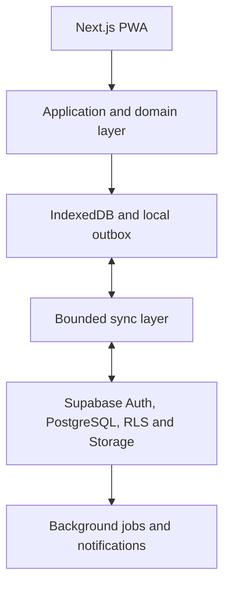
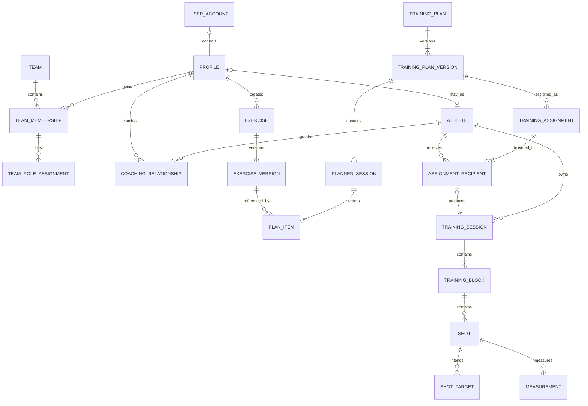

# Cloud, Identity and Collaboration Architecture

**Status:** Accepted  
**Version:** 1.0  
**Date:** 2026-08-11

**Revision note (2026-08-18, consolidated).** `docs/adr/0019-cloud-identity-and-data-authority-transition.md`
is a **Proposed**, related architectural decision — it proposes, and does not yet
finally decide, the authority boundary for the Phase 3/4 transition below. This
document's Accepted status and its identity/product decisions (Sections 3-17) are
unchanged. The following bullets and phase steps are corrected **in place**, not merely
annotated with a disclaimer layered above unchanged text:

- §4.1's infrastructure list — IndexedDB is now described as a possible future option
  for an account-scoped read cache or offline outbox, never a prerequisite.
- §12.1's heading and list are retitled and reframed as an illustrative, undesigned
  future sketch — it no longer describes accepted, mandatory mechanics.
- §18 Phase 2 is retitled to name specifically the ADR-0015/0016/0017/0018 IndexedDB
  local-backend track, which remains distinct and currently blocked, and is never reused
  as the name for a future cache/outbox (new, separately numbered work if it is ever
  built).
- §18 Phase 3's original "Sync one session through an outbox" step is replaced — ADR-0019
  instead proposes an **Assessment Adoption development/staging prototype** (ADR-0019
  Decision 15 stage 11) as the first concrete cloud-authority exercise, stated as a proposal under
  a Proposed ADR, never as the already-decided MVP mechanism — and its "test offline
  mutation followed by reconnect" step, which contradicted this same section's own
  admission that no outbox exists, is replaced with tests appropriate to that prototype
  (online-required writes, not an offline mutation queue).

IndexedDB may still be selected later for a separately designed, account-scoped read
cache or offline outbox (ADR-0019 Decision 3 role C / Decision 10) — new, separately
numbered future work, never a reuse of ADR-0016 migration output or ADR-0017 activation
evidence.

## 1. Purpose

This document defines the target architecture for extending the current local-first
Release Time Tracker into a cloud-enabled Curling Performance Platform for athletes,
coaches, teams and, later, organisations.

It covers:

- identity and account ownership;
- local-first storage and cloud synchronisation;
- athletes, coaches, teams and contextual roles;
- performance-data ownership and sharing;
- exercises and the public exercise library;
- training plans, planned sessions and assignments;
- extensible shot targets and measurements;
- security boundaries and lifecycle rules;
- the staged migration from the current application.

This document is a target design, not an instruction to implement every capability at
once. The implementation sequence in Section 18 is intentionally incremental.

## 2. Related authoritative documents

This specification must be read together with:

- `PRODUCT_DIRECTION_AND_PRINCIPLES.md`;
- `SYSTEM_ARCHITECTURE.md`;
- `DOMAIN_GLOSSARY.md`;
- `TECHNICAL_DEBT_AND_ROADMAP.md`;
- all accepted Architecture Decision Records.

If this specification introduces a new accepted domain term, the Domain Glossary must
be updated in the same change that implements the term. If implementation changes an
architectural rule described here, this document and the relevant ADR must be updated.

## 3. Product and architecture principles

### 3.1 Local-first remains a product capability

An athlete must be able to start, perform and finish training without an account, an
internet connection or a functioning cloud service. Login and cloud sync are additive.
They must not replace the local training path.

### 3.2 Athlete-centred ownership

The athlete owns their personal performance history. Joining a team or accepting a
coach does not transfer ownership of sessions, shots, measurements, goals or athlete
feedback.

### 3.3 Contextual roles, not global user types

A person can be an athlete in one team, a captain in the same team, a coach in another
team and an administrator of an organisation. `coach`, `captain` and `admin` must not be
global fields on the user account.

### 3.4 Shared content and personal performance are different domains

Teams may own their team configuration, training plans and team-created content.
Athletes retain ownership of their execution data. An assignment links the two without
copying ownership from one domain to the other.

### 3.5 Historical meaning must not change

Recorded shots remain historically stable. Exercises, planned sessions and training
plans are versioned so later edits cannot change what an athlete was instructed to do
or what they actually completed.

### 3.6 Domain concepts remain provider-neutral

Supabase, Vercel, Brower and future sensor providers are infrastructure or integration
choices. Their identifiers and APIs must not become core sporting concepts.

### 3.7 Progressive complexity

The first cloud release should solve individual backup and multi-device continuity.
Team collaboration follows after this foundation is proven. Microservices, a generic
access-control language and speculative high-volume infrastructure are out of scope.

### 3.8 Identity, roles, permissions and commercial entitlements are separate

A user account identifies a person; it is not itself a paid product. Contextual team
functions describe responsibility, permission bundles describe allowed actions, and
commercial entitlements determine which paid product capabilities are active for a
person or workspace. These concepts must not be collapsed into a single role or account
type.

For a paid capability, access requires both the applicable domain permission and an
active entitlement. Payment never transfers ownership of athlete performance data. A
lapsed entitlement may make paid collaboration capabilities unavailable or read-only,
but must not prevent an athlete from accessing or exporting their owned history.

## 4. Target system shape



### 4.1 Recommended infrastructure

- Next.js remains the application shell and web delivery layer.
- **The existing ADR-0015/0016 IndexedDB migration/activation track remains a distinct,
  currently blocked local-backend track** (`docs/adr/0017-indexeddb-activation-verification-and-rollback-protocol.md`,
  `docs/adr/0018-indexeddb-production-activation-fencing-and-outage-policy.md`) — it is
  not a prerequisite for cloud identity or Local Adoption, and a future account-scoped
  read cache or offline outbox (ADR-0019 Decision 3 role C / Decision 10), if built, is a
  **new, separately designed mechanism**, never a continuation or repurposing of that
  track. `localStorage` remains the durable local store Local Adoption reads from
  (corrected per ADR-0019 — see the revision notes above).
- Supabase Auth provides account authentication.
- PostgreSQL stores cloud records and relationships.
- Row Level Security enforces access at the database boundary.
- Supabase Storage may later store media and large raw sensor artefacts.
- **A small application-owned sync layer would connect a future local cache/outbox and
  PostgreSQL, once designed** (corrected per ADR-0019 — not required for the personal-
  cloud transition itself).
- The product remains a modular monolith until measured scale requires separation.

### 4.2 Authority by data category

| Data category | Immediate authority | Cloud authority after sync |
|---|---|---|
| Active training capture | Local device | Athlete cloud record |
| Personal sessions, shots and measurements | Local-first write | Athlete cloud record |
| Account identity | Authentication service | Authentication service |
| Team memberships and roles | Cloud | Cloud |
| Assignments | Cloud, locally cached | Cloud |
| Public exercise publication state | Cloud | Cloud |
| Draft private exercises created offline | Local | Creator cloud record after sync |

Team roles and public publication cannot be decided independently on two offline
devices. They are cloud-authoritative. Training capture must never wait for the cloud.

## 5. Identity model

### 5.1 Separate concepts

| Concept | Meaning |
|---|---|
| `UserAccount` | Authentication identity used to sign in |
| `Profile` | A person represented on the platform |
| `Athlete` | A profile whose sporting performance can be tracked |
| `TeamMembership` | A time-bounded relationship between a profile and a team |
| `CoachingRelationship` | A time-bounded athlete-to-coach relationship and access scope |

These concepts must not be collapsed into one `User` table.

### 5.2 Account linkage

- A `Profile` may be linked to zero or one `UserAccount`.
- A signed-in account normally controls one personal `Profile`.
- An `Athlete` is a capability attached to a `Profile`, not an authentication role.
- A profile may be both an athlete and a coach.
- Authentication-provider IDs are stored only in the identity adapter or account link.

### 5.3 Accountless use

The current accountless path remains valid:

1. The app creates stable local UUIDs for the local athlete and their data.
2. Training is stored in IndexedDB.
3. When the athlete signs in, the app offers to attach the local data to the signed-in
   profile.
4. Nothing is uploaded until the athlete confirms the import.
5. The import is idempotent and resumable.

### 5.4 Initial authentication experience

The technical cloud spike uses a six-digit email one-time code. After successful
authentication, the session remains active on that device and is refreshed
automatically. A new code is normally required only after explicit logout, on a new
device or browser profile, after local browser data has been cleared, or when the
session can no longer be refreshed securely.

Google sign-in is added as an alternative for the closed beta. Magic links, passwords
and Apple sign-in are deferred. The authentication method must not require the athlete
to sign in whenever the app is opened.

### 5.5 Initial local-history import

After the first login, the app detects supported local training history and asks the
athlete once whether all of it should be added to the signed-in account. The first
version does not require per-session selection.

The import is idempotent, resumable and protected against duplicates. Local records
remain available until the cloud has acknowledged them successfully. A failed or
interrupted import never deletes or invalidates the local history.

### 5.6 Unclaimed athlete profiles

The target model supports a Coach or Team Admin creating an athlete profile before the
athlete has an account. This capability is not part of the first personal-cloud release;
it belongs to the later team and coaching implementation. Claiming and merging follow
the accepted rules in Section 17.2, including explicit athlete confirmation, stable
technical redirects and audited server-side transactions. Unclaimed profiles for minors
remain deferred until the youth-account and guardian rules in Section 17.4 are accepted.

## 6. Team and organisation model

### 6.1 Core entities

- `Organisation` is an optional container for clubs, performance centres or national
  programmes.
- `Team` may belong to an organisation but does not require one.
- `TeamMembership` connects a profile to a team and records start, end and status.
- Historical memberships remain records but grant no current access.

### 6.2 Roster participation and team functions are independent

`TeamMembership` records whether the person participates as a roster athlete. Team
functions are assigned independently. This supports all of the following:

- athlete only;
- athlete and captain;
- athlete, captain and training lead;
- non-playing coach;
- playing coach;
- coach and training lead;
- organisation administrator who is not on the athlete roster.

### 6.3 Team functions

| Function | Primary responsibility | Default permission bundle |
|---|---|---|
| Member | Participate in the team | View team and own assignments |
| Captain | Organise the team | Manage team details, invitations and roster |
| Training Lead | Prepare training | Manage exercises, plans and assignments |
| Coach | Develop athletes | Review granted performance data and give feedback |
| Team Admin | Administer access | Manage settings, roles and permissions |

Functions are composable. The product must not create combined roles such as
`player_coach` or `captain_training_lead`.

### 6.4 Coach distinction

A coach is defined by a development relationship with athletes, not by administrative
power. Coach-specific capabilities may include:

- reviewing athlete sessions and detailed measurements within the granted scope;
- comparing development across athletes where permitted;
- reviewing assignment completion and results;
- writing structured feedback;
- setting or proposing athlete goals;
- documenting technical observations;
- later, reviewing technique video.

A coach does not automatically gain permission to invite members, remove members,
change roles or administer the team. A captain or training lead can organise and assign
training without being labelled a coach.

### 6.5 Permission vocabulary

The initial permission vocabulary should remain explicit and bounded:

```text
view_team
manage_team_details
manage_members
manage_roles
manage_team_exercises
manage_training_plans
assign_training
view_team_summary
view_athlete_sessions
view_athlete_measurements
review_assignments
comment_on_training
set_athlete_goals
```

Initial functions map to predefined permission bundles. Per-member custom permission
editing is deferred until a real use case requires it.

### 6.6 Provisional commercial capability layers

The current product direction separates three commercial layers:

1. **Personal Athlete:** a lower-priced individual product for self-directed training
   and personal progression.
2. **Team Workspace:** an additional paid entitlement for team administration and
   collaboration, including team exercises, training plans and assignments.
3. **Coaching:** an additional paid entitlement for developing other athletes, including
   cross-athlete review, structured feedback, goals and assignment review within the
   athlete's granted data scope.

These layers do not replace team functions. `Coach`, `Team Admin` and `Training Lead`
remain contextual functions even if the corresponding paid capability is inactive. The
subscriber or billing owner is also separate from the person who performs a function;
for example, a club may later pay for a workspace administered by a captain.

The provisional packaging, seat, payer and lifecycle decisions in Section 17.5 are
accepted as working hypotheses. Final prices and commercial launch details remain
deferred until after the closed team pilot. Every commercial boundary must remain
configurable and must not be hard-coded into the permission or data-ownership model.

## 7. Performance-data ownership and sharing

### 7.1 Ownership rules

| Record | Owner or controlling party |
|---|---|
| Athlete profile and personal history | Athlete |
| Training session executed by an athlete | Athlete |
| Shot, target snapshot and measurement | Athlete |
| Athlete feedback and private notes | Athlete |
| Coach feedback | Feedback author, visible within its declared relationship context |
| Team structure, roster and roles | Team |
| Team-created training plan | Team |
| Private exercise | Creator |
| Team exercise | Team |
| Public community exercise | Creator, subject to public-content terms |
| Platform-curated exercise | Platform, with source attribution where derived |

An athlete session created from a team assignment is still athlete-owned. The team owns
the assignment and plan version, not the athlete's resulting performance history.

### 7.2 Sharing levels

Personal performance data is private by default. Sharing is split into at least:

1. **Private:** only the athlete.
2. **Team summary:** selected aggregated indicators for authorised team members.
3. **Coaching access:** detailed sessions, measurements, trends and feedback for an
   authorised coach.

Team membership alone does not grant access to another athlete's detailed data.

### 7.3 Specialised grants

Avoid a generic ACL engine. Use domain-specific grants:

- `AthleteTeamSummarySharing` for team-level summaries;
- `CoachingRelationship` for detailed coach access;
- contextual team permissions for team-owned records.

Each grant records scope, granting athlete, grantee, start time, optional end time and
revocation time.

### 7.4 Team exit

When an athlete leaves a team:

- the membership becomes historical;
- current team access ends;
- team-owned plans and administrative history remain with the team;
- the athlete retains all personal sessions and measurements;
- past assignment records retain the plan version and completion status;
- continued detailed coaching access requires a separate active coaching relationship.

## 8. Exercise model and exercise library

### 8.1 Canonical term

`Exercise` is the reusable platform entity describing how something should be trained.
The current glossary term `Drill` should become a synonym or product label, not a second
competing entity, unless a later sporting distinction justifies separate concepts.

### 8.2 Library surfaces

One search experience may combine several clearly labelled sources:

| Surface | Content |
|---|---|
| Curated Library | Platform-reviewed and recommended exercises |
| Community Library | Public exercises published by athletes and coaches |
| Team Library | Exercises visible only within a team |
| My Exercises | A profile's private drafts and exercises |

Public does not mean curated or platform-endorsed.

### 8.3 Exercise identity and versions

`Exercise` is the stable identity. `ExerciseVersion` is an immutable content version.
A version may contain:

- title and purpose;
- instructions;
- setup and equipment;
- measurement dimensions;
- repetition or shot structure;
- scoring guidance;
- safety or coaching notes;
- structured configuration for compatible execution flows.

Material changes create a new version. Historical assignments and sessions continue to
reference their original version.

### 8.4 Visibility and publication

Visibility and moderation are separate dimensions:

```text
visibility: private | team | public
publication_status: draft | published | archived
moderation_status: unreviewed | approved | rejected | restricted
source_type: platform | community
```

A private or team exercise can be copied into a new public exercise only through an
explicit publication action. Publication never happens automatically.

### 8.5 Community growth and curation

Community exercises can populate and improve the shared library through:

- public publishing;
- saves and actual use;
- repeated use;
- ratings or structured feedback;
- use across multiple teams;
- reporting and moderation;
- editorial review and featuring.

The original creator and source remain visible. If the platform adapts an exercise, the
new item records `forked_from_exercise_id` and preserves attribution.

### 8.6 Moderation boundary

Before open public publishing is released, the product needs:

- reporting;
- moderation states;
- archive and restriction actions;
- clear public-content terms;
- a rule for copying, adapting and featuring community exercises;
- an abuse and unsafe-instruction response process.

The first collaboration release may therefore support private and team exercises before
public community publishing.

## 9. Training plans, planned sessions and assignments

### 9.1 Preserve existing domain meaning

The Domain Glossary defines a `TrainingPlan` as a structured programme containing one or
more planned training sessions. A one-day exercise sequence is represented as one
`PlannedSession` within a plan. A plan may contain only one planned session.

### 9.2 Versioned structure

```text
TrainingPlan
  TrainingPlanVersion
    PlannedSession
      PlanItem
        ExerciseVersion
        sequence
        targets
        repetitions
        rest
        instructions
```

Published or assigned plan versions are immutable. Editing creates a new version.

### 9.3 Assignment model

```text
TrainingAssignment
  plan_version_id
  planned_session_id or full-plan scope
  assigned_by_profile_id
  assigned_at
  scheduled_for
  available_from
  due_at
  message
  status

AssignmentRecipient
  athlete_id
  delivery_status
  execution_status
  started_at
  completed_at
  resulting_session_id
```

The first implementation should assign one planned session on a specific date to one or
more athletes. Full multi-week plan scheduling can follow without changing the model.

### 9.4 Assignment lifecycle

Recommended execution states:

```text
assigned -> started -> completed
assigned -> skipped
assigned -> cancelled
assigned -> superseded
started  -> completed
started  -> skipped
```

Cancellation and superseding are explicit. Completed records are never silently
rewritten.

### 9.5 Team assignment expansion

When a planned session is assigned to a team, the recipient list is frozen at creation.
Members who join later do not automatically receive the historical assignment. An
authorised person may add them explicitly.

Each recipient receives an individual `AssignmentRecipient`. The plan content is not
duplicated in every athlete's cloud record. All recipients reference the same immutable
plan version while retaining individual execution state.

### 9.6 Offline delivery

The assignment list and all required exercise versions are cached locally before
training. Once cached, the athlete can:

- open the assignment offline;
- start and complete the session offline;
- capture all shots and measurements offline;
- sync status and results later.

The assignment remains visible in `Today` and `Upcoming` even if external push delivery
fails.

### 9.7 Updating an assigned plan

- Existing assignments keep their original plan version.
- An authorised person may explicitly supersede an unstarted assignment with a newer
  version.
- The athlete is informed that the assignment changed.
- Started or completed assignments are never silently moved to a new version.

## 10. Extensible training and measurement model

### 10.1 Core execution hierarchy

```text
TrainingSession
  TrainingBlock
    Shot
      ShotTarget
      Measurement
      AthleteFeedback
      CoachFeedback
```

The current `Session`, `TrainingBlock` and `Shot` concepts remain the foundation. Cloud
work must not invalidate existing history.

### 10.2 Shot targets

A shot can contain multiple target dimensions:

```text
ShotTarget
  metric_type
  target_value
  lower_bound
  upper_bound
  unit
  source
```

Examples include release time, rotation, line and tactical outcome.

### 10.3 Measurements

```text
Measurement
  metric_type
  numeric_value or structured_value
  unit
  source_type
  source_device_id
  captured_at
  quality_flags
  schema_version
```

Potential `metric_type` values include:

- `back_hog_time`;
- `hog_hog_time`;
- `line_deviation`;
- `release_angle`;
- `rotation_count`;
- `rotation_rate`;
- `curl_distance`;
- `shot_score`.

Subjective perception remains separate from objective measurements even if both use a
similar numeric scale.

### 10.4 Large raw data

Normalised metrics belong in PostgreSQL. Large trajectories, video and high-frequency
sensor streams belong in object storage with metadata references. Their retention and
processing costs must be treated separately from normal shot records.

## 11. High-level relational model



This ERD is conceptual. It does not prescribe exact table names, columns or PostgreSQL
types. Those belong in the database design and migration ADR after the current local
model has been inventoried.

## 12. Synchronisation protocol

### 12.1 Illustrative sketch for a possible future offline outbox (undesigned — not a Phase 3/4 requirement)

**Retitled in this correction pass: this list was never accepted, mandatory mechanics for
the personal-cloud transition, and is no longer presented under that heading.** It is an
illustrative sketch of what a future offline mutation-queue/outbox (ADR-0019's Option C)
might need to address, **if and when that mechanism is separately designed** — it is not
required for, and does not gate, Phase 3/4 below. ADR-0019 selects a narrower MVP model
(online-required writes, with at most a separately designed account-scoped read cache)
precisely because none of the following exists and none of it is designed by ADR-0019
either (see ADR-0019 Decisions 5 and 10, and Decision 15 stage 14). The IndexedDB-specific
wording in items 2-3 is retained only as a record of the original sketch's assumptions,
not as a description of the store Local Adoption actually reads from (`localStorage` —
ADR-0019 Decision 4).

A future outbox design would need to address, at minimum:

1. New entities receiving client-generated UUIDs.
2. Whether local mutations are committed to IndexedDB, `localStorage`, or another local
   store first — undecided.
3. Whether and how a local outbox stores pending mutations — undecided.
4. Every mutation needing an idempotency key.
5. The server acknowledging accepted mutations and assigning a monotonic sync revision or
   equivalent cursor.
6. The client pulling changes after its last acknowledged cursor.
7. Deletions using tombstones or `deleted_at` until all relevant clients can observe them.
8. Mutable records carrying a version for optimistic concurrency.
9. Sync stopping and resuming without duplicating sessions, shots or assignments.

### 12.2 Conflict policy

| Record type | Default policy |
|---|---|
| Shot and measurement creation | Append-only, deduplicate by stable ID |
| Explicit shot correction | New audited revision or explicit correction mutation |
| Personal note | Last accepted edit with version check |
| Exercise draft | Version check, surface conflict if both sides changed |
| Published exercise or plan | Immutable version, create a new version |
| Membership, role and permission | Cloud-authoritative, reject stale mutation |
| Assignment status | Valid state transition plus idempotency |

`last write wins` must not be used for roles, permissions, published plans or records
whose silent overwrite would change historical meaning.

### 12.3 Sync is not Realtime

Realtime subscriptions may later update coach dashboards or assignment delivery. They
do not replace durable pull, push, retry, idempotency and conflict handling.

## 13. Security model

### 13.1 Database boundary

Row Level Security must enforce at least:

- athletes can access their own personal records;
- users cannot access another athlete's private data without a valid grant;
- coaches only receive the scopes granted by the athlete;
- current team functions control team-owned records;
- historical membership does not grant current access;
- public exercises are readable only when published and not restricted;
- client-supplied owner IDs cannot override authenticated ownership.

Frontend checks improve usability but are never the security boundary.

### 13.2 Server-controlled operations

The following should execute through validated server functions or transactions rather
than unrestricted direct table writes:

- accepting invitations;
- changing roles;
- transferring the last administrative function;
- assigning a plan to a team;
- publishing or moderating exercises;
- claiming an unclaimed profile;
- merging duplicate profiles;
- account deletion and data export orchestration.

### 13.3 Audit requirements

Audit events should cover:

- membership and role changes;
- data-sharing grant creation and revocation;
- plan assignment, cancellation and superseding;
- public exercise publication and moderation;
- profile claim and merge operations;
- explicit corrections to historical performance data.

## 14. Notifications

The domain event and the transport are separate.

An assignment is valid when its database record and recipients exist. In-app `Today`
and `Upcoming` views are the primary delivery mechanism. Web Push and email are optional
transports that can be added later without changing the assignment model.

Potential notification events include:

- assignment created;
- assignment changed or superseded;
- assignment due soon;
- coach feedback added;
- team invitation received;
- coaching access requested or revoked.

## 15. Deletion, export and retention

### 15.1 Athlete export

An athlete must be able to export personal sessions, shots and measurements in a useful,
portable form. Existing CSV export remains useful but will eventually need a complete
account export for relational and shared records.

### 15.2 Account deletion

Account deletion must distinguish:

- authentication identity;
- athlete-owned performance data;
- team-owned administrative records;
- authored public exercises;
- coach feedback relied upon by another athlete;
- legally or operationally required audit records.

The exact anonymisation and retention policy requires a separate privacy decision before
public launch.

### 15.3 Team deletion

A team cannot be hard-deleted while doing so would remove athlete-owned history. Team
closure should archive the team, terminate access and retain minimal historical links
needed to interpret assignments.

## 16. Deliberately deferred capabilities

- Microservices and event sourcing.
- A generic ACL or policy-builder interface.
- Custom permissions per individual member.
- Automatic recurring assignment schedules.
- Open public community publishing before moderation exists.
- Unclaimed profiles for minors before the youth consent and guardian rules exist.
- Minor accounts and guardian workflows before a specific policy is accepted.
- Video processing and high-frequency sensor pipelines.
- Organisation-wide analytics and national-programme hierarchy.
- Database partitioning, read replicas and separate analytics infrastructure before
  measured need.

## 17. Accepted and deferred product decisions

This section records accepted product decisions and the remaining decisions that are
deliberately deferred until the phase that depends on them. None of the deferred
commercial decisions blocks the persistence refactor, cloud foundation or closed team
pilot.

### 17.1 Decisions blocking personal cloud sync

Accepted decisions:

1. **Initial login methods:** the technical cloud spike uses a six-digit email one-time
   code and persists the authenticated session on the device. Google sign-in is added
   for the closed beta. Magic links, passwords and Apple sign-in are deferred.
2. **Local import confirmation:** after explicit one-time confirmation, all supported
   local history is imported. Per-session selection is not required in the first
   version. Import is idempotent and resumable, and local data remains intact until
   cloud acknowledgement.
3. **Duplicate import behaviour:** imported records are identified by stable entity IDs.
   An identical record is skipped automatically and included only in the import summary.
   If the same ID has different content, neither version is silently overwritten; the
   system preserves both states and raises a conflict for resolution. Similar content
   with different IDs is not merged automatically because it may represent separate
   training activity.
4. **Account deletion baseline:** account deletion requires recent re-authentication,
   disables the account and stops cloud synchronisation immediately, and starts a
   30-day recovery period. A data export is offered before deletion but is not required.
   After the recovery period, the account and its personal cloud data are deleted
   permanently. On the current device, the user separately chooses whether local
   training history is deleted or retained as local-only history. Other devices observe
   the deletion state when they next connect; remote deletion of data held in an offline
   browser or device cannot be guaranteed.
5. **Cloud region and operational environments:** the production database is hosted in
   the specific Supabase Frankfurt region (`eu-central-1`). The platform uses three
   isolated environments: local development through the Supabase CLI, one hosted
   development and staging project containing artificial test data only, and a separate
   production project containing real user data. Databases, credentials and secrets are
   never shared between environments, and production data is never copied into the
   development or staging environment. Schema changes are stored as versioned repository
   migrations and promoted from local development through staging to production rather
   than being applied manually in production. Dedicated Supabase preview branches per
   pull request are deferred until parallel development makes them worthwhile. Application
   previews may use the staging project but must not receive production credentials.

All decisions required by this subsection are accepted.

### 17.2 Decisions blocking teams and coaching

Accepted decisions:

1. **Team creation:** any user with a confirmed account may create a team. The creator
   becomes the first Team Admin but does not automatically become coach, captain or
   roster athlete. Participation and additional functions are assigned separately. An
   active Team Workspace entitlement is required to activate paid administration and
   collaboration capabilities. The provisional payer, pilot and lapse models are defined
   in Section 17.5 and remain configurable commercial hypotheses.

2. **Final Team Admin:** an active team must always have at least one Team Admin. The
   final administrator cannot relinquish the function or leave the team until another
   confirmed member has accepted the Team Admin function, or the team has been
   archived. Account deletion remains possible. If the final administrator deletes the
   account without a successor, the team enters a restricted recovery state rather than
   being deleted: team administration and collaborative writes are suspended until an
   authorised recovery process appoints a new Team Admin. Members' personal training
   data remains unaffected. Historical team records are retained according to the
   applicable retention and deletion rules.

3. **Sharing on team join:** team membership alone grants no access to an athlete's
   personal performance data. A team may request a clearly described sharing level in
   the join flow, but the athlete must explicitly accept or decline it. Membership data,
   team functions and the workflow status of assigned training, such as `assigned`,
   `started` or `completed`, are visible to the responsible team function. Personal
   results, session details, individual measurements and development trends require a
   separate permission. The athlete may revoke that permission for future access at any
   time; historical retention and already-created team artefacts remain governed by the
   later exit and retention decisions in this subsection.

4. **Person-specific coaching access:** coaching access is granted to individually named
   coaches, not automatically to every person who currently or later holds the Coach
   function. A request may present several current coaches together, but acceptance
   creates a separate grant for each coach. A coach may access an athlete's personal
   performance data only while both conditions hold: the person has an active Coach
   function in the relevant team or coaching context, and the athlete has granted that
   person the required data scope. A newly appointed coach receives no retroactive or
   automatic access. If the Coach function ends, the personal grant is suspended at
   minimum; the final visibility and retention rules are decided under item 6 below.

5. **Captain default access:** the Captain function grants access to organisational team
   data and relevant workflow states, including membership, team functions, participation
   status, invitations and the status of assigned training where the captain is responsible
   for coordination. It does not grant access to personal performance results, individual
   sessions, measurements, development trends or coach feedback. Team summaries and any
   supposedly anonymised team performance statistics require an additional athlete grant,
   because individuals may remain identifiable in small teams. Additional functions such
   as Coach or Training Lead do not bypass the required athlete permission.

6. **Visibility after coaching ends:** when a Coach function or its underlying coaching
   relationship ends, the related access to the athlete's personal performance data ends
   immediately. The former coach can no longer view earlier or later sessions,
   measurements or development trends through that relationship. Feedback already created
   remains available to the athlete and to currently authorised people, and historical team
   artefacts remain with the team, but neither provides the former coach with continued
   access to the athlete's data. Access continues only where a separate active coaching
   relationship exists and the athlete has granted that relationship its own permission.
   Athlete data cached for coaching is removed from the former coach's device after the
   next successful synchronisation. Data previously exported or captured outside the
   platform cannot be withdrawn technically.

7. **Claiming and merging athlete profiles:** a Coach or Team Admin may create an
   unclaimed athlete profile with only the minimum required identity information. The
   profile has no login and is visibly marked as unclaimed. Claiming requires a personal
   invitation and a verified user account. If the invited athlete already has an athlete
   profile, the existing team membership is linked to that profile instead of creating a
   second active profile. Similar names or email addresses produce a warning only;
   profiles are never merged automatically. The athlete must explicitly confirm every
   merge. Memberships, assignments and attributable training history are transferred to
   the claimed profile in one audited server-side transaction. The superseded profile is
   retained as a technical redirect so that offline clients cannot recreate it. Merging
   two already claimed profiles additionally requires recent re-authentication and a
   controlled verification process. Any performance data recorded against an unclaimed
   profile comes under the athlete's control when the profile is claimed; the team retains
   only the access that the athlete subsequently grants. Claiming profiles for minors is
   deferred until the consent model in Section 17.4 is accepted.

All decisions required by this subsection are accepted.

### 17.3 Decisions blocking the public exercise library

Accepted decisions:

1. **Public-content licence and terms:** the creator retains all ownership rights in an
   exercise. By publishing it, the creator grants the platform a non-exclusive right to
   store, display, moderate, recommend and technically reproduce the exercise for the
   platform service. Other users may save and use the exercise inside the platform and
   may create attributed adaptations as new exercise records and versions. Publication
   does not grant an automatic right to republish, resell or otherwise exploit the
   exercise outside the platform. The creator must confirm that they hold the necessary
   rights. The platform may restrict, archive or remove unlawful, unsafe or
   rights-infringing content. If an exercise is withdrawn, new copies and adaptations
   from the withdrawn source are blocked, while compliant copies and adaptations that
   already exist remain available under their recorded provenance. The final public
   terms require legal review before launch and must not silently broaden these rights.
2. **Attribution for copies and adaptations:** every copy and adaptation preserves an
   immutable provenance chain containing the direct source, the original creator and the
   source version. An unchanged copy remains attributed to the original creator. A
   published adaptation identifies its adapting author separately and displays both its
   direct source and original creator. Attribution cannot be removed and does not imply
   that an earlier creator endorses a later adaptation. The primary interface may show a
   compact attribution while the complete version chain remains available in the
   exercise details. If a source is withdrawn, existing compliant copies and adaptations
   retain their attribution and mark the source as unavailable. Executed training
   sessions do not need to repeat the attribution outside the linked exercise details.
3. **Moderation and editorial featuring:** moderation of public exercises is limited to
   people with an explicit platform-level `Platform Moderator` permission. Moderators
   may approve, restrict, reject or archive an exercise, but may not silently edit its
   content; required corrections are returned to the creator. Editorial featuring is a
   separate `Content Curator` permission and may only be applied to published,
   unrestricted exercises. Team functions and coaching permissions grant neither global
   moderation nor curation powers. The same responsible platform person may hold both
   permissions during the first release, but the permissions and resulting actions remain
   distinct. Publication, moderation, restriction and featuring are server-controlled
   actions and every such decision is recorded in the audit log. `public`, `approved` and
   `featured` remain separate states. Featuring is an editorial recommendation, not a
   guarantee of effectiveness or safety.
4. **Reporting categories and response process:** users may report a specific published
   exercise version for unsafe or health-related guidance, infringement of copyright or
   usage rights, disclosure of personal data or other privacy violations, harassment,
   discrimination or inappropriate content, spam, advertising or deliberate
   misrepresentation, or another stated platform-rule violation. Poor quality or limited
   usefulness is handled through feedback or later quality signals rather than abuse
   reporting. The creator is not shown the reporter's identity. Report volume alone never
   removes content automatically. A `Platform Moderator` reviews every report and may take
   no action, request a correction, restrict the version, archive it or remove it. Where a
   version presents an immediate safety or privacy risk, it may be restricted provisionally
   before the review is complete; otherwise it remains available during review. The creator
   receives the reason for the decision and may request a further review, while the reporter
   receives a concise outcome notice. Reports, provisional measures, decisions and later
   changes are recorded in the audit log. Repeated abusive reporting may result in limits on
   the reporting capability.
5. **Private exercise feedback before public ratings:** the first public release does not
   display public ratings, star scores or other public quality rankings. An athlete may submit
   structured private feedback only after completing the exercise. The initial dimensions are
   clarity, appropriate difficulty and personal usefulness, with an optional short comment.
   The creator receives only anonymised aggregate summaries and cannot identify individual
   athletes from the feedback interface. The platform may use aggregated feedback for
   curation and product analysis, but it does not automatically influence public ranking in
   the first release. Safety concerns and rule violations continue through the separate
   reporting process. Public quality signals are deferred until usage volume is sufficient and
   the platform has validated which signals are meaningful and resistant to manipulation.
6. **Moderated publishing for the first public release:** every verified user who meets
   the applicable age requirement may submit an exercise for publication. Coach, team and
   paid-product entitlements are not required for submission. A submitted exercise remains
   a draft or `pending review` until a `Platform Moderator` approves the specific version;
   it is not publicly visible before approval. A material change to an approved exercise
   creates a new version that requires review, while the previously approved version may
   remain available. Submission limits and server-side anti-spam controls may be applied.
   Direct publishing may be introduced later through an explicit, revocable
   `Trusted Publisher` platform permission. This permission is assigned on trust and
   moderation history, is never a purchasable entitlement and does not remove audit or
   moderation controls.

All decisions required by this subsection are accepted.

### 17.4 Decisions blocking youth use

Accepted baseline age direction:

1. An independent user account is available from age 16.
2. Users aged 13 to 15 may use the platform only through a youth account linked to a
   verified guardian.
3. Users under 13 are not supported in the first release.
4. Stricter regional requirements override these baseline limits.
5. Date of birth and youth status are private identity attributes and are not visible to
   teams, coaches or other users.

This baseline records the intended age bands only. It does not make youth accounts ready
for implementation or launch. Before youth accounts are implemented or enabled in any
region, the following decisions require a dedicated product, privacy, safeguarding and
legal review:

1. How guardian identity, authority and consent are verified and recorded.
2. Which controls a guardian receives, which actions remain with the young athlete, and
   how increasing autonomy is handled as the athlete gets older.
3. How consent can be changed or withdrawn and what happens when the athlete turns 16.
4. Which personal performance data coaches may request from minors and whether guardian
   approval is additionally required.
5. Which team invitations, direct communication, notifications and safeguarding controls
   apply to minors.
6. How unclaimed profiles, profile claiming and duplicate-profile merges work for minors.
7. Which retention, export and deletion rights are exercised by the athlete, the guardian
   or both.
8. In which regions youth accounts may launch and which stricter local age or consent
   requirements apply.

Until these decisions are accepted, youth accounts, guardian workflows and claiming an
unclaimed minor profile remain deferred capabilities.

### 17.5 Decisions blocking the commercial launch

Accepted product direction:

1. Personal self-directed training is the lower-priced core paid product.
2. Team administration and collaboration require an additional Team Workspace
   entitlement.
3. Coaching capabilities for developing and reviewing other athletes require an
   additional Coaching entitlement.
4. Accounts, contextual functions, permission bundles, subscriptions and entitlements
   remain separate concepts.

Accepted provisional boundary between free local use and Personal Athlete:

1. The existing local training application remains useful without an account,
   subscription or internet connection. Free local use includes all existing training
   modes, manual entry of release times, local session history, existing assessments,
   CSV export and access to the athlete's own raw data.
2. Free local use includes a deliberately limited analysis of the current session, such
   as average release time, average deviation and target-hit rate. It does not include the
   full analytical workspace or longitudinal development analysis.
3. Personal Athlete includes automatic time capture through Brower and other supported
   hardware integrations.
4. Personal Athlete includes full analytics such as charts, distributions, In/Out-turn
   comparisons, extended filters, comparisons across sessions, long-term trends,
   personal benchmarks and goal tracking.
5. Personal Athlete also includes cloud backup, multi-device synchronisation, reusable
   personal exercises, session templates, personal training plans and later personal
   video, sensor or AI-assisted analysis capabilities.
6. Existing free local core capabilities are not withdrawn merely to create a paid tier.
   New capabilities are assigned according to their concrete value and operating cost.
7. This commercial boundary is an accepted working hypothesis, not an irreversible
   implementation constant. Before or during commercial validation, it may be adjusted
   using observed activation, retention, conversion, hardware usage and direct customer
   feedback. Entitlement checks and product configuration must therefore allow the
   boundary to change without a data migration or permission-model redesign.

Accepted provisional Team Workspace and athlete-seat model:

1. A Team Workspace has its own base price for team administration and collaboration.
   This price remains payable even when every team member already has Personal Athlete,
   because the workspace provides a separate organisational product capability.
2. Personal Athlete is not charged automatically for every member of a paid Team
   Workspace. An athlete who already has an independently funded Personal Athlete
   entitlement does not require an additional paid team seat.
3. A Team Workspace may fund a discounted `Sponsored Athlete Seat` for a member who does
   not otherwise have Personal Athlete. The sponsored seat grants the same personal
   product capability; its funding source does not transfer ownership of the athlete's
   personal data to the team.
4. A person may have several entitlement sources, including `self_paid`,
   `team_sponsored` and later `club_sponsored` or `promotional`. Overlapping sources do
   not grant duplicate capabilities and must not cause unintended double charging.
5. For the first commercial release, when team sponsorship is added during an already
   paid personal term, the sponsored entitlement should take effect when that personal
   term ends rather than requiring prorated refunds or credits. This transition rule may
   be refined when the billing provider and cancellation model are selected.
6. If a sponsored seat ends, the athlete keeps the account and all personal data. Access
   continues through any other active entitlement source or otherwise falls back to the
   free local product boundary defined above.
7. Example working prices of CHF 14.90 per month or CHF 149 per year for the Team
   Workspace base, and CHF 4.90 per month or CHF 49 per year for each Sponsored Athlete
   Seat, are commercial hypotheses only. They require validation and must remain product
   configuration rather than permission or data-model constants.

Accepted Team Workspace billing-account model:

1. A Team Workspace may be financed by an individual or an organisation. A statement
   that a team pays means technically that an individual or organisation pays on behalf
   of that team.
2. Billing uses two payer types: an `Individual Billing Account`, such as a captain,
   coach, team member or sponsor, and an `Organisation Billing Account`, such as a club
   or federation.
3. The purchased entitlement belongs to the Team Workspace rather than to the payer.
   Changing the payer does not transfer or recreate the workspace, memberships or data.
4. Billing and invoice-management rights do not grant a team function, administrative
   permission or access to team or athlete performance data.
5. An organisation may finance several Team Workspaces and Sponsored Athlete Seats.
   Financing them does not by itself grant the organisation cross-workspace access or
   rights over the financed athletes' personal data.
6. The first commercial release may initially implement payments by individuals only,
   but the entitlement and billing architecture must support organisation-funded
   workspaces without a later ownership or data-model migration.
7. The consequences of ended financing follow the accepted cancellation, grace-period
   and read-only model defined below. Trial and promotional-access rules remain separate
   rollout decisions.

Accepted provisional Team Workspace scope:

1. One Team Workspace represents exactly one team.
2. The first commercial model includes up to eight active athletes in that workspace.
   This is intended to cover a regular curling team, substitute players and an extended
   competitive roster without stretching the workspace into an organisation-wide product.
3. The workspace additionally includes up to four active non-playing members, such as
   Team Admins, Training Leads or Coaches.
4. A person who is both an athlete and holds one or more additional team functions
   occupies only one athlete place. Assigning several contextual functions to the same
   person does not create another place or a separately billed function seat.
5. Former or archived members do not count against the active limits. Their historical
   memberships, assignments and attribution remain preserved.
6. `Sponsored Athlete Seats` are independent of workspace membership limits. They decide
   only whose Personal Athlete entitlement the team finances and do not expand or reduce
   the number of people who may belong to the workspace.
7. A club with several teams uses several Team Workspaces. A later club or federation
   layer may finance and coordinate those workspaces without changing the rule that each
   workspace represents one team.
8. Larger training groups, academies and national squads require a later organisation
   product rather than an expansion of the Team Workspace concept.
9. The limits of eight active athletes and four additional non-playing members are
   accepted commercial hypotheses. They must remain configurable product values and must
   not be hard-coded into roles, permission bundles or the membership data model.

Accepted provisional Team Workspace Coaching model:

1. Coaching capabilities are licensed per Team Workspace rather than per coach or per
   coached athlete. The Coaching entitlement is an optional module attached to one
   specific Team Workspace.
2. The module is normally financed by the team or its club through the workspace's
   individual or organisation billing account. The entitlement belongs to the Team
   Workspace rather than to a coach.
3. The first commercial model may assign the module to up to two named coaches within
   the workspace. This allowance is a configurable commercial hypothesis and must not be
   hard-coded into the function, permission or membership model.
4. A named coach does not need a separate paid Coaching subscription. Access still
   requires the contextual `Coach` function, an active person-specific
   `CoachingRelationship` and the athlete's granted data scope. The paid module alone
   grants no access to athlete data.
5. If the same person coaches two teams, each Team Workspace requires its own active
   Coaching entitlement. The coach may use one global identity across both contexts.
6. A workspace may reassign a named coach place when a coach changes. Reassignment does
   not transfer the former coach's identity or rewrite historical feedback and
   attribution.
7. Individual coaching of unrelated athletes across several teams is outside the first
   commercial release. A later personal or organisation-wide coaching product may add
   that model without changing the Team Workspace entitlement.
8. Whether the module is sold as an add-on or included in a higher Team Workspace tier,
   and an example working price of approximately CHF 9.90 to CHF 14.90 per team per
   month, remain commercial hypotheses. They must be controlled through product and
   billing configuration rather than permissions or data ownership.

Accepted provisional entitlement-expiry and read-only model:

1. A voluntary cancellation ends paid capabilities only at the end of the already paid
   billing term. Until that date, the entitlement remains fully active.
2. A failed renewal or other recoverable payment failure starts a 14-day grace period
   during which the affected product retains its full capabilities. Billing reminders
   and payment recovery may occur during this period without changing data rights.
3. When a cancelled paid term ends, or when the 14-day payment grace period expires,
   the affected product enters a restricted read-only state for 90 days.
4. Personal Athlete in this state continues to permit the free local training boundary,
   basic current-session analysis and export of the athlete's own data. Cloud sync,
   automatic time capture and paid analytics or planning capabilities are unavailable.
5. A Team Workspace in this state permits authorised members to view and export existing
   members, plans, exercises, assignments and history. Invitations, membership changes,
   new assignments, edits and other team-administration actions are unavailable.
6. An expired Team Workspace Coaching module permits a named coach to view earlier
   feedback only while the underlying team context, person-specific CoachingRelationship
   and athlete-granted data scope remain valid. New analyses, comments, goals and reviews
   are unavailable.
7. Reactivation during the 90-day read-only period restores the applicable paid
   capabilities without recreating the account, workspace, roles, relationships or
   configuration.
8. After the 90-day read-only period, an inactive Team Workspace and its inactive paid
   configuration are archived. Archival is not hard deletion: historical attribution,
   athlete-owned records and the ability to restore the workspace remain preserved in
   accordance with the platform's retention and deletion rules.
9. An entitlement lapse never deletes or rewrites historical performance data. Athletes
   retain ownership, access and export rights over their own data independently of the
   former payer or entitlement source.
10. Billing lifecycle rules never extend a data permission. If an athlete withdraws a
    grant, a membership or CoachingRelationship ends, or another access condition ceases
    to be valid, the corresponding access ends immediately regardless of a paid term,
    grace period, read-only period or archived state.
11. The 14-day and 90-day durations are accepted commercial hypotheses and remain
    configurable product values. They must not be embedded in permission rules, data
    ownership or irreversible deletion jobs.

Accepted initial commercial-launch priority:

1. The first commercial launch prioritises fast and operationally simple validation
   over immediate coverage of the largest curling market or simultaneous multi-market
   availability.
2. The first billing implementation should therefore minimise the number of launch
   countries, currencies, tax regimes, payer variants, payment methods, discounts and
   exceptional billing paths that must be operated at once.
3. This launch constraint does not change the international product direction. Market,
   currency and billing availability remain configurable rollout policy and must not be
   hard-coded into identity, entitlement, permission or data-ownership models.
4. Expansion should follow evidence from real paid use, including conversion, retention,
   support burden and demand from athletes, teams, coaches and clubs outside the first
   market.

Accepted product-pilot boundary before commercial preparation:

1. The immediate objective is a functioning online closed beta, not a commercial
   launch. The beta must first prove personal cloud use and the complete collaboration
   flow for team administration, coaching, exercises, training plans, planned sessions,
   assignments, athlete execution and coach review.
2. The first interested team participates as an invite-only pilot without payment.
   Accounts, team access and applicable product capabilities may be enabled through a
   manually granted `pilot` or `promotional` entitlement source. Pilot access is not a
   billing state and does not weaken role, permission, sharing or data-ownership rules.
3. No billing provider, checkout, invoice flow, final pricing, tax implementation or
   newly founded selling entity is required to begin or complete the closed pilot.
   Architectural separation of identity, permissions and entitlements remains in place,
   but payment execution is deliberately deferred.
4. Pilot work prioritises product completeness for the intended test scope, reliable
   synchronisation, secure access control, usable onboarding and evidence that athletes,
   captains and coaches can complete their real training workflow without platform-owner
   intervention.
5. Commercial preparation resumes only after the pilot has produced enough evidence to
   assess product value, missing capabilities, repeated use, operational support burden
   and the stability of the proposed Personal Athlete, Team Workspace and Coaching
   boundaries.
6. Commercial hypotheses already accepted in this section remain provisional design
   inputs. They do not authorise billing implementation before the explicit post-pilot
   commercial go/no-go decision.

Open decisions:

The following decisions are intentionally deferred until after the closed team pilot and
do not block cloud, team, coaching, exercise or training-plan implementation:

1. Whether the fast-validation priority means an initial Switzerland-only sale in CHF.
2. Which legal entity sells the product and when that entity must be founded.
3. Which billing provider and hosted payment or account-management surfaces are used.
4. Which Swiss tax, invoice and billing-entity requirements apply at launch and which
   legal or accounting review is required before accepting payment.
5. Whether the first paid release offers only monthly and annual prices or also trials,
   promotion codes, introductory prices or other discounts.
6. Final prices, packaging and launch criteria after evaluation of pilot evidence.

## 18. Implementation sequence

### Phase 0: Stable baseline

- Merge the accepted application state.
- Run all unit and end-to-end tests.
- Publish the current local version.
- Tag the release used as the migration baseline.

### Phase 1: Persistence boundary (Implemented)

- Inventory every current `localStorage` key and persisted shape. **Done** — 10 keys
  across 7 domains.
- Introduce repository or persistence interfaces around existing storage. **Done** — a
  `StorageAdapter` plus seven domain repositories, see
  `docs/SYSTEM_ARCHITECTURE.md`'s "Persistence boundary" section.
- Keep behaviour and visible UI unchanged. **Done** — storage keys, serialized shapes,
  session/history write order, and the lack of cross-save deduplication are all
  unchanged; this phase deliberately did not fix any pre-existing behavior.
- Add contract tests for current session, session history, assessments and settings.
  **Done** — every repository has its own contract test suite, plus an
  architecture-enforcement test rejecting direct `localStorage` access outside the
  adapter.

`docs/PERSISTENCE_BOUNDARY_DESIGN.md` and
`docs/adr/0013-application-owned-persistence-repository-boundary.md` (Status: Accepted.
Implemented) cover the full inventory, the repository/adapter boundary, and the staged
migration path into a later IndexedDB adapter (Phase 2 below), which remains
unimplemented.

### Phase 2: IndexedDB local-backend migration (a distinct, currently blocked track — not a prerequisite for Phase 3/4)

**Retitled and corrected per the revision notes above.** This phase names specifically
the ADR-0015/0016/0017/0018 local-backend track (`localStorage` vs. IndexedDB, on one
device) — `docs/adr/0017-indexeddb-activation-verification-and-rollback-protocol.md` and
`docs/adr/0018-indexeddb-production-activation-fencing-and-outage-policy.md` found that
IndexedDB production activation has a bundled, unresolved blocking prerequisite this
codebase cannot currently close, and this phase remains blocked on that basis. **Phase
3/4 do not require this phase to complete first**: Local Adoption (ADR-0019 Decision 4)
reads its legacy source from `localStorage` and writes cloud data to Supabase — it never
reads from or depends on this phase's IndexedDB work. **A future account-scoped read
cache or offline outbox (ADR-0019 Decision 3 role C / Decision 10) is new, separately
numbered future work if it is ever built — it is not this phase, and this phase's name is
not reused for it.**

- Implement IndexedDB repositories.
- Migrate existing local records idempotently.
- Preserve existing migration invariants, including the distinction between missing
  `blocks` and `blocks: []`.
- Keep a recoverable fallback until migration is verified.
- Test offline reload, interrupted migration and rollback behaviour.

### Phase 3: Technical cloud spike

**Does not require Phase 2 above to be complete** (corrected per the revision note).
The original "sync one session through an outbox" and "test offline mutation followed by
reconnect" steps below are replaced: no outbox exists or is designed (§12.1 above), and
ADR-0019's proposed MVP model for this prototype is online-required writes, not an
offline mutation queue — retaining an offline-mutation test here would contradict that
directly. **ADR-0019 instead proposes an Assessment Adoption development/staging
prototype** as the first concrete cloud-authority exercise — Local Adoption of
`assessment` data, reading its legacy source from `localStorage` and writing to Supabase
directly, with no outbox involved (ADR-0019 Decisions 4-6, Decision 15 stage 11). **This
is a proposal under a Proposed ADR, not yet the decided MVP mechanism**, and is
explicitly scoped to development/staging only — ADR-0019 Decision 15 requires a separate,
explicit production-enablement gate, conditioned on ADR-0019 itself reaching Accepted
status (or being superseded by an Accepted decision), before any cloud authority is
enabled for real users. Future offline-mutation/outbox testing belongs only in a future
illustrative-outbox phase, if one is ever designed — not here.

- Create the hosted development and staging Supabase project in the accepted Frankfurt
  region, isolated from production.
- Implement one login path.
- Create one profile and athlete.
- Run an Assessment Adoption development/staging prototype (replaces "sync one session
  through an outbox" — see above): interrupt and resume a `prepared` Adoption Run.
- Verify writes are blocked while offline for a cloud-authoritative Assessment domain
  (replaces "test offline mutation followed by reconnect," which assumed an offline
  mutation queue that does not exist).
- Verify reconnecting re-resolves authority correctly.
- Simulate two devices, without claiming Branch Reconciliation is solved by doing so.
- Verify RLS denies foreign-account access.
- Record findings before continuing.

### Phase 4: Personal cloud sync

- Import all supported personal history.
- Sync sessions, blocks, shots and assessments.
- Implement idempotency, deletion and conflict handling.
- Add personal export and account deletion foundations.
- Observe sync failures and data-volume behaviour.

### Phase 5: Teams and coaching

- Add invitations, memberships and contextual functions.
- Add bounded permission bundles.
- Add athlete sharing and coaching relationships.
- Test team exit and role-transfer lifecycles.
- Test every RLS path with positive and negative cases.

### Phase 6: Exercises, plans and assignments

- Add private and team exercises with versions.
- Add versioned training plans and planned sessions.
- Assign planned sessions to athletes and teams.
- Cache assignments for offline execution.
- Return recipient status and linked athlete session.

### Phase 7: Closed team pilot

- Invite the initial test team without requiring payment or billing setup.
- Enable the necessary product capabilities through a reversible pilot entitlement.
- Test onboarding, login, personal sync and multi-device continuity with real users.
- Test invitations, memberships, team functions, athlete sharing and coach access.
- Test the complete flow from exercise and plan authoring through assignment, athlete
  execution, result synchronisation and coach review.
- Record product gaps, usability failures, access-control defects, sync failures and the
  amount of platform-owner support required.
- Iterate until the agreed pilot scope is stable enough for an explicit commercial
  go/no-go review.

### Phase 8: Commercial readiness

- Evaluate repeated use, product value, missing capabilities and support burden from the
  closed pilot.
- Revalidate the proposed Personal Athlete, Team Workspace, Sponsored Athlete Seat and
  Coaching boundaries and working prices.
- Decide the initial market, currency, selling entity, billing provider, tax treatment
  and invoice requirements.
- Implement and test billing, entitlement transitions, cancellation, grace and read-only
  behaviour only after those decisions are accepted.
- Run the required legal, accounting, privacy and operational launch reviews before
  accepting payment.

### Phase 9: Public library

- Add public publication workflow.
- Add search, reporting, moderation and attribution.
- Add curated featuring without conflating public with approved.
- Validate quality signals before ranking community exercises.

## 19. Definition of Ready for Claude Code

Claude Code may begin Phase 1 when:

- the current stable release is identified;
- the repository and all relevant project documents are available;
- the current persisted data shapes and storage keys are inventoried;
- Phase 1 acceptance criteria explicitly require no visible behaviour change;
- a backup or export path exists for current local history;
- existing tests are green;
- the implementation prompt requires updating affected architecture documents and ADRs.

Claude Code may begin the first Supabase implementation only when:

- the target ERD has been converted into an initial physical schema;
- the personal-cloud RLS matrix is written;
- the sync mutation envelope and cursor protocol are specified;
- the local-to-cloud import rules are accepted;
- environments, region and secret handling are decided;
- automated negative access tests are defined.

## 20. Required ADRs

Create or accept separate ADRs for:

1. Supabase Auth, PostgreSQL and RLS as the first cloud platform.
2. Local-first IndexedDB with an application-owned sync layer.
3. Contextual team functions and bounded permission bundles.
4. Separation of `UserAccount`, `Profile` and `Athlete`.
5. Athlete ownership of personal performance data.
6. Versioned exercises, planned sessions and training plans.
7. Assignment recipient snapshots and offline delivery.
8. Sync identity, idempotency, deletion and conflict policy.

## 21. Decision status and maintenance

This document is accepted as the target architecture and product boundary for the staged
cloud, identity and collaboration work.

The following are authoritative for implementation:

- the principles and target models in Sections 3 to 16;
- all decisions explicitly marked accepted in Section 17;
- `Exercise` as the canonical reusable training entity, with `Drill` retained only as a
  synonym or product label unless a later accepted domain distinction requires otherwise;
- the implementation sequence in Section 18;
- the requirement to create the ADRs listed in Section 20 before the corresponding
  implementation becomes irreversible.

The decisions explicitly listed as open in Section 17.5 remain deferred until after the
closed team pilot. They do not weaken or reopen the accepted architecture. Commercial
hypotheses, numerical limits and lifecycle durations remain configurable and must be
revalidated before paid launch.

Any implementation that changes an accepted rule in this document must update this file,
the Domain Glossary where terminology changes, and the relevant ADR in the same change.
