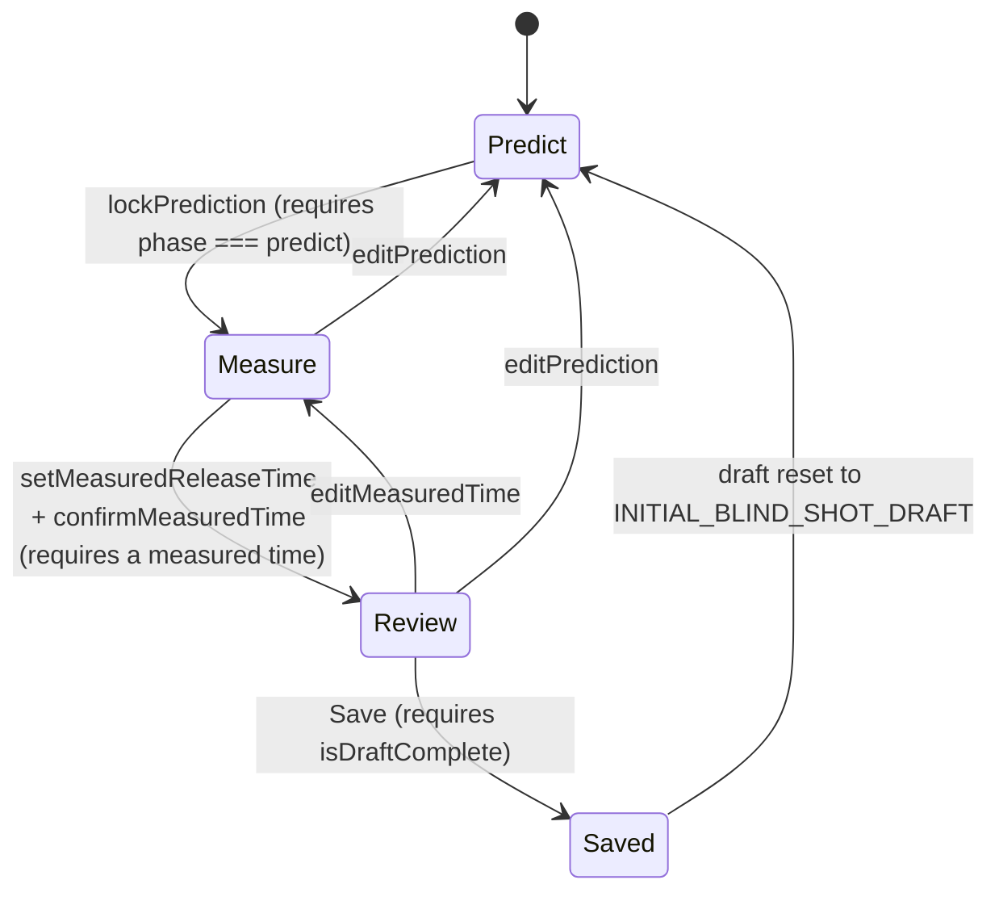

# System Architecture

## Purpose

This document defines the architectural direction of the Curling Performance Platform.

It describes the architectural principles that should guide implementation decisions over time.

It is intentionally independent of the current implementation details.

The implementation will evolve continuously.

The architectural principles should remain comparatively stable.

---

# Architectural philosophy

The architecture should support long-term evolution.

New functionality should be added by extending the system rather than rewriting it.

The platform should remain modular, maintainable and easy to understand while avoiding unnecessary complexity.

Architecture exists to support the product—not the other way around.

---

# High-level architecture

The platform should evolve around six major areas.

```text

Presentation

        │

Application

        │

Domain

   ┌────┼────┐

Analytics  Integrations

        │

Persistence

```

Each area has a clearly defined responsibility.

---

# Presentation

Responsible for:

- User interface

- Navigation

- Forms

- Charts

- Visual feedback

- Device status

- User interactions

Presentation should contain as little business logic as possible.

---

# Application

Responsible for coordinating workflows.

Examples:

- Start training session

- Finish training session

- Create blocks

- Record shots

- Associate measurements

- Validate user actions

Application logic coordinates the system.

It should not contain domain-specific calculations.

---

# Domain

The domain represents curling itself.

It contains concepts such as:

- Athlete

- Coach

- Team

- Training Session

- Training Block

- Drill

- Shot

- Measurement

- Target

- Feedback

The domain should remain independent of:

- React

- Next.js

- Browsers

- Bluetooth

- Brower Timing

- Apple Health

- Database technology

The domain is the heart of the platform.

---

# Analytics

Responsible for transforming data into insights.

Examples:

- averages

- consistency

- deviations

- trends

- baselines

- comparisons

- future coaching recommendations

Analytics should never depend on specific hardware vendors.

Analytics operate on domain data.

---

# Integrations

Integrations connect the platform to external systems.

Examples:

- Timing systems

- Stone sensors

- Apple Health

- WHOOP

- Garmin

- Video

- CSV imports

- Future APIs

Integrations translate external data into the internal domain model.

External formats should never leak into the domain.

---

# Persistence

Responsible for storing information.

Possible storage mechanisms may evolve over time.

Examples:

- Local browser storage

- Cloud database

- Offline cache

- Synchronisation layer

The rest of the application should not depend on a specific storage technology.

---

# Core architectural principles

## Domain-first

Everything revolves around curling concepts.

Technology should adapt to the domain—not vice versa.

---

## Device independence

No hardware manufacturer should become part of the core architecture.

Devices are replaceable.

The athlete's data is not.

---

## Local-first today

The current implementation is local-first for a **previously authenticated and onboarded
Profile**; it is no longer accountless-capable. See "Mandatory identity and the Free Cloud
Foundation (B0.2+B0.3 implemented; B0.4 planned)" below, and its canonical
sources: `docs/MANDATORY_IDENTITY_AND_FREE_CLOUD_FOUNDATION_SPECIFICATION.md` and
`docs/adr/0024-mandatory-identity-and-free-structured-cloud-foundation.md`.

In the target model, "local-first" means **reliable offline training for a previously
authenticated and onboarded Profile** — not accountless use.

Future cloud capabilities should extend the architecture without fundamentally changing the domain model.

---

## Progressive complexity

The architecture should grow only when required.

Avoid building infrastructure for hypothetical future features.

---

## Separation of concerns

Each layer should have one clear responsibility.

Avoid mixing:

- UI

- business logic

- persistence

- analytics

- integrations

---

## Backwards compatibility

Historical athlete data is valuable.

Whenever practical, new versions should migrate existing data instead of discarding it.

---

## Raw data preservation

Store sufficient raw information to support future analyses.

Never assume today's analytics are the final analytics.

---

# Domain hierarchy

The platform should evolve around the following hierarchy.

```text

Organisation (future)

    │

Team

    │

Athlete

    │

Training Plan

    │

Training Session

    │

Training Block

    │

Shot

    │

Measurement

```

Not every level currently exists.

The hierarchy describes the intended long-term structure.

---

# Measurements

Measurements should be independent from their source.

Examples:

- Release Time

- Rotation

- Speed

- Heart Rate

- Line Deviation

Possible sources include:

- Manual Entry

- Timing Gate

- Stone Sensor

- Wearable

- Camera System

Measurements should describe **what** was measured.

Sources describe **where** the information came from.

---

# Future extensibility

Potential future capabilities include:

- Native mobile applications

- Cloud synchronisation

- Team management

- Coach dashboards

- AI-assisted coaching

- Video analysis

- Sensor integrations

- Health integrations

The architecture should allow these capabilities without requiring major redesign.

However, they should only be implemented when justified by real product needs.

---

# Architectural decision rule

Whenever a significant architectural decision is made, ask:

1. Does this make future extensions easier?

2. Does it unnecessarily increase complexity today?

3. Does it keep the domain independent?

4. Does it preserve historical data?

5. Can this decision be reversed later?

---

# Non-goals

The platform should currently avoid introducing:

- Microservices

- Event sourcing

- Plugin frameworks

- Enterprise infrastructure

- Complex synchronisation

- Generic abstractions without practical use

Simple solutions should be preferred whenever they satisfy current requirements.

---

# Guiding principle

The architecture should remain as simple as possible today while making tomorrow's evolution as easy as possible.

---

# Current Implementation Snapshot

> Everything above this line is the long-term architectural **vision** for the Curling
> Performance Platform. Everything below documents what is **actually implemented today**
> in the Curling Release Tracker MVP (`PROJECT.md`). Where the two differ, the vision
> isn't wrong — the implementation just hasn't grown into it yet. This section uses the
> current code as ground truth and is expected to be revised as the app evolves; the
> sections above should rarely need to change.
>
> Status tags used throughout: **Implemented**, **Prepared**, **Planned**, **Open decision**.
> See `docs/adr/` for the reasoning behind the decisions marked with an ADR reference, and
> `docs/DOMAIN_GLOSSARY.md` for term definitions.

## Domain model (Implemented)

Personal Release Timing persistence is organized around three of the types declared in
`src/types/index.ts` — `Session`, `TrainingBlock` and `Shot` — with a `Session` as the
entire unit of persistence. These core personal-training records remain local: they are
not persisted by, and have no representation in, the Team backend. Separate Auth and
Team backend infrastructure does exist elsewhere in this repository (see "Optional
Supabase Auth Shell" and "Team Foundation" below); neither stores personal training
data.

### Session

The current training session. Exactly one exists at a time (`currentSession` in
`TrackerApp.tsx`); completed sessions move into a `Session[]` history list.

| Field | Meaning |
|---|---|
| `id`, `title`, `date`, `notes` | Session identity and free-text metadata |
| `blocks: TrainingBlock[]` | All blocks created in this session, in creation order |
| `activeBlockId: string` | The block currently receiving shots. `""` means no block has been configured yet (see "Active Block" in the glossary) |
| `shots: Shot[]` | **Flat** list of every shot across every block in this session — shots are not nested inside blocks; they reference their block via `shot.blockId` |

A session has no explicit status field. "In progress" vs. "finished" is implicit:
the current session is whatever is in `currentSession`; clicking *Start New Session*
archives it into the history array (only if it has at least one shot) and creates a
fresh, blockless session. There is no partial/paused/completed session status —
only "current" (exactly one) and "history" (append-only list, deletable per entry
or entirely from the History view).

### TrainingBlock

A named, bounded stretch of shots sharing one training objective and one target
configuration. Ending one block and starting the next never mutates the old block —
`addTrainingBlock` stamps `completedAt` on the outgoing block and appends a new one.

| Field | Meaning |
|---|---|
| `mode: "fixed" \| "variable" \| "blind"` | **Training mode** — see below |
| `measurementMode: "back-hog" \| "hog-hog"` | **Measurement mode** — what the release time actually measures |
| `targetTime: number` | The block's default/fallback target — see "Target model" below; its exact meaning depends on `mode` |
| `variableTargetMode?: "smart-random" \| "manual"` | **Target source**, only set when `mode === "variable"` |
| `blindTargetMode?: "fixed" \| "smart-random" \| "manual"` | **Target source**, only set when `mode === "blind"` (has one more option than Variable Weight — see ADR-0004) |
| `smartRandomMin?`, `smartRandomMax?: number` | The configured Smart Random range, only set when the resolved target source is `"smart-random"` |
| `pendingTargetTime?: number` | The target to show/use for the *next* shot when the resolved target source is `"smart-random"` or `"manual"` — see "Target model" |
| `completedAt?: string` | Set once a newer block takes over; `undefined` means this is the active block |
| `accuracyThresholds?: { onTarget, acceptable }` | **Target Accuracy** tolerance, snapshotted once at block creation from whichever preset/custom pair was selected — never re-derived from the app's current default afterward. See ADR-0008 and `src/lib/accuracyThresholds.ts`. |

**Do not conflate four different concepts that all live near each other on this type:**

1. **Training mode** (`mode`) — *what kind of training is this block* (Fixed / Variable / Blind).
2. **Target source** (`variableTargetMode` / `blindTargetMode`) — *how is the target for the next shot determined* (Fixed / Smart Random / Coach-Manual). Only Variable and Blind blocks have one; Fixed Weight blocks are implicitly target-source "fixed".
3. **Measurement mode** (`measurementMode`) — *what the release time physically measures* (Back-Hog / Hog-Hog). Orthogonal to both of the above — any training mode can (in principle) use either measurement mode, though Smart Random is currently only available for Back-Hog.
4. **Shot classification** (`shot.shotType`) — *draw or takeout*, a property of the individual shot, not the block. Fixed and Variable Weight shots have one; Blind Weight shots do not (see "Shot" below).

`trainingBlocks.ts`'s `getEffectiveTargetMode(block)` is the one place that reads
`variableTargetMode`/`blindTargetMode` and normalizes them into a single
`"fixed" | "smart-random" | "manual"` value — every target-generation function
downstream (`getNextShotTarget`, `advanceBlockTarget`, `createTrainingBlock`) is written
once against that normalized concept instead of branching on `mode` repeatedly.

### Shot

| Field | Meaning |
|---|---|
| `blockId` | The block this shot belongs to (shots are flat on the session, not nested) |
| `shotNumber` | 1-based, sequential **within its block** — deleting a shot renumbers only the remaining shots of that same block |
| `releaseTime: number` | The measured release time — always required |
| `targetTime: number` | **The target that actually applied to this specific shot.** Always required, always a plain number captured at save time. Never recomputed, never touched again — even if the block's default target, Smart Random range, or pending target later change. This is what makes Variable/Blind Weight's changing targets historically safe: a block-level change can never retroactively alter what an already-recorded shot was judged against |
| `predictedTime?: number` | The player's own guess, locked in **before** `releaseTime` was known. Present **only** for Blind Weight shots; always `undefined` for Fixed/Variable Weight, and never fabricated during migration |
| `handle: "in" \| "out"` | Required for every shot, including Blind Weight |
| `shotType?: "draw" \| "takeout"` | **Optional.** Required in practice for Fixed/Variable Weight (the UI always sets one); genuinely absent for Blind Weight, which trains perception rather than shot execution. A missing `shotType` is a real, valid state — it is never defaulted to `"draw"` by the app itself. (Migration *does* fold truly-legacy garbage values like the removed `"guard"`/`"other"` into `"draw"`, since those were real historical classifications that no longer have a matching type — see "Persistence and migration") |

## Training modes (Implemented)

### Fixed Weight

- One constant target (`block.targetTime`) for every shot in the block.
- Each shot still stores its own `shot.targetTime` (copied from the block's target at
  save time) — Fixed Weight is simply the case where every shot in a block happens to
  share the same value, not a special code path in analytics or export.
- Shot type (draw/takeout) is required, same as it always has been.
- Analytics run unmodified: `analyzeShots` always compares each shot to its own
  `targetTime`, which is trivially correct here.

### Variable Weight

Target source (`variableTargetMode`) is one of:

- **Smart Random** — the app generates a new target after every shot, within a
  configured range. Only available when `measurementMode === "back-hog"` (see
  "Measurement modes"). Default for newly-created Variable Weight blocks.
- **Coach / Manual** — a human enters the next target before each shot. The
  previously-used value stays as an editable starting point so the same value can be
  reused or lightly adjusted without retyping it.

Both share:
- No required shot type — draw/takeout may still be picked (`ShotEntry.tsx` always
  offers it for Fixed/Variable), but nothing about target generation depends on it.
- Each shot's own `targetTime` is what was actually shown/used for that shot.
- `pendingTargetTime` holds the next target and survives reload; it is only
  regenerated *after* a shot is saved, never before.
- `smartRandomMin`/`smartRandomMax` hold the configured range for Smart Random blocks.
- The "natural transition" logic (below) applies identically to Blind Weight's Smart
  Random target source — it is not duplicated per training mode.

### Blind Weight

Trains the player's ability to *perceive* their own release time before it's measured.
Target source (`blindTargetMode`) is one of **Fixed**, **Smart Random**, or **Coach /
Manual** — Blind Weight is the only mode with a Fixed target-source option, since here
"fixed" describes *what the perception task is measured against*, not the training mode
itself (see ADR-0004).

- No shot type required, same reasoning and same "never fabricate one" rule as above.
- Entry follows a 3-phase state machine (`predict` → `measure` → `review`) — documented
  in full below.
- **Important clarification:** Blind Weight does not mean the app already knows the real
  release time and hides it. The actual release time genuinely doesn't exist inside the
  app until the player reads it off the external timing system and types it in — *after*
  locking their prediction. There is no capture-then-mask step anywhere in this codebase.
- A Blind Weight *draft* (in-progress prediction/measurement) is not a `Shot` — see
  ADR-0002. It never appears in analytics, charts, History, or CSV export while
  incomplete, and reload is allowed to lose it (only the block's own configuration and
  `pendingTargetTime` are guaranteed to survive reload).
- `shot.predictedTime` is set **only** on Blind Weight shots, at the moment of saving —
  never on Fixed/Variable Weight shots, never invented during migration.

## Target model (Implemented)

Four distinct concepts that are easy to conflate — kept deliberately separate here:

1. **Block default target** (`block.targetTime`) — the constant target for Fixed Weight
   and Blind+Fixed; the initial seed value used to create the very first
   `pendingTargetTime` for Manual mode.
2. **Next target** (`block.pendingTargetTime`) — what Smart Random/Manual blocks will use
   for the *next* shot. Persisted, survives reload, only changes after a shot is saved.
3. **Actually-used shot target** (`shot.targetTime`) — the immutable, per-shot value
   described above.
4. **Target source** (`variableTargetMode`/`blindTargetMode`) — which of the three
   generation strategies below produced #2.

### Fixed

`block.targetTime` is used directly for every shot; `pendingTargetTime` is never set for
this target source (`getNextShotTarget` falls through to `block.targetTime` whenever
`pendingTargetTime` is `undefined`).

### Manual (Coach)

- `pendingTargetTime` is seeded from `block.targetTime` at block creation.
- Before saving, the UI may override it (`ShotEntry`/`BlindShotEntry`'s editable target
  input); whatever value is actually used becomes both `shot.targetTime` and the new
  `pendingTargetTime` (`advanceBlockTarget`), so the same/adjusted value is ready as the
  next starting point without retyping.
- Earlier shots are never touched by a later manual change — `shot.targetTime` is a
  plain number copied at save time, not a reference to the block.

### Smart Random (`src/lib/variableTargets.ts`)

- Configured per block via `smartRandomMin`/`smartRandomMax` — **not** a fixed profile;
  the user picks the range they want to train (e.g. a narrow takeout-weight band) at
  block setup. Default for a newly-created block: **min 2.50s, max 4.50s**
  (`DEFAULT_SMART_RANDOM_MIN`/`MAX`).
- Step is **not** user-configurable: always **0.05s** (`SMART_RANDOM_STEP`). Minimum
  valid range width: **0.10s** (`MIN_SMART_RANDOM_RANGE_WIDTH`). Both bounds are snapped
  to the 0.05s grid and re-validated after snapping (`validateSmartRandomRange`).
- The next target is generated by `generateSmartRandomTarget({ min, max, recentTargets,
  randomFn })` and stored as `pendingTargetTime` — **only after a shot is saved**
  (`advanceBlockTarget`), never speculatively. Reload never changes it, because it's
  read straight from the persisted block.
- **Natural transitions**, not pure uniform randomness (this was a deliberate fix — a
  naive uniform draw could jump e.g. 4.45 → 2.50 → 4.35 between consecutive shots, which
  doesn't train anything realistic):
  - ~85% of the time (`1 - LARGE_JUMP_PROBABILITY`, `LARGE_JUMP_PROBABILITY = 0.15`) the
    next target stays within `TYPICAL_MAX_DELTA` (**0.40s**) of the last one — or the
    whole range, if the range itself is narrower than 0.40s.
  - ~15% of the time the next target may come from anywhere in the range, to train real
    adaptability.
  - Either way, exact repeats of the most recent target(s) are avoided when the range
    offers alternatives (2 shots of memory in the typical case, 1 in the large-jump
    case); if avoidance or the delta window would leave nothing to pick, the pool widens
    back to the full range rather than searching indefinitely — `generateSmartRandomTarget`
    always resolves in exactly 1–2 calls to its injected `randomFn`, never a loop.
- **Smart Random is currently only available for `measurementMode === "back-hog"`**
  (`isSmartRandomAvailable`). Hog-Hog has no validated range anywhere in this project's
  history — **it never falls back to the Back-Hog range or any invented Hog-Hog range**.
  When Hog-Hog is selected, Smart Random is disabled in the setup UI with an explicit
  explanation, and Fixed/Manual remain available (see ADR-0004 and Measurement Modes
  below).

## Measurement modes (Implemented / Open decision)

### Back-Hog

- **Implemented.** The only measurement mode with a validated Smart Random range today.
- Every training mode (Fixed, Variable, Blind) and every target source works with it.
- The exact curling-specific physical definition of "Back-Hog" (which line, which
  direction) is **not** re-derived or re-defined in this document — it's assumed to be
  the release-timing convention already understood by the app's users. If a precise,
  written physical definition doesn't exist elsewhere yet, that is an **open
  documentation gap**, not a code gap.

### Hog-Hog

- **Implemented for Fixed and Coach/Manual target sources.** Any training mode can use
  Hog-Hog as its measurement mode as long as its target source doesn't require Smart
  Random.
- **Smart Random is deliberately disabled for Hog-Hog** (`isSmartRandomAvailable`
  returns `false`) — not because it's technically hard, but because there is no
  validated Hog-Hog target range anywhere in this project (no prior defaults, no mock
  data, no product decision). Inventing one, or reusing the Back-Hog numbers, would
  silently misrepresent a physically different measurement as if it were the same thing
  — this was an actual bug earlier in this project's history, fixed and now guarded
  against (see ADR-0004).
- **Open decision:** what a validated Hog-Hog Smart Random range should be. Needs a
  domain expert / real training data, not an engineering guess.

## Blind Weight state machine (Implemented)

`src/lib/blindWeight.ts` holds a single discriminated `BlindShotDraft.phase`, not a set
of independent booleans — this makes states like "measured but no locked prediction" or
"reviewing without a measured time" structurally unrepresentable rather than merely
discouraged by convention.



Allowed transitions (all implemented as pure functions in `blindWeight.ts` that return
the draft **unchanged** — a safe no-op — if the precondition isn't met):

| Function | From → To | Precondition |
|---|---|---|
| `lockPrediction(draft, predictedTime)` | predict → measure | phase is `predict` |
| `setMeasuredReleaseTime(draft, releaseTime, source)` | measure → measure (no phase change) | phase is `measure` — this is the one function that never changes phase by itself; see "External timing integration" below |
| `confirmMeasuredTime(draft)` | measure → review | phase is `measure` **and** a measured time is already set |
| `editPrediction(draft)` | measure/review → predict | phase is `measure` or `review` |
| `editMeasuredTime(draft)` | review → measure | phase is `review` |
| `isDraftComplete(draft)` | (query, no transition) | true only when phase is `review` with both values set — gates the Save button |

Forbidden by construction (not just convention): predicting straight into review;
reviewing without a locked prediction or a measured time; a measured time becoming
visible before the prediction is locked; saving an incomplete draft.

**Value validation** (predicted/measured time must be a positive, parseable number) is
the caller's responsibility — `BlindShotEntry.tsx` validates before calling into
`blindWeight.ts`, which only enforces phase-transition validity, not value shape.

**Correction paths:** Edit Prediction (from measure *or* review) returns to predict with
the old prediction still shown as an editable value; Edit Measured Time (from review
only) returns to measure with the prediction still locked and the old measured value
editable. Neither path touches any already-saved `Shot` — they only ever mutate the
local, unsaved draft.

**Leaving an incomplete draft:** `hasUnsavedBlindProgress(draft)` is simply
`phase !== "predict"`. `TrackerApp.tsx` tracks this as `hasUnsavedBlindDraft` and gates
History navigation, "New Training Block", and "Start New Session" behind the existing
`ConfirmModal` ("You have an unfinished blind-weight shot..."). Confirming discards the
draft — no shot is saved, no shot number is consumed, `pendingTargetTime` is untouched —
and bumps `blindDraftResetToken`, which is part of `BlindShotEntry`'s React `key`, so a
subsequent *cancelled* action (e.g. dismissing the New Training Block modal) can't
resurrect the discarded draft.

**Reload:** the draft is plain component state, not persisted — a reload always resets
to `predict`. Only the block's configuration and `pendingTargetTime` are guaranteed to
survive reload (see ADR-0002 for why this is the deliberate first-cut rule, not an
oversight).

**Block switch / session end:** same discard-with-warning behavior as "leaving" above —
there is no separate code path for these; they all funnel through the same
`runOrConfirmBlindDraftDiscard` guard in `TrackerApp.tsx`.

**Why draft and Shot are separate concepts:** a `Shot` is meant to be a permanent,
analyzable training record. A draft is mid-entry UI state that may be wrong, abandoned,
or corrected multiple times before it's ever complete. Merging them would mean either
inventing fake shots for incomplete data, or teaching every consumer of `Shot` (charts,
analytics, export, filters) to understand "maybe incomplete" — both worse than keeping
the draft a purely local, throwaway concept until `isDraftComplete` is true.

## Data flows (Implemented)

### Block creation

```text
TrainingSetup (validated input)
  → tryCreateTrainingBlock (TrackerApp) — defensive re-validation, since a
    setCurrentSession updater must never throw
  → createTrainingBlock (trainingBlocks.ts)
      → resolve effective target mode (fixed / smart-random / manual)
      → validateSmartRandomRange, if applicable
      → generateSmartRandomTarget for the initial pendingTargetTime, if applicable
  → addTrainingBlock — stamps completedAt on the outgoing block, appends the new one
  → setCurrentSession → persisted to localStorage by the session-write effect
```

### Normal shot capture (Fixed / Variable Weight)

```text
getNextShotTarget(activeBlock) — the target already computed for this render
  → ShotEntry captures releaseTime, handle, shotType (+ a manual target override, if editable)
  → handleAddShot (TrackerApp)
      → computeShotTarget — manual override wins, else the pending/default target
      → new Shot stamped with that targetTime, next shotNumber in this block
      → advanceBlockTarget — generates/updates pendingTargetTime for the *next* shot
  → setCurrentSession → analyzeShots recomputed on next render from the updated shots
  → persisted to localStorage
```

### Blind Weight shot capture

```text
Target shown (Fixed value, or Auto-generated, or editable Manual field)
  → BlindShotEntry: predict phase — capture handle + predictedTime → lockPrediction
  → measure phase — read the external timing system → setMeasuredReleaseTime → confirmMeasuredTime
  → review phase — show target/prediction/actual/prediction error/target error
  → Save Shot & Continue → handleAddShot (same function as the normal flow, with
    shotType: undefined and predictedTime set)
  → advanceBlockTarget generates the next target only now
  → draft resets to predict
```

### Migration (`sessionMigration.ts`)

```text
Read raw JSON from localStorage
  → migrateSession(raw)
      → migrateBlocks — normalize mode/measurementMode/target sources; fabricate a
        single "Legacy Block" ONLY when `blocks` is entirely absent (not when it's an
        empty array — see the migration invariant below)
      → migrateShots — backfill missing shot.targetTime from the shot's block; never
        invent predictedTime; fold legacy/garbage shotType values to "draw", but leave a
        genuinely absent shotType absent
      → backfillPendingTargets — ensure variable/blind blocks have a valid
        pendingTargetTime and (for Smart Random) a valid range; force Hog-Hog Smart
        Random blocks to Manual (never fabricate a Hog-Hog range)
  → migrated Session used for the rest of the app's lifetime this load
```

### Export (`export.ts`)

```text
Session or session history
  → buildSessionCsv / buildHistoryCsv (pure string builders, no DOM access)
      → join each shot with its block (name, mode, target source, measurement mode, range)
      → compute prediction_error / absolute_prediction_error (blank if no predictedTime)
      → compute target_error / absolute_target_error (always present)
      → round every computed error to 3 decimals
  → exportSessionToCsv / exportHistoryToCsv — wrap the string in a Blob and trigger a download
```

## Analytics (Implemented)

All in `src/lib/analytics.ts`, operating on whatever `Shot[]` is handed to
`analyzeShots` — filtering happens *before* this call (`filterShots`), so every
metric described here is already filter-aware without analytics needing to know about
filters at all.

**Release-time metrics** — plain statistics of `shot.releaseTime`, no target involved:
`average`, `median`, `min`, `max`, `releaseTimeStandardDeviation`.

**Target metrics** — every shot judged against its own `shot.targetTime`:
- `averageDeviationFromTarget` (signed bias) and `averageAbsoluteDeviationFromTarget`
  (magnitude), both defined as `releaseTime - targetTime`.
- `targetErrorStandardDeviation` — spread of that same per-shot error. Kept under an
  unambiguous, distinct name from `releaseTimeStandardDeviation` on purpose (an earlier
  iteration of this app conflated "how much did release times vary" with "how much did
  they miss their target by" under one ambiguous `standardDeviation` field).

**Prediction metrics** (`analysis.prediction.*`) — Blind Weight only, computed from
whichever shots in the input happen to have a `predictedTime`:
- `predictionErrors` / `meanPredictionError` — signed, `predictedTime - releaseTime`.
  Positive means the player believed they were slower than they actually were; negative
  means they believed they were faster.
- `meanAbsolutePredictionError` — magnitude only, overall self-assessment accuracy.
- `predictionErrorStandardDeviation` — consistency of the self-assessment.
- `predictionCorrelation` — Pearson r between predicted and actual release time.
  **Never shown or interpreted alone** — a player who is confidently, consistently
  wrong by the same offset (e.g. always guesses 0.20s slow) can still score a high
  correlation. It is always shown alongside bias, absolute error, and standard
  deviation in the UI (Dashboard, History, Block Summary) for exactly this reason.
- All four return `null` — never `0`, `NaN`, or `Infinity` — when there isn't enough
  data: correlation needs ≥ 2 points with non-constant predicted *and* actual values
  (division by zero is guarded explicitly); the others need ≥ 1 shot with a
  `predictedTime`. Fixed/Variable Weight shots (no `predictedTime`) are silently excluded
  from these four metrics rather than counted as a prediction error of `0`.
- **UI naming note:** the Dashboard/History card labeled *"Avg Prediction Error"* /
  *"Mean Abs Prediction Error"* is always the **absolute** value
  (`meanAbsolutePredictionError`); the **signed** bias is always labeled *"Prediction
  Bias"*. This distinction is intentional and already consistent across the codebase —
  no renaming was needed as part of this review, but the naming will bear repeating if
  more prediction cards are ever added.

### Target Accuracy (Implemented, ADR-0008)

A second target-related lens, added alongside the plain target-deviation metrics above
— judges each shot against a resolved `AccuracyThresholds` snapshot rather than just
computing a raw error. `analyzeShots(shots, thresholds?)` takes an optional threshold
parameter (defaulting to the legacy/Standard preset for backward compatibility with
every pre-existing call site) and exposes:

- **`targetAccuracy: TargetAccuracyAnalytics`** (`computeTargetAccuracyAnalytics`) —
  `meanTargetError` (bias) and `meanAbsoluteTargetError` (magnitude) kept as always-
  distinct fields; `onTargetCount`/`acceptableCount`/`majorMissCount` (mutually
  exclusive, see `categorizeTargetError` in `src/lib/accuracyThresholds.ts`) plus their
  rates; `largestAbsoluteMiss`, `averageMajorMiss`,
  `positiveMajorMissCount`/`negativeMajorMissCount` (split by signed direction). All
  rate/mean fields are `null` — never `0`/`NaN`/`Infinity` — for zero shots.
- **`handleAccuracy: HandleAccuracyComparison`** (`computeHandleAccuracyComparison`) —
  the same `TargetAccuracyAnalytics` shape computed independently for `in`/`out`
  handle groups. Filtering always happens before this grouping.
- **`targetErrorBoxPlot` / `handleTargetErrorBoxPlots`** (`src/lib/boxPlotStatistics.ts`)
  — boxplot statistics (median-of-halves quantiles, 1.5×IQR whiskers/outliers) computed
  over **Target Error, never raw Release Time**. A boxplot's statistical outlier is a
  different concept from a Major Miss (see the Domain Glossary) and the two are never
  cross-labeled.
- **`interpretTargetErrorDirection(targetError, measurementMode)`** — the one place
  Target Error's sign is turned into language. Returns a mathematical `sign`
  (`"faster" | "slower" | "on-target"`) and a neutral `relativeToTargetLabel` always;
  only for `measurementMode === "back-hog"` does it also return a `curlingTendency`
  (`"more-weight-long" | "less-weight-short"`) — Hog-Hog has no documented, validated
  curling-outcome mapping for its sign, so it deliberately stays neutral-only (same
  "no fabricated precision" posture as Hog-Hog Smart Random, ADR-0004).

### Chart data preparation (Implemented) — `src/lib/chartData.ts`

Pure functions that shape already-filtered `Shot[]`/block data into chart-ready arrays
— no analytics computation happens inside any chart component (`src/components/*Chart.tsx`);
they only receive prepared data and render it. Covers: `prepareTargetErrorByShotData`,
`prepareTargetVsActualScatterData` (+ `hasMultipleTargetTimes`),
`prepareProgressMetricData` (+ rolling average, `groupProgressEntriesByMeasurementMode`),
`prepareShotQualityDistributionData`, and `hasUniformThresholds` (gates whether
on-target/acceptable reference bands or a "Thresholds vary" notice should show for a
multi-block selection). Chart color/label tokens live in `src/lib/chartTheme.ts` — no
chart hard-codes a handle/category color or re-derives sign-formatted text locally.

## History Analytics and Filtering (Implemented) — `src/lib/historyAnalysis.ts`

Everything in the History view — Key Progress Summary, Progress Metric Chart, Shot
Quality Over Time, the Target vs. Actual Scatterplot, Handle Analysis, and the
Blocks/Sessions list — reads from **one** `HistoryAnalysisContext`, built by
`buildHistoryAnalysisContext(sessionHistory, filters)`. No History chart or card is
allowed to independently re-filter `sessionHistory`; `TrackerApp.tsx`'s History branch
builds the context once per render and passes its fields down.

```text
All historical sessions
  → extract blocks and shots
  → HistoryAnalysisFilters (Training Category, Measurement Mode, Date Range, Handle,
    Shot Type, Session, Block, Target Range, Threshold Comparison Mode)
  → filtered comparable blocks (HistoryAnalysisBlockContext[])
  → filtered shots (flat, shot-level, across every comparable block/session)
  → progressEntries / scatter points / handle analytics / session-block list
```

### Training Category vs. Training Block vs. Session

*Training Category* is the UI-facing name for the existing `BlockMode` type (Fixed /
Variable / Blind Weight) — **not** a new domain concept or a renamed type; see
`TrainingCategory` in `historyAnalysis.ts`, a plain alias. A *Training Block* is one
concrete block within a *Session* (a Session may contain several different Blocks).
Progress is always computed **per comparable Training Block**, one point per block —
different Blocks within one Session are never automatically merged into a single
figure, and a Session-level rollup (in the Blocks/Sessions list) never mixes Measurement
Modes or Training Categories without an explicit "varies" notice.

### `HistoryAnalysisFilters`

```ts
type HistoryAnalysisFilters = {
  trainingCategory: TrainingCategory | null; // BlockMode | null
  measurementMode: MeasurementMode | null;
  dateRange: DateRangeFilter; // all | 30d | 90d | 6m | custom
  handles: Handle[];   // empty = Both
  shotTypes: ShotType[]; // empty = All
  sessionIds: string[];  // empty = All
  blockIds: string[];    // empty = All
  targetRange?: { min?: number; max?: number };
  thresholdComparisonMode: ThresholdComparisonMode;
};
```

**Defaults** (`resolveDefaultTrainingCategory`/`resolveDefaultMeasurementMode`): a single
available Training Category or Measurement Mode is auto-selected; with multiple
available, the previously-chosen value (persisted in `localStorage` under
`curling-release-tracker-history-filters`, the same simple per-key pattern already used
for the current session/history, not a new settings architecture) wins, else the first
available one — the app never leaves both unset, which would silently let incompatible
categories/modes mix in Progress or the Scatterplot. This resolution is a **plain
render-time derivation** in `TrackerApp.tsx` (`effectiveHistoryFilters`), not a
`useEffect` writing state back — deriving it during render avoids the
`react-hooks/set-state-in-effect` lint violation a naive "sync defaults via effect"
implementation would trip, and avoids an extra render pass.

### Threshold Comparison Mode

```ts
type ThresholdComparisonMode =
  | { type: "original" }
  | { type: "comparison"; thresholds: AccuracyThresholds };
```

- **Original** (default): each block is judged against its own persisted
  `accuracyThresholds` snapshot (ADR-0008) — "how well did I perform against the
  standard used in that training?"
- **Comparison**: every selected shot is temporarily re-classified with one shared
  `AccuracyThresholds` (Standard/Tight preset, or Custom) — "how do all selected
  trainings compare under one consistent standard?" This **never** mutates a
  `TrainingBlock` or `Shot` — `HistoryAnalysisBlockContext.thresholds` simply holds the
  override for that render's analytics instead of the block's own snapshot. Scatterplot
  coordinates (`targetTime`/`actualTime`) are unaffected either way; only
  On Target/Acceptable/Major Miss classification changes.
- `aggregateTargetAccuracyAcrossBlocks` (used for the Key Progress Summary rollup)
  categorizes **each shot against its own block's effective threshold** before
  counting — correct even when Original-mode blocks carry different snapshots, rather
  than picking one threshold and misjudging every other block against it.
  `representativeThresholds` picks a single value for *display labels only* (e.g. "within
  ±0.10s") when blocks disagree, falling back to the legacy default — the same
  approximation this codebase already used for the pre-existing session-level rollup.

**Compare: Custom UI flow (`HistoryFilterBar.tsx`)** — selecting "Compare: Custom…" from
the Threshold Comparison Mode `<select>` reveals On Target / Acceptable input fields
immediately, seeded with sensible starting values (the currently-active Standard/Tight
preset's numbers, or the Standard default if none was active) the first time Custom is
entered from a fresh, unedited state. A local `thresholdModeSelection` tracks the
dropdown's own selection separately from the applied `filters.thresholdComparisonMode`,
since Custom needs an explicit Apply step (gated on the same
`validateAccuracyThresholds` every other threshold entry point already uses — no second,
divergent validation logic) while Standard/Tight/Original apply immediately. Once the
coach edits a Custom field by hand (or a valid value is applied/restored from reload),
the fields are marked "dirty" so a later Standard/Tight→Custom switch never silently
overwrites an already-considered value; Reset explicitly restores the Standard default
and clears that flag. Switching to Original, editing Custom, and switching back to
Custom preserves the not-yet-applied entry — none of this ever mutates a `TrainingBlock`
or `Shot`, only the render-local Comparison override (same guarantee as the Decision
above). `sanitizeThresholdComparisonMode`/`sanitizeHistoryFilters`
(`historyAnalysis.ts`) repair an invalid persisted Custom value (corrupt/hand-edited
`localStorage`) to Original on load — the same "never invent a value, fall back to a
documented safe default" discipline `sessionMigration.ts` uses for `TrainingBlock`s.

### Dynamic analytics visibility

- **Handle Analysis** (`HandleAnalysisSection.tsx`) inspects which handles actually have
  shots in the current selection: two present → "Handle Comparison"; exactly one → "{Handle}
  Distribution" (never called a comparison); zero → an explicit empty state, not a blank
  chart.
- **Blind Weight** Prediction Accuracy cards (`PredictionDashboardCards`) only render
  when the selection's Training Category is Blind Weight — Target Accuracy cards remain
  the same for every category, since they apply uniformly (see ADR-0008).
- The Scatterplot is prominent (always expanded) for Variable Weight; for Fixed Weight
  with only one distinct target time it renders inside a collapsed `<details>` (secondary,
  one tap to expand) instead of being hidden — see "Current Session information
  hierarchy" below.

### Multi-session Scatterplot

`TargetActualScatterChart` is always shot-level (never reduced to block averages) and,
in History, receives every filtered shot across every comparable block/session at once
via `prepareTargetVsActualScatterData(shots, blocksById, sessionContextByBlockId)` — the
same function already used for the single-block Current Session case, now called with a
cross-block/cross-session shot list. `TargetVsActualPoint` carries `trainingCategory`
and `measurementMode` (in addition to the pre-existing `blockName`/`sessionTitle`/`date`)
so the History tooltip can show them. Back-Hog and Hog-Hog are never combined (the
Measurement Mode filter guarantees this upstream); combining Fixed and Variable Weight
deliberately, in one chart, is **not implemented** in this pass (see Technical Debt).

### Metric and chart explanation architecture — `src/lib/analyticsExplanations.ts` + `InfoButton.tsx`

One `AnalyticsExplanation` record (`title`, `shortDescription`, `whatItShows`,
`howToRead[]`, `betterMeans[]`, optional `possiblePatterns[]`/`limitations[]`) per core
metric/chart — the single source of truth rendered by `InfoButton.tsx` (an accessible
popover on wide screens, a bottom sheet on narrow ones via CSS breakpoints alone, same
markup) wherever that metric/chart appears (`DashboardCard`'s optional `explanation`
prop, `ChartCard`'s optional `explanation` prop). Chart subtitles read
`shortDescription`; nothing hard-codes a second copy of the same text. Back-Hog gets an
additional curling-tendency sentence (`biasExplanation`, `targetErrorByShotExplanation`);
Hog-Hog explanations stay neutral, since no validated curling-outcome mapping exists for
its sign (same posture as `interpretTargetErrorDirection`, ADR-0004's "no fabricated
precision"). `ExplanationContext` (`"current" | "history"`) swaps only the
*interpretation* framing (immediate in-block feedback vs. recurring cross-block
patterns) — the underlying math is identical either way.

`ChartCard`'s and `DashboardCard`'s title rows use a `<header>`, not a `<div>`, to hold
the title/label plus `InfoButton` — both to keep the popover's block-level content
(`<h3>`/`<p>`/`<ul>`) out of an invalid `<p>`-in-`<p>`/`<h2>`-containing-`<div>` nesting,
and so existing tests that scope a card by "the div containing this title" keep
resolving to the card's own root element instead of a new title-only wrapper.

### Training concept explanation architecture — `src/lib/helpContent.ts` + `InfoButton.tsx`

A second, deliberately separate content source from `analyticsExplanations.ts`: that
file explains *already-recorded analytics* (a metric or chart); `helpContent.ts`
explains a *training concept a user is choosing or configuring* — today, Training
Category (Fixed/Variable/Blind Weight) and Measurement Mode (Backline – Hog/Hog – Hog).
One `FeatureExplanation` record (`title`, `shortDescription`, `purpose`, `howItWorks[]`,
`usefulFor[]`, optional `limitations[]`) per concept — `trainingCategoryExplanation(mode)`
and `measurementModeExplanation(mode)` are the lookup functions every call site uses;
no component hard-codes this text a second time.

`InfoButton.tsx` renders **either** shape (`AnalyticsExplanation | FeatureExplanation`,
distinguished by a `"purpose" in explanation` type guard) through the same popover/sheet
shell, keyboard/Escape/focus behavior, and `aria-label` pattern — not a second Info
component. `TrainingSetup.tsx` places one `InfoButton` per Training Mode option, one per
Measurement Mode option, and one on the Accuracy Tolerance section heading (reusing
`analyticsExplanations.ts`'s existing On Target/Acceptable/Major Miss definitions via a
new `accuracyThresholdsSetupExplanation()`, framed for someone about to choose a
tolerance rather than someone reading a result). Each per-option Info button is a
**sibling** of that option's selection `<button>` inside a small `position: relative`
wrapper `<div>` — never nested inside the selection button — so it can never produce an
invalid `<button>`-in-`<button>` and clicking it can never also select that option
(sibling elements don't receive each other's click events).

### History information hierarchy

Sticky Analysis Filters (`HistoryFilterBar.tsx`, primary: Training Category, Measurement
Mode, Date Range, Handle, Threshold Comparison Mode; secondary, behind "More filters":
Shot Type, Session, Block, Target Range) → Analysis Context (`AnalysisContextSummary.tsx`
— headline + block/shot/date-span counts + short, non-overloading notices) → Key
Progress Summary → Progress Metric Chart → Shot Quality Over Time → Target vs. Actual
Scatterplot → Handle Analysis → Blocks and Sessions (a detail/navigation list onto the
same filtered selection — it no longer computes its own, separately-filtered rollup).

### Current Session information hierarchy

Active Block header + Shot Entry/Auto Capture → Dashboard (immediate feedback) → Target
Error by Shot (primary live chart) → Handle Analysis (same dynamic-visibility component
as History) → Target vs. Actual Scatterplot (prominent for Variable Weight; collapsed
`<details>` for Fixed Weight with one target) → Current Shots list → Target Time
Settings / Session Settings / Export / Start New Session. Same interpretation-text
math as History, framed for immediate in-block feedback (`ExplanationContext: "current"`).

## Persistence boundary (Implemented)

Every persisted domain is read and written through an application-owned repository, not
through direct `localStorage` calls scattered across components — see
`docs/PERSISTENCE_BOUNDARY_DESIGN.md` and `docs/adr/0013-application-owned-persistence-repository-boundary.md`
(Accepted. Implemented) for the full design and rationale. Summary of what exists today:

- **`StorageAdapter`** (`src/lib/persistence/localStorageAdapter.ts`) is the only file
  permitted to reference the `localStorage` global directly — enforced by
  `src/lib/persistence/__tests__/architectureBoundary.test.ts`, a filesystem scan rather
  than a custom ESLint rule (deferred as unnecessary for this phase). It never throws;
  both `get`/`set` resolve to a typed result (`StorageGetResult` /
  `PersistenceWriteResult`), classifying any raw browser exception
  (`QuotaExceededError`, storage-unavailable, etc.) before it can escape the boundary.
- **Seven repositories, current runtime** (`SessionRepository`, `HistoryFiltersRepository`,
  `AssessmentRepository`, `TrainingPlansRepository`,
  `AccuracyToleranceProfilesRepository`, `SmartRandomProfilesRepository`,
  `AssessmentPreferencesRepository`) each wrap the adapter and one domain's existing
  migration/serialization logic unchanged. (Target, not yet implemented:
  `docs/adr/0021-assessment-draft-history-authority-unit-split.md` splits
  `AssessmentRepository` into `AssessmentDraftRepository`/`AssessmentHistoryRepository`,
  bringing the eventual total to 8 repositories over 11 keys — see the "Assessments"
  section below.) Every `load*` method resolves a
  `DomainLoadResult<T>` with three distinct outcomes — `"value"`, `"absent"`, or
  `"read_failed"` — never conflating a genuinely missing key with a storage failure (see
  design doc §8.2 for why that distinction matters:
  `SessionRepository.loadCurrent()`'s doc comment is the concrete cautionary example —
  calling `migrateSession` on a failure's fallback would fabricate a bogus "Legacy
  Block", ADR-0005).
- **Stage B0.3 Profile composition** (`profileScopedSportingPersistence.ts`, ADR-0026)
  constructs those seven repositories over one immutable namespace adapter bound to a
  canonical application `Profile.id`. Its closed allowlist contains exactly the ten
  logical sporting keys; an unknown key fails before the underlying adapter is called.
  Physical keys use `curling.sporting.profile.v1.<Profile.id>.<logical-key>`. Components
  consume the repository bundle through `ProfileScopedSportingPersistence`; architecture
  tests forbid direct production component imports of the unscoped repository modules.
- **Hydration** in `TrackerApp.tsx` is a three-state model per domain (`"loading"` →
  `"ready"` or `"write_protected"`, see `src/lib/persistence/types.ts`). A domain's save
  effect only runs once hydration reaches `"ready"` (via either `"value"` or `"absent"`);
  a `"read_failed"` result leaves that domain `"write_protected"` for the rest of the
  session — its state is set to the result's display-only fallback, but nothing is ever
  written back over whatever is actually stored. The Timing Simulator subscription is
  additionally gated on session hydration reaching `"ready"` specifically, so a session
  read failure can never let a stale or not-yet-hydrated session receive timing results.
- ADR-0013's original boundary phase was behavior-preserving. B0.3 deliberately changes
  only the physical key namespace and composition; logical keys, serialized shapes,
  domain migrations and repository APIs remain unchanged. IndexedDB activation and cloud
  sync remain unimplemented.
- **Session archiving is coordinated at the repository boundary, not left to two
  independent React effects (Implemented, `docs/adr/0014-session-archive-write-ordering.md`).**
  `SessionRepository.archiveAndReplace(nextHistory, nextCurrentSession)` writes session
  history to completion — via a plain sequential `await` inside the repository method,
  not via effect declaration order — **before** it even attempts the current-session
  write, and short-circuits (never attempting the current-session write at all) if the
  history write fails. This ordering guarantee holds regardless of whether the adapter
  resolves synchronously (today's `localStorage`) or genuinely asynchronously (a future
  IndexedDB adapter), because no React effect participates in the coordination. History-
  first was chosen as the safer of the two possible orders for a backend with no
  cross-key atomicity: an interruption between the two writes now risks, at worst, a
  recoverable duplicate (the archived session briefly still visible in the old "current"
  slot too), never the unrecoverable loss the reverse order risked. Two refs in
  `TrackerApp.tsx` (`lastArchivedHistoryRef`/`lastArchivedCurrentSessionRef`) prevent the
  ordinary, independent per-key save effects from redundantly re-persisting — in their
  own declaration order — the same transition the coordinated call just committed. See
  ADR-0014 for the full failure semantics and the seam this leaves for a future
  IndexedDB adapter to make the same operation genuinely atomic.
- **The transition itself is single-flight and coordinated with the existing capture
  queue, not left to `ConfirmModal` or a stale render closure (Implemented, ADR-0014's
  hardening pass).** `handleStartNewSession`'s `onConfirm` checks and sets a
  `useRef<boolean>` guard synchronously, before any `await`, so a second rapid click
  cannot start a second `archiveAndReplace` call — `ConfirmModal` itself has no
  re-entrancy protection of its own. The actual transition
  (`performSessionArchiveTransition`) is enqueued onto `captureQueueRef`, the same
  Promise chain every `TimingResult` already flows through (ADR-0007), so a capture
  mutation already accepted before the transition's turn always completes first (and is
  reflected in the archived snapshot), and one submitted while the transition's own
  persistence write is pending cannot interleave between the snapshot read and the
  current-session replacement — it simply runs after, against whatever is authoritative
  by then. The transition reads `sessionRef`/`sessionHistoryRef` (a new mirror added for
  this pass, matching `sessionRef`'s existing pattern), never the render closure that
  scheduled it, since that closure may be stale by the time a deferred, queued call
  actually runs.
- **A second `StorageAdapter` implementation, backed by IndexedDB, exists but is not
  wired in (Implemented, not activated — `docs/adr/0015-indexeddb-adapter-unwired.md`).**
  `src/lib/persistence/indexedDbAdapter.ts`'s `createIndexedDbAdapter()` opens a
  `curling-release-tracker` database (version 1, via the `idb` package) with two
  out-of-line-string-keyed stores — `records` (what `get`/`set` actually read/write,
  storing the exact serialized strings a repository already produces) and `metadata`
  (reserved for a future migration/activation marker, not exposed through
  `StorageAdapter` in this pass). The connection opens lazily on first `get`/`set`
  (never at import time, so it stays safe under Next.js server-side evaluation), is
  cached across calls, and is invalidated — dropping the cache so the next call reopens
  fresh — on open failure, on a `blocking` notification (a newer connection needs this
  one to close), and on abnormal termination; a `blocked` open is converted into a
  classified failure immediately rather than left to hang, and a late-resolving blocked
  connection is closed rather than adopted. Error classification mirrors
  `localStorageAdapter.ts`'s exactly: `storage_unavailable` for a missing `indexedDB`
  global, `SecurityError`/`NotAllowedError`/`InvalidStateError`, or a blocked open;
  `quota_exceeded` for a `QuotaExceededError`; `unknown` otherwise. Nothing in the
  application imports or constructs this adapter — `localStorage` remains the sole
  production source of truth, and no migration, activation, rollback, or dual-write
  mechanism exists yet. It still cannot express the atomic archive transaction ADR-0014
  describes, for the same structural reason `localStorageAdapter.ts` can't: `get`/`set`
  is a single-key interface.
- **A resumable, per-domain copy migration from `localStorage` into IndexedDB exists,
  but nothing invokes it (Implemented, mechanism only —
  `docs/adr/0016-resumable-localstorage-to-indexeddb-copy-migration.md`).**
  `src/lib/persistence/indexedDbAdapter.ts` gained a narrow, separate
  `IndexedDbMigrationTarget` interface (`createIndexedDbMigrationTarget`) — reading and
  validating a per-domain marker, and atomically committing one domain's snapshot in a
  single IndexedDB transaction spanning both `records` and `metadata` — sharing the same
  lazy/cached/retry-safe connection lifecycle `createIndexedDbAdapter` uses, not a second
  implementation of it. `src/lib/persistence/localStorageToIndexedDbMigration.ts`
  orchestrates all seven repository-boundary domains (`session`, `historyFilters`,
  `assessment`, `trainingPlans`, `accuracyToleranceProfiles`, `smartRandomProfiles`,
  `assessmentPreferences` — the same grouping ADR-0013 established) in that fixed order:
  for each, it checks a deterministic `metadata`-store marker
  (`migration:local-storage-to-indexeddb:v1:<domain>`) before ever reading that domain's
  source keys, skips entirely if already complete, reads every source key before
  attempting a commit, and copies the **exact string** each key resolves to — never
  parsing, repairing, or reserializing it, since interpretation stays the exclusive job
  of each domain's existing repository and migration function, applied later, whichever
  backend the bytes came from. A `null` source value means the corresponding target
  record must not exist. Markers are deliberately minimal (protocol version, domain,
  status, the exact ordered source-key list — no timestamp, no random ID) and fail
  closed on anything that doesn't validate exactly, never silently treated as absent or
  complete. Two concurrent runs, or a run resumed after an interruption, are both safe:
  the marker is re-checked inside the same transaction that writes it, and IndexedDB's
  own transaction serialization over shared stores — not a new lock — is what guarantees
  at most one commit per domain. Nothing in the application imports or invokes this
  migration (enforced by an architecture-boundary test); `localStorage` remains
  untouched by it and remains the sole production source of truth. Activation,
  verification-before-cleanup, rollback, dual-write, and `localStorage` cleanup are all
  still unresolved and unimplemented.
- **A proposed, but explicitly incomplete, activation-and-rollback design exists (Design
  only, not accepted — `docs/adr/0017-indexeddb-activation-verification-and-rollback-protocol.md`,
  status: Proposed, incomplete design).** Per-domain authority is a *computed*, never
  separately stored, function of **two independent, fingerprint-bound activation-evidence
  records** — a new per-domain `localStorage` witness (one dedicated key per domain,
  distinct from the ten domain keys) and a new IndexedDB `metadata` record, distinct from
  ADR-0016's migration marker — plus that migration marker and current IndexedDB
  reachability; a `"complete"` migration marker alone is never sufficient for authority,
  and neither is a lone witness or a lone `"committed"` evidence record — either signals
  the other side was lost, and both fail closed rather than distinguishing "never
  activated" from "activated, then lost." **A valid `"prepared"` evidence record with no
  witness is a different, unremarkable case, not a loss signal**: `"prepared"` alone has
  never conferred authority, so a `"prepared"` record with nothing on the `localStorage`
  side yet is simply an activation attempt that has not reached its second step —
  it resolves `localStorage`, not `blocked`. **`indexedDB` authority
  begins only once the IndexedDB evidence reaches `"committed"` and matches the witness —
  never at the earlier `"prepared"` step, even with a matching witness present**: a crash
  between those two writes releases activation's exclusive lock, during which an
  ordinary, fully-participating writer may still legitimately write to `localStorage`, so
  that intermediate state is treated as blocked, pending an automatic, crash-resumable
  recovery procedure that re-verifies the *current* (not the stale) snapshot before ever
  finalizing or discarding it — a discard deletes the `localStorage` witness *before* the
  IndexedDB evidence (the reverse of manual rollback's order, deliberately: any crash
  during an automatic, unattended discard must resolve to plain `localStorage` authority,
  never to a state requiring manual review, which is exactly what deleting in the other
  order could produce). Ordinary writes and activation both participate in a **per-domain
  Web Locks exclusive/shared write-fencing protocol**, held for the whole
  verify-through-finalize sequence, but the lock alone is not the safety mechanism: a
  write **queued** behind an in-progress activation must, once granted the shared lock,
  re-check current durable evidence — exactly once per complete logical mutation,
  immediately before that mutation's first write, never independently repeated before a
  later write in the same mutation — before executing, otherwise it could still land,
  after activation completes, through a repository instance built against the
  now-superseded backend. This re-check is the actual safety mechanism; a `storage`-event
  or `BroadcastChannel` notification may shorten how quickly another tab notices, but is
  explicitly not relied on for correctness. The lease is also scoped to one **complete
  logical mutation**, not one individual write — `SessionRepository.archiveAndReplace`
  holds one lease and performs its one authority check across both of its ordered writes
  together so an exclusive activation attempt can never run between them, without
  changing ADR-0014's own ordering or failure semantics. Pre-activation verification
  compares exact strings only, bounded to at most two passes under the held lock — a
  second mismatch aborts and is reported, not retried, since it can only mean a
  **non-participating writer** (an older application build) wrote during the critical
  section. **ADR-0017 identifies exactly one unresolved, blocking prerequisite — bundled,
  not split into two — that it does not solve**: no purely client-side mechanism in this
  codebase can exclude a build that predates this protocol from writing `localStorage`
  during or after activation, **and** the same future decision must also explicitly
  decide the fate of one further, named gap in the startup gate: a domain whose witness
  was lost while IndexedDB happens to be simultaneously unreachable cannot be
  distinguished from a never-activated domain, and currently resolves `localStorage`
  anyway — an accepted, bounded trade-off (favoring ordinary offline-first use over a
  risk that cannot occur in production while activation itself remains blocked) whose
  justification depends specifically on that block still being in place. **Automatic
  production activation is blocked by ADR-0017 itself** pending that one, combined,
  separate decision. A ten-state startup readiness gate resolves every domain's authority
  before any repository is constructed, blocking the whole application only when
  `localStorage` itself is unreadable — a per-domain blocked result always permits the
  rest of the application to render. Post-activation IndexedDB outages, and a mutation
  lease's authority-changed discovery, both reuse the existing `"write_protected"`
  hydration state and the same reload-based recovery — three different triggers, one
  mechanism. Rollback is reclassified as **manual, never automatic**, even before any
  post-activation write — because the diagnostic proving that precondition cannot itself
  exclude a non-participating writer while the old-build gap remains open — and otherwise
  unchanged: blocked once a post-activation IndexedDB write exists, manual-but-conditional
  for a deployment revert, deferred for storage-corruption data recovery. **Nothing is
  implemented, and this design is not accepted**: `localStorage` remains the sole
  production source of truth and IndexedDB remains unactivated; ADR-0017's
  thirteen-stage implementation sequence gates repository wiring and real activation
  behind that one still-open, bundled prerequisite.
- **A design exists for that bundled prerequisite, and resolves neither half of it
  (Design only — `docs/adr/0018-indexeddb-production-activation-fencing-and-outage-policy.md`,
  status: Proposed, incomplete design).** Decision 13 row 0b is **narrowed, not closed**:
  a proposed `localStorage` record per domain (the Activation Ledger) is established as a
  barrier *before* IndexedDB evidence finalizes — never as a best-effort write after,
  which a prior draft got wrong — with its own mandatory read-back validation, and is
  extended into the existing discard/manual-rollback deletion orders rather than only
  appended to one of them. This stops an ordinary, isolated witness loss while IndexedDB
  is unreachable from being silently misread as "never activated." **It is not
  self-healing**: nothing repairs an already-established ledger entry lost after
  activation. It does **not** stop a whole-`localStorage`-origin wipe, which removes the
  ledger together with the witness in one action, while IndexedDB's own evidence
  survives, unreachable — directly recreating row 0b's original ambiguity. A **targeted
  deletion** of just the ledger entry, with the witness left untouched, does **not** by
  itself recreate that ambiguity — it only removes this domain's future mitigation
  against a *later*, independent witness loss coincident with IndexedDB being
  unreachable; all three (deletion, later witness loss, simultaneous unreachability)
  must hold together. **Ledger corruption is a third, distinct case**: an invalid or
  unreadable ledger fails closed (`invalid_activation_metadata` /
  `activation_ledger_unreadable`) and never silently selects `localStorage` — it costs
  availability, not safety. The mitigation narrows the risk only for as
  long as the ledger entry remains valid and readable; an absent ledger is not proof, and
  row 0b remains bundled into ADR-0017 Decision 3 pending an explicit, separate
  residual-risk decision, exactly like the other half. **That decision, if made, resolves
  the pending governance prerequisite — it does not technically eliminate the ambiguity**;
  only unconditional fail-closed behavior would do that, at the offline-first cost the ADR
  names and does not choose unilaterally.
  **Old-build/tab exclusion, the other half, is not resolved.** The document evaluates
  staged deployment, service-worker-controlled client updates, build/protocol version
  handshakes, `BroadcastChannel`/`storage` events, and Web Locks — including
  `navigator.locks.query()` used as a passive, no-message presence check that queries
  every historical version of its own lock name, scoped to this browser's own storage
  partition, never other devices — against whether each can actually prevent an
  already-running, non-participating build from writing, and finds that none can: a
  service worker cannot force code that predates it, or that it does not control, to stop
  running or reload; a handshake or broadcast only notifies clients that already have
  code to listen; Web Locks excludes only writers that request it; a backend session
  registry cannot stop already-loaded JavaScript from writing either — not even a
  materially redesigned, server-authoritative model can prevent that local API call
  itself, since it has no server in its path; such a redesign could only make the write's
  effect harmless (a non-authoritative local value other clients ignore, or a rejected
  server-side mutation from an obsolete client), never prevent the write from happening,
  and is out of scope here regardless. The best achievable design
  combines a passive presence check (which detects any tab running current, lease-aware
  code that is awake or, per an explicitly unverified lifecycle assumption, merely frozen
  — write-safety for that category never depends on this detection succeeding, only on
  ADR-0017 Decision 2's mutation lease) with an explicit, honest, software-unverifiable
  user confirmation for everything the presence check structurally cannot see — proposed
  in full, but never described as a proof. **Because no fully provable solution exists for
  either half without either new backend infrastructure this local-first application does
  not have (ADR-0017/0018 argued this from the product's then-current accountless model —
  superseded by ADR-0024; their technical conclusion about already-running old builds does
  not depend on it), or a separate, explicit product decision to accept a named
  residual risk — an acceptance that resolves the pending governance decision, never a
  technical elimination of the risk itself — ADR-0017 Decision 3 remains blocked as a
  whole**, and no activation is recommended on the strength of probability, telemetry, or
  a bake period.

**Cloud identity and data authority (Proposed, incomplete design — genuine architecture
blockers remain; superseded as the forward path by ADR-0024) —
`docs/adr/0019-cloud-identity-and-data-authority-transition.md`.**
**Read the whole summary below as historical design reasoning.** ADR-0019's Local Adoption
protocol exists to reconcile pre-existing *anonymous* local data with a later account;
`docs/adr/0024-mandatory-identity-and-free-structured-cloud-foundation.md` (Accepted) makes
identity mandatory and classifies the existing unscoped local data as disposable early-test
data, to be discarded once rather than adopted. Local Adoption is therefore **not the
forward production path**, and nothing here is implemented. One conclusion of ADR-0019 that
does survive independently of the accountless premise: its Decision 8 non-participating-old-
build hazard remains a real, unresolved risk for any future local-authority transition.

It proposes the authority boundary for a transition from an anonymous, device-local
application to authenticated Supabase-backed accounts using **three independent state
machines**: `LocalGenerationState` (this browser storage partition's own legacy Role-A
evidence only — `legacy_active`, `adoption_prepared`, `legacy_quarantined`,
`abort_cleanup_pending`, `remote_authority_quarantined`, `local_branch_quarantined`,
`invalid_local_transition_evidence`); `AccountDomainAuthority` (server-side canonical
ownership for one exact `(accountScopeId, domain)` pair, resolved from a new
**account-domain authority registry** ADR-0020 must design as **one exact,
discriminated-union record per pair, created for every known cloud-eligible domain at
account bootstrap and never deleted** (so a missing row after bootstrap is always
corruption, never `not_initialized`), updated in the same transaction as every Adoption
Run state change, with an exact-format `authorityRevision` string (starting at `"0"` at
bootstrap, incremented only by the authoritative server transaction) compared only by
equality — never derived by sorting a list of runs); and
`SessionAccessibility` (whether *this session, right now*
may use a domain `AccountDomainAuthority` has already resolved to `cloud_authoritative`
— requiring `ready` cloud capability, a matching authenticated identity, and reachable,
RLS-authorized access). **No one of the three substitutes for another**, and a
discovered local fence or barrier never by itself implies authority or accessibility. A
domain becomes cloud-authoritative only through a committed, server-side **Adoption
Run** record (a distinct concept from the migrations above — see the Domain Glossary),
never through mere row existence, automatically, or by dual-write. The existing combined
`session` domain is not assumed to also be the final cloud-authority unit: the
in-progress capture draft stays permanently device-local, while completed session
history needs both an explicit, unbuilt domain split *and* a separately designed,
mandatory transfer/outbox protocol before it can become cloud-authoritative. The
cross-system commit itself (`localStorage` → Supabase, which cannot share one atomic
transaction) is designed as a nine-step, crash-resumable protocol using a local
**Adoption Transition Fence**, stored under **one stable, per-domain key for the legacy
generation, never scoped by account**. Every ordinary write to the legacy generation is
serialized by **one stable, domain-scoped mutation lock** (never account-scoped, since
the legacy generation is one shared resource across every account and anonymous
session), held in shared mode by ordinary writes and exclusive mode by adoption itself.
A companion Claim Marker schema drops a redundant `adopted` state; a local artifact, the
**`AbortCleanupCursor`**, anchors abort-cleanup recovery once the fence itself is
deleted — its own preconditions (matching fence, matching pending marker, a validated
referenced archive, a consistent `archiveKey`, no coexisting committed fence, the
exclusive lock held) are all checked before cleanup ever begins, and its ordinary
cleanup is a fixed five-step sequence (write cursor; delete fence; delete archive;
delete marker; delete cursor), each step confirmed absent before the next. Against a
server-side run, this uses **a seven-outcome query model containing four distinct,
fail-closed failure outcomes** — `server_run_missing`, `query_failed`,
`authorization_failed`, and `malformed_response` are each distinct from, and never
conflated with, an authoritative `aborted`. Supersession is represented solely as
`aborted` plus an immutable `supersededByRunId` reference; Source-Drift Resolution
fingerprints the source *before* creating and binding a replacement run, and recovery
follows **at most one** validated supersession edge, and only within the specific crash
window between the server's own transaction and the Claim Marker's update — a second
edge, a cycle, or any mismatch fails closed. A **new, permanent local artifact, the
`RemoteAuthorityBarrier`** (one exact schema, one fixed per-domain key), is written and
validated *before* a cloud repository is ever exposed on a device that discovers remote
authority it did not itself establish, under the same exclusive domain lock adoption
itself uses (an authority-transition operation, never an unsynchronized write) —
surviving logout, reload, and account switch, and never overwritten by a later sign-in —
resolving to `remote_authority_quarantined` (no local content existed at discovery) or
`local_branch_quarantined` (local content existed, or was later detected by drift-aware
re-resolution). Detected drift is recorded in its own permanent local artifact,
**`RemoteAuthorityDriftEvidence`**, so the detection is durable across a reload rather
than a purely live, in-memory comparison — correcting a gap where the one-directional
drift claim had no way to survive a reload on its own. **A quarantined branch is
read-only for every participating build** — never appended to, never auto-uploaded,
visible only through a future dedicated recovery UI — but a non-participating old build
is not prevented from writing legacy keys directly; the barrier does not prove the
underlying bytes can never change, only that a later, participating resolution will
detect drift by re-comparing the current snapshot against the fingerprint recorded at
creation, computed by one shared, pure fingerprinting function over an explicitly
captured snapshot rather than an ambiguous combined read-and-hash operation. This closes
a durability gap in an earlier draft's reclassification, which was only in-memory and
vanished on logout or reload. A second device that observes a `prepared`, not-yet-terminal
remote adoption with no matching local evidence reports `adoption_in_progress_elsewhere`
and never fabricates local adoption artifacts for another device's snapshot — it must
not upload, finalize, or abort a run it did not itself start. A total
repository-selection matrix, evaluated after the local and account-domain tables,
composes every `AccountDomainAuthority` outcome (`cloud_authoritative`,
`adoption_prepared`, `unavailable`, `not_initialized`/`aborted`) with
`SessionAccessibility` or `LocalGenerationState` as appropriate, never falling back to
ordinary Role A while any of those outcomes could still mean the domain is, or may
become, cloud-authoritative. **Legacy local data is never physically cleared
automatically.** **The Device Workspace Pointer mechanism is removed from the MVP
entirely**: once a domain is quarantined on a given browser, anonymous use and any
non-owning account are explicitly blocked from local use of it there — a named MVP
limitation, not a second competing local-workspace tree — and a non-owning account
instead resolves its own, separately server-authoritative domain directly, independent
of this browser's fence or barrier, via the account-domain authority registry. A claim
marker's validity is checked only when it remains reachable — a committed fence or a
barrier make it permanently inert, a cursor makes it reachable only for exact
checkpoint-matrix recovery, and a prepared fence makes it deliberately unread by the
local resolver, deferred entirely until the server's own state for that run is known —
and an `adoption_prepared` recovery decision is resolved by an ordered,
server-state-first tree rather than local evidence alone, since the same local evidence
means different things depending on the server's own state for that run (a marker that
would fail closed if the run is still `adoption_prepared` is fully ignored if the run is
already `cloud_authoritative`). This is an explicit, analyzed limitation: a
non-participating (old) build cannot
be excluded from writing the legacy local keys this protocol relies on, and production
cloud authority for any domain remains disabled while ADR-0019 itself is Proposed. This
decouples cloud identity work from IndexedDB production
activation entirely — adoption reads `localStorage` directly, so the still-unresolved
ADR-0017/0018 prerequisite above is neither resolved nor required to be resolved by it.
No production code exists for any of this yet.

### Readiness gating at the interaction boundary (Phase 1 correction, Implemented)

Save-effect write-guards (`if (xHydration !== "ready") return;`, above) are necessary but
not, by themselves, sufficient: an audit of the initial Phase 1 implementation
(`PERSISTENCE_BOUNDARY_PHASE1_AUDIT.md`) found that History Filters, Training Plans,
Accuracy Tolerance Profiles, and Smart Random Profiles all exposed a fully interactive
control backed by that domain's initial default *before* its own repository load had
resolved — a user could create a Training Plan, an Accuracy/Smart Random profile, or
change a filter during that window, only to have the late-arriving mount-effect result
silently overwrite it once the load resolved. `AssessScreen.tsx`'s threshold-preset and
custom-threshold controls had the same defect, plus a second race:
`handleViewAssessment` started a fresh, unguarded preference read on every call, whose
late completion could force navigation after the user had already moved on.

The corrected rule, applied per domain, independently, **with no per-domain exception**:
`"loading"` — no user action may mutate that domain, and its mutating control(s) are not
even rendered; `"ready"` — normal interaction and persistence are permitted;
`"write_protected"` — the fallback may be displayed, but every control that mutates the
domain or implies durable persistence is visibly disabled (never merely a silently
no-op'd control that still looks interactive). Two layers are both required: the visible
UI gate prevents a user from being misled into interacting with something that cannot
durably take effect, and a matching guard at the top of every handler that mutates that
domain's state is defence in depth against any trigger path that bypasses the UI layer.
Neither layer alone is sufficient on its own.

An earlier pass of this correction treated History Filters as an exception, reasoning
that an in-memory-only change to a single, always-overwritten preference object is
harmless since its own save effect already refuses to persist anything once
write-protected. External review rejected that reasoning: the user-visible guarantee
("this control is unavailable") must be identical across every domain regardless of what
happens underneath. History Filters' controls (five `<select>`s, the custom-threshold
inputs, "More filters" and its own contents) are now all passed
`disabled={historyFiltersHydration !== "ready"}`, exactly like every other domain's
controls, with `onChange` additionally routed through a handler-level guard
(`handleChangeHistoryFilters`) as defence in depth.

The "Training Plans" tab, the "Manage Accuracy Tolerances"/"Manage Smart Random
Profiles" buttons, and the History Filter bar are disabled the same way. Session gained
the same treatment for its own `"write_protected"` case specifically (its `"loading"`
case was already safe, structurally, via the pre-existing `if (!currentSession) return
null;` render gate): every *reachable* Session-mutating control is now visibly
disabled — the Quick Start "Start Training" submit, the session name/notes fields, the
Training Plan "Start Training" review button, the per-session-history "Delete" button,
and "Clear History" — and every Session-mutating handler (`handleStartNewSession`, block
creation/editing, session-history delete/clear, manual shot entry, Auto Capture start,
etc.) also guards on `sessionHydration === "ready"`, together with
`processQueuedTimingResult`'s non-Assessment branch. Manual timing entry, Auto Capture,
and the Timing Simulator panel are, in the current implementation, structurally
*unreachable* rather than merely disabled while Session is write-protected: the fallback
`SessionRepository.loadCurrent()` returns on a read failure is always a blockless
`createNewSession()`, and since every block-creating handler is guarded, `activeBlock`
can never become non-null for the rest of that session — none of that UI ever mounts.
Assessment received the equivalent treatment via its single choke point,
`updateAssessmentState`, plus a `disabled` prop on `AssessmentOverview` that visibly
disables the threshold-preset radios, the custom-threshold inputs, the setup-confirmation
controls, and "Start Warm-up" together, so a user cannot complete an apparently
functional setup that could only ever end in a silent no-op. Pure navigation that neither
mutates the Assessment domain nor implies durable workflow progress ("View
Assessment"/"Resume Assessment" from Landing) stays available regardless of Assessment's
own hydration state, since it depends only on the separately-gated preferences hydration
below. Each domain's gate is independent — one domain being unavailable never disables an
unrelated, already-ready domain.

**Why not a dirty-flag ("user state wins") guard instead**, which would be simpler: for a
*collection* domain (Training Plans, Accuracy Tolerance Profiles, Smart Random Profiles),
"skip the late load if the user already touched this domain" is unsafe on its own — the
UI starts from an *empty* default, so if the user creates one item before the real load
resolves, the late result is (correctly) skipped, but the complete stored collection is
then never applied at all, and the user's one new item silently becomes the entire
collection once hydration reaches `"ready"` and the save effect fires — replacing a
missed-update bug with a data-loss bug. Readiness gating avoids this because it closes
the window entirely rather than trying to resolve a conflict after the fact; no
conflict-merge, operation-replay, or three-way-merge logic was introduced.

`AssessScreen.tsx`'s three preference reads (last threshold preset, last custom
threshold, show-introduction) are now hydrated together, once, by a single mount-time
effect, tracked by a local `preferencesHydration: "loading" | "ready"` flag — the
threshold-preset/custom-threshold controls do not render at all until that settles, so
there is no "interactive default, then silently replaced" window. The Assessment entry
action itself ("View Assessment"/"Resume Assessment"/"Start New Assessment" on
`AssessmentLanding`) is disabled while `preferencesHydration === "loading"`, since it
decides between Guided Introduction and Overview using that hydrated value — an action
whose outcome depends on an asynchronously-hydrated preference must stay unavailable
until that preference settles, not merely resolve to a same-tick default and call itself
safe because the read is synchronous. `handleViewAssessment` no longer performs its own
read at all; it reads the already-hydrated `showIntroductionPreference` value
synchronously, which eliminates the late-completion-overrides-navigation race by
construction (there is no longer a pending Promise per click for a later resolution to
override anything with), and still guards on `preferencesHydration === "ready"` as
defence in depth.

**Accepted, undisplayed consequence (Finding 6 of the audit):** no call site in
`TrackerApp.tsx`/`AssessScreen.tsx` inspects the `PersistenceWriteResult` any `save*`/
`set*` call returns — every write remains fire-and-forget, same as the original Phase 1
implementation. This is a deliberate, product-owner-accepted deviation from the
pre-Phase-1 code's (crude, uncaught-exception-based) write-failure visibility, not a
claim of equivalence: a raw storage exception can no longer escape and crash a render,
but a quota-exceeded or storage-unavailable write failure is now also completely silent
to the user. Write-failure notification, retry, and recovery UX remain deferred (see
`docs/TECHNICAL_DEBT_AND_ROADMAP.md`).

This section covers `Session`/`Session History` specifically for the migration rules
below. **For the complete, re-verified inventory of all 10 persisted `localStorage` keys
across all 7 independent domains, current runtime** (Session, History Filters, Assessment,
Training Plans, Accuracy Tolerance Profiles, Smart Random Profiles, Assessment
Preferences) see `docs/PERSISTENCE_BOUNDARY_DESIGN.md`. (A target, not-yet-implemented 8th
domain/11th key — Assessment splitting into `assessmentDraft`/`assessmentHistory` — is
designed by `docs/adr/0021-assessment-draft-history-authority-unit-split.md`; it does not
change this count until implemented.)

Session and Session History are two `localStorage` keys, read and written through
`SessionRepository` (`src/lib/sessionRepository.ts`). Ordinary per-shot/per-edit
persistence for each key still goes through its own independent `useEffect` in
`TrackerApp.tsx`; the session-archiving transition specifically goes through the single,
coordinated `archiveAndReplace` method instead (see above and ADR-0014), not through
those two effects:

- `curling-release-tracker-current-session` — the current `Session`.
- `curling-release-tracker-session-history` — a `Session[]` of completed sessions.

Migration (`migrateSession`) runs unconditionally on every successful load of either key
(a `"value"` result), whether
the data is brand new or years old — there is no version field or explicit "needs
migration" check; the function is written to be a safe no-op on already-current data.

- **Legacy sessions** (no `blocks` array *at all*) get a single fabricated `"Legacy
  Block"` (Fixed Weight, Back-Hog) to hold their pre-block-era shots.
- **⚠️ Migration invariant — do not regress this:** a session with `blocks: []` (an
  *empty array*, meaning "no first block configured yet") is **not** legacy data and
  must **never** be treated as if it were. This was an actual, shipped bug: a freshly
  created session that got written to `localStorage` before its first block existed —
  a completely normal state — was misdetected as legacy on the next load and given a
  bogus, unrequested "Legacy Block", silently skipping the intended setup screen. The
  fix (`Array.isArray(raw.blocks)` rather than a truthiness/length check) is covered by
  a regression test and must be preserved by any future change to `migrateBlocks`.
- **Missing `targetTime`** on an old shot is backfilled from that shot's own block's
  target; if even the block has none, a documented constant (`3.75`) is used —
  `predictedTime` is never backfilled this way; it's either present or stays `undefined`.
- **Missing `variableTargetMode`** defaults to `"manual"` (assume the old behavior was
  manual entry, since Smart Random didn't exist yet when such data could have been
  written) — new blocks default to `"smart-random"` instead; migration and creation are
  intentionally allowed to have different defaults.
- **Missing `blindTargetMode`** defaults to `"fixed"` if the block already has a
  `targetTime`, otherwise `"manual"`.
- **Smart Random ranges** missing on an old block default to
  `DEFAULT_SMART_RANDOM_MIN`/`MAX` (2.50s–4.50s).
- **Invalid Hog-Hog Smart Random blocks** (only possible from an earlier, since-fixed
  bug that let Hog-Hog share the Back-Hog range) are forced to Manual on migration; the
  old numeric `pendingTargetTime` is kept only as a plain, freely-editable manual
  starting value — never re-presented as if it were a validated range.
- **`pendingTargetTime`** already inside the (possibly just-backfilled) range is left
  untouched; outside the range, a single new one is generated once.
- **Missing or invalid `accuracyThresholds`** (absent, NaN, Infinity, zero/negative, or
  `acceptable <= onTarget`) repairs to the fixed legacy default (0.10s / 0.20s) — never
  to whichever preset the app currently defaults new blocks to (see ADR-0008). A valid
  stored snapshot is left untouched.
- **Already-recorded shot values are never rewritten** by migration, under any
  circumstance — only block-level configuration gaps are filled in.
- **Migration must be idempotent** — running it twice on its own output must be a
  no-op. This is enforced by tests (`sessionMigration.test.ts`) for every migration path
  described above, including the Hog-Hog-forced-to-Manual case.

## External timing integration boundary (Prepared)

See `docs/EXTERNAL_TIMING_INTEGRATION_DISCOVERY.md` for the full discovery plan. Summary
of what exists today:

```ts
setMeasuredReleaseTime(draft: BlindShotDraft, releaseTime: number, source: ReleaseTimeSource)
```

- `ReleaseTimeSource` (`src/types/index.ts`) is `"manual" | "external"`. Only `"manual"`
  is used today (typed into the Measured Release Time field); `"external"` exists as a
  named, tested placeholder — **no hardware, protocol, or device integration exists**.
- The function only takes effect during the `measure` phase (see the state machine
  above) — a value arriving through this path before the prediction is locked is
  silently discarded, by construction, not by a special case. This is the one rule that
  must hold regardless of where a future reading comes from: **an externally-supplied
  time must never become visible before the prediction is locked.**
  `source` is not currently stored anywhere (not on the draft, not on the `Shot`) —
  there is no product need for it yet; storing it later would be additive, not breaking.
- **Buffering an early external reading is intentionally not built.** Today, "too
  early" simply means "discarded". A real integration will need to decide whether to
  buffer a reading that arrives before the lock and re-deliver it once `measure` is
  reached, or require the device to wait for a "ready" signal — that decision is
  deferred, not resolved, to avoid guessing at hardware behavior that isn't known yet.
- Target architecture (**Planned**, not built):

  ```text
  Timing Device → Device Adapter → Release-Time Input Boundary
    → Blind Weight State Machine (setMeasuredReleaseTime, gated by phase)
    → Review → Shot Save
  ```

  The "Device Adapter" and "Release-Time Input Boundary" layers don't exist as code yet
  — `setMeasuredReleaseTime` **is** the input boundary today, just fed exclusively by a
  manual text field. A future adapter would call the exact same function; the state
  machine does not need to change to support it.

## Capture Sequences (Implemented for Fixed/Variable Weight; Prepared for Blind Weight; Planned for real hardware)

Automatic, sequential capture of multiple shots from a stream of timing readings —
built around the exact same provider-neutral boundary described above, generalized
beyond Blind Weight's single-value case. See ADR-0006 for the central design decision
and `docs/EXTERNAL_TIMING_INTEGRATION_DISCOVERY.md` for how this relates to a future
real device.

### The shared Timing Provider boundary (`src/lib/timingProvider.ts`)

```ts
interface TimingProvider {
  type: TimingProviderType; // "simulator" | "manual" | "external"
  start(): void | Promise<void>;
  stop(): void | Promise<void>;
  subscribe(listener: (result: TimingResult) => void): () => void;
}
```

- A `TimingResult` (`src/types/index.ts`) is a normalized reading:
  `{ id, receivedAt, source, measurements: TimingMeasurement[], deviceId?, laneId? }`.
  A `TimingMeasurement` is `{ measurementMode, value }` — a result *may* carry more than
  one measurement (e.g. a future device reporting Back-Hog and Hog-Hog from one throw),
  but only the one matching the active block's `measurementMode` is ever consumed; the
  rest are neither saved nor counted.
- Three implementations exist or are named today:
  - **Manual** (`createManualTimingResult`) — wraps a typed-in value into the exact same
    `TimingResult` shape. This is not a fallback bolted on beside the real boundary; it
    **is** the boundary, same as `setMeasuredReleaseTime`'s manual path for Blind Weight.
  - **Simulator** (`src/lib/simulatorTimingProvider.ts`, `SimulatorTimingProvider`) —
    development/test-only. Implements `TimingProvider` plus test-trigger methods
    (`simulateResult`, `simulateDuplicate`, `simulateDelayed`,
    `simulateMultiMeasurementResult`, `simulateInvalidResult`). Gated out of the
    production UI by `process.env.NODE_ENV !== "production"` in `TrackerApp.tsx` — it is
    never started, subscribed to, or rendered in a production build.
  - **External** (`"external"` as a `TimingProviderType` value) — **Planned, not
    implemented.** Named ahead of time, same as `ReleaseTimeSource` was for Blind Weight,
    so a future real adapter is just another `TimingProvider` implementation; nothing
    downstream needs to change.
- `ReleaseTimeSource` (Blind Weight's existing type) is now a type alias of
  `TimingProviderType` — same concept, same values, one definition instead of two
  competing ones for "where did this value come from."

### Capture Sequence domain model (`src/lib/captureSequence.ts`, `CaptureSequence` in `src/types/index.ts`)

A `CaptureSequence` is scoped to exactly one `TrainingBlock`, belongs to exactly one
`Session` (`session.captureSequence?`), and only ever has one active instance per
session at a time.

| Field | Meaning |
|---|---|
| `expectedShotCount` | Mandatory, validated whole number > 0, capped at `MAX_CAPTURE_SHOT_COUNT` (200 — a technical ceiling against typos, not a sporting limit) |
| `capturedShotCount` | Shots actually **saved** by this sequence — a duplicate, invalid, mismatched, or paused-and-discarded result never increments this |
| `status` | `"ready" \| "running" \| "paused" \| "completed" \| "cancelled"` |
| `handleMode` | `"manual" \| "fixed-in" \| "fixed-out" \| "alternate"` — see below |
| `shotType?` | Optional fixed classification applied to every captured shot — only meaningful for Fixed Weight, consistent with Variable/Blind Weight never requiring one |
| `processedResultIds` | Every `TimingResult.id` ever submitted, accepted or not — a resend of any of these is always a duplicate |
| `steps: CaptureStepRecord[]` | One entry per successfully captured shot, in order — the only state Undo needs (see below) |

Status transitions (`startCaptureSequence`, `pauseCaptureSequence`, `resumeCaptureSequence`,
`cancelCaptureSequence`) are pure, no-op-on-invalid-transition functions, same shape as
`blindWeight.ts`'s phase transitions. A sequence completes automatically the moment
`capturedShotCount === expectedShotCount` — there is no separate "finish" action.

**Blind Weight is deliberately out of scope for this pass** — `createCaptureSequence`
throws if `block.mode === "blind"`. Prediction must be locked before a measured time may
be used, which the current linear "receive result → save shot" flow doesn't model; rather
than build an unsafe half-integration, Blind Weight keeps its existing full manual
predict → measure → review flow, and Auto Capture is not offered for it (the UI shows an
explicit "not available yet" message). This is a **Prepared, not Planned-in-detail**
integration point — see `docs/EXTERNAL_TIMING_INTEGRATION_DISCOVERY.md`.

### Handle strategies

The handle for the *next* captured shot is computed by `computeNextCaptureHandle`,
purely from `capturedShotCount` (and, for `"manual"`, from live UI state) — nothing
extra needs to be persisted or reconstructed for Undo:

- `"fixed-in"` / `"fixed-out"` — constant.
- `"alternate"` — flips every shot starting from `startHandle`
  (`capturedShotCount % 2 === 0 ? startHandle : opposite`).
- `"manual"` — whatever the live "Next Handle" toggle in the UI currently says.

A duplicate, invalid, mismatched, or paused-and-discarded result never advances
`capturedShotCount`, and therefore never advances the handle sequence either.

### The one shot-save path (`processTimingResult`)

```ts
processTimingResult({ result, sequence, session, activeBlock, manualTargetOverride?, manualHandleOverride? })
```

This is the **only** place a `TimingResult` becomes (or doesn't become) a `Shot`.
Simulator results, manual-fallback results submitted through "Add Result Manually," and
(later) real hardware results all pass through here identically. It reuses the exact
same functions manual entry (`handleAddShot` in `TrackerApp.tsx`) already uses —
`computeShotTarget`, `advanceBlockTarget`, `getBlockShots`, `getNextShotNumberInBlock`
from `trainingBlocks.ts` — so Auto Capture can never diverge from manual entry's target
resolution, shot numbering, or target-advancement logic. There is deliberately no
parallel shot-save path.

Processing order (short-circuits at the first matching condition):

1. Result's block doesn't match the active block → `invalid`.
2. Sequence is `completed`/`cancelled` → `ignored-completed`.
3. Sequence is `paused` → `ignored-paused` (a result arriving while paused is
   **discarded, not buffered** — the same deliberate scope limit as Blind Weight's
   external-timing boundary; see `docs/TECHNICAL_DEBT_AND_ROADMAP.md`).
4. `result.id` already in `processedResultIds` → `duplicate`.
5. No measurements at all → `invalid`.
6. No measurement matches the active block's `measurementMode` → `measurement-mode-mismatch`
   (the result is never saved as a shot and never counted — but it's diagnosable, not
   silently dropped).
7. Matching value isn't plausible (`Number.isFinite(value) && value > 0`) → `invalid`.
8. Otherwise → `accepted`: a new `Shot` is built (target/handle/shot-number resolved via
   the shared functions above, plus `measurementSource`/`captureSequenceId`/
   `timingResultId`/`deviceId`/`laneId` from the result), the block's pending target is
   advanced, a `CaptureStepRecord` is appended, and the sequence completes automatically
   if `capturedShotCount` now equals `expectedShotCount`.

A value outside `[0.5s, 30s]` (`isUnusualTimingValue`) is **not** rejected — it's still
saved, with a non-blocking `unusualValueWarning` ("Unusual timing value: 12.85s. Saved.
Undo if this was a false trigger.") shown to the user. No sport-specific precision range
is enforced, consistent with this project's "no fabricated precision" principle.

### Target behavior per training mode

- **Fixed** — every captured shot uses `block.targetTime`, same as manual entry.
- **Variable / Smart Random** — the currently-shown `pendingTargetTime` is used; a new
  one is generated only *after* a shot is successfully saved, never speculatively —
  identical timing to manual entry.
- **Variable / Coach-Manual** — the live "Current Target" input in the Auto Capture
  panel supplies `manualTargetOverride`; capture only proceeds once this holds a valid
  target, mirroring `ShotEntry`'s existing editable-target requirement for this same
  target source.

### Undo (`undoLastCapturedShot`)

Reverses only the most-recently-captured shot **of this exact sequence** — never an
older manual shot. Restoration is exact, not reconstructed:

- The removed shot's `CaptureStepRecord.previousPendingTargetTime` is written back to the
  block verbatim — **no new random target is ever generated**, so Smart Random Undo
  cannot produce a different target than existed before the undone shot.
- `capturedShotCount` is decremented; a `"completed"` sequence flips back to `"running"`
  if its last shot is undone.
- Handle progress is automatically correct once `capturedShotCount` is decremented, since
  `computeNextCaptureHandle` is a pure function of that count — no separate handle
  history needs restoring.
- **The undone result's id is deliberately NOT removed from `processedResultIds`** — it
  stays "spent" forever for this sequence. A replacement shot needs a genuinely new
  `TimingResult` id; resubmitting the undone one is still a `duplicate`. This is a
  chosen semantic (see ADR-0006), not an oversight.

### Pause / Resume / Cancel

- **Pause** does not stop the `TimingProvider` itself (pausing is a sequence-level
  concern) — it stops results from being processed as shots. A result received while
  paused is diagnosed as `ignored-paused` and discarded; the UI also disables "Add
  Result Manually" while paused, as a matching UX signal (the domain layer would refuse
  it either way).
- **Resume** picks up exactly where the sequence left off — target, handle progress, and
  `capturedShotCount` are all untouched by pausing.
- **Cancel** (`ConfirmModal`-gated) sets `status: "cancelled"`. Already-saved shots are
  never deleted; the active block is untouched; classic manual shot entry remains fully
  available afterward; no session end is triggered.
- Attempting to leave a running/paused sequence (open History, start a New Training
  Block, or Start New Session) shows the same kind of `ConfirmModal` warning already used
  for an in-progress Blind Weight draft (`runOrConfirmCaptureLeave`, composed with the
  existing Blind guard via `guardLeavingActiveWork` in `TrackerApp.tsx`) — confirming
  cancels the sequence (shots already saved remain) before the navigation proceeds.

### Persistence and reload (`sessionMigration.ts`'s `migrateCaptureSequence`)

- The active `CaptureSequence` is persisted as part of `Session` and migrated on every
  load, same as everything else in `sessionMigration.ts`.
- **A `"running"` sequence is always forced to `"paused"` on load** — the
  `TimingProvider` (in particular the Simulator) is never silently running again after a
  reload; the user must explicitly tap Resume. Doing this only when the *raw* stored
  status is literally `"running"` (not when it's already `"paused"`) keeps migration
  idempotent — a second migration pass doesn't stamp a fresh `pausedAt` over an existing
  one.
- `expectedShotCount`/`capturedShotCount`/`processedResultIds`/`steps` all survive reload
  unchanged — no double-counting, no re-processing of already-seen result ids.
- A structurally invalid persisted sequence (no valid `expectedShotCount`, or more real
  captured shots than `expectedShotCount` allows) is **discarded, not repaired** — same
  "don't invent a value migration can't know" rule as the rest of `sessionMigration.ts`.
  A sequence referencing a block that no longer exists is discarded the same way, before
  `sanitizeCaptureSequence` ever runs. See "Persistence validation and repair" below for
  the cases that ARE repaired rather than discarded.

### Race conditions and serialized result processing (Implemented)

Two distinct problems, both solved by the same mechanism (`TrackerApp.tsx`):

1. **Two `TimingResult`s arriving in the same synchronous tick** (two simulator events
   fired without an `await` between them, or a simulator event and an "Add Result
   Manually" click landing together) must never be processed concurrently, never read a
   torn/stale copy of each other's in-flight work, and must never collide on shot number,
   double-count, or silently drop one of the two.
2. **Reading the *outcome* of a state transition synchronously**, right after triggering
   it (needed for the "Shot N captured: X.XXs" feedback and the Simulator's debug log) —
   this is a different problem from #1, and the two are easy to conflate. React
   guarantees that queued functional `setState` updaters chain correctly against each
   other (a later updater always sees the result of an earlier queued one), but it does
   **not** guarantee an updater is invoked *synchronously* at the moment `setState` is
   called — that only happens as an internal "eager state" optimization when no other
   update is already pending. Code that needs to synchronously know a transition's
   outcome cannot safely depend on that optimization (it silently stops firing the moment
   two updates are queued in the same tick).

**Chosen solution:** a small, hand-rolled Promise queue plus an authoritative session
mirror — no external state-management library, no reducer framework.

```text
processIncomingTimingResult(result)
  → captureQueueRef.current = captureQueueRef.current.then(() => processQueuedTimingResult(result))
      → reads sessionRef.current (never `currentSession` from the render closure)
      → applyTimingResultToSession(...) — the pure atomic transition (see below)
      → commitSession(nextSession) — writes sessionRef.current AND calls setCurrentSession
        synchronously, together, before returning
  → next queued result starts from here
```

- `sessionRef` (a `useRef`) mirrors the session. Every capture-mutating action —
  processing a result, and every Pause/Resume/Cancel/Undo/Start-sequence handler, via a
  shared `commitSession(nextSession)` helper — writes this ref **synchronously**, at the
  same point it calls `setCurrentSession`. This is what makes "read the latest session
  right now, without waiting for a render" possible at all.
- `captureQueueRef` is a `Promise` that each call to `processIncomingTimingResult` chains
  onto via `.then()`. Because `.then()` callbacks for the same promise chain always run
  in registration order, two results queued back-to-back — even in the exact same
  synchronous tick — are guaranteed to run one at a time, each starting from the
  immediately-preceding result's already-committed `sessionRef.current`. An outer
  `.catch()` on the chain exists purely so a bug in the queue plumbing itself (not an
  ordinary rejection like `"duplicate"`, which is a normal return value, never a thrown
  exception) can never permanently wedge the queue and silently drop every subsequent,
  unrelated result.
- This makes `processIncomingTimingResult` **not synchronous** — actual processing is
  always deferred by at least one microtask. This is a deliberate trade-off: the tiny,
  imperceptible delay buys a correctness guarantee that doesn't depend on React's
  internal `setState` batching/eager-evaluation behavior at all.
- `sessionRef` is also resynced after every render (in a `useEffect`) as a catch-all for
  the *other*, non-capture handlers (`handleAddShot`, `handleDeleteShot`, block
  creation, ...) that still use the classic functional-`setState`-updater pattern and
  don't call `commitSession`. **Known, narrow edge case, out of scope for this pass:** if
  a classic manual shot (`ShotEntry`) is added in the same render window as a capture
  result is being processed for the *same* block (both can be on screen at once — Auto
  Capture is additive, not exclusive), there is a brief window before the next render
  where `sessionRef` may not yet reflect the manual shot. See
  `docs/TECHNICAL_DEBT_AND_ROADMAP.md`.

### The atomic Capture Sequence transition (Implemented)

`applyTimingResultToSession({ session, result, manualTargetOverride?,
manualHandleOverride? })` (`src/lib/captureSequence.ts`) is the single pure function that
computes "old `Session` + `TimingResult` → new `Session`" in one step: shot append,
block replace, and `CaptureSequence` replace are computed together and returned as one
object, never as three separately-observable state changes. It has no framework
dependency (plain values in, plain values out), which is what makes it safely callable
from the hand-rolled queue above instead of needing React's `setState` semantics at all —
and independently unit-testable without a browser or React (see
`captureSequence.test.ts`'s `applyTimingResultToSession` suite, which exercises exactly
this: two and three results applied sequentially never collide on shot number; a
manual result and a simulator result interleaved each get a distinct, deterministic
position; a rejected result returns the *exact same* session reference, proving no
partial mutation happened).

### Save-Fehler semantics: paused + `lastError`, not a new status (Implemented)

`processTimingResult`/`applyTimingResultToSession` never throw for an ordinary
rejection (duplicate, invalid, paused, completed, mismatch) — those are always a normal
returned outcome. A genuine exception (a bug, not a rejection) is caught in
`TrackerApp.tsx`'s `processQueuedTimingResult`: the session's shots/blocks are left
**exactly as they were** (no partial capture progress), and the sequence is forced into
`"paused"` with a new `lastError: string` field set (`pauseCaptureSequenceWithError`),
surfaced in the Auto Capture UI. There is deliberately **no** separate `"error"`
`CaptureSequenceStatus`: reusing `"paused"` means every existing paused-state UI/guard/
migration rule already applies without needing a new one, and Resume already means "the
user has explicitly decided to continue" — `resumeCaptureSequence` clears `lastError` on
a successful resume, so a subsequent successful capture starts from a clean slate. No
automatic retry is attempted.

### Persistence validation and repair (Implemented)

`sanitizeCaptureSequence(sequence, shotsForThisSequence)` (`src/lib/captureSequence.ts`)
is called from `sessionMigration.ts`'s `migrateCaptureSequence`, after structural
coercion (type-checking raw JSON) and after the block-reference/`expectedShotCount`
discard checks. It cross-checks the sequence against `shots` — **the actually-saved
shots are the primary source of truth**, never the separately-stored counters:

- `capturedShotCount` is always recomputed from the real number of shots whose
  `captureSequenceId` matches — never trusted from the stored value.
- `steps` is filtered to only those whose `shotId` matches a real, still-existing shot —
  a step referencing a vanished shot is dropped, never repaired by inventing one.
- `processedResultIds` is widened (never narrowed) from the *original, unfiltered*
  steps — so a result whose shot later vanished still stays "spent" forever; it can
  never accidentally become resubmittable as if it were new.
- `completedAt`/`cancelledAt` are cleared whenever they don't match `status` (e.g. a
  `completedAt` stamp on a `"running"` sequence is nonsensical and discarded).
- A `"completed"` sequence whose real shot count doesn't actually reach
  `expectedShotCount` is reopened as `"paused"` (with a `lastError` explaining why) —
  safer than either silently treating it as done, or discarding real, valid shots.
- The whole sequence is discarded (not repaired) if `expectedShotCount` isn't a valid
  positive integer, or if the real captured-shot count exceeds `expectedShotCount` — an
  impossible state that can't be safely repaired by guessing which shots "shouldn't
  count."
- `sanitizeCaptureSequence` is idempotent by construction (applying it to its own output
  is a no-op) — verified by a dedicated test, the same discipline
  `sessionMigration.ts` already applies everywhere else.

### Provider lifecycle and Strict Mode (Implemented)

The Simulator subscription effect in `TrackerApp.tsx` follows the standard
subscribe-in-effect / unsubscribe-in-cleanup shape: `subscribe`/`unsubscribe` are a
plain `Set` add/delete, and `start`/`stop` are a plain boolean flag (both idempotent —
calling either twice in a row changes nothing further). This means:

- React Strict Mode's dev-only mount → cleanup → remount double-invoke can never result
  in two active listeners — the cleanup always unsubscribes the first listener before
  the second mount subscribes a new one.
- A delayed/in-flight simulated result from an instance that has since been cleaned up
  (unsubscribed) can never reach a listener that no longer exists — it simply has no
  listener to call.
- A delayed result that fires while the *same* listener is still subscribed, but after
  the sequence it was intended for has been cancelled, is still correctly rejected — not
  by any provider-level mechanism, but because `processTimingResult` checks the
  sequence's `status` at processing time, not at emission time (see "Race conditions"
  above): a `"cancelled"`/`"completed"` sequence ignores every result regardless of when
  it arrives.
- **Known, documented scope limit:** a `TimingResult` carries no sequence identity (real
  hardware has no concept of "which capture sequence" either — see ADR-0006). If a
  sequence is cancelled and a **new** sequence is started for the same block before a
  stale delayed result arrives, that result is attributed to the new, running sequence
  as its next shot — there is no "generation token" tying a result to the specific
  sequence that was active when it was requested. This is a deliberate, tested
  simplicity trade-off (see `tests/e2e/stale-callback.spec.ts`), not an oversight — see
  `docs/TECHNICAL_DEBT_AND_ROADMAP.md`.
- Verified directly at the provider level by a dedicated unit test simulating the exact
  Strict Mode mount→cleanup→remount sequence (`simulatorTimingProvider.test.ts`).

### Contract for a future real Timing Provider (Planned, formally specified now)

Any future non-simulator, non-manual `TimingProvider` implementation must satisfy:

- **Result id** — stable within one provider source; the same id for a genuine retry of
  the same reading; a new id for a genuinely new measurement. The app treats id equality
  as the *only* signal of duplication — two results with an identical measured value but
  different ids are two distinct shots, never merged or treated as suspicious.
  **No exactly-once delivery is required or assumed** — the app is built to tolerate
  at-least-once delivery (duplicates arriving) by deduplicating on id; it never assumes a
  provider will avoid resending.
  Ordering: a provider should preserve the order readings actually occurred in, but the
  Capture Sequence layer serializes processing itself regardless (see "Race conditions"
  above) — it does not trust or depend on provider-side ordering for correctness.
- **Timestamps** — `receivedAt` is when the app received the result, not necessarily when
  the measurement physically occurred; a future adapter may add a separate
  measurement-time field additively, without needing to change this one's meaning.
- **Multi-measurement results** — a single result may carry more than one
  `TimingMeasurement`; only the one matching the active block's `measurementMode` is ever
  consumed. The order of measurements within one result carries no meaning about shot
  order — shot order is entirely determined by the order results are *processed* in, not
  by measurement array position.
- **Lifecycle** — `start()`/`stop()` and `subscribe()`/its returned unsubscribe function
  are the entire contract (see `timingProvider.ts`). A provider has no access to Session
  state, capture sequence state, or React state of any kind — it only ever emits
  `TimingResult` values to its subscribers. Error propagation and connection status are
  **not yet part of the contract** — deliberately deferred until a real device's actual
  failure modes are known (see `docs/EXTERNAL_TIMING_INTEGRATION_DISCOVERY.md`); a
  `TimingProviderError` shape was considered for this pass and intentionally not added,
  since inventing error codes for a device that doesn't exist yet would be exactly the
  kind of "looks real but isn't" fabrication this project's principles warn against.

### Shot metadata (`Shot` in `src/types/index.ts`)

Five new optional fields, all `undefined` for every shot recorded through the classic
manual flows (ShotEntry/BlindShotEntry) and never fabricated by migration:
`measurementSource`, `captureSequenceId`, `timingResultId`, `deviceId`, `laneId`. A
captured shot is otherwise an entirely ordinary `Shot` — analytics, History, charts,
filters, and CSV export all handle it without any special-casing, by construction (see
"Analytics" above and `export.ts`'s CSV columns).

### Not implemented (Planned)

Real hardware/radio/Bluetooth/USB/serial integration, an `"external"` `TimingProvider`
implementation, a formal `TimingProviderError` shape (considered, deliberately deferred —
see above), multi-lane or multi-athlete capture, a "generation token" tying a result to
the specific sequence that was active when it was requested (see the Provider lifecycle
scope limit above), buffering a result that arrives while paused, and Auto Capture for
Blind Weight. See `docs/EXTERNAL_TIMING_INTEGRATION_DISCOVERY.md` and
`docs/TECHNICAL_DEBT_AND_ROADMAP.md`.

## Platform Navigation (Implemented for Home/Train/Assess/Analyze/Settings)

See `docs/PLATFORM_NAVIGATION_AND_HOME_EXPERIENCE.md` for the product-level navigation
model and Home content, ADR-0009 for the original two architectural decisions
summarized here, and ADR-0011 for the Assess-specific navigation guard added in Phase B.

### Navigation config — `src/lib/navigation.ts`

A single `NAVIGATION_ITEMS: NavigationItem[]` array is the one place the platform's
top-level structure is declared: `{ id, label, availability }` per item, for
`home | train | assess | analyze | settings`. All five are `availability: "active"` as
of the Release Time Core Assessment v1 execution flow (Phase B) —
`getVisibleNavigationItems()` still filters on `availability`, so a future section can
still be added `"hidden"` first without a navigation/layout rewrite; this filter is just
not currently hiding anything.

`ActiveView` (`"home" | "train" | "assess" | "analyze" | "settings"`) is the
screen-switching type — kept distinct from `NavigationItemId` in case a nav entry is
ever reserved (`"hidden"`) again before its screen exists. `sanitizeActiveView`/
`isActiveView` resolve any value to a valid `ActiveView`, defaulting to `"home"` — used
by `src/lib/__tests__/navigation.test.ts`, not currently wired to persistence (see
below).

### `TrackerApp`'s `activeView` state

`TrackerApp` owns one `activeView: ActiveView` state value and renders exactly one of
`HomeScreen` / the Train JSX / `AssessScreen` / the Analyze JSX (a Training/Assessments
segmented control, no repeated screen title) / `SettingsScreen` based on it.
`PrimaryNavigation` is the only thing that calls `setActiveView` (via `handleNavigate`).
`TrackerApp` also renders the one screen-identifying header for whichever view is
active — `AppHeader` (full product identity) only when `activeView === "home"`,
`PageHeader` (compact contextual title + one-sentence description) otherwise — see
"Mobile shell, safe area and page headers" below.

### Leaving Train or Assess are the guarded transitions

The Blind-draft-leave guard, the Training-Capture-Sequence-leave guard, and (added in
Phase B) the Assessment-leave guard are composed by `guardLeavingActiveWork` (see
"Module responsibilities" below). `handleNavigate` gates on them when
`activeView === "train"` and the target is something else, or when
`activeView === "assess"` and the target is something else — navigating **into**
Train/Assess, or moving among Home/Analyze/Settings, is always safe by construction,
since neither Session nor Assessment state is touched by which screen currently
renders it. Confirming the Train guard still cancels an active Capture Sequence exactly
as it always did (see "Pause / Resume / Cancel" below); confirming the Assess guard
*pauses* (never cancels/abandons) an active Assessment Run — see ADR-0011 Decision 2 for
why pausing, not cancelling, is correct there. This pass generalized *which
navigations* trigger the existing guard mechanism, not what confirming
it does.

### Default view and reload behavior

Home is the default `activeView` on every normal load — no scheduling data model exists
yet to justify anything else, and nothing about Session/Capture state is protected by
*which* screen is shown first (both are read from `localStorage` and rendered correctly
whichever screen the user navigates to). The one exception: if the loaded session has an
active Capture Sequence (`isCaptureSequenceActive` — status `"ready"`, `"running"`, or
`"paused"`), the initial view is `"train"` instead, so a paused-on-reload sequence (see
"Persistence and reload" below) is immediately visible rather than hidden behind an extra
tap. `activeView` itself is **not** persisted to `localStorage` — seeing §"Non-goals" in
ADR-0009 for why not, and why no "invalid persisted view" migration exists for it (there
is nothing to migrate).

### Home screen composition — `src/components/HomeScreen.tsx` + friends

`HomeScreen` renders, in order: a plain time-of-day greeting (no card), `TodayPlanCard`,
`TrainingOverview`, `DeviceStatusCard`, and `FutureCapabilitiesSection` (which renders one
`FutureCapabilityItem` row per Schedule/Coach/Team inside one shared, dashed-border
container — not three individually-boxed tiles, which read as fragmented even when
stacked on mobile). All of them receive already-prepared data/callbacks as props — none
computes analytics or invents scheduling/coaching data;
`TrainingOverview`'s "Last Training"/"Total Sessions" figures are read directly from
`sessionHistory`/`currentSession`, not a new analytics function. There is no standalone
Quick Access section — its one non-redundant action ("View Analyze") is a secondary
control inside `TrainingOverview` instead (see
`docs/PLATFORM_NAVIGATION_AND_HOME_EXPERIENCE.md`'s Implementation Status for the full
rationale of this narrower, first-review information hierarchy). `TodayPlanCard` adds
one contextual action (Phase B) when an active, non-terminal Assessment Run exists —
"Resume Assessment" — computed from `assessmentState.currentRun` exactly like
`hasActiveAssessmentRun`/`onResumeAssessment`; never an invented or scheduled
assessment, only a real in-progress one. The full-product-identity title
(`AppHeader.tsx`) currently reads "Curling Performance" with the subtitle "Train,
assess and understand your performance." — a provisional, visible-only name/subtitle,
not reflected in package/PWA metadata. It is rendered by `TrackerApp` only on Home;
every other screen renders `PageHeader.tsx` instead (see below).

### Mobile shell, safe area and page headers

- **Content clearance** — `TrackerApp`'s one scrolling content root uses a single
  `app-content-clearance` utility class (`src/app/globals.css`) rather than a
  per-screen bottom-padding value, so the reserved space for the fixed mobile
  navigation (its rendered height + `env(safe-area-inset-bottom)` + a small visual
  gap) is centralized in one place. At `sm:` and above, where `PrimaryNavigation`
  returns to normal document flow, the class collapses to ordinary page padding.
- **Safe area** — `src/app/layout.tsx` exports a Next.js `viewport` config with
  `viewportFit: "cover"` (required for `env(safe-area-inset-*)` to resolve to a
  non-zero value on notch/Home-Indicator devices) and carries `themeColor` (moved
  there from `metadata` per Next's current API). `PrimaryNavigation`'s mobile bar is a
  floating, edge-inset surface (not five buttons flush against the device edge) that
  reads the safe-area inset directly in its own Tailwind class.
  `NAVIGATION_ITEMS`/`ActiveView`/`getVisibleNavigationItems` are unchanged.
- **Page headers** — `PageHeader.tsx` is a small shared component (title + optional
  one-sentence description, no card/border/shadow) used for Train/Assess/Analyze/
  Settings, so the large `AppHeader` product identity is never repeated as a card on
  every functional screen. Screens that previously rendered their own in-content
  "Train"/"Analyze"/"Settings" title card (e.g. the old "Analyze" / "History &
  Analytics" card) no longer do, since `PageHeader` now owns that role.

## Assessments (Phase A domain/persistence, Phase B execution flow, and Phase C Results/Analyze integration implemented)

See `docs/ASSESSMENT_PRODUCT_AND_DOMAIN_SPECIFICATION.md` for the authoritative product
and domain model this section only summarizes at an architecture-snapshot level,
`docs/adr/0010-assessment-domain-foundation.md` for the Phase A domain/persistence
decisions, and `docs/adr/0011-assessment-capture-ownership-and-app-shell-integration.md`
for the Phase B app-shell integration decisions (capture ownership, navigation guard,
persistence wiring) summarized below.

### Current state

- Assess is a real, active navigation item (see "Platform Navigation" above) — no
  longer reserved/hidden.
- The complete Assessment domain and persistence layer from Phase A is unchanged
  (`src/lib/assessment/` — types, the official Release Time Core Assessment v1
  template, the Run state machine, attempt semantics, raw/category metrics, comparison
  eligibility, defensive persistence/migration), plus one new Phase B addition,
  `src/lib/assessment/capture.ts` (see below).
- `AssessScreen.tsx` and its `Assessment*.tsx` sub-components drive the full Landing →
  Overview → Guided Introduction → Threshold/Setup → Warm-up → Scored Execution →
  Pause/Resume/Abandon → Completion Summary flow, calling the Phase A domain functions
  directly — no domain logic is duplicated in the UI layer.
- Training Sessions and Assessment Runs are both executable workflows now, sharing the
  app's single `TimingProvider`/`TimingResult` subscription under one
  status-derived capture-ownership rule (see below) — never simultaneously.

### Implemented Assessment domain (Phase A, unchanged)

Core concepts: `AssessmentTemplate`, `AssessmentBlockDefinition`, `PlannedAssessmentShot`,
`AssessmentRun`, `AssessmentAttempt`, `AccuracyThresholdSet`, `ProtocolDeviation`, plus
the official `RELEASE_TIME_CORE_ASSESSMENT_V1` template.

Architectural principles this module follows (see ADR-0010 for the full reasoning):

- Reuses `Handle`/`ShotType`/`MeasurementMode`/`TimingProviderType` and the existing
  `categorizeTargetError`/`average`/`standardDeviationOfValues` utilities directly —
  never redefines them.
- An `AssessmentRun` is not persisted as, or substitutable for, a Training Session —
  it has its own types, its own `localStorage` key, its own state machine.
- Every `AssessmentRun` holds a deep, immutable snapshot of the exact template version
  it was created from (`AssessmentRun.templateSnapshot`) — a later template edit can
  never retroactively change a historical run's protocol.
- Completed (and incomplete) runs are terminal: `transitionAssessmentRun` refuses any
  further status change, and `addValidAttempt`/`addInvalidAttempt` refuse any further
  attempt, once a run reaches `"completed"` or `"incomplete"`.
- Invalid Attempts and Protocol Deviations are preserved, never discarded — a wrong-handle
  attempt stays scored and valid, with the deviation recorded alongside it.
- Assessment persistence (`src/lib/assessment/persistence.ts` /
  `src/lib/assessment/migration.ts`) is schema-versioned and defensively validated on
  load: an individually invalid persisted run is quarantined (dropped) rather than
  partially repaired, since — unlike `Session`/`Shot`'s mostly-independent scalar
  fields — an `AssessmentRun`'s cross-field invariants (at most one valid attempt per
  planned shot, no duplicate `timingResultId`s, a completed run must cover every scored
  shot) make partial repair unsafe. See ADR-0010 and this module's doc comments for the
  full rationale.
- `pauseAssessmentRun` (`run.ts`, added in Phase B) composes the two already-legal
  `"warmup" -> "in_progress" -> "paused"` transitions so a run can be paused regardless
  of whether warm-up has finished — `ALLOWED_TRANSITIONS` deliberately has no direct
  `"warmup" -> "paused"` edge (see ADR-0011 Decision 3). This is the only function the
  app calls to pause a run.

### Capture integration (Phase B) — one shared TimingResult stream, ownership derived from Run status

`src/lib/assessment/capture.ts`'s `applyTimingResultToAssessmentRun(run, result,
executedHandle)` is the sole adapter from a `TimingResult` to `addValidAttempt` — the
Assessment-domain counterpart to `captureSequence.ts`'s `applyTimingResultToSession`.
`TrackerApp` keeps exactly one Timing Simulator subscription (unchanged from Training)
feeding one serialized processing queue; a new `isAssessmentCaptureActive()` check
(true iff `currentRun.status` is `"warmup"` or `"in_progress"`) decides, per result,
whether it's routed to Assessment (`processQueuedAssessmentTimingResult`) or to
Training's existing logic — never both, and never via a second, independently-set
"owner" flag that could desync from the Run's own status. Manual Assessment timing
entry (`AssessScreen`'s "Enter measured time") builds a `TimingResult` via the same
`createManualTimingResult` Training's manual fallback uses and pushes it through the
same queue, so there is exactly one code path that ever creates a valid Assessment
Attempt from captured input. See ADR-0011 Decision 1.

### Navigation guard and persistence wiring (Phase B)

`handleNavigate`'s guard (ADR-0009) now also protects leaving Assess while a Run is
actively warming up or scoring: confirming pauses the run (via `pauseAssessmentRun`,
never abandons/cancels it) before the navigation proceeds — composed into
`guardLeavingActiveWork` alongside the pre-existing Blind-draft and Training-Capture
guards. `assessmentState` (`AssessmentPersistedState | null`) mirrors
`currentSession`'s existing load/save-effect pattern exactly: its own `localStorage`
key (`ASSESSMENT_STORAGE_KEY`), read via `migrateAssessmentPersistedState` inside the
same mount effect, a save effect on every change, and an `assessmentStateRef` mirror for
the capture queue's synchronous reads (same rationale as `sessionRef`, ADR-0007). A
`currentRun` still `"warmup"`/`"in_progress"` at load time (i.e. it survived a reload
rather than an explicit Pause) is force-paused via `pauseAssessmentRun` before ever
rendering, so capture never silently reactivates without an explicit Resume — see
ADR-0011 Decision 4 for the reload-recovery/quarantine-notice details.

**Target, not yet implemented:** `docs/adr/0021-assessment-draft-history-authority-unit-split.md`
(Accepted, design complete) splits this single `AssessmentPersistedState`/
`ASSESSMENT_STORAGE_KEY` domain into two independent persistence domains —
`assessmentDraft` (permanently device-local, owning `currentRun`) and `assessmentHistory`
(owning `history`, the only Assessment unit ever eligible for future cloud adoption) — via
a dedicated structural migration, a startup authority-resolution gate preceding repository
construction, and an idempotent, history-first archive-and-clear mutation replacing
`archiveCurrentAssessmentRun`. This resolves ADR-0020 Decision D's authority-unit blocker
only; the running application is unchanged until that ADR's implementation sequence is
carried out.

### Implemented Assessment Results and Analyze integration (Phase C)

All derivation is on-demand and pure — see `src/lib/assessment/result.ts`. No
`AssessmentResult` type is persisted; ADR-0010's rejection of caching derived metrics on
the Run extends to this phase too (ADR-0010's Decision 4 already anticipated exactly
this: ".../`metrics.ts`'s functions are cheap and pure enough to recompute on demand" —
`result.ts` is the same principle applied to richer, multi-dimensional breakdowns).

- `src/lib/assessment/result.ts` — block/target/handle/Variable-Adaptation breakdowns,
  Protocol Integrity summaries, comparison-ineligibility copy, an `AssessmentResultView`
  aggregate for a single run, `compareAssessmentRuns` (two protocol-comparable runs
  under one shared Comparison Threshold Set), and `buildAssessmentTrendSeries`
  (same-Template-and-Version completed runs only). Handle-based breakdowns group by the
  handle actually **executed**, not the planned/expected handle — an explicit
  implementation decision (the domain spec doesn't spell this out in exact words); a
  wrong-handle attempt's own Protocol Deviation stays independently visible via
  `ProtocolIntegritySummary`.
- `src/lib/assessment/persistence.ts` gained `getCompletedAssessmentRuns` /
  `getIncompleteAssessmentRuns` / `getLatestCompletedAssessmentRun` /
  `deleteAssessmentRunFromHistory` — still pure state-shape functions, no new
  `localStorage` access.
- `src/lib/assessment/export.ts` — a dedicated Assessment CSV builder
  (`buildAssessmentCsv`/`exportAssessmentRunsToCsv`), one row per attempt (valid and
  invalid), never merged with Training's `export.ts` CSV. `export.ts`'s `downloadCsv`
  is now exported so this module reuses the same download mechanics rather than
  duplicating it.
- `AssessmentResultScreen.tsx` (plus its `Assessment*.tsx` sub-components — see the
  components table below) is a read-only view over one already-terminal
  `AssessmentRun`: it never calls `updateAssessmentState` to mutate the run itself, only
  the Original/Standard/Tight/Custom Analysis Threshold selection (local UI state,
  recalculates category metrics only) and the caller-supplied `onDeleteRun` (removes the
  run from history as a whole). It is mounted from `TrackerApp.tsx` as a top-level
  overlay (`viewingAssessmentResultRunId`, an id, not the run object, so it always
  resolves against the latest `assessmentState` and self-clears if the run is deleted) —
  reachable from the Completion Summary's new "View Full Results" action, from
  `AssessmentLanding`'s "Latest Completed Assessment" card, and from Analyze →
  Assessments.
- Analyze gained a Training/Assessments tab (`analyzeTab` local state inside
  `TrackerApp.tsx`'s existing `activeView === "analyze"` block — no new top-level
  `ActiveView`/nav item). `AssessmentAnalyze.tsx` reads `assessmentState` directly:
  Latest Completed Assessment, separate Completed/Incomplete history lists
  (`AssessmentHistoryItem.tsx`), the empty state, and a CSV export action. Training's own
  History filters/state are untouched by switching tabs.
- **Known limitation**: navigating away from `AssessmentResultScreen` back into
  `AssessScreen` remounts `AssessScreen` from scratch (it was conditionally unmounted
  while the Result Screen overlay was shown), so an in-flight Completion Summary is
  lost in favor of Assess Landing — the archived run itself is never affected, only the
  transient "just completed" UI state. See `docs/TECHNICAL_DEBT_AND_ROADMAP.md`.

### Not yet implemented

- Benchmarking, a synthetic overall score, athlete-level classification/capability
  profile, automatic training-focus suggestions, a Custom Assessment editor, coach/team
  workflows, cloud sync — see `docs/TECHNICAL_DEBT_AND_ROADMAP.md`'s "Assessment
  Framework" section. None of these were in scope for Phase C by design (see
  `docs/ASSESSMENT_PRODUCT_AND_DOMAIN_SPECIFICATION.md` sections 2/20).

## Training Plans (Implemented — Version 1)

See `docs/TRAINING_SYSTEM_AND_PLANS.md` for the authoritative product/domain
specification this section only summarizes at an architecture-snapshot level, and
`docs/adr/0012-training-plans-domain-and-execution-model.md` for the reasoning behind
the decisions below.

### Current state

- Training Plans live entirely inside the existing `"train"` `ActiveView` — no new
  navigation item. `TrainLanding.tsx` (mounted only when there is no active block)
  offers Training Plans as one of Train's three equally-reachable entry paths, alongside
  Quick Start (the pre-existing hero, unchanged) and Exercises (added by the Exercise
  Library's Stage A — see that section below).
- A Training Plan (`TrainingPlan`/`TrainingPlanStep`/`ReleaseTimingPlanStep`/
  `HandleStrategy`/`ShotCountCompletion`/`ReleaseTimingBlockConfiguration`, all in
  `src/types/index.ts` — see ADR-0012 Decision 2 for why they live centrally rather
  than in their own `trainingPlans/types.ts`) is persisted independently of
  `currentSession`/`sessionHistory`, under its own `localStorage` key
  (`curling-release-tracker-training-plans`, `src/lib/trainingPlans/persistence.ts`).
- Starting a plan attaches `Session.planExecution?: PlanExecutionState` — a deep-copied
  snapshot of the plan's steps taken at start time, plus which step is active and
  which steps' `TrainingBlock`s have been created so far. A later edit or deletion of
  the source `TrainingPlan` can never affect this snapshot (spec invariant #2).
- Each step's `TrainingBlock` is created lazily, via the existing `addTrainingBlock`
  (`src/lib/trainingBlocks.ts`) — exactly when the athlete starts the plan or taps
  Continue — never all up front (ADR-0012 Decision 1). `handleAddShot` and Auto
  Capture's shot-save path are completely unchanged; a plan-driven block is an
  ordinary `TrainingBlock`.

### Domain (`src/lib/trainingPlans/`)

- `mapping.ts` — `mapPlanStepToTrainingBlockInput(step): NewBlockInput`, the one
  boundary translating a Plan Step template into `trainingBlocks.ts`'s existing block-
  creation input (spec section 40). Never re-validates; validation lives in
  `validation.ts`.
- `validation.ts` — `isStepExecutable`/`isPlanExecutable`/`validatePlanStep`/
  `validatePlan`, reusing `isSmartRandomAvailable`/`validateSmartRandomRange`
  (`variableTargets.ts`) directly rather than a second interpretation of "valid".
  Distinguishes "readable" (loads without crashing) from "executable" (safe to start)
  per spec section 53 — an unexecutable plan stays visible with an Edit action, Start
  disabled.
- `handleStrategy.ts` — `resolveExpectedHandle(strategy, shotsSavedInBlock)`, using the
  same alternation parity math as `captureSequence.ts`'s `computeNextCaptureHandle`
  (`shotsSaved % 2`), applied to classic manual entry instead of a Capture Sequence's
  `capturedShotCount`. `handleStrategyToCaptureHandleMode` maps a Handle Strategy onto
  `CaptureHandleMode` so a plan-driven block's Auto Capture setup can be pre-filled
  (still fully overridable).
- `progress.ts` — pure, derived-only functions: `isPlanExecutionActive` (true only
  when `session.activeBlockId` matches the active step's stored `blockId`, which
  itself resolves to a real block — false, never a crash or a guess, if a manual "New
  Training Block" interrupted the plan, or the reference is corrupt), `isActiveStepComplete`,
  `isFinalStep`, `isPlanComplete`, `getPlanProgressSummary`. Progression is always
  keyed by the snapshot's stored `blockId`, never `session.blocks` array position
  (ADR-0012 Decision 6).
- `execution.ts` — `startPlanExecution(plan, firstBlockId)` (deep-copies every step;
  never a live reference back into the saved plan) and
  `advanceToNextPlanStep(planExecution, newBlockId)`. Neither function creates a
  `TrainingBlock` itself — the caller (`TrackerApp.tsx`) creates the block first via
  the existing `addTrainingBlock`, then calls these to update the execution snapshot,
  in one atomic session update (never two separate `setCurrentSession` calls).
- `persistence.ts` / `migration.ts` — the Training Plan *library*'s own root state,
  pure state-shape functions (`addPlan`/`updatePlan`/`deletePlan`/`duplicatePlan`), and
  its own migration (`migrateTrainingPlans`) — field-by-field repair style (like
  `sessionMigration.ts`'s block backfill), since a `TrainingPlan`'s fields are mostly
  independent scalars. An unexecutable step's sport-specific configuration is never
  silently coerced into a fabricated-valid combination.
- `errors.ts` — the same `Outcome<T>`/`ok`/`err` discriminated-union convention as
  `src/lib/assessment/errors.ts`.

### `Session.planExecution` migration (`sessionMigration.ts`)

Unlike the plan library above, `Session.planExecution` follows Assessment's
discard-the-whole-record style, not `sessionMigration.ts`'s general field-by-field
repair style — its cross-field invariants (`activeStepIndex` validly indexes `steps`;
every step at or before it has a `blockId` resolving to a real, already-migrated
block; every step after it has none) are too strict to safely patch in isolation. A
structurally invalid `planExecution` is discarded entirely (`undefined`); `blocks`/
`shots` (the real training data) are migrated independently, before this runs, and are
never affected by a corrupt or missing `planExecution`. See ADR-0012 Decision 4 and
`sessionMigration.test.ts`'s "planExecution (Training Plans)" suite for the covered
cases (active/completed execution reload, legacy sessions without one, and four
distinct malformed shapes).

### UI (`src/components/`)

`TrainLanding.tsx` (Train's Quick Start / Exercises / Training Plans chooser, owning the
Training Plans library/editor/start-review sub-navigation locally — TrackerApp only
learns about a plan being started/saved/duplicated/deleted), `TrainingPlansLibrary.tsx` (list +
Start/Edit/Duplicate/Delete + empty state), `TrainingPlanEditor.tsx` (name/description
+ ordered step list with Move Up/Down, no drag-and-drop),
`TrainingPlanStepEditor.tsx` (reuses `TrainingSetup.tsx` unmodified for the block-
scoped fields, converting its `TrainingSetupValue` output to/from the domain's
`ReleaseTimingBlockConfiguration` locally — the persisted type is never derived from
the component's form-value export, see ADR-0012 Decision 3 — plus Number of Stones and
a Handle Strategy selector), `TrainingPlanStartReview.tsx` (pre-start summary),
`TrainingPlanProgress.tsx` (compact "Step X of Y · Shot N of M", visually secondary to
active capture), and `TrainingPlanStepTransition.tsx` (two mutually exclusive states —
"Continue to next step" mid-plan, or a distinct "Plan complete" / Finish Training once
the final step's count is reached; the latter reuses the existing
`handleStartNewSession` session-archiving path, introducing no new completion logic —
ADR-0012 Decision 5).

`ShotEntry.tsx`/`BlindShotEntry.tsx` gained one optional prop, `presetHandle?: Handle`
(undefined ⇒ unchanged behavior): when present, a render-time state-adjustment (same
pattern already used for the editable-target input, not a `useEffect`) resyncs the
locally-selected handle whenever the prop changes — the athlete may still override it
for one shot; the next shot's preselect follows the plan's own sequence regardless.

### Scope (Version 1)

Not built: Skip Step, drag-and-drop step reordering, scheduling/calendar, coach/team
features, cloud sync, shared/marketplace plans, adaptive plans, Assessment Plan Steps,
a dedicated plan-editor-navigation-loss guard, or any History/Analyze surface beyond a
single "Started from: {plan name}" label on the session summary — see
`docs/TECHNICAL_DEBT_AND_ROADMAP.md`'s "Training Plans" section.

## Exercise Library (Stage A implemented — domain, curated content, read-only Train UI)

`docs/EXERCISE_LIBRARY_AND_EXECUTION_SPECIFICATION.md` is the authoritative product and
domain source; this section is an architecture snapshot of what **Stage A** actually
built. Stages B-E of that document's section 21 (Solo execution, Team execution on one
device, generalised Training Plans, content expansion) are **not implemented** — see
`docs/TECHNICAL_DEBT_AND_ROADMAP.md`'s "Exercise Library and multi-athlete execution".

### Current state

- **Implemented:** a versioned curated content package, its validation boundary, the two
  Diagram variants and their renderers, and read-only discovery/detail inside Train.
- **Not implemented (Planned):** Exercise Execution, Shot Attempt capture, handle or 0-4
  input, Athlete Notes, Athlete Exercise Results, analytics, Team participants/roles/
  rotation, offline upload, Exercise Training Plan steps, Exercise authoring, and any
  persistence at all for this domain.
- Stage A **stores nothing**. There is no `localStorage` key, no repository, no
  migration and no `Session`/`TrainingBlock`/`Shot` schema change. Existing Sessions,
  Training Blocks, Shots, Assessments, Quick Start, Training Plans, navigation guards,
  analytics and persistence are behaviourally unchanged.

### Domain (`src/lib/exercises/`)

Its own module, not `src/types/index.ts`: nothing in the central types file references an
Exercise, so there is no dependency cycle to avoid. This follows
`src/lib/assessment/types.ts` rather than ADR-0012 Decision 2, whose central placement
was forced specifically by `Session.planExecution`.

- `types.ts` — `Exercise` (stable identity: `{ id, currentVersionId }`) separate from
  `ExerciseVersion` (one immutable version of the content). Independent classification
  dimensions, never one overloaded `type`: `ExercisePrimaryFocus`
  (`technique`/`shotmaking`/`measured`), `ExerciseShotFamily`,
  `ExerciseTrainingPurpose` (which is where `consistency` lives), `ExerciseDifficulty`
  (`level` 1-6 or a bounded `range`, and **optional** — an Exercise whose source states
  no level stays unrated rather than being assigned an invented one),
  `ExerciseParticipationProfile`, `ExerciseSweepingRequirement`, equipment, ordered
  instructions, variations, `ExerciseSource` (+ provenance), and the
  `ExerciseCatalogPackage` these are delivered in.
- **`ExerciseGuidance` is a discriminated union**, and it is what makes the detail
  renderer generic: `observation` (Technique and Measured — what to look for, plus an
  explicit statement that the app produces no score) or `generic-shotmaking-score`
  (Shotmaking — curling's exact 0-4/0-25-50-75-100 scale, plus a
  `team-defined-unstructured` evaluation basis retained with the content so later
  analytics cannot mistake it for a standardised rubric). A Technique Exercise carrying
  Shotmaking-score guidance is rejected by validation, not merely avoided by convention.
- `ExerciseSourceReferenceGoal.evaluated` is the literal type `false`, so a curated
  source goal such as "6 of 8 stones at the correct length" is structurally incapable of
  becoming a pass/fail result (spec 11.5). It is also validated at runtime for untrusted
  data.
- `measurementProtocols.ts` — reusable, versioned Measurement Protocols, not fields
  duplicated per Exercise. Stage A defines release time for both existing Measurement
  Modes and **reuses the existing Training semantics directly**: `MeasurementMode` from
  `src/types/index.ts`, `measurementModeLabel` from `src/lib/trainingBlocks.ts`, and
  `TimingProviderType` for `allowedSources` — no second definition of Backline-Hog or
  Hog-Hog exists. `allowedSources` is exactly `["manual"]` and `target` is validated as
  `null`: no curated protocol prescribes a target or tolerance, and none implies
  hardware capture that does not exist.
- `content.ts` — the three approved Stage A Exercises (Release Point, Eight Guards
  Progressively Longer, Release Time), each at version 1. All user-facing strings are
  English. Original German source titles exist only under
  `source.nonDisplayedSourceMetadata`, which no component renders (it feeds attribution
  traceability and Library search only).
- `diagrams.ts` — the independently authored structured diagram for Eight Guards.
- `catalog.ts` — assembles the package, **recursively `deepFreeze`s** it (runtime
  immutability, not merely a `readonly` type — the same local helper as
  `src/lib/assessment/templates.ts`), and calls
  `assertValidExerciseCatalogPackage` **once at module import time**. Invalid curated
  content throws with one actionable message listing every problem, before anything
  renders.
- `validation.ts` — treats the package as untrusted even though it is authored in code,
  checking every field it will render at runtime rather than trusting its TypeScript
  type. Rejects: wrong package/content/diagram schema version; unsupported content
  language; duplicate Exercise ids, Version ids and per-Exercise version numbers;
  non-positive or non-integer versions; a missing current version or one belonging to
  another Exercise; a version referencing an unknown Exercise; missing required content;
  invalid classification, difficulty, guidance, recommended volume or source reference
  goal; contradictory participation/Sweeper requirements (for example a required Sweeper
  role under a no-sweeping policy, or required sweeping on a Solo-only Exercise); an
  unknown, malformed or **duplicated** Measurement Protocol reference; a protocol that
  lists the same allowed source twice, prescribes a target, or names an unknown metric,
  unit, mode or source; unsupported diagram kinds, element kinds and coordinate systems;
  malformed or out-of-range normalised coordinates; a Diagram missing its English caption
  or accessible summary; and an incomplete or publicly addressable restricted source
  image.
- **Optional means absent, never blank.** Every *optional* renderable field is checked
  too — a role note, an equipment note, a variation description, a counted recommended
  volume's note, each optional `ExerciseSource` string, and `sourcePage` as a positive
  integer. The detail renderer decides whether to render each of these purely from its
  presence, so a present-but-empty value would become an empty label or a dangling "—"
  separator; it is rejected at this boundary rather than defended against in every
  component. Every issue is collected and reported, never just the first.
- **No speculative migration.** Because Stage A persists nothing, exact-schema
  validation is the whole strategy: a future catalog schema change requires an explicit
  loader/migration or a deliberate, visible failure. Nothing guesses at an unknown
  version.
- `lookup.ts` — deterministic resolution by stable Exercise id, by immutable Exercise
  Version id, and to an Exercise's current version. `resolveCurrentExerciseVersion`
  returns `undefined` — never a guess — when the identity is unknown, the named current
  version is missing, or that version belongs to a different Exercise. Historical
  versions stay independently resolvable forever, so replacing a Diagram creates a new
  Exercise Version and leaves the old one byte-identical (proved in
  `__tests__/versioning.test.ts`, which is also the ADR-0023 review case).
- `query.ts` — text search plus the essential filters (focus, Shot Family, difficulty
  including "Not rated", Solo/Team suitability, Sweeper requirement). Results always keep
  catalog order; there is no relevance score, ranking, recommendation or popularity
  signal. Filter option lists are **derived from the catalog**, so a value no Exercise
  carries is never offered. Search matches the non-displayed source aliases (diacritics
  folded, so "ubung" finds the retained German alias) while displaying only English.
- `presentation.ts` — the one place every English label for a domain value lives, plus
  the Library's shared UI copy and its `FeatureExplanation` for the existing shared
  `InfoButton`. No component hard-codes a label for a focus, purpose or policy.
- `restrictedAssets.ts` — the restricted source-asset access boundary.
  `resolveRestrictedAssetAccess` is the only path from an opaque reference to a
  renderable source, and it fails closed with exactly one of five named reasons:
  `no-resolver`, `not-authorized`, `distribution-not-restricted`, `invalid-resolution`,
  and `resolver-error` — an injected resolver that *throws* is a refusal, never a crash,
  and the thrown value is dropped rather than inspected or rendered, since it may carry a
  path, a signed URL or the asset id. Obtaining *and* inspecting the returned resolution
  both happen inside that boundary, because a resolver may hand back an object or `Proxy`
  whose `src` getter throws; `src` is read exactly once, so a getter cannot pass
  validation and then substitute a different value. See **ADR-0023**.

### Diagrams

Two variants behind one discriminated union, so the renderer branches on declared
domain semantics and never on which Exercise it is drawing:

- **`structured-platform-diagram`** — a versioned element union (`sheet`, `line`,
  `house`, `stone`, `path`, `arrow`, `target-zone`, `label`) in the
  `normalized-ice-sheet-v1` coordinate system: `x` runs *along* the depicted section in
  the direction of travel (0 = the athlete's edge, 1 = the far edge), `y` runs *across*
  the sheet (centre line at 0.5), and every radius/length is expressed in `x` units. The
  diagram declares its own `aspectRatio`, and `ExerciseStructuredDiagram.tsx` renders a
  `viewBox` of `0 0 100 (100/aspectRatio)` with `w-full h-auto` — so one viewBox unit is
  the same physical distance on both axes (a `house` radius stays a true circle), and
  there is no pixel geometry anywhere. This is the seam a future sensor-derived position
  would arrive through; Stage A implements no editor, animation, dragging, actual
  positions or coordinate-based scoring.
- **`attributed-source-image`** — prepared and validated, used by no Stage A Exercise.
  ADR-0023 governs it.

Accessibility and honest failure, both variants: a semantic `<figure>`/`<figcaption>`,
`role="img"` with the caption and an English textual summary as the accessible name, and
**visible failure for unsupported content** — an element kind this build does not know is
skipped from the drawing but reported in a notice above the caption, never silently
dropped. The same applies to an unrecognised diagram *kind* in
`ExerciseDiagramView.tsx`. Validation already rejects both at the content boundary; the
renderer's notice is the second line of defence.

### Train integration (`src/components/`)

- `TrainLanding.tsx` now offers **three** entry paths inside the existing `"train"`
  `ActiveView` — Quick Start (default, the pre-existing hero passed through unchanged),
  Exercises, and Training Plans. No new `ActiveView`, no route, no
  `NAVIGATION_ITEMS` entry, and no new leave guard: Stage A creates no unsaved work to
  guard (contrast ADR-0009/ADR-0011). Three short labels stay on one row at 390 px by
  tightening padding and type scale below the `sm` breakpoint rather than forcing a
  two-row control (DESIGN_SYSTEM.md §13.2).
- **The chooser is a complete ARIA tab interface, not just `role="tab"`.** Each tab has
  a stable id and `aria-controls`; one `role="tabpanel"` element holds whichever entry
  path is active and is `aria-labelledby` the selected tab. That single reused panel is
  deliberate — rendering three panels and hiding two would mount the Training Plans
  library while its tab is still disabled, which is exactly what the readiness gate
  exists to prevent, and it keeps every `aria-controls` resolving to a real element.
  Keyboard behaviour is a roving `tabindex` (exactly one tab in the page tab order) plus
  ArrowLeft/ArrowRight/Home/End with automatic activation over the **enabled** tabs
  only, so a disabled Training Plans tab is simply not a stop. Focus is moved by
  querying the tablist container, not by per-item refs.
- **The active path is always an enabled path.** If the readiness gate disables Training
  Plans while it is the active one, `TrainLanding` moves `mode` to Quick Start during
  render — the same "reset state on a prop change" pattern as `ShotEntry.tsx` and
  `HistoryFilterBar.tsx`, so React discards that pass and retries, and the gated library,
  editor or start-review screen is never committed to the DOM. Deriving around the
  invalid state instead would leave a disabled tab marked `aria-selected`, leave the
  panel labelled by it, and silently reopen Training Plans where the athlete left it the
  moment readiness recovered; moving the state means they choose it again deliberately,
  and the plan sub-view is reset rather than restored.
- `plansTabDisabled` and `startPlanDisabled` keep their exact existing readiness
  semantics. **Exercises depends on no persisted domain at all** — it reads the compiled
  `EXERCISE_CATALOG` directly and takes no props — so it stays reachable while the
  Training Plans library is still loading or write-protected.
- Entering the Exercises tab resets both its subview and its filters; the filter state
  is lifted into `TrainLanding` so returning from a detail lands back on the same
  filtered list.
- `ExerciseLibrary.tsx` (heading + shared `InfoButton` explanation + filter bar + result
  count + cards + one honest shared empty state with a reset action). The Info action is
  a **sibling** of the `h2`, never a child: nesting it folded "About Exercises" into the
  heading's own accessible name.
- `ExerciseLibraryFilterBar.tsx` — search always visible, the rest behind one "Filters"
  toggle. When that panel is collapsed, a compact summary restates what is still applied
  ("2 active filters: Focus: Technique · Sweepers: Sweeping optional"), built from
  `describeActiveExerciseLibraryFilters` in `query.ts` — otherwise the narrowing would
  be invisible the moment the panel closed (DESIGN_SYSTEM.md §23.2). The search term is
  deliberately not repeated there, since its field stays visible.
- `ExerciseSummaryCard.tsx` (one generic row), `ExerciseDiagramView.tsx`,
  `ExerciseStructuredDiagram.tsx`, `ExerciseRestrictedSourceImage.tsx` — the last renders
  attribution, source organisation, source version, permitted audience and provenance
  from one shared definition list *outside* its authorized/unavailable branch, so
  ADR-0023 Decision 5 holds structurally rather than by inspection.
- `ExerciseDetail.tsx` — **one generic renderer**, following the specification's fixed
  information order (spec 14.3) across **five** surfaces rather than one card per
  section (DESIGN_SYSTEM.md §10.2/§10.5 and its "Card Hierarchy" refactor priority):
  a hero (title, classification badges, attribution, Exercise version); "Goal" (goal,
  why it matters, then the Diagram); "Setup and instructions" (setup steps, Participants,
  Equipment, Sweeping, Instructions as divider-separated blocks); the focus-appropriate
  "What to look for" / "How it is evaluated" (with volume and the descriptive source
  reference goal); and one grouped container holding Variations, Compatible Measurements
  and Source and attribution as progressive-disclosure rows. A Measured Exercise's
  Compatible Measurements row opens by default — branching on the declared Primary
  Exercise Focus, never on which Exercise it is.
- **The immutable Exercise Version is shown for every Exercise** ("Exercise version 1"
  in the hero, repeated in the provenance rows), deliberately worded so it can never be
  read as the source collection's own version, which appears separately as "Source
  version" and only where a collection exists.
- Touch targets follow DESIGN_SYSTEM.md §29.1: the Back action and every disclosure
  summary carry a ~44 px minimum height, protected by bounding-box assertions in
  `tests/e2e/exercise-library.spec.ts`.
- **No development or release language reaches an athlete.** Exercise copy describes the
  sporting activity and what the app does or does not judge; it never says "this
  release", never presents planned execution as existing, and never explains
  implementation status. The Library's own Info panel states plainly that an exercise
  cannot be started or recorded from the Library.
- **No exercise-specific UI conditional exists.** This is enforced two ways:
  `ExerciseRendererGenericity.test.tsx` renders a synthetic Exercise Version that is not
  in the catalog through the same components, and statically asserts that none of the
  Exercise UI components contains any catalog Exercise id, Version id or display title.
- Stage A is read-only: there is deliberately **no start action, enabled or disabled**,
  on the Library or the detail.
- Train's page header description now reads "Find an exercise, set up a session, and
  record release times as you throw." Quick Start remains an entry mechanism, not a
  synonym for Release Time.

## Accuracy Tolerance Profiles (Implemented)

A small, independent persisted domain (`src/lib/accuracyToleranceProfiles/`) letting
an athlete save reusable, named Accuracy Tolerance values (`AccuracyToleranceProfile:
{ id, name, onTarget, acceptable, createdAt, updatedAt }`) and select one wherever
Custom Accuracy Tolerance is already configured, instead of retyping the same On
Target / Acceptable pair for every Training Block, Training Plan Step, or Quick Start
session. See "Accuracy Tolerance Profile" and "Default Profile" in
`docs/DOMAIN_GLOSSARY.md`.

**Core principle — a profile helps select, it never becomes a live dependency.**
Selecting a profile copies its current `onTarget`/`acceptable` values into whichever
`TrainingSetupValue`/`ReleaseTimingBlockConfiguration`/`TrainingBlock.accuracyThresholds`
is being built at that moment (a plain `{ onTarget, acceptable }` object, same shape
`AccuracyThresholds` already uses) — no persisted type anywhere stores a profile id or
any other live reference back to a profile. This is a stricter version of the same
discipline ADR-0008 already established for `TrainingBlock.accuracyThresholds` itself:
editing or deleting a profile can never retroactively change an already-configured
Training Block, Training Plan Step, active Session, completed Session, or historical
analytics, because nothing downstream ever re-reads the profile after the values were
copied.

**Domain and validation (`src/lib/accuracyToleranceProfiles/profiles.ts`)** — reuses
`validateAccuracyThresholds` from `src/lib/accuracyThresholds.ts` directly (no second
definition of a valid On Target/Acceptable pair): `buildAccuracyToleranceProfile`
validates both the profile name (non-empty, ≤40 characters) and the thresholds before
ever constructing a profile. `duplicateAccuracyToleranceProfile` generates a new id and
an athlete-visible "(Copy)" name suffix; `deleteAccuracyToleranceProfile` removes a
profile and, if it was the current default, clears `defaultProfileId` to `null` rather
than silently promoting another saved profile to default (the athlete must explicitly
choose a new one) — the same "no fabricated value migration/deletion can't know" posture
as everywhere else in this codebase.

**Persistence and migration** — its own `localStorage` key
(`curling-release-tracker-accuracy-tolerance-profiles`) and schema version, loaded/saved
by `TrackerApp.tsx` following the exact one-effect-per-key pattern already used for
Session/Assessment/Training Plan data, and deliberately not coupled to
`sessionMigration.ts` or `src/lib/trainingPlans/migration.ts`.
`migrateAccuracyToleranceProfilesState` (`src/lib/accuracyToleranceProfiles/migration.ts`)
resolves an unknown/future schema version or any structurally invalid top-level shape to
a safe, empty state (never guess-migrated); an individual structurally-invalid profile is
dropped without invalidating the rest of the list (quarantine style, like
`src/lib/assessment/migration.ts` — a profile has no cross-field invariants worth a
field-by-field repair); a `defaultProfileId` that no longer resolves to a surviving
profile is cleared to `null`. Malformed profile data can never invalidate a Session or
Training Plan, since this module never reads or writes either of their storage keys.

**UI integration** — `AccuracyToleranceProfileSelector.tsx` is the one shared "pick a
saved profile, or enter a one-off Custom value" control, rendered inside
`TrainingSetup.tsx`'s existing Custom Accuracy Tolerance branch. Because Quick Start
(`TrackerApp.tsx`), New Training Block (`NewTrainingBlock.tsx`), and the Training Plan
Step Editor (`TrainingPlanStepEditor.tsx`) all already render `TrainingSetup.tsx`
unmodified (see "Training Plans" above and ADR-0012), adding the two new
`accuracyToleranceProfiles`/`defaultAccuracyToleranceProfileId` props to `TrainingSetup`
and threading them down from `TrackerApp` covers all three surfaces without any
per-surface logic. A default profile only prefills a **brand-new** configuration's
Custom fields (never an already-configured block/step being edited, and never the
top-level Standard/Tight/Custom choice itself — see "Default Profile" in the glossary).
Settings > Accuracy Tolerances (`AccuracyToleranceProfilesScreen.tsx` +
`AccuracyToleranceProfileForm.tsx`, opened from a new section in `SettingsScreen.tsx`) is
the main management location: create/edit/duplicate/delete/set-default, following the
same full-screen-modal convention `NewTrainingBlock.tsx`/`TrainingPlanStepEditor.tsx`
already use, with delete confirmed via the existing shared `ConfirmModal`.

**Deferred (see `docs/TECHNICAL_DEBT_AND_ROADMAP.md`):** Assessment setup
(`AssessmentThresholdSelector.tsx`/`AssessmentOverview.tsx`/`AssessScreen.tsx`) already
lets an athlete enter a user-configurable Custom Accuracy Tolerance before a Run starts,
so it was in scope per the product spec — not wired up in this pass to avoid touching
`AssessScreen.tsx`'s carefully-integrated capture-ownership/navigation-guard logic
(ADR-0011) as a side effect of an unrelated feature.

## Smart Random Profiles (Implemented)

A small, independent persisted domain (`src/lib/smartRandomProfiles/`), the same shape
as Accuracy Tolerance Profiles above, letting an athlete save reusable, named Smart
Random ranges (`SmartRandomProfile: { id, name, measurementMode, min, max, createdAt,
updatedAt }`) and select one wherever Smart Random is the selected target source,
instead of retyping the same Minimum/Maximum Target Time for every Variable Weight or
Blind Weight exercise. See "Smart Random Profile" and "Default Smart Random Profile" in
`docs/DOMAIN_GLOSSARY.md`.

**Scope decision, confirmed with the product owner before implementation:** auditing
`src/lib/variableTargets.ts` found that Smart Random's step size (always `0.05s`) and
its two-tier repeat-avoidance memory (`NORMAL_REPEAT_AVOIDANCE_MEMORY`/
`LARGE_JUMP_REPEAT_AVOIDANCE_MEMORY`) are fixed implementation constants today, not
per-block configurable settings — the code explicitly documents the step as "Not
user-configurable." A Smart Random Profile therefore stores only what is actually
configurable today: Measurement Mode and the Minimum/Maximum range. Making step/memory
genuinely configurable would be a real target-generation-algorithm change, which is
explicitly out of scope for this feature.

**Core principle — a profile helps select, it never becomes a live dependency.**
Identical discipline to Accuracy Tolerance Profiles: selecting a profile copies its
current `min`/`max` into whichever `TrainingSetupValue`/`ReleaseTimingBlockConfiguration`/
`TrainingBlock.smartRandomMin`/`smartRandomMax` is being built at that moment — no
persisted type anywhere stores a profile id. Editing or deleting a profile can never
retroactively change an already-configured Training Block, Training Plan Step, active
Session, completed Session, or historical analytics, because nothing downstream ever
re-reads the profile after the values were copied; target generation itself
(`generateSmartRandomTarget`, `advanceBlockTarget`) is completely unmodified and has no
awareness that profiles exist.

**Domain and validation (`src/lib/smartRandomProfiles/profiles.ts`)** — reuses
`isSmartRandomAvailable`/`validateSmartRandomRange` from `src/lib/variableTargets.ts`
directly (no second definition of a valid range or Measurement Mode restriction):
`buildSmartRandomProfile` rejects any Measurement Mode Smart Random has no validated
range for (today, anything but Back-Hog) before a profile can ever be saved — a
Hog-Hog profile can never exist, so it can never later be silently applied in the
wrong measurement context. `duplicateSmartRandomProfile`/`deleteSmartRandomProfile`
follow the exact same "(Copy)" naming and "clear the default reference, never
silently promote another profile" rules as Accuracy Tolerance Profiles.

**Persistence and migration** — its own `localStorage` key
(`curling-release-tracker-smart-random-profiles`) and schema version, loaded/saved by
`TrackerApp.tsx` following the same one-effect-per-key pattern as every other
independent persisted domain, deliberately not coupled to `sessionMigration.ts` or
`src/lib/trainingPlans/migration.ts`. `migrateSmartRandomProfilesState`
(`src/lib/smartRandomProfiles/migration.ts`) resolves an unknown/future schema version
or any structurally invalid top-level shape to a safe, empty state; an individual
structurally-invalid profile (including any Hog-Hog or otherwise Smart-Random-unavailable
Measurement Mode, or a range failing `validateSmartRandomRange`) is dropped without
invalidating the rest of the list; a `defaultProfileId` that no longer resolves to a
surviving profile is cleared to `null`.

**UI integration** — `SmartRandomProfileSelector.tsx` is the one shared "pick a saved
profile, or enter a one-off Custom range" control, rendered inside `TrainingSetup.tsx`'s
existing Smart Random range section (renamed "Smart Random Settings"), gated on the
same pre-existing `showSmartRandomRange` boolean (`effectiveTargetMode ===
"smart-random" && smartRandomAvailable`) — the selector can therefore never appear for
Fixed, Manual, or an unsupported Hog-Hog combination without any new visibility logic.
Because Quick Start, New Training Block, and the Training Plan Step Editor all already
render `TrainingSetup.tsx` unmodified, adding `smartRandomProfiles`/
`defaultSmartRandomProfileId` props to `TrainingSetup` and threading them down from
`TrackerApp` covers Variable Weight and Blind Weight Quick Start, New Training Block,
and the Plan Step Editor without any per-surface logic. The selector additionally
filters offered profiles to the form's current Measurement Mode, so a profile can never
be applied in the wrong measurement context even defensively. A default profile only
prefills a **brand-new** configuration's range when Smart Random is already the
selected target source (never activates Smart Random on its own, never overrides an
already-configured block/step being edited). Settings > Smart Random Profiles
(`SmartRandomProfilesScreen.tsx` + `SmartRandomProfileForm.tsx`, opened from a new
section in `SettingsScreen.tsx`) is the main management location, following the exact
same list/form/delete-confirmation pattern as `AccuracyToleranceProfilesScreen.tsx`;
Measurement Mode is shown as a fixed, read-only "Backline – Hog" in the form rather than
a picker, since there is currently only one valid choice.

**Deferred (see `docs/TECHNICAL_DEBT_AND_ROADMAP.md`):** "Save current settings as a
profile" from within the selector itself, and Hog-Hog Smart Random support (an
[Open decision] independent of this feature — see ADR-0004).

## Historical optional Supabase Auth Shell (Retired by Stage B0.2)

> **Historical implementation record.** The files and runtime described in this
> section (`AccountControl`, `CloudSignInForm`, `useSupabaseAuthController`, and its
> reducer) were removed in Stage B0.2e. They no longer describe the current tree.

An optional, additive email-OTP sign-in, with no change to persistence authority and no
cloud data of any kind — see `docs/TECHNICAL_DEBT_AND_ROADMAP.md`'s "Cloud Auth Shell
(Supabase)" entry for what is deliberately deferred.

**This was a transitional implementation, not the target.** The accepted target
(`docs/adr/0024-mandatory-identity-and-free-structured-cloud-foundation.md`, Accepted)
requires a `UserAccount` **and** a completed personal `Profile` before the application is
reachable at all. Stage B0.2 replaced this shell with one
application-level auth authority (email OTP **and** Google sign-in), Profile bootstrap,
legal acceptance, Athlete capability, a default Free entitlement, and a global access
gate. Everything described in this section — including the explicit "never gates the rest
of the app" property below — is an accurate statement about today's code and must not be
read as the current implementation or as product direction.

**Where the replacement is designed.** Stage B0.2's accepted design is recorded in
`docs/adr/0025-application-identity-gate-onboarding-completion-and-trusted-device-state.md`
and summarised under "Stage B0.2 gate design and implementation" below — **B0.2a-e
implemented and verified**. Two consequences for this historical section specifically: `useSupabaseAuthController`
is **retired** rather than extended (its four current call sites collapse into one
coordinator behind a thin provider), and the client's auth options change (PKCE, automatic
URL detection disabled, flow-id round-trip enabled), so the callback handling described
here as absent becomes application-owned.

**Configuration boundary.** `src/lib/supabase/config.ts`'s `resolveCloudConfig()` reads
the two public, browser-exposed `NEXT_PUBLIC_SUPABASE_URL`/
`NEXT_PUBLIC_SUPABASE_PUBLISHABLE_KEY` variables and resolves one of `"cloud_disabled"`
(neither set — the default for this alpha build), `"invalid_configuration"` (one set, or
either malformed — including a key that isn't a current `sb_publishable_...` publishable
key, e.g. a mistakenly-pasted `sb_secret_...` secret key or a legacy anon JWT, both
rejected rather than accepted), or `"configured"`. No Supabase client is constructed for
the first two outcomes.

**Supabase SDK import boundary.** Exactly two production files import
`@supabase/supabase-js`: `src/lib/supabase/supabaseClient.ts` (a lazy, cached client
factory — never constructed eagerly) and `src/lib/supabase/supabaseAuthService.ts` (the
only place `signInWithOtp`/`verifyOtp`/`getSession`/`onAuthStateChange`/`signOut` are
called). Everything else depends only on `src/lib/supabase/authService.ts`'s
`AuthService` interface, which has no SDK import — enforced by an architecture-boundary
test alongside the existing `localStorage`/`indexedDB`/migration-module checks (see
`src/lib/persistence/__tests__/architectureBoundary.test.ts`). Neither the real service
nor a test fake ever exposes a raw provider session, access/refresh token, or OTP value
past this boundary — only `AccountIdentity` (an id and an email) and a normalized,
static, user-facing `NormalizedAuthError`.

**State model.** `src/lib/supabase/authState.ts` defines one `AuthState` discriminated
union (`cloud_disabled` / `invalid_configuration` / `restoring_session` / `signed_out` /
`requesting_otp` / `awaiting_otp` / `verifying_otp` / `signed_in` / `signing_out` /
`recoverable_error`) and a pure `reduceAuthState(state, event)` function — the same
"old state + event → new state, computed outside of `setState` and committed as a plain
value" pattern `applyTimingResultToSession` (`captureSequence.ts`, ADR-0007) uses.
`src/lib/supabase/useSupabaseAuthController.ts` is the React controller: it subscribes
to session restoration and auth-state changes inside a `useEffect` (setState only from
the callback, never synchronously in the effect body — the sanctioned pattern already
used by the Timing Simulator wiring), keeps a synchronously-updated `stateRef` mirror so
a rapid double-click cannot start two overlapping OTP requests, and guards every pending
async callback against a `disposedRef` set once on unmount.

**UI integration.** `AccountControl.tsx` is mounted at the top of `TrackerApp.tsx`'s
render body (above the per-view header), so it is visible across every `activeView` —
or, cloud-disabled, renders nothing at all. It never gates the rest of the app: every
state (including `recoverable_error`) renders inline alongside whatever screen is
active, never as a full-page takeover, and the local, accountless application remains
fully usable in every state. **That last property is a current, transitional fact about
this shell, not product direction** — Stage B0.2's gate replaces it (see the section that
follows).

## Mandatory identity and the Free Cloud Foundation (B0.2+B0.3 implemented; B0.4 planned)

**Canonical product source:** `docs/MANDATORY_IDENTITY_AND_FREE_CLOUD_FOUNDATION_SPECIFICATION.md`.
**Architecture decisions:** `docs/adr/0024-mandatory-identity-and-free-structured-cloud-foundation.md`,
ADR-0025 (identity gate) and ADR-0026 (Profile-scoped local sporting persistence).

**Current implementation.** B0.2a-e and B0.3 are implemented. `IdentityProvider` wraps
the Profile-scoped sporting persistence boundary at the root and is the only component
importing `identityRuntime`; the sporting shell and its seven repositories do not mount
before a correlated ready verdict and successful bounded legacy retirement.
The gate provides email OTP, Google entry, blocking personal onboarding, legal-snapshot
handling, trusted offline continuity, durable sign-out/invalidation, cross-tab barrier
observation, and durable Team deep-link replay. The four transitional auth-controller
owners and the Team-local Profile UI/API path are removed. A forward migration retains
the historical `bootstrap_profile` function only for reproducible migration history and
revokes its execution from `public`, `anon`, and `authenticated`. The ten sporting keys are
mapped through one immutable adapter namespace bound to canonical `Profile.id`; a keyed
boundary remounts application and repository state on Profile change. Production
components cannot import the unscoped repositories directly.

**Still deliberately absent:** all cloud sporting persistence/sync (B0.4), including an
outbox, upload, restore and sync status. B0.2 was never independently release-ready;
B0.2+B0.3 now form an implemented candidate release unit awaiting independent review.

The sections above describe what is actually built; this one describes the accepted target
and how it is staged.

**The accepted target.**

- A `UserAccount` **and** a completed personal `Profile` are required to reach the
  authenticated application. No Profile means no access. Free is a commercial tier, not an
  exemption from identity; deliberately public marketing material stays public.
- `Profile.id` is a stable application-owned UUID, never equal to or replaced by the
  authentication-provider user id (the model ADR-0022 already implements for Teams).
  **Athlete-owned sporting data, local persistence scope, cloud authority and
  recorder/actor attribution are Profile-scoped**, never auth-account-scoped.
- Onboarding is minimal and blocking: display name, Terms acceptance, Privacy
  acknowledgement; it grants **Athlete capability** and the **default Free entitlement**.
  Marketing consent is separate, optional and off by default. No training data may be
  created before it completes.
- **Offline after onboarding:** first authentication and first onboarding on a device
  require connectivity; afterwards, a device holding trusted Profile-scoped local state
  trains fully offline. A first-run, signed-out or deleted-account device cannot bypass the
  gate offline. Sign-out or account switching immediately hides and locks the previous
  Profile's local data.
- **Free Cloud Core:** all supported structured raw sporting/training data needed to
  reconstruct the athlete's history and compute future analytics is persisted in the cloud
  for Free users, with no date cutoff, plus basic restore on a new device. The paid
  personal tier sells value *derived* from that data. Large or operationally expensive
  artifacts (video, high-frequency sensor streams, large coordinate traces, AI output) are
  not covered by that guarantee.
- **Sync truth:** stable client-generated IDs before upload; automatic, idempotent upload
  on reconnect; a durable outbox; fail-closed authority revalidation before upload; at
  least *saved on this device* / *synced* / *sync issue*, with nothing called cloud-backed
  before the server acknowledges it; no silent overwrite of conflicting content under one
  stable identity.
- **Legacy local data is disposable.** The former unscoped `localStorage` data is early-
  test data, discarded once and explicitly by Stage B0.3 — never adopted, claimed, imported
  or merged. The ADR-0016/0017/0018 copy-migration and activation track is retired as the
  forward production path; ADR-0015's unwired adapter remains valid infrastructure; no
  dormant code is deleted by that decision.

**Staging.** B0.1 (done) → B0.2 (implemented) → B0.3 (implemented: Profile-scoped local
persistence and one-time retirement of disposable test data) → B0.4 (Free cloud data backbone, which
**requires real database verification** before it can be called complete) → Exercise Stage
B. Each stage has its own independent review gate; see the specification's Section 11 and
`docs/TECHNICAL_DEBT_AND_ROADMAP.md`.

**B0.2 and B0.3 are one releasable privacy unit** (specification §11.1). They stay two
implementation scopes with two review gates, but they ship together, because B0.2 made
identity mandatory and added account switching while the seven repositories still shared **one
identity-unscoped `localStorage` workspace** before B0.3 — a separately released B0.2 would
let a second authenticated account in the same browser read the first account's sporting
data. B0.2 may be built and reviewed first, but **its gate and account-switching experience
could not be enabled for real users or released as the new product behaviour until B0.3 was
implemented; the remaining independent review of the combined unit must prove **no
Profile can observe another Profile's local data or pending writes**. B0.2's own
account-switch review proves authentication/onboarding state transitions only. The unscoped
data is **discarded** by B0.3, never imported or adopted, and disposal did not move earlier.
**B0.2 is never independently release-ready.**

### Stage B0.2 gate design and implementation (B0.2a-e implemented)

**Decision record:** `docs/adr/0025-application-identity-gate-onboarding-completion-and-trusted-device-state.md`.
The identity records, repositories, validators, reducer and transition coordinator in
`src/lib/identity/` are composed through the page-scoped `identityRuntime` and mounted by
`src/components/identity/IdentityProvider.tsx` at the application root.

**One authority.** A thin `IdentityProvider` owns React lifecycle, context and rendering; a single
non-component `identityRuntime` facade is the only composition seam; and one
`IdentityTransitionCoordinator` owns **every deliberate identity transition** — Google, email OTP,
locked-screen recovery, **explicit sign-out** and the bounded invitation-recovery transition — **and
every server-driven invalidation transition**, which no person initiates and which is therefore never
described as a deliberate one. Both categories are coordinator-owned and deny-ward. OAuth-return
admission and required trusted-state establishment are steps within those transitions. The four former
`useSupabaseAuthController` call sites collapsed into that one owner, and the hook was retired rather
than kept as a second orchestrator.

**Why a durable barrier exists.** The installed Supabase SDK **persists the session and emits
`SIGNED_IN` before `exchangeCodeForSession` or `verifyOtp` resolves**. A post-hoc verdict therefore
cannot undo a session that already survives a reload. **No raw provider auth event — `SIGNED_IN`
included — can open the application.**

**The two transition categories order their denial differently.** A **deliberate** identity transition
establishes the unresolved barrier **before** any provider call, navigation or persistent local
mutation; if that write fails, nothing begins. A **server-driven invalidation** cannot wait for a
durable write, because the application is already running: it **denies in memory first**, then attempts
the invalidation barrier before cleaning trusted state, and **falls back to trusted-record removal if
the barrier write fails**. If both durable mechanisms fail, denial holds for the page lifetime and
**durable offline revocation is not claimed**.

**Barriers are resolved, never deleted.** A successful, correlated operation writes a **resolution
under a key derived from that exact barrier id**, so an older operation can never resolve or remove a
newer barrier. This matters because `StorageAdapter` offers only `get`/`set` and explicitly claims no
multi-key atomicity, so a read-then-delete finalization could not be made safe. The barrier, its
matching attempt and its matching resolution form **one durable correlation set** that survives reload;
ordinary best-effort cleanup touches only non-current records and cannot affect authorization. The one
distinct required compensation removes the exact just-written resolution only when its post-write proof
failed and the replacement denial fence could not be stored.

**Same-page identity effects are serialized.** Every mutation and each read that guards a mutation uses
one page-lifetime effect lane. If a resolution or trusted-record write finishes but its post-write proof
fails or its operation lost ownership, that same section installs a fresh unresolved
`unconfirmed_grant_fence` barrier before releasing the lane (or retracts the exact resolution/removes
the trusted key if the fence write fails), so a reload cannot turn the superseded success into offline
access when either containment write succeeds. A simultaneous fence
and compensation failure returns a named storage failure and emits no ready state, without claiming
durable reload containment. Pending-intent capture uses the coordinator and the same lane
as invalidation cleanup; a successful invalidation retry clears both the intent and any older cleanup
tombstone. This does not claim cross-tab atomicity beyond ADR-0025 §8.
When a different current barrier is already visible, the old derived-key resolution is intrinsically
non-current; the coordinator leaves that harmless record alone and never overwrites the newer barrier.

**Startup has three phases.** **Phase 0** captures the OAuth return once, classifies it, cleans the URL
and only then inspects durable state — because a legitimate full-page Google return necessarily arrives
with a valid unresolved barrier, a matching attempt and **no resolution yet**, and is the intentional
continuation mechanism rather than a lost one. **Phase A** validates a *completed* correlation set
structurally, with **no account scope checked, because no identity has been restored yet**. **Phase B**
binds a restored or trusted identity to the resolution's account scope.

**Account-scope divergence is not one case.** A deliberately authenticated account that differs from a
stale trusted record, **proved by an exact completed correlation set**, is an expected replacement: the
old record is never honoured, the new account resolves fresh, and the trusted record is replaced before
any ready state. An *uncorrelated* mismatch, or a restored identity differing from the resolution's
scope, is an invalidation, which follows the failure-aware ordering described above: deny in memory,
**attempt** the durable invalidation barrier before cleaning trusted state, fall back to trusted-record
removal if that write fails, and on double failure hold page-lifetime denial **without claiming durable
offline revocation**.

**Google correlation.** The client uses PKCE with automatic URL detection disabled and the SDK's
flow-id round-trip enabled, so a callback carries an exact selector. That selector must match the
persisted attempt **before** any exchange, and the exchange always passes it explicitly — **never the
flow-less form**, which would use the most recently stored verifier and, on failure, remove the
verifier it selected, destroying a newer valid attempt. Callback capture is **page-scoped, single-use
and React-Strict-Mode-safe**: cleaning the URL in a discarded effect pass must not lock out the
committed one.

**Onboarding.** `ensure_my_profile()` is the only bare-Profile creation path and grants nothing.
`complete_personal_onboarding()` is **completion-first and write-once**: it returns an existing
completion with no writes, or atomically establishes display name, both **pinned** legal evidence rows,
Athlete capability, the default Free entitlement and the completion fact — or none of them. Gate
eligibility is derived from those facts; no mutable "gate eligible" flag is persisted, and no browser
role can write any of them.

**Legal evidence.** Versioned immutable metadata with one-way retirement and atomic rotation; the
metadata displayed and the ids submitted come from **one snapshot**; an invalid response fails closed as
a whole; and **a later document change never automatically revokes a completed Profile or forces
re-acceptance** — that policy is deliberately undecided. **No Marketing Consent is collected in B0.2,
and absence never means consent.**

**Local records are trust hints, not a security boundary.** A person able to alter browser storage can
forge a trusted-device record, a barrier, an attempt or a resolution. B0.3 ensures the mounted sporting
workspace is the namespace named by that local Profile record, rather than one shared workspace; it
cannot protect against someone already controlling the device and its storage. None of it grants
server-side authority — `auth.uid()`, grants and RLS remain the real boundary.

**What this does not change.** The domain model, the repository boundary's shape
(ADR-0013), the `TimingProvider`/`TimingResult` capture boundary, navigation, Assessments
and the Exercise Library domain are all unaffected as designs. What changes across the
whole B0.2-B0.4 programme is that local persistence gains a Profile scope, and a cloud tier
gains authority once it acknowledges a record.

**Which stage does which — do not read the subsection above as doing any of the last two.**

| Stage | What it introduces | What it explicitly does **not** do |
|---|---|---|
| **B0.2** | Identity and onboarding: the gate, the barrier protocol, the onboarding completion transaction, and trusted-device continuity for offline entry | **No Profile scoping of local sporting persistence. No disposal of legacy unscoped data. No cloud sporting persistence of any kind.** The seven repositories still share one identity-unscoped `localStorage` workspace |
| **B0.3** | **Implemented:** Profile-scoped local sporting persistence, sign-out/account-switch isolation, and the one-time disposal of the disposable unscoped test data | No cloud sporting persistence |
| **B0.4** | **Free structured cloud authority** — schema, ownership, RLS, idempotent upload, a durable outbox, restore, retry, sync truth and conflict behaviour | — |

**B0.2 and B0.3 remain one releasable privacy unit** (see the paragraphs above). Both are now
implemented; independent review of the combined confidentiality and retirement gate remains required.

## Team Foundation (Implemented — domain/service/UI; SQL layer executed and verified; application integration not yet exercised against a real database)

The first real collaboration layer, now integrated behind the mandatory identity gate —
named Teams, composable member functions, email invitations, and a Team Admin
succession flow. See `docs/adr/0022-team-foundation-domain-and-persistence.md` for the
full decision record and `docs/DOMAIN_GLOSSARY.md` for the domain terms (**Profile**,
**Team Membership**, **Team Function**, **Team Invitation**, **Team Admin Request**).
`docs/CLOUD_IDENTITY_AND_COLLABORATION_ARCHITECTURE.md`'s Team Workspace/Team Seat
sections remain the authoritative product/billing model this implements; no billing or
entitlement logic exists in this code.

**SQL layer executed and verified.** `supabase db reset` applies all three migrations in
`supabase/migrations/` (schema, RLS, functions) from scratch against a real local Supabase
Postgres, and `supabase/tests/team_foundation.test.sql` passes **102/102** against it. The
two-session concurrency Procedures A–E documented at the end of that file — the races the
per-team advisory lock and the `for update` membership locks exist to close — have been
executed with genuinely concurrent sessions in both orderings each; no observed state ever
contained an active Team with zero active Team Admin functions. See
`supabase/tests/README.md` for the recorded outcomes.

Two defects that only real execution could expose were found and fixed in the process:
the RLS migration defined `SELECT` policies for `authenticated` while granting it no
table-level `SELECT` (a policy narrows an access the ACL permits; it never grants one, so
every direct client read would have failed with `permission denied`), and the invitation
token helpers called pgcrypto unqualified while their callers pin
`search_path = public, pg_temp` — pgcrypto lives in the `extensions` schema, so no
invitation could have been created. The privilege boundary is now explicit —
`authenticated` has `SELECT` only, `anon` has no direct table access at all, and every
mutation remains SECURITY DEFINER RPC-only — and asserted from the catalog by the suite.

**Still not exercised against the real database:** the Route Handlers and the UI. Only the
SQL layer has been run for real; the application layers above it remain verified against
the fake/in-memory `TeamService` and unit/component tests.

**Domain layer (`src/lib/team/`, `src/lib/email/`).** Pure, fully unit-tested modules —
`types.ts`, `errors.ts` (`TeamResult<T>`, never throws), `permissions.ts` (the one
canonical, UI-only permission matrix), `invitationLifecycle.ts`/
`adminRequestLifecycle.ts` (mirrored state machines), `lastAdminInvariant.ts`,
`recovery.ts` (exit path only — see ADR-0022 Decision 9), `postgresErrorMapping.ts`
(parses every RPC's `'<kind>: <message>'` failure convention back into a typed error,
failing closed to a generic message for anything unrecognized). `teamService.ts` is the
one application-facing `TeamService` interface; `fakeTeamService.ts` is a full,
multi-actor in-memory reference implementation used by tests. `src/lib/email/` mirrors
this discipline for the provider-neutral `EmailService` boundary (`emailService.ts`,
`fakeEmailService.ts`, `smtpEmailService.ts` — SMTP via `nodemailer`, never a named
commercial vendor in domain code).

**Production service (`src/lib/supabase/supabaseTeamService.ts`).** The one production
`TeamService`, constructed via `teamServiceFactory.ts` from the same cached, per-config
Supabase browser client the identity runtime uses. Reads go straight through
RLS-scoped `select` queries; ordinary mutations call a Postgres RPC directly. The five
mutations that must also send an email (`createInvitation`, `reviseInvitation`,
`resendInvitation`, `createAdminRequest`, `removeMember`) instead POST to this app's own
Next.js Route Handlers.

**Route Handlers (`src/app/api/team/`).** Server-only — `_lib/context.ts` holds the
shared preamble (bearer-token extraction, a fresh user-scoped Supabase client via
`supabaseServerClient.ts`, and the `'<kind>: <message>'` error-passthrough
convention). Four of the five routes — invitation create/revise/resend and Admin
Request create — build an email accept link via `buildAcceptUrl`/
`resolveAppOriginConfig` from the ONE explicitly configured `APP_ORIGIN`
environment variable — never from the request's own URL/Host, which is attacker- or
proxy-influenced input and must never determine where a link carrying a secret
points (the invitation link carries the raw one-time invitation token; the Admin
Request link carries only the request's non-secret id). If `APP_ORIGIN` is
absent/invalid, only these four routes' email send is skipped, reported as an
honest `emailSent: false` — the fifth route, member removal, has no accept link at
all and reports `notificationEmailSent` independently of `APP_ORIGIN` entirely (see
docs/adr/0022 §Canonical Email Link Origin). Each handler calls its RPC through
`callMutationRpc` (a real exception boundary — a rejected mutation promise, not
merely a resolved `{ error }`, still yields a stable sanitized response), then —
entirely inside one `bestEffort` call, so a synchronous construction failure can't
escape either — constructs the SMTP service via `createSmtpEmailServiceFromEnv()`
and attempts exactly one email send (`null` from that factory, or a rejection, is
reported as an honest `emailSent: false`/`notificationEmailSent: false` on its own
route, never fabricated — see the `APP_ORIGIN` breakdown above for which of the two
fields it can affect), then records the delivery outcome durably for invitation/
admin-request routes. Every caught error at
this boundary is logged (server-side only) through `safeErrorCategory`
(`src/lib/safeErrorCategory.ts`) — a stable label plus one of a small, fixed set of
HARD-CODED categories (e.g. `"TypeError"`, generic `"Error"`, `"provider_error"`,
`"unknown_error"`), chosen only by the caught value's runtime type, never by any
field value read off it — an `Error`'s own `.name`, or a plain object's `code`/
`status`, is runtime-controlled and therefore never logged, since either could
carry a request fragment, a recipient address, a raw token, or SMTP credentials.
Classifying that runtime type is itself a TOTAL, non-throwing operation: even a
hostile value whose own reflection behavior throws while merely being inspected
(a `Proxy` whose `getPrototypeOf` or `has` trap throws, which `instanceof`/`in`
would otherwise propagate) fails closed to the same hard-coded `"unknown_error"`
category an unrecognized shape already produces, so categorizing a caught error can
never itself become the thing that lets an exception escape a best-effort boundary
after a durable mutation has already succeeded. `supabaseServerClient.ts` is the
one additional file (beyond
`supabaseClient.ts`/`supabaseAuthService.ts`) permitted to import
`@supabase/supabase-js` — enforced by the same architecture-boundary test as the
Auth Shell above; the Route Handlers themselves never import the SDK directly.

**UI (`src/components/TeamsScreen.tsx`, `TeamInvitationAcceptOverlay.tsx`, and
`src/components/identity/IdentityPendingTeamIntent.tsx`).** Authentication and
personal onboarding happen only at the global identity gate; no Team component owns
an auth controller or creates a Profile. `TeamsScreen` is a full-screen overlay reached from
Settings' "Manage Teams" card or `IdentityAccountControl`'s "Teams" button —
the same toggled-boolean overlay pattern `AccuracyToleranceProfilesScreen`/
`SmartRandomProfilesScreen` already use, not a new `NAVIGATION_ITEMS` entry (ADR-0009's
in-memory navigation model is unchanged). It owns no local persisted state of its own —
every render reflects a fresh or just-mutated read through the injected `TeamService`.
An emailed invitation link has no dedicated Next.js page route: it points at the root
with `inviteToken`; an Admin Request uses `adminRequestId`. `identityRuntime` validates
and durably captures the selected intent before removing only those application-owned
query parameters. The intent survives authentication, onboarding, reload and transient
failure. Once the gate is ready, `IdentityPendingTeamIntent` opens the invitation overlay
or the Teams inbox. Terminal handling/dismissal deletes the intent only afterwards; a
wrong-email invitation alone may survive exactly one coordinator-owned account-recovery
sign-out.

**Resolved (Team Foundation correction pass).** `TeamService.listAdminRequestsForTeam
(teamId)` gives an active Team Admin a Team-scoped view of their own Team's
outstanding (effectively pending) Admin Requests, distinct from `listAdminRequestsForMe`'s
nominee-scoped inbox. `SupabaseTeamService` calls a dedicated, genuinely admin-only
RPC (`list_admin_requests_for_team`) for this — not a plain RLS-scoped `select`, since
`team_admin_requests_select`'s policy deliberately also permits the nominee to see
their own row for their separate inbox, which would not make a plain select on that
table an admin-only boundary on its own (see "§Team-Side Admin Request Read Model" in
`docs/adr/0022`, corrected in a second pass). `TeamsScreen`'s "Outstanding Admin
Requests" section (with a Revoke action) is built on this method and survives leaving/
re-entering the workspace, since it re-fetches from the server rather than relying on
local component state.

## Module responsibilities / architecture boundaries (Implemented)

### UI components (`src/components/`)

| Component | Responsibility |
|---|---|
| `TrainingSetup.tsx` | Block creation/edit form: mode, measurement mode, target source, Smart Random range, Accuracy Threshold preset/custom picker, inline validation; an `InfoButton` per Training Mode/Measurement Mode option plus one for Accuracy Tolerance |
| `NewTrainingBlock.tsx` | Modal wrapping `TrainingSetup` for mid-session block switches; also renders the outgoing block's summary cards |
| `ShotEntry.tsx` | Fixed/Variable Weight single-step shot capture (release time, handle, shot type, optional editable target) |
| `BlindShotEntry.tsx` | Blind Weight's 3-phase capture UI, wired to `blindWeight.ts` |
| `ReleaseTrendChart.tsx` | Per-block chart: target/release/(prediction if present) over shot number, with a combined tooltip |
| `DashboardCard.tsx` | One shared metric-tile presentational component (label/value/optional sublabel/tone/explanation), used by the live Dashboard, History, and Block Summary |
| `TargetAccuracyDashboardCards.tsx` | The shared Bias/Average Error/On Target/Major Misses/... card set — formats a pre-computed `TargetAccuracyAnalytics`, never computes analytics itself |
| `TargetErrorChart.tsx` | Target Error by Shot — bar chart with on-target/acceptable reference bands and a zero line |
| `TargetActualScatterChart.tsx` | Target vs. Actual scatterplot with a y=x reference diagonal and a clickable In/Out legend toggle (visual filter only); shot-level across multiple blocks/sessions in History |
| `HandleBoxPlot.tsx` | Custom-SVG boxplot of Target Error by handle (no Recharts boxplot primitive exists) — statistical outliers kept visually/semantically distinct from Major Miss |
| `HandleErrorBarChart.tsx` | Handle Bias and Consistency — mean Target Error ± 1 SD per handle, via Recharts `ErrorBar` |
| `HandleAnalysisSection.tsx` | Wraps Boxplot + Bias/Consistency with one dynamic heading ("Handle Comparison" / "{Handle} Distribution" / empty state) based on which handles are actually present |
| `ProgressMetricChart.tsx` | Selectable-metric progress line chart across blocks/sessions, with a 3-block rolling average — one point per comparable Training Block |
| `ShotQualityTrendChart.tsx` | 100%-stacked On Target/Acceptable/Major Miss distribution, one bar per block, plus an optional Major-Miss/On-Target trend summary (≥3 comparable, non-tiny blocks) |
| `ChartCard.tsx` | Shared chart shell: title + optional `InfoButton`, subtitle, contextual notices, consistent empty state |
| `InfoButton.tsx` | The one Info-popover/bottom-sheet affordance for `AnalyticsExplanation` **or** `FeatureExplanation` content — keyboard-operable, Escape closes and returns focus |
| `HistoryFilterBar.tsx` | Sticky History filter bar — primary filters (native `<select>`s) apply immediately; secondary filters and the Compare: Custom threshold fields behind an explicit Apply/Reset |
| `AnalysisContextSummary.tsx` | The "what am I looking at" line directly under the sticky filters — headline, block/shot/date-span counts, short contextual notices |
| `TargetTimeSettings.tsx` | Edits the active block's constant target — only rendered for Fixed Weight and Blind+Fixed |
| `AutoCapture.tsx` | Capture Sequence start form + live status/Pause/Resume/Cancel/Undo/"Add Result Manually" panel — not rendered for Blind Weight blocks |
| `TimingSimulatorPanel.tsx` | Dev/test-only Timing Simulator controls, gated by `process.env.NODE_ENV !== "production"` |
| `PrimaryNavigation.tsx` | The one platform-wide navigation surface — desktop top bar + mobile floating, safe-area-aware bottom bar, both rendered from `getVisibleNavigationItems()`; a hidden item would never reach it, though none currently is |
| `AppHeader.tsx` | The full "Curling Performance" product identity — rendered by `TrackerApp` only when `activeView === "home"` |
| `PageHeader.tsx` | Compact contextual header (title + optional one-sentence description, no card) for Train/Assess/Analyze/Settings |
| `HomeScreen.tsx` | Composes the Home screen's sections from already-prepared props — no analytics/scheduling logic of its own |
| `TodayPlanCard.tsx` | Today's Plan — the "no scheduled session" empty state (no scheduling data model exists yet) with the Start Training primary action, plus (Phase B) a contextual "Resume Assessment" action when an active Assessment Run exists |
| `TrainingOverview.tsx` | Compact Last Training / Total Sessions glance (an honestly-scoped rename of the former "Performance Snapshot"), or an honest "no training yet" empty state — never a new metric or inferred trend; also hosts the secondary "View Analyze" action |
| `FutureCapabilitiesSection.tsx` | Groups Schedule/Coach/Team into one shared, dashed-border "Coming next" container (rows stack on mobile, columns at `sm`+) instead of three separate full-width cards |
| `FutureCapabilityItem.tsx` | One reusable, visually secondary "Coming soon" row/column (used for Schedule, Coach, Team) — never interactive, renders no border/background of its own |
| `DeviceStatusCard.tsx` | Honest current device state ("Manual Timing") |
| `SettingsScreen.tsx` | App-wide Data Management (Export History CSV / Clear History, moved here from the old History view) and Data & Privacy — session-specific settings stay in Train |
| `AssessScreen.tsx` | Phase B's Assess-domain orchestrator — the Assess-domain counterpart to `TrackerApp`'s Train branch; owns pre-run UI state (threshold draft, setup confirmation, guided-introduction step) and calls `src/lib/assessment/*` directly, never duplicating its logic |
| `AssessmentLanding.tsx` | Assess entry point — Release Time Core Assessment v1 metadata card, and a prominent "Resume Assessment" state when an active run exists (never silently offering a fresh start alongside it) |
| `AssessmentOverview.tsx` | Compact protocol overview with progressive disclosure — purpose, what is/isn't measured, why this structure, threshold selection, setup confirmation |
| `AssessmentGuidedIntroduction.tsx` | The four-block explanation shown by default before a first run — Continue/Skip/"Do not show again", never skips threshold selection, setup, or the warm-up itself |
| `AssessmentProtocolSheet.tsx` | The permanent, full-protocol overlay reachable from Overview, execution, and the Completion Summary |
| `AssessmentSetupDiagram.tsx` | Plain provider-neutral inline SVG of the Backline–Hog measurement setup |
| `AssessmentThresholdSelector.tsx` | Standard/Tight/Custom Accuracy Threshold selection with inline Custom validation |
| `AssessmentSetupConfirmation.tsx` | Setup Requirements + a single confirmation checkbox before Warm-up can start; Manual vs. (dev-only) Simulator timing-method copy differs, never claiming a gate that isn't there |
| `AssessmentExecution.tsx` | The active warm-up/scored surface — header (block/progress/threshold/Protocol/Pause), current shot, attempt entry, warm-up-complete and block-transition sub-states |
| `AssessmentProgress.tsx` | A labeled progress bar with real `aria-valuenow`/`-valuemin`/`-valuemax` — reused for warm-up, per-block, and overall progress |
| `AssessmentCurrentShot.tsx` | Target/Expected Handle display, the Executed Handle toggle (defaults to Expected Handle), and the most recent result incl. the wrong-handle notice |
| `AssessmentAttemptEntry.tsx` | Manual timing entry (reusing `timeInput.ts`, Enter-key submit, a double-submit ref guard) plus the "Mark attempt invalid" trigger and invalid-count/limit display |
| `AssessmentInvalidAttemptDialog.tsx` | The technical-reason-only invalid-attempt picker — a sporting complaint is never offered here |
| `AssessmentBlockTransition.tsx` | Shown between scored blocks — next block's purpose/first target, `Continue`, no enforced rest |
| `AssessmentPausedView.tsx` | Shown while a Run is paused — progress, Resume, Abandon |
| `AssessmentCompletionSummary.tsx` | The simple Completion Summary — counts, raw metrics (MAE/Bias/SD), category percentages under the original Run Threshold, and (Phase C) a "View Full Results" action opening `AssessmentResultScreen` |
| `AssessmentResultScreen.tsx` | (Phase C) Top-level orchestrator for a single completed/incomplete run's full result view — composes every section below, owns Analysis/Comparison threshold UI state, delete confirmation |
| `AssessmentResultSummary.tsx` | (Phase C) Header card: name/version/date/measurement mode/shot type/scored count/original vs. active threshold |
| `AssessmentThresholdControl.tsx` | (Phase C) Original/Standard/Tight/Custom (or, with `allowOriginal={false}`, Standard/Tight/Custom only, for multi-run contexts) — never mutates the run |
| `AssessmentCoreMetrics.tsx` | (Phase C) Threshold-independent MAE/Bias/SD card + threshold-dependent On Target/Acceptable/Major Miss card, always shown with the active Threshold Set labeled |
| `AssessmentBlockResults.tsx` | (Phase C) Per-block metrics — no block score or ranking |
| `AssessmentTargetResults.tsx` | (Phase C) Fast/Medium/Slow Delivery breakdown, combining every block including Variable Adaptation |
| `AssessmentHandleComparison.tsx` | (Phase C) In vs. Out Handle (grouped by executed handle) plus MAE/Bias/SD differences, with careful non-diagnostic copy |
| `AssessmentVariableAdaptationResults.tsx` | (Phase C) The one block with more than one target time — deliberately restrained copy given only 8 scored shots |
| `AssessmentProtocolIntegrity.tsx` | (Phase C) Factual protocol-quality disclosure — never treats a deviation as automatic invalidation |
| `AssessmentShotDetails.tsx` | (Phase C) Expandable, read-only shot-level table + a separate invalid-attempt technical log — no edit/delete/reclassify action |
| `AssessmentComparisonEligibilityNotice.tsx` | (Phase C) Maps `ComparisonIneligibilityReason[]` to plain-language copy — never a raw enum value |
| `AssessmentRunComparison.tsx` | (Phase C) Two-run delta view under one shared Comparison Threshold — neutral, percentage-point phrasing, never a synthetic winner |
| `AssessmentTrendChart.tsx` | (Phase C) MAE/Bias/SD/On-Target trend across protocol-compatible completed runs of the same Template+Version, one shared Comparison Threshold |
| `AssessmentAnalyze.tsx` | (Phase C) Analyze → Assessments landing: Latest Completed Assessment, separate Completed/Incomplete history, empty state, CSV export |
| `AssessmentHistoryItem.tsx` | (Phase C) One history row (completed or incomplete), with View/Delete actions |
| `TrainLanding.tsx` | Train's "no active block" landing — the Quick Start (unchanged hero) / Exercises / Training Plans chooser, owning both pillars' sub-navigation locally; a complete ARIA tab interface (ids, `aria-controls`, one `role="tabpanel"`, roving `tabindex`, Arrow/Home/End over enabled tabs only) |
| `ExerciseLibrary.tsx` | Read-only Exercise discovery — heading + shared `InfoButton` explanation, filter bar, result count, generic cards, one honest shared empty state with a reset action |
| `ExerciseLibraryFilterBar.tsx` | Search (always visible) plus focus/difficulty/Solo-Team/Shot Family/Sweeper filters behind one "Filters" toggle; every option list derived from the catalog; a compact active-selection summary once the panel collapses |
| `ExerciseSummaryCard.tsx` | One generic Library row from Exercise Version data — title, goal, focus/classification/difficulty/participation/Sweeper badges, `View Details` |
| `ExerciseDetail.tsx` | The one generic Exercise detail renderer, in the specification's fixed information order across five consolidated surfaces (divider-separated blocks, one grouped progressive-disclosure container); shows the immutable Exercise version; branches only on declared domain semantics, never on an Exercise id or title. No start action in Stage A |
| `ExerciseDiagramView.tsx` | Dispatches on the Diagram's declared `kind`; an unrecognised kind is reported visibly rather than rendering nothing |
| `ExerciseStructuredDiagram.tsx` | Generic responsive SVG renderer for `normalized-ice-sheet-v1` structured diagrams — data-driven elements, one `viewBox`, no pixel geometry, visible notice for an unsupported element |
| `ExerciseRestrictedSourceImage.tsx` | Renders an attributed restricted source image only via an explicitly authorized resolver; otherwise a clear unavailable state that never emits or infers an asset URL (ADR-0023) |
| `TrainingPlansLibrary.tsx` | Plan list — summary (steps/stones/mode composition), Start/Edit/Duplicate/Delete, empty state; Start disabled with an inline note for an unexecutable plan |
| `TrainingPlanEditor.tsx` | Create/edit a plan — name, optional description, ordered step list with Move Up/Down/Duplicate/Delete, "Add Step" |
| `TrainingPlanStepEditor.tsx` | Configures one Release Timing Plan Step — wraps `TrainingSetup.tsx` unmodified, adding Number of Stones and a Free/Fixed/Alternating Handle Strategy selector |
| `TrainingPlanStartReview.tsx` | Pre-start summary (ordered steps, stones, handle strategy, total) + Start Training |
| `TrainingPlanProgress.tsx` | Compact "Step X of Y · Shot N of M" during execution — visually secondary to active shot capture |
| `TrainingPlanStepTransition.tsx` | "Continue to next step" mid-plan, or a distinct "Plan complete" + Finish Training on the final step — never both at once |
| `identity/IdentityProvider.tsx` | The one application-level identity owner. Mounts `TrackerApp` only for a reducer-accepted ready session; otherwise renders the global gate |
| `identity/IdentityGateScreen.tsx` | Fixed fail-closed gate/onboarding presentation for email OTP, Google entry, Legal availability/rotation, trusted-state recovery, locks and progress |
| `identity/IdentityAccountControl.tsx` | Ready-session identity summary with Teams and coordinator-owned Sign out actions |
| `identity/IdentityPendingTeamIntent.tsx` | Replays one durable invitation/Admin-Request intent only after gate readiness |

### Domain and logic modules (`src/lib/`)

| Module | Responsibility |
|---|---|
| `trainingBlocks.ts` | Block lifecycle and target resolution: creation, active-block/shot lookups, `getEffectiveTargetMode`, `advanceBlockTarget`, labels |
| `variableTargets.ts` | Pure Smart Random logic: validation, candidate generation, natural-transition selection; measurement-mode availability gate |
| `blindWeight.ts` | Pure Blind Weight phase state machine and prediction/target error formulas |
| `analytics.ts` | All release-time/target/prediction/Target-Accuracy statistics, plus `interpretTargetErrorDirection` (see ADR-0008) |
| `accuracyThresholds.ts` | `AccuracyThresholds` presets (Standard/Tight), validation, `categorizeTargetError`, legacy-default resolution |
| `boxPlotStatistics.ts` | Pure, generic median-of-halves boxplot statistics (median/Q1/Q3/whiskers/statistical outliers) over any `number[]` |
| `chartData.ts` | Pure chart-data preparation (Target Error by Shot, Target-vs-Actual scatter, Progress, Shot Quality) — chart components never compute analytics themselves |
| `chartTheme.ts` | Central chart color/label tokens (handle colors, category colors, axis formatting) — no chart hard-codes its own |
| `historyAnalysis.ts` | The central History filter pipeline: `HistoryAnalysisFilters`, `ThresholdComparisonMode`, `buildHistoryAnalysisContext`, default-selection resolution, `aggregateTargetAccuracyAcrossBlocks`, `sanitizeThresholdComparisonMode`/`sanitizeHistoryFilters` (persisted-filter repair) |
| `analyticsExplanations.ts` | Central `AnalyticsExplanation` content for every core metric/chart — one source for `InfoButton`, chart subtitles, and (later) translation |
| `helpContent.ts` | Central `FeatureExplanation` content for Training Category and Measurement Mode — one source for `InfoButton` at every Training Setup selection point; kept separate from `analyticsExplanations.ts`, which is scoped to already-recorded analytics |
| `shotFilters.ts` | Handle/shot-type filtering for the active block view (Current Session only) — History's filtering now goes through `historyAnalysis.ts` |
| `sessionMigration.ts` | The one place old or partial `localStorage` JSON becomes a valid `Session` |
| `export.ts` | CSV string building (pure) and the DOM download side-effect |
| `timeInput.ts` | Shared numeric input parsing/formatting (`3.75` or `375` → `3.75`, signed formatting) |
| `timingProvider.ts` | The shared `TimingProvider` contract and `createManualTimingResult` |
| `simulatorTimingProvider.ts` | Dev/test-only `TimingProvider` implementation with test-trigger methods |
| `captureSequence.ts` | Capture Sequence lifecycle, handle strategies, `processTimingResult`/`applyTimingResultToSession` (the one shot-save path for captured shots, plain-value in/out), Undo, `sanitizeCaptureSequence` (persistence repair), `pauseCaptureSequenceWithError` |
| `navigation.ts` | The one place the platform's top-level navigation structure is declared (`NAVIGATION_ITEMS`, `ActiveView`, `sanitizeActiveView`) — see "Platform Navigation" above |
| `assessmentContent.ts` | Central Assessment UI copy (Guided Introduction block text, what-it-measures/doesn't, why-structure, setup requirements/notes, invalid-reason labels) — the Assessment-domain counterpart to `helpContent.ts` |
| `assessmentResultContent.ts` | (Phase C) Central Result-screen copy (MAE/Bias/SD explanations, category/handle/Variable-Adaptation/threshold-control notices) — facts and interpretation kept separately, per `docs/UX_WRITING_GUIDELINES.md` |
| `assessmentPreferences.ts` | Local, device-only Assess UI preferences (show-introduction, last-used threshold preset/custom values) — deliberately separate from the `AssessmentRun`/`AssessmentPersistedState` domain objects; never affects an already-started run |

### Assessment domain modules (`src/lib/assessment/`)

A separate domain from Training — see "Assessments" above, ADR-0010, and ADR-0011.
Wired into `TrackerApp.tsx`/`AssessScreen.tsx` as of Phase B; still covered by
`src/lib/assessment/__tests__/` for the domain layer itself.

| Module | Responsibility |
|---|---|
| `types.ts` | `AssessmentTemplate`, `AssessmentBlockDefinition`, `PlannedAssessmentShot`, `AssessmentRun`, `AssessmentAttempt`, `AccuracyThresholdSet`, `ProtocolDeviation`, and every related status/reason enum |
| `errors.ts` | The `AssessmentOutcome<T>`/`AssessmentError` discriminated-union convention every domain function returns |
| `thresholds.ts` | Assessment threshold presets (Standard/Tight, reusing `accuracyThresholds.ts`'s values), `validateThresholdValues`, `AccuracyThresholdSet` construction/cloning |
| `templateValidation.ts` | `validateAssessmentTemplate` — every structural template invariant (unique IDs, contiguous sequence, warm-up/scored separation, published-Official completeness) |
| `templates.ts` | The immutable, versioned, deterministic `RELEASE_TIME_CORE_ASSESSMENT_V1` template, self-validated at import |
| `progress.ts` | Planned-shot navigation and progress: `getCurrentPlannedShot`, `calculateWarmupProgress`/`calculateScoredProgress`, `isRunCompletable`, deviation/attempt counters |
| `run.ts` | `createAssessmentRun`, the centralized Run Status state machine (`transitionAssessmentRun`), and `pauseAssessmentRun` (Phase B — composes the legal `"warmup" -> "in_progress" -> "paused"` transitions; see ADR-0011) |
| `attempts.ts` | `addValidAttempt`/`addInvalidAttempt` — repeat-limit enforcement, wrong-handle Protocol Deviation, timing-result deduplication |
| `capture.ts` | (Phase B) `applyTimingResultToAssessmentRun` — the sole adapter from a `TimingResult` to `addValidAttempt`, the Assessment-domain counterpart to `captureSequence.ts`'s `applyTimingResultToSession` |
| `metrics.ts` | Threshold-independent raw metrics (MAE/Bias/SD) and threshold-dependent category metrics (On Target/Acceptable/Major Miss), reusing `analytics.ts`/`accuracyThresholds.ts` |
| `comparison.ts` | `checkProtocolComparisonEligibility`/`checkCategoryComparisonEligibility` |
| `persistence.ts` | The Assessment root persisted shape (own `localStorage` key, current run + history), pure state-shape transitions — the actual `localStorage` read/write call site lives in `TrackerApp.tsx` (Phase B, ADR-0011); Phase C added `getCompletedAssessmentRuns`/`getIncompleteAssessmentRuns`/`getLatestCompletedAssessmentRun`/`deleteAssessmentRunFromHistory` |
| `migration.ts` | Defensive validation/quarantine of persisted Assessment data (`migrateAssessmentPersistedState`, `validatePersistedAssessmentRun`) |
| `result.ts` | (Phase C) Derived, non-persisted Result view: block/target/handle/Variable-Adaptation breakdowns, Protocol Integrity summary, comparison-ineligibility copy, `AssessmentResultView`, `compareAssessmentRuns`, `buildAssessmentTrendSeries`, `resolveAnalysisThresholdSet` |
| `resultFormatting.ts` | (Phase C) Shared display formatting (percent/seconds/signed/percentage-point-delta) for Result-screen components — kept out of JSX |
| `export.ts` | (Phase C) `buildAssessmentCsv`/`exportAssessmentRunsToCsv` — one row per attempt; deliberately its own file, never merged with Training's `src/lib/export.ts` |

### Exercise Library domain modules (`src/lib/exercises/`)

Stage A only — curated content and its validation boundary. Nothing here persists
anything, and no execution/result/attempt/note model exists yet. Types live in this
folder (not centrally) because nothing in `src/types/index.ts` references an Exercise —
the same rule ADR-0012 Decision 2 states, applied to a domain that does not create a
cycle. See "Exercise Library" above and ADR-0023.

| Module | Responsibility |
|---|---|
| `types.ts` | `Exercise` (stable identity) vs. `ExerciseVersion` (immutable content), the independent classification dimensions, participation/sweeping/equipment/instruction/variation shapes, the `ExerciseGuidance` and `ExerciseDiagram` unions, `MeasurementProtocol`, `RestrictedAssetReference`/`RestrictedDistribution`, and `ExerciseCatalogPackage` |
| `errors.ts` | `ExerciseCatalogIssueCode`/`ExerciseCatalogIssue`/`ExerciseCatalogValidationResult` — the same discriminated-result convention as `assessment/templateValidation.ts` |
| `validation.ts` | `validateExerciseCatalogPackage` — every package, identity, versioning, content, classification, participation/sweeping, protocol-reference and diagram invariant, checked at runtime against untrusted data and reported in full |
| `measurementProtocols.ts` | The two reusable, versioned release-time Measurement Protocols, reusing the existing `MeasurementMode`/`measurementModeLabel`/`TimingProviderType` semantics; `allowedSources` is `["manual"]` and `target` is always `null` |
| `diagrams.ts` | The independently authored `normalized-ice-sheet-v1` structured diagram for Eight Guards — hand-authored literals, no source-document geometry |
| `content.ts` | The three curated Stage A Exercise Versions; English only, with German source titles confined to `nonDisplayedSourceMetadata` |
| `catalog.ts` | Builds, recursively deep-freezes and import-time-validates `EXERCISE_CATALOG`; `assertValidExerciseCatalogPackage` throws one actionable message rather than rendering broken content |
| `lookup.ts` | Deterministic resolution by Exercise id, Version id and current version; never guesses when a reference is missing or belongs to another Exercise |
| `query.ts` | `ExerciseLibraryFilters`, `filterExerciseVersions`, diacritic-folding alias search, and catalog-derived filter option lists — no ranking, recommendation or popularity signal |
| `presentation.ts` | Every English label for a domain value, the Library's shared UI copy, and its `FeatureExplanation` for the existing `InfoButton` |
| `restrictedAssets.ts` | `resolveRestrictedAssetAccess` — the only path from an opaque restricted reference to a renderable source, fail-closed with a named reason (ADR-0023) |

### Training Plan domain modules (`src/lib/trainingPlans/`)

A new persisted domain (see "Training Plans" above and ADR-0012) — its types live
centrally in `src/types/index.ts` rather than in this folder, deliberately, to avoid
an import cycle back into that file.

| Module | Responsibility |
|---|---|
| `mapping.ts` | `mapPlanStepToTrainingBlockInput` — the one Plan-Step-to-Block-input translation boundary |
| `validation.ts` | `isStepExecutable`/`isPlanExecutable`/`validatePlanStep`/`validatePlan`, reusing `variableTargets.ts`'s Smart Random rules directly |
| `handleStrategy.ts` | `resolveExpectedHandle`/`handleStrategyToCaptureHandleMode` — the manual-entry and Auto-Capture-preset counterparts of `captureSequence.ts`'s alternation logic |
| `progress.ts` | Pure, derived plan-execution state: `isPlanExecutionActive`, `isActiveStepComplete`, `isFinalStep`, `isPlanComplete`, `getPlanProgressSummary` |
| `execution.ts` | `startPlanExecution`/`advanceToNextPlanStep` — build/advance a `PlanExecutionState` snapshot; never creates a `TrainingBlock` itself |
| `persistence.ts` | The Training Plan library's own root state and CRUD (`addPlan`/`updatePlan`/`deletePlan`/`duplicatePlan`), pure state-shape functions only |
| `migration.ts` | `migrateTrainingPlans` — field-by-field repair of the plan library, distinct from `Session.planExecution`'s own migration in `sessionMigration.ts` |
| `errors.ts` | The `TrainingPlanOutcome<T>`/`ok`/`err` convention, matching `src/lib/assessment/errors.ts` |

### Optional Supabase Auth Shell modules (`src/lib/supabase/`)

See the mandatory-identity section above. Exactly the audited Supabase integration
files import `@supabase/supabase-js`; identity components depend on `identityRuntime`
through the single provider boundary.

| Module | Responsibility |
|---|---|
| `config.ts` | `resolveCloudConfig()` — typed, deterministic `NEXT_PUBLIC_*` resolution into `cloud_disabled`/`invalid_configuration`/`configured`; never constructs a client |
| `authService.ts` | The `AuthService` contract, `AccountIdentity`, and normalized `NormalizedAuthError` — no SDK import |
| `supabaseClient.ts` | Lazy, cached Supabase browser client factory — the only other file besides `supabaseAuthService.ts` permitted to import the SDK |
| `supabaseAuthService.ts` | `createSupabaseAuthService` — the only place `signInWithOtp`/`verifyOtp`/`getSession`/`onAuthStateChange`/`signOut` are called; reduces every provider `Session`/`User` to `AccountIdentity` before it crosses the boundary |

### Orchestration — `TrackerApp.tsx`

The one client component that owns all sporting application state: current session, history,
active view, filters, the edit-shot form, the new-block modal, confirm dialogs, the
Blind-draft-leave guard, the Capture Sequence handlers (`processIncomingTimingResult`
and Start/Pause/Resume/Cancel/Undo), the stable `SimulatorTimingProvider` instance, and
(Phase B) `assessmentState` plus its own load/save effect pair and
`updateAssessmentState`/`commitAssessmentState` helpers (`AssessScreen`'s one entry
point for mutating it — see ADR-0011). It reads and writes the Profile-scoped repository
bundle on mount/change; it never accesses `localStorage` directly. `AssessScreen` uses the
same bundle for its three preferences.

`processIncomingTimingResult` is the one place a `TimingResult` (from the simulator
subscription, from Training's "Add Result Manually", or from `AssessScreen`'s manual
timing entry) gets applied to state. It appends onto `captureQueueRef`, a Promise chain
that serializes processing (see
"Race conditions and serialized result processing" in the Capture Sequences section
above) — each queued call reads `sessionRef.current` (an authoritative session mirror,
not `currentSession` from the render closure), computes the next state via the pure
`applyTimingResultToSession` (`captureSequence.ts`), and commits both the ref and React
state together via a shared `commitSession` helper before the next queued result runs.
This is deliberately not the same shape as `handleAddShot`'s direct functional-updater
call — it needs a synchronous, framework-independent read of the outcome for
diagnostics/feedback, which a `setState` updater cannot reliably provide (see that
section for why). The simulator subscription itself is wired in a `useEffect` that calls
this function from the subscription's callback, not synchronously in the effect body —
the sanctioned pattern for bridging an external subscription into React state, which
does not trip the `react-hooks/set-state-in-effect` lint rule (unlike the one
pre-existing, documented exception on initial load — see
`docs/TECHNICAL_DEBT_AND_ROADMAP.md`). Refs that mirror render state for this purpose
(`sessionRef`, `captureManualHandleRef`, `captureManualTargetInputRef`) are resynced via
small dedicated `useEffect`s rather than mutated during the render body itself — this
project's lint config flags ref mutation during render (`react-hooks/refs`) even for the
"adjust during render" pattern used elsewhere in this codebase (e.g. `ShotEntry.tsx`'s
local component state) — the effect-based form is the version that stays lint-clean for
refs specifically.

**Is this too much responsibility?** At ~1,900 lines, yes, in the sense that it is by
far the largest file in the project and touches nearly every domain concept. **No**, in
the sense that splitting it today would mostly move code around without reducing real
complexity — the state genuinely is one interconnected session/active-block/filter/
capture graph, and the *domain logic* (target resolution, migration, analytics, Smart
Random, Capture Sequence processing) is already correctly extracted into `src/lib/`.
What remains in `TrackerApp.tsx` is close to pure orchestration: read state, call a
`lib/` function, write state back.

Concrete risk: new features keep landing as more `useState` + more inline JSX in the
same file, and it will keep growing. Sensible extraction boundaries, **when** (not yet)
that becomes painful:
- The History view (its own filters, its own block/session rendering,
  `HistoryBlockPanel`/`PredictionDashboardCards`) is the most self-contained candidate
  for a `HistoryView.tsx` extraction — it already only reads props it's given.
- The Blind-draft-leave guard (`hasUnsavedBlindDraft`, `blindDraftResetToken`,
  `runOrConfirmBlindDraftDiscard`) and the Capture Sequence leave guard
  (`runOrConfirmCaptureLeave`) are already composed through one shared
  `guardLeavingActiveWork` function rather than duplicated per navigation action — a
  further extraction into a `useLeaveGuards` hook would be reasonable if a third kind of
  "unsaved work" is ever added.
- The inline shot-edit form (release time/handle/shot type) could become its own
  component if it ever needs to support editing `predictedTime` (it currently doesn't —
  see Technical Debt).

None of these are done in this pass — they would be pure code movement without a
concrete bug or blocked feature motivating them right now, which this project's own
principles argue against ("evolution over perfection", "avoid unnecessary complexity").
Revisit when a *new* feature would otherwise have to be wedged into `TrackerApp.tsx` in
a way that clearly duplicates one of the boundaries above.
