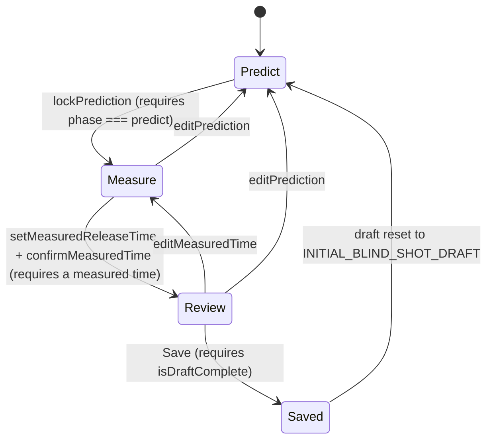

# System Architecture

## Purpose

This document defines the architectural direction of the Curling Performance Platform.

It describes the architectural principles that should guide implementation decisions over time.

It is intentionally independent of the current implementation details.

The implementation will evolve continuously.

The architectural principles should remain comparatively stable.

---

# Architectural philosophy

The architecture should support long-term evolution.

New functionality should be added by extending the system rather than rewriting it.

The platform should remain modular, maintainable and easy to understand while avoiding unnecessary complexity.

Architecture exists to support the product—not the other way around.

---

# High-level architecture

The platform should evolve around six major areas.

```text

Presentation

        │

Application

        │

Domain

   ┌────┼────┐

Analytics  Integrations

        │

Persistence

```

Each area has a clearly defined responsibility.

---

# Presentation

Responsible for:

- User interface

- Navigation

- Forms

- Charts

- Visual feedback

- Device status

- User interactions

Presentation should contain as little business logic as possible.

---

# Application

Responsible for coordinating workflows.

Examples:

- Start training session

- Finish training session

- Create blocks

- Record shots

- Associate measurements

- Validate user actions

Application logic coordinates the system.

It should not contain domain-specific calculations.

---

# Domain

The domain represents curling itself.

It contains concepts such as:

- Athlete

- Coach

- Team

- Training Session

- Training Block

- Drill

- Shot

- Measurement

- Target

- Feedback

The domain should remain independent of:

- React

- Next.js

- Browsers

- Bluetooth

- Brower Timing

- Apple Health

- Database technology

The domain is the heart of the platform.

---

# Analytics

Responsible for transforming data into insights.

Examples:

- averages

- consistency

- deviations

- trends

- baselines

- comparisons

- future coaching recommendations

Analytics should never depend on specific hardware vendors.

Analytics operate on domain data.

---

# Integrations

Integrations connect the platform to external systems.

Examples:

- Timing systems

- Stone sensors

- Apple Health

- WHOOP

- Garmin

- Video

- CSV imports

- Future APIs

Integrations translate external data into the internal domain model.

External formats should never leak into the domain.

---

# Persistence

Responsible for storing information.

Possible storage mechanisms may evolve over time.

Examples:

- Local browser storage

- Cloud database

- Offline cache

- Synchronisation layer

The rest of the application should not depend on a specific storage technology.

---

# Core architectural principles

## Domain-first

Everything revolves around curling concepts.

Technology should adapt to the domain—not vice versa.

---

## Device independence

No hardware manufacturer should become part of the core architecture.

Devices are replaceable.

The athlete's data is not.

---

## Local-first today

The current implementation is local-first.

Future cloud capabilities should extend the architecture without fundamentally changing the domain model.

---

## Progressive complexity

The architecture should grow only when required.

Avoid building infrastructure for hypothetical future features.

---

## Separation of concerns

Each layer should have one clear responsibility.

Avoid mixing:

- UI

- business logic

- persistence

- analytics

- integrations

---

## Backwards compatibility

Historical athlete data is valuable.

Whenever practical, new versions should migrate existing data instead of discarding it.

---

## Raw data preservation

Store sufficient raw information to support future analyses.

Never assume today's analytics are the final analytics.

---

# Domain hierarchy

The platform should evolve around the following hierarchy.

```text

Organisation (future)

    │

Team

    │

Athlete

    │

Training Plan

    │

Training Session

    │

Training Block

    │

Shot

    │

Measurement

```

Not every level currently exists.

The hierarchy describes the intended long-term structure.

---

# Measurements

Measurements should be independent from their source.

Examples:

- Release Time

- Rotation

- Speed

- Heart Rate

- Line Deviation

Possible sources include:

- Manual Entry

- Timing Gate

- Stone Sensor

- Wearable

- Camera System

Measurements should describe **what** was measured.

Sources describe **where** the information came from.

---

# Future extensibility

Potential future capabilities include:

- Native mobile applications

- Cloud synchronisation

- Team management

- Coach dashboards

- AI-assisted coaching

- Video analysis

- Sensor integrations

- Health integrations

The architecture should allow these capabilities without requiring major redesign.

However, they should only be implemented when justified by real product needs.

---

# Architectural decision rule

Whenever a significant architectural decision is made, ask:

1. Does this make future extensions easier?

2. Does it unnecessarily increase complexity today?

3. Does it keep the domain independent?

4. Does it preserve historical data?

5. Can this decision be reversed later?

---

# Non-goals

The platform should currently avoid introducing:

- Microservices

- Event sourcing

- Plugin frameworks

- Enterprise infrastructure

- Complex synchronisation

- Generic abstractions without practical use

Simple solutions should be preferred whenever they satisfy current requirements.

---

# Guiding principle

The architecture should remain as simple as possible today while making tomorrow's evolution as easy as possible.

---

# Current Implementation Snapshot

> Everything above this line is the long-term architectural **vision** for the Curling
> Performance Platform. Everything below documents what is **actually implemented today**
> in the Curling Release Tracker MVP (`PROJECT.md`). Where the two differ, the vision
> isn't wrong — the implementation just hasn't grown into it yet. This section uses the
> current code as ground truth and is expected to be revised as the app evolves; the
> sections above should rarely need to change.
>
> Status tags used throughout: **Implemented**, **Prepared**, **Planned**, **Open decision**.
> See `docs/adr/` for the reasoning behind the decisions marked with an ADR reference, and
> `docs/DOMAIN_GLOSSARY.md` for term definitions.

## Domain model (Implemented)

Three types, all in `src/types/index.ts`. There is no backend and no database — a
`Session` is the entire unit of persistence.

### Session

The current training session. Exactly one exists at a time (`currentSession` in
`TrackerApp.tsx`); completed sessions move into a `Session[]` history list.

| Field | Meaning |
|---|---|
| `id`, `title`, `date`, `notes` | Session identity and free-text metadata |
| `blocks: TrainingBlock[]` | All blocks created in this session, in creation order |
| `activeBlockId: string` | The block currently receiving shots. `""` means no block has been configured yet (see "Active Block" in the glossary) |
| `shots: Shot[]` | **Flat** list of every shot across every block in this session — shots are not nested inside blocks; they reference their block via `shot.blockId` |

A session has no explicit status field. "In progress" vs. "finished" is implicit:
the current session is whatever is in `currentSession`; clicking *Start New Session*
archives it into the history array (only if it has at least one shot) and creates a
fresh, blockless session. There is no partial/paused/completed session status —
only "current" (exactly one) and "history" (append-only list, deletable per entry
or entirely from the History view).

### TrainingBlock

A named, bounded stretch of shots sharing one training objective and one target
configuration. Ending one block and starting the next never mutates the old block —
`addTrainingBlock` stamps `completedAt` on the outgoing block and appends a new one.

| Field | Meaning |
|---|---|
| `mode: "fixed" \| "variable" \| "blind"` | **Training mode** — see below |
| `measurementMode: "back-hog" \| "hog-hog"` | **Measurement mode** — what the release time actually measures |
| `targetTime: number` | The block's default/fallback target — see "Target model" below; its exact meaning depends on `mode` |
| `variableTargetMode?: "smart-random" \| "manual"` | **Target source**, only set when `mode === "variable"` |
| `blindTargetMode?: "fixed" \| "smart-random" \| "manual"` | **Target source**, only set when `mode === "blind"` (has one more option than Variable Weight — see ADR-0004) |
| `smartRandomMin?`, `smartRandomMax?: number` | The configured Smart Random range, only set when the resolved target source is `"smart-random"` |
| `pendingTargetTime?: number` | The target to show/use for the *next* shot when the resolved target source is `"smart-random"` or `"manual"` — see "Target model" |
| `completedAt?: string` | Set once a newer block takes over; `undefined` means this is the active block |
| `accuracyThresholds?: { onTarget, acceptable }` | **Target Accuracy** tolerance, snapshotted once at block creation from whichever preset/custom pair was selected — never re-derived from the app's current default afterward. See ADR-0008 and `src/lib/accuracyThresholds.ts`. |

**Do not conflate four different concepts that all live near each other on this type:**

1. **Training mode** (`mode`) — *what kind of training is this block* (Fixed / Variable / Blind).
2. **Target source** (`variableTargetMode` / `blindTargetMode`) — *how is the target for the next shot determined* (Fixed / Smart Random / Coach-Manual). Only Variable and Blind blocks have one; Fixed Weight blocks are implicitly target-source "fixed".
3. **Measurement mode** (`measurementMode`) — *what the release time physically measures* (Back-Hog / Hog-Hog). Orthogonal to both of the above — any training mode can (in principle) use either measurement mode, though Smart Random is currently only available for Back-Hog.
4. **Shot classification** (`shot.shotType`) — *draw or takeout*, a property of the individual shot, not the block. Fixed and Variable Weight shots have one; Blind Weight shots do not (see "Shot" below).

`trainingBlocks.ts`'s `getEffectiveTargetMode(block)` is the one place that reads
`variableTargetMode`/`blindTargetMode` and normalizes them into a single
`"fixed" | "smart-random" | "manual"` value — every target-generation function
downstream (`getNextShotTarget`, `advanceBlockTarget`, `createTrainingBlock`) is written
once against that normalized concept instead of branching on `mode` repeatedly.

### Shot

| Field | Meaning |
|---|---|
| `blockId` | The block this shot belongs to (shots are flat on the session, not nested) |
| `shotNumber` | 1-based, sequential **within its block** — deleting a shot renumbers only the remaining shots of that same block |
| `releaseTime: number` | The measured release time — always required |
| `targetTime: number` | **The target that actually applied to this specific shot.** Always required, always a plain number captured at save time. Never recomputed, never touched again — even if the block's default target, Smart Random range, or pending target later change. This is what makes Variable/Blind Weight's changing targets historically safe: a block-level change can never retroactively alter what an already-recorded shot was judged against |
| `predictedTime?: number` | The player's own guess, locked in **before** `releaseTime` was known. Present **only** for Blind Weight shots; always `undefined` for Fixed/Variable Weight, and never fabricated during migration |
| `handle: "in" \| "out"` | Required for every shot, including Blind Weight |
| `shotType?: "draw" \| "takeout"` | **Optional.** Required in practice for Fixed/Variable Weight (the UI always sets one); genuinely absent for Blind Weight, which trains perception rather than shot execution. A missing `shotType` is a real, valid state — it is never defaulted to `"draw"` by the app itself. (Migration *does* fold truly-legacy garbage values like the removed `"guard"`/`"other"` into `"draw"`, since those were real historical classifications that no longer have a matching type — see "Persistence and migration") |

## Training modes (Implemented)

### Fixed Weight

- One constant target (`block.targetTime`) for every shot in the block.
- Each shot still stores its own `shot.targetTime` (copied from the block's target at
  save time) — Fixed Weight is simply the case where every shot in a block happens to
  share the same value, not a special code path in analytics or export.
- Shot type (draw/takeout) is required, same as it always has been.
- Analytics run unmodified: `analyzeShots` always compares each shot to its own
  `targetTime`, which is trivially correct here.

### Variable Weight

Target source (`variableTargetMode`) is one of:

- **Smart Random** — the app generates a new target after every shot, within a
  configured range. Only available when `measurementMode === "back-hog"` (see
  "Measurement modes"). Default for newly-created Variable Weight blocks.
- **Coach / Manual** — a human enters the next target before each shot. The
  previously-used value stays as an editable starting point so the same value can be
  reused or lightly adjusted without retyping it.

Both share:
- No required shot type — draw/takeout may still be picked (`ShotEntry.tsx` always
  offers it for Fixed/Variable), but nothing about target generation depends on it.
- Each shot's own `targetTime` is what was actually shown/used for that shot.
- `pendingTargetTime` holds the next target and survives reload; it is only
  regenerated *after* a shot is saved, never before.
- `smartRandomMin`/`smartRandomMax` hold the configured range for Smart Random blocks.
- The "natural transition" logic (below) applies identically to Blind Weight's Smart
  Random target source — it is not duplicated per training mode.

### Blind Weight

Trains the player's ability to *perceive* their own release time before it's measured.
Target source (`blindTargetMode`) is one of **Fixed**, **Smart Random**, or **Coach /
Manual** — Blind Weight is the only mode with a Fixed target-source option, since here
"fixed" describes *what the perception task is measured against*, not the training mode
itself (see ADR-0004).

- No shot type required, same reasoning and same "never fabricate one" rule as above.
- Entry follows a 3-phase state machine (`predict` → `measure` → `review`) — documented
  in full below.
- **Important clarification:** Blind Weight does not mean the app already knows the real
  release time and hides it. The actual release time genuinely doesn't exist inside the
  app until the player reads it off the external timing system and types it in — *after*
  locking their prediction. There is no capture-then-mask step anywhere in this codebase.
- A Blind Weight *draft* (in-progress prediction/measurement) is not a `Shot` — see
  ADR-0002. It never appears in analytics, charts, History, or CSV export while
  incomplete, and reload is allowed to lose it (only the block's own configuration and
  `pendingTargetTime` are guaranteed to survive reload).
- `shot.predictedTime` is set **only** on Blind Weight shots, at the moment of saving —
  never on Fixed/Variable Weight shots, never invented during migration.

## Target model (Implemented)

Four distinct concepts that are easy to conflate — kept deliberately separate here:

1. **Block default target** (`block.targetTime`) — the constant target for Fixed Weight
   and Blind+Fixed; the initial seed value used to create the very first
   `pendingTargetTime` for Manual mode.
2. **Next target** (`block.pendingTargetTime`) — what Smart Random/Manual blocks will use
   for the *next* shot. Persisted, survives reload, only changes after a shot is saved.
3. **Actually-used shot target** (`shot.targetTime`) — the immutable, per-shot value
   described above.
4. **Target source** (`variableTargetMode`/`blindTargetMode`) — which of the three
   generation strategies below produced #2.

### Fixed

`block.targetTime` is used directly for every shot; `pendingTargetTime` is never set for
this target source (`getNextShotTarget` falls through to `block.targetTime` whenever
`pendingTargetTime` is `undefined`).

### Manual (Coach)

- `pendingTargetTime` is seeded from `block.targetTime` at block creation.
- Before saving, the UI may override it (`ShotEntry`/`BlindShotEntry`'s editable target
  input); whatever value is actually used becomes both `shot.targetTime` and the new
  `pendingTargetTime` (`advanceBlockTarget`), so the same/adjusted value is ready as the
  next starting point without retyping.
- Earlier shots are never touched by a later manual change — `shot.targetTime` is a
  plain number copied at save time, not a reference to the block.

### Smart Random (`src/lib/variableTargets.ts`)

- Configured per block via `smartRandomMin`/`smartRandomMax` — **not** a fixed profile;
  the user picks the range they want to train (e.g. a narrow takeout-weight band) at
  block setup. Default for a newly-created block: **min 2.50s, max 4.50s**
  (`DEFAULT_SMART_RANDOM_MIN`/`MAX`).
- Step is **not** user-configurable: always **0.05s** (`SMART_RANDOM_STEP`). Minimum
  valid range width: **0.10s** (`MIN_SMART_RANDOM_RANGE_WIDTH`). Both bounds are snapped
  to the 0.05s grid and re-validated after snapping (`validateSmartRandomRange`).
- The next target is generated by `generateSmartRandomTarget({ min, max, recentTargets,
  randomFn })` and stored as `pendingTargetTime` — **only after a shot is saved**
  (`advanceBlockTarget`), never speculatively. Reload never changes it, because it's
  read straight from the persisted block.
- **Natural transitions**, not pure uniform randomness (this was a deliberate fix — a
  naive uniform draw could jump e.g. 4.45 → 2.50 → 4.35 between consecutive shots, which
  doesn't train anything realistic):
  - ~85% of the time (`1 - LARGE_JUMP_PROBABILITY`, `LARGE_JUMP_PROBABILITY = 0.15`) the
    next target stays within `TYPICAL_MAX_DELTA` (**0.40s**) of the last one — or the
    whole range, if the range itself is narrower than 0.40s.
  - ~15% of the time the next target may come from anywhere in the range, to train real
    adaptability.
  - Either way, exact repeats of the most recent target(s) are avoided when the range
    offers alternatives (2 shots of memory in the typical case, 1 in the large-jump
    case); if avoidance or the delta window would leave nothing to pick, the pool widens
    back to the full range rather than searching indefinitely — `generateSmartRandomTarget`
    always resolves in exactly 1–2 calls to its injected `randomFn`, never a loop.
- **Smart Random is currently only available for `measurementMode === "back-hog"`**
  (`isSmartRandomAvailable`). Hog-Hog has no validated range anywhere in this project's
  history — **it never falls back to the Back-Hog range or any invented Hog-Hog range**.
  When Hog-Hog is selected, Smart Random is disabled in the setup UI with an explicit
  explanation, and Fixed/Manual remain available (see ADR-0004 and Measurement Modes
  below).

## Measurement modes (Implemented / Open decision)

### Back-Hog

- **Implemented.** The only measurement mode with a validated Smart Random range today.
- Every training mode (Fixed, Variable, Blind) and every target source works with it.
- The exact curling-specific physical definition of "Back-Hog" (which line, which
  direction) is **not** re-derived or re-defined in this document — it's assumed to be
  the release-timing convention already understood by the app's users. If a precise,
  written physical definition doesn't exist elsewhere yet, that is an **open
  documentation gap**, not a code gap.

### Hog-Hog

- **Implemented for Fixed and Coach/Manual target sources.** Any training mode can use
  Hog-Hog as its measurement mode as long as its target source doesn't require Smart
  Random.
- **Smart Random is deliberately disabled for Hog-Hog** (`isSmartRandomAvailable`
  returns `false`) — not because it's technically hard, but because there is no
  validated Hog-Hog target range anywhere in this project (no prior defaults, no mock
  data, no product decision). Inventing one, or reusing the Back-Hog numbers, would
  silently misrepresent a physically different measurement as if it were the same thing
  — this was an actual bug earlier in this project's history, fixed and now guarded
  against (see ADR-0004).
- **Open decision:** what a validated Hog-Hog Smart Random range should be. Needs a
  domain expert / real training data, not an engineering guess.

## Blind Weight state machine (Implemented)

`src/lib/blindWeight.ts` holds a single discriminated `BlindShotDraft.phase`, not a set
of independent booleans — this makes states like "measured but no locked prediction" or
"reviewing without a measured time" structurally unrepresentable rather than merely
discouraged by convention.



Allowed transitions (all implemented as pure functions in `blindWeight.ts` that return
the draft **unchanged** — a safe no-op — if the precondition isn't met):

| Function | From → To | Precondition |
|---|---|---|
| `lockPrediction(draft, predictedTime)` | predict → measure | phase is `predict` |
| `setMeasuredReleaseTime(draft, releaseTime, source)` | measure → measure (no phase change) | phase is `measure` — this is the one function that never changes phase by itself; see "External timing integration" below |
| `confirmMeasuredTime(draft)` | measure → review | phase is `measure` **and** a measured time is already set |
| `editPrediction(draft)` | measure/review → predict | phase is `measure` or `review` |
| `editMeasuredTime(draft)` | review → measure | phase is `review` |
| `isDraftComplete(draft)` | (query, no transition) | true only when phase is `review` with both values set — gates the Save button |

Forbidden by construction (not just convention): predicting straight into review;
reviewing without a locked prediction or a measured time; a measured time becoming
visible before the prediction is locked; saving an incomplete draft.

**Value validation** (predicted/measured time must be a positive, parseable number) is
the caller's responsibility — `BlindShotEntry.tsx` validates before calling into
`blindWeight.ts`, which only enforces phase-transition validity, not value shape.

**Correction paths:** Edit Prediction (from measure *or* review) returns to predict with
the old prediction still shown as an editable value; Edit Measured Time (from review
only) returns to measure with the prediction still locked and the old measured value
editable. Neither path touches any already-saved `Shot` — they only ever mutate the
local, unsaved draft.

**Leaving an incomplete draft:** `hasUnsavedBlindProgress(draft)` is simply
`phase !== "predict"`. `TrackerApp.tsx` tracks this as `hasUnsavedBlindDraft` and gates
History navigation, "New Training Block", and "Start New Session" behind the existing
`ConfirmModal` ("You have an unfinished blind-weight shot..."). Confirming discards the
draft — no shot is saved, no shot number is consumed, `pendingTargetTime` is untouched —
and bumps `blindDraftResetToken`, which is part of `BlindShotEntry`'s React `key`, so a
subsequent *cancelled* action (e.g. dismissing the New Training Block modal) can't
resurrect the discarded draft.

**Reload:** the draft is plain component state, not persisted — a reload always resets
to `predict`. Only the block's configuration and `pendingTargetTime` are guaranteed to
survive reload (see ADR-0002 for why this is the deliberate first-cut rule, not an
oversight).

**Block switch / session end:** same discard-with-warning behavior as "leaving" above —
there is no separate code path for these; they all funnel through the same
`runOrConfirmBlindDraftDiscard` guard in `TrackerApp.tsx`.

**Why draft and Shot are separate concepts:** a `Shot` is meant to be a permanent,
analyzable training record. A draft is mid-entry UI state that may be wrong, abandoned,
or corrected multiple times before it's ever complete. Merging them would mean either
inventing fake shots for incomplete data, or teaching every consumer of `Shot` (charts,
analytics, export, filters) to understand "maybe incomplete" — both worse than keeping
the draft a purely local, throwaway concept until `isDraftComplete` is true.

## Data flows (Implemented)

### Block creation

```text
TrainingSetup (validated input)
  → tryCreateTrainingBlock (TrackerApp) — defensive re-validation, since a
    setCurrentSession updater must never throw
  → createTrainingBlock (trainingBlocks.ts)
      → resolve effective target mode (fixed / smart-random / manual)
      → validateSmartRandomRange, if applicable
      → generateSmartRandomTarget for the initial pendingTargetTime, if applicable
  → addTrainingBlock — stamps completedAt on the outgoing block, appends the new one
  → setCurrentSession → persisted to localStorage by the session-write effect
```

### Normal shot capture (Fixed / Variable Weight)

```text
getNextShotTarget(activeBlock) — the target already computed for this render
  → ShotEntry captures releaseTime, handle, shotType (+ a manual target override, if editable)
  → handleAddShot (TrackerApp)
      → computeShotTarget — manual override wins, else the pending/default target
      → new Shot stamped with that targetTime, next shotNumber in this block
      → advanceBlockTarget — generates/updates pendingTargetTime for the *next* shot
  → setCurrentSession → analyzeShots recomputed on next render from the updated shots
  → persisted to localStorage
```

### Blind Weight shot capture

```text
Target shown (Fixed value, or Auto-generated, or editable Manual field)
  → BlindShotEntry: predict phase — capture handle + predictedTime → lockPrediction
  → measure phase — read the external timing system → setMeasuredReleaseTime → confirmMeasuredTime
  → review phase — show target/prediction/actual/prediction error/target error
  → Save Shot & Continue → handleAddShot (same function as the normal flow, with
    shotType: undefined and predictedTime set)
  → advanceBlockTarget generates the next target only now
  → draft resets to predict
```

### Migration (`sessionMigration.ts`)

```text
Read raw JSON from localStorage
  → migrateSession(raw)
      → migrateBlocks — normalize mode/measurementMode/target sources; fabricate a
        single "Legacy Block" ONLY when `blocks` is entirely absent (not when it's an
        empty array — see the migration invariant below)
      → migrateShots — backfill missing shot.targetTime from the shot's block; never
        invent predictedTime; fold legacy/garbage shotType values to "draw", but leave a
        genuinely absent shotType absent
      → backfillPendingTargets — ensure variable/blind blocks have a valid
        pendingTargetTime and (for Smart Random) a valid range; force Hog-Hog Smart
        Random blocks to Manual (never fabricate a Hog-Hog range)
  → migrated Session used for the rest of the app's lifetime this load
```

### Export (`export.ts`)

```text
Session or session history
  → buildSessionCsv / buildHistoryCsv (pure string builders, no DOM access)
      → join each shot with its block (name, mode, target source, measurement mode, range)
      → compute prediction_error / absolute_prediction_error (blank if no predictedTime)
      → compute target_error / absolute_target_error (always present)
      → round every computed error to 3 decimals
  → exportSessionToCsv / exportHistoryToCsv — wrap the string in a Blob and trigger a download
```

## Analytics (Implemented)

All in `src/lib/analytics.ts`, operating on whatever `Shot[]` is handed to
`analyzeShots` — filtering happens *before* this call (`filterShots`), so every
metric described here is already filter-aware without analytics needing to know about
filters at all.

**Release-time metrics** — plain statistics of `shot.releaseTime`, no target involved:
`average`, `median`, `min`, `max`, `releaseTimeStandardDeviation`.

**Target metrics** — every shot judged against its own `shot.targetTime`:
- `averageDeviationFromTarget` (signed bias) and `averageAbsoluteDeviationFromTarget`
  (magnitude), both defined as `releaseTime - targetTime`.
- `targetErrorStandardDeviation` — spread of that same per-shot error. Kept under an
  unambiguous, distinct name from `releaseTimeStandardDeviation` on purpose (an earlier
  iteration of this app conflated "how much did release times vary" with "how much did
  they miss their target by" under one ambiguous `standardDeviation` field).

**Prediction metrics** (`analysis.prediction.*`) — Blind Weight only, computed from
whichever shots in the input happen to have a `predictedTime`:
- `predictionErrors` / `meanPredictionError` — signed, `predictedTime - releaseTime`.
  Positive means the player believed they were slower than they actually were; negative
  means they believed they were faster.
- `meanAbsolutePredictionError` — magnitude only, overall self-assessment accuracy.
- `predictionErrorStandardDeviation` — consistency of the self-assessment.
- `predictionCorrelation` — Pearson r between predicted and actual release time.
  **Never shown or interpreted alone** — a player who is confidently, consistently
  wrong by the same offset (e.g. always guesses 0.20s slow) can still score a high
  correlation. It is always shown alongside bias, absolute error, and standard
  deviation in the UI (Dashboard, History, Block Summary) for exactly this reason.
- All four return `null` — never `0`, `NaN`, or `Infinity` — when there isn't enough
  data: correlation needs ≥ 2 points with non-constant predicted *and* actual values
  (division by zero is guarded explicitly); the others need ≥ 1 shot with a
  `predictedTime`. Fixed/Variable Weight shots (no `predictedTime`) are silently excluded
  from these four metrics rather than counted as a prediction error of `0`.
- **UI naming note:** the Dashboard/History card labeled *"Avg Prediction Error"* /
  *"Mean Abs Prediction Error"* is always the **absolute** value
  (`meanAbsolutePredictionError`); the **signed** bias is always labeled *"Prediction
  Bias"*. This distinction is intentional and already consistent across the codebase —
  no renaming was needed as part of this review, but the naming will bear repeating if
  more prediction cards are ever added.

### Target Accuracy (Implemented, ADR-0008)

A second target-related lens, added alongside the plain target-deviation metrics above
— judges each shot against a resolved `AccuracyThresholds` snapshot rather than just
computing a raw error. `analyzeShots(shots, thresholds?)` takes an optional threshold
parameter (defaulting to the legacy/Standard preset for backward compatibility with
every pre-existing call site) and exposes:

- **`targetAccuracy: TargetAccuracyAnalytics`** (`computeTargetAccuracyAnalytics`) —
  `meanTargetError` (bias) and `meanAbsoluteTargetError` (magnitude) kept as always-
  distinct fields; `onTargetCount`/`acceptableCount`/`majorMissCount` (mutually
  exclusive, see `categorizeTargetError` in `src/lib/accuracyThresholds.ts`) plus their
  rates; `largestAbsoluteMiss`, `averageMajorMiss`,
  `positiveMajorMissCount`/`negativeMajorMissCount` (split by signed direction). All
  rate/mean fields are `null` — never `0`/`NaN`/`Infinity` — for zero shots.
- **`handleAccuracy: HandleAccuracyComparison`** (`computeHandleAccuracyComparison`) —
  the same `TargetAccuracyAnalytics` shape computed independently for `in`/`out`
  handle groups. Filtering always happens before this grouping.
- **`targetErrorBoxPlot` / `handleTargetErrorBoxPlots`** (`src/lib/boxPlotStatistics.ts`)
  — boxplot statistics (median-of-halves quantiles, 1.5×IQR whiskers/outliers) computed
  over **Target Error, never raw Release Time**. A boxplot's statistical outlier is a
  different concept from a Major Miss (see the Domain Glossary) and the two are never
  cross-labeled.
- **`interpretTargetErrorDirection(targetError, measurementMode)`** — the one place
  Target Error's sign is turned into language. Returns a mathematical `sign`
  (`"faster" | "slower" | "on-target"`) and a neutral `relativeToTargetLabel` always;
  only for `measurementMode === "back-hog"` does it also return a `curlingTendency`
  (`"more-weight-long" | "less-weight-short"`) — Hog-Hog has no documented, validated
  curling-outcome mapping for its sign, so it deliberately stays neutral-only (same
  "no fabricated precision" posture as Hog-Hog Smart Random, ADR-0004).

### Chart data preparation (Implemented) — `src/lib/chartData.ts`

Pure functions that shape already-filtered `Shot[]`/block data into chart-ready arrays
— no analytics computation happens inside any chart component (`src/components/*Chart.tsx`);
they only receive prepared data and render it. Covers: `prepareTargetErrorByShotData`,
`prepareTargetVsActualScatterData` (+ `hasMultipleTargetTimes`),
`prepareProgressMetricData` (+ rolling average, `groupProgressEntriesByMeasurementMode`),
`prepareShotQualityDistributionData`, and `hasUniformThresholds` (gates whether
on-target/acceptable reference bands or a "Thresholds vary" notice should show for a
multi-block selection). Chart color/label tokens live in `src/lib/chartTheme.ts` — no
chart hard-codes a handle/category color or re-derives sign-formatted text locally.

## History Analytics and Filtering (Implemented) — `src/lib/historyAnalysis.ts`

Everything in the History view — Key Progress Summary, Progress Metric Chart, Shot
Quality Over Time, the Target vs. Actual Scatterplot, Handle Analysis, and the
Blocks/Sessions list — reads from **one** `HistoryAnalysisContext`, built by
`buildHistoryAnalysisContext(sessionHistory, filters)`. No History chart or card is
allowed to independently re-filter `sessionHistory`; `TrackerApp.tsx`'s History branch
builds the context once per render and passes its fields down.

```text
All historical sessions
  → extract blocks and shots
  → HistoryAnalysisFilters (Training Category, Measurement Mode, Date Range, Handle,
    Shot Type, Session, Block, Target Range, Threshold Comparison Mode)
  → filtered comparable blocks (HistoryAnalysisBlockContext[])
  → filtered shots (flat, shot-level, across every comparable block/session)
  → progressEntries / scatter points / handle analytics / session-block list
```

### Training Category vs. Training Block vs. Session

*Training Category* is the UI-facing name for the existing `BlockMode` type (Fixed /
Variable / Blind Weight) — **not** a new domain concept or a renamed type; see
`TrainingCategory` in `historyAnalysis.ts`, a plain alias. A *Training Block* is one
concrete block within a *Session* (a Session may contain several different Blocks).
Progress is always computed **per comparable Training Block**, one point per block —
different Blocks within one Session are never automatically merged into a single
figure, and a Session-level rollup (in the Blocks/Sessions list) never mixes Measurement
Modes or Training Categories without an explicit "varies" notice.

### `HistoryAnalysisFilters`

```ts
type HistoryAnalysisFilters = {
  trainingCategory: TrainingCategory | null; // BlockMode | null
  measurementMode: MeasurementMode | null;
  dateRange: DateRangeFilter; // all | 30d | 90d | 6m | custom
  handles: Handle[];   // empty = Both
  shotTypes: ShotType[]; // empty = All
  sessionIds: string[];  // empty = All
  blockIds: string[];    // empty = All
  targetRange?: { min?: number; max?: number };
  thresholdComparisonMode: ThresholdComparisonMode;
};
```

**Defaults** (`resolveDefaultTrainingCategory`/`resolveDefaultMeasurementMode`): a single
available Training Category or Measurement Mode is auto-selected; with multiple
available, the previously-chosen value (persisted in `localStorage` under
`curling-release-tracker-history-filters`, the same simple per-key pattern already used
for the current session/history, not a new settings architecture) wins, else the first
available one — the app never leaves both unset, which would silently let incompatible
categories/modes mix in Progress or the Scatterplot. This resolution is a **plain
render-time derivation** in `TrackerApp.tsx` (`effectiveHistoryFilters`), not a
`useEffect` writing state back — deriving it during render avoids the
`react-hooks/set-state-in-effect` lint violation a naive "sync defaults via effect"
implementation would trip, and avoids an extra render pass.

### Threshold Comparison Mode

```ts
type ThresholdComparisonMode =
  | { type: "original" }
  | { type: "comparison"; thresholds: AccuracyThresholds };
```

- **Original** (default): each block is judged against its own persisted
  `accuracyThresholds` snapshot (ADR-0008) — "how well did I perform against the
  standard used in that training?"
- **Comparison**: every selected shot is temporarily re-classified with one shared
  `AccuracyThresholds` (Standard/Tight preset, or Custom) — "how do all selected
  trainings compare under one consistent standard?" This **never** mutates a
  `TrainingBlock` or `Shot` — `HistoryAnalysisBlockContext.thresholds` simply holds the
  override for that render's analytics instead of the block's own snapshot. Scatterplot
  coordinates (`targetTime`/`actualTime`) are unaffected either way; only
  On Target/Acceptable/Major Miss classification changes.
- `aggregateTargetAccuracyAcrossBlocks` (used for the Key Progress Summary rollup)
  categorizes **each shot against its own block's effective threshold** before
  counting — correct even when Original-mode blocks carry different snapshots, rather
  than picking one threshold and misjudging every other block against it.
  `representativeThresholds` picks a single value for *display labels only* (e.g. "within
  ±0.10s") when blocks disagree, falling back to the legacy default — the same
  approximation this codebase already used for the pre-existing session-level rollup.

### Dynamic analytics visibility

- **Handle Analysis** (`HandleAnalysisSection.tsx`) inspects which handles actually have
  shots in the current selection: two present → "Handle Comparison"; exactly one → "{Handle}
  Distribution" (never called a comparison); zero → an explicit empty state, not a blank
  chart.
- **Blind Weight** Prediction Accuracy cards (`PredictionDashboardCards`) only render
  when the selection's Training Category is Blind Weight — Target Accuracy cards remain
  the same for every category, since they apply uniformly (see ADR-0008).
- The Scatterplot is prominent (always expanded) for Variable Weight; for Fixed Weight
  with only one distinct target time it renders inside a collapsed `<details>` (secondary,
  one tap to expand) instead of being hidden — see "Current Session information
  hierarchy" below.

### Multi-session Scatterplot

`TargetActualScatterChart` is always shot-level (never reduced to block averages) and,
in History, receives every filtered shot across every comparable block/session at once
via `prepareTargetVsActualScatterData(shots, blocksById, sessionContextByBlockId)` — the
same function already used for the single-block Current Session case, now called with a
cross-block/cross-session shot list. `TargetVsActualPoint` carries `trainingCategory`
and `measurementMode` (in addition to the pre-existing `blockName`/`sessionTitle`/`date`)
so the History tooltip can show them. Back-Hog and Hog-Hog are never combined (the
Measurement Mode filter guarantees this upstream); combining Fixed and Variable Weight
deliberately, in one chart, is **not implemented** in this pass (see Technical Debt).

### Metric and chart explanation architecture — `src/lib/analyticsExplanations.ts` + `InfoButton.tsx`

One `AnalyticsExplanation` record (`title`, `shortDescription`, `whatItShows`,
`howToRead[]`, `betterMeans[]`, optional `possiblePatterns[]`/`limitations[]`) per core
metric/chart — the single source of truth rendered by `InfoButton.tsx` (an accessible
popover on wide screens, a bottom sheet on narrow ones via CSS breakpoints alone, same
markup) wherever that metric/chart appears (`DashboardCard`'s optional `explanation`
prop, `ChartCard`'s optional `explanation` prop). Chart subtitles read
`shortDescription`; nothing hard-codes a second copy of the same text. Back-Hog gets an
additional curling-tendency sentence (`biasExplanation`, `targetErrorByShotExplanation`);
Hog-Hog explanations stay neutral, since no validated curling-outcome mapping exists for
its sign (same posture as `interpretTargetErrorDirection`, ADR-0004's "no fabricated
precision"). `ExplanationContext` (`"current" | "history"`) swaps only the
*interpretation* framing (immediate in-block feedback vs. recurring cross-block
patterns) — the underlying math is identical either way.

`ChartCard`'s and `DashboardCard`'s title rows use a `<header>`, not a `<div>`, to hold
the title/label plus `InfoButton` — both to keep the popover's block-level content
(`<h3>`/`<p>`/`<ul>`) out of an invalid `<p>`-in-`<p>`/`<h2>`-containing-`<div>` nesting,
and so existing tests that scope a card by "the div containing this title" keep
resolving to the card's own root element instead of a new title-only wrapper.

### History information hierarchy

Sticky Analysis Filters (`HistoryFilterBar.tsx`, primary: Training Category, Measurement
Mode, Date Range, Handle, Threshold Comparison Mode; secondary, behind "More filters":
Shot Type, Session, Block, Target Range) → Analysis Context (`AnalysisContextSummary.tsx`
— headline + block/shot/date-span counts + short, non-overloading notices) → Key
Progress Summary → Progress Metric Chart → Shot Quality Over Time → Target vs. Actual
Scatterplot → Handle Analysis → Blocks and Sessions (a detail/navigation list onto the
same filtered selection — it no longer computes its own, separately-filtered rollup).

### Current Session information hierarchy

Active Block header + Shot Entry/Auto Capture → Dashboard (immediate feedback) → Target
Error by Shot (primary live chart) → Handle Analysis (same dynamic-visibility component
as History) → Target vs. Actual Scatterplot (prominent for Variable Weight; collapsed
`<details>` for Fixed Weight with one target) → Current Shots list → Target Time
Settings / Session Settings / Export / Start New Session. Same interpretation-text
math as History, framed for immediate in-block feedback (`ExplanationContext: "current"`).

## Persistence and migration (Implemented)

Two `localStorage` keys, written by two independent `useEffect`s in `TrackerApp.tsx`:

- `curling-release-tracker-current-session` — the current `Session`.
- `curling-release-tracker-session-history` — a `Session[]` of completed sessions.

Migration (`migrateSession`) runs unconditionally on every load of either key, whether
the data is brand new or years old — there is no version field or explicit "needs
migration" check; the function is written to be a safe no-op on already-current data.

- **Legacy sessions** (no `blocks` array *at all*) get a single fabricated `"Legacy
  Block"` (Fixed Weight, Back-Hog) to hold their pre-block-era shots.
- **⚠️ Migration invariant — do not regress this:** a session with `blocks: []` (an
  *empty array*, meaning "no first block configured yet") is **not** legacy data and
  must **never** be treated as if it were. This was an actual, shipped bug: a freshly
  created session that got written to `localStorage` before its first block existed —
  a completely normal state — was misdetected as legacy on the next load and given a
  bogus, unrequested "Legacy Block", silently skipping the intended setup screen. The
  fix (`Array.isArray(raw.blocks)` rather than a truthiness/length check) is covered by
  a regression test and must be preserved by any future change to `migrateBlocks`.
- **Missing `targetTime`** on an old shot is backfilled from that shot's own block's
  target; if even the block has none, a documented constant (`3.75`) is used —
  `predictedTime` is never backfilled this way; it's either present or stays `undefined`.
- **Missing `variableTargetMode`** defaults to `"manual"` (assume the old behavior was
  manual entry, since Smart Random didn't exist yet when such data could have been
  written) — new blocks default to `"smart-random"` instead; migration and creation are
  intentionally allowed to have different defaults.
- **Missing `blindTargetMode`** defaults to `"fixed"` if the block already has a
  `targetTime`, otherwise `"manual"`.
- **Smart Random ranges** missing on an old block default to
  `DEFAULT_SMART_RANDOM_MIN`/`MAX` (2.50s–4.50s).
- **Invalid Hog-Hog Smart Random blocks** (only possible from an earlier, since-fixed
  bug that let Hog-Hog share the Back-Hog range) are forced to Manual on migration; the
  old numeric `pendingTargetTime` is kept only as a plain, freely-editable manual
  starting value — never re-presented as if it were a validated range.
- **`pendingTargetTime`** already inside the (possibly just-backfilled) range is left
  untouched; outside the range, a single new one is generated once.
- **Missing or invalid `accuracyThresholds`** (absent, NaN, Infinity, zero/negative, or
  `acceptable <= onTarget`) repairs to the fixed legacy default (0.10s / 0.20s) — never
  to whichever preset the app currently defaults new blocks to (see ADR-0008). A valid
  stored snapshot is left untouched.
- **Already-recorded shot values are never rewritten** by migration, under any
  circumstance — only block-level configuration gaps are filled in.
- **Migration must be idempotent** — running it twice on its own output must be a
  no-op. This is enforced by tests (`sessionMigration.test.ts`) for every migration path
  described above, including the Hog-Hog-forced-to-Manual case.

## External timing integration boundary (Prepared)

See `docs/EXTERNAL_TIMING_INTEGRATION_DISCOVERY.md` for the full discovery plan. Summary
of what exists today:

```ts
setMeasuredReleaseTime(draft: BlindShotDraft, releaseTime: number, source: ReleaseTimeSource)
```

- `ReleaseTimeSource` (`src/types/index.ts`) is `"manual" | "external"`. Only `"manual"`
  is used today (typed into the Measured Release Time field); `"external"` exists as a
  named, tested placeholder — **no hardware, protocol, or device integration exists**.
- The function only takes effect during the `measure` phase (see the state machine
  above) — a value arriving through this path before the prediction is locked is
  silently discarded, by construction, not by a special case. This is the one rule that
  must hold regardless of where a future reading comes from: **an externally-supplied
  time must never become visible before the prediction is locked.**
  `source` is not currently stored anywhere (not on the draft, not on the `Shot`) —
  there is no product need for it yet; storing it later would be additive, not breaking.
- **Buffering an early external reading is intentionally not built.** Today, "too
  early" simply means "discarded". A real integration will need to decide whether to
  buffer a reading that arrives before the lock and re-deliver it once `measure` is
  reached, or require the device to wait for a "ready" signal — that decision is
  deferred, not resolved, to avoid guessing at hardware behavior that isn't known yet.
- Target architecture (**Planned**, not built):

  ```text
  Timing Device → Device Adapter → Release-Time Input Boundary
    → Blind Weight State Machine (setMeasuredReleaseTime, gated by phase)
    → Review → Shot Save
  ```

  The "Device Adapter" and "Release-Time Input Boundary" layers don't exist as code yet
  — `setMeasuredReleaseTime` **is** the input boundary today, just fed exclusively by a
  manual text field. A future adapter would call the exact same function; the state
  machine does not need to change to support it.

## Capture Sequences (Implemented for Fixed/Variable Weight; Prepared for Blind Weight; Planned for real hardware)

Automatic, sequential capture of multiple shots from a stream of timing readings —
built around the exact same provider-neutral boundary described above, generalized
beyond Blind Weight's single-value case. See ADR-0006 for the central design decision
and `docs/EXTERNAL_TIMING_INTEGRATION_DISCOVERY.md` for how this relates to a future
real device.

### The shared Timing Provider boundary (`src/lib/timingProvider.ts`)

```ts
interface TimingProvider {
  type: TimingProviderType; // "simulator" | "manual" | "external"
  start(): void | Promise<void>;
  stop(): void | Promise<void>;
  subscribe(listener: (result: TimingResult) => void): () => void;
}
```

- A `TimingResult` (`src/types/index.ts`) is a normalized reading:
  `{ id, receivedAt, source, measurements: TimingMeasurement[], deviceId?, laneId? }`.
  A `TimingMeasurement` is `{ measurementMode, value }` — a result *may* carry more than
  one measurement (e.g. a future device reporting Back-Hog and Hog-Hog from one throw),
  but only the one matching the active block's `measurementMode` is ever consumed; the
  rest are neither saved nor counted.
- Three implementations exist or are named today:
  - **Manual** (`createManualTimingResult`) — wraps a typed-in value into the exact same
    `TimingResult` shape. This is not a fallback bolted on beside the real boundary; it
    **is** the boundary, same as `setMeasuredReleaseTime`'s manual path for Blind Weight.
  - **Simulator** (`src/lib/simulatorTimingProvider.ts`, `SimulatorTimingProvider`) —
    development/test-only. Implements `TimingProvider` plus test-trigger methods
    (`simulateResult`, `simulateDuplicate`, `simulateDelayed`,
    `simulateMultiMeasurementResult`, `simulateInvalidResult`). Gated out of the
    production UI by `process.env.NODE_ENV !== "production"` in `TrackerApp.tsx` — it is
    never started, subscribed to, or rendered in a production build.
  - **External** (`"external"` as a `TimingProviderType` value) — **Planned, not
    implemented.** Named ahead of time, same as `ReleaseTimeSource` was for Blind Weight,
    so a future real adapter is just another `TimingProvider` implementation; nothing
    downstream needs to change.
- `ReleaseTimeSource` (Blind Weight's existing type) is now a type alias of
  `TimingProviderType` — same concept, same values, one definition instead of two
  competing ones for "where did this value come from."

### Capture Sequence domain model (`src/lib/captureSequence.ts`, `CaptureSequence` in `src/types/index.ts`)

A `CaptureSequence` is scoped to exactly one `TrainingBlock`, belongs to exactly one
`Session` (`session.captureSequence?`), and only ever has one active instance per
session at a time.

| Field | Meaning |
|---|---|
| `expectedShotCount` | Mandatory, validated whole number > 0, capped at `MAX_CAPTURE_SHOT_COUNT` (200 — a technical ceiling against typos, not a sporting limit) |
| `capturedShotCount` | Shots actually **saved** by this sequence — a duplicate, invalid, mismatched, or paused-and-discarded result never increments this |
| `status` | `"ready" \| "running" \| "paused" \| "completed" \| "cancelled"` |
| `handleMode` | `"manual" \| "fixed-in" \| "fixed-out" \| "alternate"` — see below |
| `shotType?` | Optional fixed classification applied to every captured shot — only meaningful for Fixed Weight, consistent with Variable/Blind Weight never requiring one |
| `processedResultIds` | Every `TimingResult.id` ever submitted, accepted or not — a resend of any of these is always a duplicate |
| `steps: CaptureStepRecord[]` | One entry per successfully captured shot, in order — the only state Undo needs (see below) |

Status transitions (`startCaptureSequence`, `pauseCaptureSequence`, `resumeCaptureSequence`,
`cancelCaptureSequence`) are pure, no-op-on-invalid-transition functions, same shape as
`blindWeight.ts`'s phase transitions. A sequence completes automatically the moment
`capturedShotCount === expectedShotCount` — there is no separate "finish" action.

**Blind Weight is deliberately out of scope for this pass** — `createCaptureSequence`
throws if `block.mode === "blind"`. Prediction must be locked before a measured time may
be used, which the current linear "receive result → save shot" flow doesn't model; rather
than build an unsafe half-integration, Blind Weight keeps its existing full manual
predict → measure → review flow, and Auto Capture is not offered for it (the UI shows an
explicit "not available yet" message). This is a **Prepared, not Planned-in-detail**
integration point — see `docs/EXTERNAL_TIMING_INTEGRATION_DISCOVERY.md`.

### Handle strategies

The handle for the *next* captured shot is computed by `computeNextCaptureHandle`,
purely from `capturedShotCount` (and, for `"manual"`, from live UI state) — nothing
extra needs to be persisted or reconstructed for Undo:

- `"fixed-in"` / `"fixed-out"` — constant.
- `"alternate"` — flips every shot starting from `startHandle`
  (`capturedShotCount % 2 === 0 ? startHandle : opposite`).
- `"manual"` — whatever the live "Next Handle" toggle in the UI currently says.

A duplicate, invalid, mismatched, or paused-and-discarded result never advances
`capturedShotCount`, and therefore never advances the handle sequence either.

### The one shot-save path (`processTimingResult`)

```ts
processTimingResult({ result, sequence, session, activeBlock, manualTargetOverride?, manualHandleOverride? })
```

This is the **only** place a `TimingResult` becomes (or doesn't become) a `Shot`.
Simulator results, manual-fallback results submitted through "Add Result Manually," and
(later) real hardware results all pass through here identically. It reuses the exact
same functions manual entry (`handleAddShot` in `TrackerApp.tsx`) already uses —
`computeShotTarget`, `advanceBlockTarget`, `getBlockShots`, `getNextShotNumberInBlock`
from `trainingBlocks.ts` — so Auto Capture can never diverge from manual entry's target
resolution, shot numbering, or target-advancement logic. There is deliberately no
parallel shot-save path.

Processing order (short-circuits at the first matching condition):

1. Result's block doesn't match the active block → `invalid`.
2. Sequence is `completed`/`cancelled` → `ignored-completed`.
3. Sequence is `paused` → `ignored-paused` (a result arriving while paused is
   **discarded, not buffered** — the same deliberate scope limit as Blind Weight's
   external-timing boundary; see `docs/TECHNICAL_DEBT_AND_ROADMAP.md`).
4. `result.id` already in `processedResultIds` → `duplicate`.
5. No measurements at all → `invalid`.
6. No measurement matches the active block's `measurementMode` → `measurement-mode-mismatch`
   (the result is never saved as a shot and never counted — but it's diagnosable, not
   silently dropped).
7. Matching value isn't plausible (`Number.isFinite(value) && value > 0`) → `invalid`.
8. Otherwise → `accepted`: a new `Shot` is built (target/handle/shot-number resolved via
   the shared functions above, plus `measurementSource`/`captureSequenceId`/
   `timingResultId`/`deviceId`/`laneId` from the result), the block's pending target is
   advanced, a `CaptureStepRecord` is appended, and the sequence completes automatically
   if `capturedShotCount` now equals `expectedShotCount`.

A value outside `[0.5s, 30s]` (`isUnusualTimingValue`) is **not** rejected — it's still
saved, with a non-blocking `unusualValueWarning` ("Unusual timing value: 12.85s. Saved.
Undo if this was a false trigger.") shown to the user. No sport-specific precision range
is enforced, consistent with this project's "no fabricated precision" principle.

### Target behavior per training mode

- **Fixed** — every captured shot uses `block.targetTime`, same as manual entry.
- **Variable / Smart Random** — the currently-shown `pendingTargetTime` is used; a new
  one is generated only *after* a shot is successfully saved, never speculatively —
  identical timing to manual entry.
- **Variable / Coach-Manual** — the live "Current Target" input in the Auto Capture
  panel supplies `manualTargetOverride`; capture only proceeds once this holds a valid
  target, mirroring `ShotEntry`'s existing editable-target requirement for this same
  target source.

### Undo (`undoLastCapturedShot`)

Reverses only the most-recently-captured shot **of this exact sequence** — never an
older manual shot. Restoration is exact, not reconstructed:

- The removed shot's `CaptureStepRecord.previousPendingTargetTime` is written back to the
  block verbatim — **no new random target is ever generated**, so Smart Random Undo
  cannot produce a different target than existed before the undone shot.
- `capturedShotCount` is decremented; a `"completed"` sequence flips back to `"running"`
  if its last shot is undone.
- Handle progress is automatically correct once `capturedShotCount` is decremented, since
  `computeNextCaptureHandle` is a pure function of that count — no separate handle
  history needs restoring.
- **The undone result's id is deliberately NOT removed from `processedResultIds`** — it
  stays "spent" forever for this sequence. A replacement shot needs a genuinely new
  `TimingResult` id; resubmitting the undone one is still a `duplicate`. This is a
  chosen semantic (see ADR-0006), not an oversight.

### Pause / Resume / Cancel

- **Pause** does not stop the `TimingProvider` itself (pausing is a sequence-level
  concern) — it stops results from being processed as shots. A result received while
  paused is diagnosed as `ignored-paused` and discarded; the UI also disables "Add
  Result Manually" while paused, as a matching UX signal (the domain layer would refuse
  it either way).
- **Resume** picks up exactly where the sequence left off — target, handle progress, and
  `capturedShotCount` are all untouched by pausing.
- **Cancel** (`ConfirmModal`-gated) sets `status: "cancelled"`. Already-saved shots are
  never deleted; the active block is untouched; classic manual shot entry remains fully
  available afterward; no session end is triggered.
- Attempting to leave a running/paused sequence (open History, start a New Training
  Block, or Start New Session) shows the same kind of `ConfirmModal` warning already used
  for an in-progress Blind Weight draft (`runOrConfirmCaptureLeave`, composed with the
  existing Blind guard via `guardLeavingActiveWork` in `TrackerApp.tsx`) — confirming
  cancels the sequence (shots already saved remain) before the navigation proceeds.

### Persistence and reload (`sessionMigration.ts`'s `migrateCaptureSequence`)

- The active `CaptureSequence` is persisted as part of `Session` and migrated on every
  load, same as everything else in `sessionMigration.ts`.
- **A `"running"` sequence is always forced to `"paused"` on load** — the
  `TimingProvider` (in particular the Simulator) is never silently running again after a
  reload; the user must explicitly tap Resume. Doing this only when the *raw* stored
  status is literally `"running"` (not when it's already `"paused"`) keeps migration
  idempotent — a second migration pass doesn't stamp a fresh `pausedAt` over an existing
  one.
- `expectedShotCount`/`capturedShotCount`/`processedResultIds`/`steps` all survive reload
  unchanged — no double-counting, no re-processing of already-seen result ids.
- A structurally invalid persisted sequence (no valid `expectedShotCount`, or more real
  captured shots than `expectedShotCount` allows) is **discarded, not repaired** — same
  "don't invent a value migration can't know" rule as the rest of `sessionMigration.ts`.
  A sequence referencing a block that no longer exists is discarded the same way, before
  `sanitizeCaptureSequence` ever runs. See "Persistence validation and repair" below for
  the cases that ARE repaired rather than discarded.

### Race conditions and serialized result processing (Implemented)

Two distinct problems, both solved by the same mechanism (`TrackerApp.tsx`):

1. **Two `TimingResult`s arriving in the same synchronous tick** (two simulator events
   fired without an `await` between them, or a simulator event and an "Add Result
   Manually" click landing together) must never be processed concurrently, never read a
   torn/stale copy of each other's in-flight work, and must never collide on shot number,
   double-count, or silently drop one of the two.
2. **Reading the *outcome* of a state transition synchronously**, right after triggering
   it (needed for the "Shot N captured: X.XXs" feedback and the Simulator's debug log) —
   this is a different problem from #1, and the two are easy to conflate. React
   guarantees that queued functional `setState` updaters chain correctly against each
   other (a later updater always sees the result of an earlier queued one), but it does
   **not** guarantee an updater is invoked *synchronously* at the moment `setState` is
   called — that only happens as an internal "eager state" optimization when no other
   update is already pending. Code that needs to synchronously know a transition's
   outcome cannot safely depend on that optimization (it silently stops firing the moment
   two updates are queued in the same tick).

**Chosen solution:** a small, hand-rolled Promise queue plus an authoritative session
mirror — no external state-management library, no reducer framework.

```text
processIncomingTimingResult(result)
  → captureQueueRef.current = captureQueueRef.current.then(() => processQueuedTimingResult(result))
      → reads sessionRef.current (never `currentSession` from the render closure)
      → applyTimingResultToSession(...) — the pure atomic transition (see below)
      → commitSession(nextSession) — writes sessionRef.current AND calls setCurrentSession
        synchronously, together, before returning
  → next queued result starts from here
```

- `sessionRef` (a `useRef`) mirrors the session. Every capture-mutating action —
  processing a result, and every Pause/Resume/Cancel/Undo/Start-sequence handler, via a
  shared `commitSession(nextSession)` helper — writes this ref **synchronously**, at the
  same point it calls `setCurrentSession`. This is what makes "read the latest session
  right now, without waiting for a render" possible at all.
- `captureQueueRef` is a `Promise` that each call to `processIncomingTimingResult` chains
  onto via `.then()`. Because `.then()` callbacks for the same promise chain always run
  in registration order, two results queued back-to-back — even in the exact same
  synchronous tick — are guaranteed to run one at a time, each starting from the
  immediately-preceding result's already-committed `sessionRef.current`. An outer
  `.catch()` on the chain exists purely so a bug in the queue plumbing itself (not an
  ordinary rejection like `"duplicate"`, which is a normal return value, never a thrown
  exception) can never permanently wedge the queue and silently drop every subsequent,
  unrelated result.
- This makes `processIncomingTimingResult` **not synchronous** — actual processing is
  always deferred by at least one microtask. This is a deliberate trade-off: the tiny,
  imperceptible delay buys a correctness guarantee that doesn't depend on React's
  internal `setState` batching/eager-evaluation behavior at all.
- `sessionRef` is also resynced after every render (in a `useEffect`) as a catch-all for
  the *other*, non-capture handlers (`handleAddShot`, `handleDeleteShot`, block
  creation, ...) that still use the classic functional-`setState`-updater pattern and
  don't call `commitSession`. **Known, narrow edge case, out of scope for this pass:** if
  a classic manual shot (`ShotEntry`) is added in the same render window as a capture
  result is being processed for the *same* block (both can be on screen at once — Auto
  Capture is additive, not exclusive), there is a brief window before the next render
  where `sessionRef` may not yet reflect the manual shot. See
  `docs/TECHNICAL_DEBT_AND_ROADMAP.md`.

### The atomic Capture Sequence transition (Implemented)

`applyTimingResultToSession({ session, result, manualTargetOverride?,
manualHandleOverride? })` (`src/lib/captureSequence.ts`) is the single pure function that
computes "old `Session` + `TimingResult` → new `Session`" in one step: shot append,
block replace, and `CaptureSequence` replace are computed together and returned as one
object, never as three separately-observable state changes. It has no framework
dependency (plain values in, plain values out), which is what makes it safely callable
from the hand-rolled queue above instead of needing React's `setState` semantics at all —
and independently unit-testable without a browser or React (see
`captureSequence.test.ts`'s `applyTimingResultToSession` suite, which exercises exactly
this: two and three results applied sequentially never collide on shot number; a
manual result and a simulator result interleaved each get a distinct, deterministic
position; a rejected result returns the *exact same* session reference, proving no
partial mutation happened).

### Save-Fehler semantics: paused + `lastError`, not a new status (Implemented)

`processTimingResult`/`applyTimingResultToSession` never throw for an ordinary
rejection (duplicate, invalid, paused, completed, mismatch) — those are always a normal
returned outcome. A genuine exception (a bug, not a rejection) is caught in
`TrackerApp.tsx`'s `processQueuedTimingResult`: the session's shots/blocks are left
**exactly as they were** (no partial capture progress), and the sequence is forced into
`"paused"` with a new `lastError: string` field set (`pauseCaptureSequenceWithError`),
surfaced in the Auto Capture UI. There is deliberately **no** separate `"error"`
`CaptureSequenceStatus`: reusing `"paused"` means every existing paused-state UI/guard/
migration rule already applies without needing a new one, and Resume already means "the
user has explicitly decided to continue" — `resumeCaptureSequence` clears `lastError` on
a successful resume, so a subsequent successful capture starts from a clean slate. No
automatic retry is attempted.

### Persistence validation and repair (Implemented)

`sanitizeCaptureSequence(sequence, shotsForThisSequence)` (`src/lib/captureSequence.ts`)
is called from `sessionMigration.ts`'s `migrateCaptureSequence`, after structural
coercion (type-checking raw JSON) and after the block-reference/`expectedShotCount`
discard checks. It cross-checks the sequence against `shots` — **the actually-saved
shots are the primary source of truth**, never the separately-stored counters:

- `capturedShotCount` is always recomputed from the real number of shots whose
  `captureSequenceId` matches — never trusted from the stored value.
- `steps` is filtered to only those whose `shotId` matches a real, still-existing shot —
  a step referencing a vanished shot is dropped, never repaired by inventing one.
- `processedResultIds` is widened (never narrowed) from the *original, unfiltered*
  steps — so a result whose shot later vanished still stays "spent" forever; it can
  never accidentally become resubmittable as if it were new.
- `completedAt`/`cancelledAt` are cleared whenever they don't match `status` (e.g. a
  `completedAt` stamp on a `"running"` sequence is nonsensical and discarded).
- A `"completed"` sequence whose real shot count doesn't actually reach
  `expectedShotCount` is reopened as `"paused"` (with a `lastError` explaining why) —
  safer than either silently treating it as done, or discarding real, valid shots.
- The whole sequence is discarded (not repaired) if `expectedShotCount` isn't a valid
  positive integer, or if the real captured-shot count exceeds `expectedShotCount` — an
  impossible state that can't be safely repaired by guessing which shots "shouldn't
  count."
- `sanitizeCaptureSequence` is idempotent by construction (applying it to its own output
  is a no-op) — verified by a dedicated test, the same discipline
  `sessionMigration.ts` already applies everywhere else.

### Provider lifecycle and Strict Mode (Implemented)

The Simulator subscription effect in `TrackerApp.tsx` follows the standard
subscribe-in-effect / unsubscribe-in-cleanup shape: `subscribe`/`unsubscribe` are a
plain `Set` add/delete, and `start`/`stop` are a plain boolean flag (both idempotent —
calling either twice in a row changes nothing further). This means:

- React Strict Mode's dev-only mount → cleanup → remount double-invoke can never result
  in two active listeners — the cleanup always unsubscribes the first listener before
  the second mount subscribes a new one.
- A delayed/in-flight simulated result from an instance that has since been cleaned up
  (unsubscribed) can never reach a listener that no longer exists — it simply has no
  listener to call.
- A delayed result that fires while the *same* listener is still subscribed, but after
  the sequence it was intended for has been cancelled, is still correctly rejected — not
  by any provider-level mechanism, but because `processTimingResult` checks the
  sequence's `status` at processing time, not at emission time (see "Race conditions"
  above): a `"cancelled"`/`"completed"` sequence ignores every result regardless of when
  it arrives.
- **Known, documented scope limit:** a `TimingResult` carries no sequence identity (real
  hardware has no concept of "which capture sequence" either — see ADR-0006). If a
  sequence is cancelled and a **new** sequence is started for the same block before a
  stale delayed result arrives, that result is attributed to the new, running sequence
  as its next shot — there is no "generation token" tying a result to the specific
  sequence that was active when it was requested. This is a deliberate, tested
  simplicity trade-off (see `tests/e2e/stale-callback.spec.ts`), not an oversight — see
  `docs/TECHNICAL_DEBT_AND_ROADMAP.md`.
- Verified directly at the provider level by a dedicated unit test simulating the exact
  Strict Mode mount→cleanup→remount sequence (`simulatorTimingProvider.test.ts`).

### Contract for a future real Timing Provider (Planned, formally specified now)

Any future non-simulator, non-manual `TimingProvider` implementation must satisfy:

- **Result id** — stable within one provider source; the same id for a genuine retry of
  the same reading; a new id for a genuinely new measurement. The app treats id equality
  as the *only* signal of duplication — two results with an identical measured value but
  different ids are two distinct shots, never merged or treated as suspicious.
  **No exactly-once delivery is required or assumed** — the app is built to tolerate
  at-least-once delivery (duplicates arriving) by deduplicating on id; it never assumes a
  provider will avoid resending.
  Ordering: a provider should preserve the order readings actually occurred in, but the
  Capture Sequence layer serializes processing itself regardless (see "Race conditions"
  above) — it does not trust or depend on provider-side ordering for correctness.
- **Timestamps** — `receivedAt` is when the app received the result, not necessarily when
  the measurement physically occurred; a future adapter may add a separate
  measurement-time field additively, without needing to change this one's meaning.
- **Multi-measurement results** — a single result may carry more than one
  `TimingMeasurement`; only the one matching the active block's `measurementMode` is ever
  consumed. The order of measurements within one result carries no meaning about shot
  order — shot order is entirely determined by the order results are *processed* in, not
  by measurement array position.
- **Lifecycle** — `start()`/`stop()` and `subscribe()`/its returned unsubscribe function
  are the entire contract (see `timingProvider.ts`). A provider has no access to Session
  state, capture sequence state, or React state of any kind — it only ever emits
  `TimingResult` values to its subscribers. Error propagation and connection status are
  **not yet part of the contract** — deliberately deferred until a real device's actual
  failure modes are known (see `docs/EXTERNAL_TIMING_INTEGRATION_DISCOVERY.md`); a
  `TimingProviderError` shape was considered for this pass and intentionally not added,
  since inventing error codes for a device that doesn't exist yet would be exactly the
  kind of "looks real but isn't" fabrication this project's principles warn against.

### Shot metadata (`Shot` in `src/types/index.ts`)

Five new optional fields, all `undefined` for every shot recorded through the classic
manual flows (ShotEntry/BlindShotEntry) and never fabricated by migration:
`measurementSource`, `captureSequenceId`, `timingResultId`, `deviceId`, `laneId`. A
captured shot is otherwise an entirely ordinary `Shot` — analytics, History, charts,
filters, and CSV export all handle it without any special-casing, by construction (see
"Analytics" above and `export.ts`'s CSV columns).

### Not implemented (Planned)

Real hardware/radio/Bluetooth/USB/serial integration, an `"external"` `TimingProvider`
implementation, a formal `TimingProviderError` shape (considered, deliberately deferred —
see above), multi-lane or multi-athlete capture, a "generation token" tying a result to
the specific sequence that was active when it was requested (see the Provider lifecycle
scope limit above), buffering a result that arrives while paused, and Auto Capture for
Blind Weight. See `docs/EXTERNAL_TIMING_INTEGRATION_DISCOVERY.md` and
`docs/TECHNICAL_DEBT_AND_ROADMAP.md`.

## Module responsibilities / architecture boundaries (Implemented)

### UI components (`src/components/`)

| Component | Responsibility |
|---|---|
| `TrainingSetup.tsx` | Block creation/edit form: mode, measurement mode, target source, Smart Random range, Accuracy Threshold preset/custom picker, inline validation |
| `NewTrainingBlock.tsx` | Modal wrapping `TrainingSetup` for mid-session block switches; also renders the outgoing block's summary cards |
| `ShotEntry.tsx` | Fixed/Variable Weight single-step shot capture (release time, handle, shot type, optional editable target) |
| `BlindShotEntry.tsx` | Blind Weight's 3-phase capture UI, wired to `blindWeight.ts` |
| `ReleaseTrendChart.tsx` | Per-block chart: target/release/(prediction if present) over shot number, with a combined tooltip |
| `DashboardCard.tsx` | One shared metric-tile presentational component (label/value/optional sublabel/tone/explanation), used by the live Dashboard, History, and Block Summary |
| `TargetAccuracyDashboardCards.tsx` | The shared Bias/Average Error/On Target/Major Misses/... card set — formats a pre-computed `TargetAccuracyAnalytics`, never computes analytics itself |
| `TargetErrorChart.tsx` | Target Error by Shot — bar chart with on-target/acceptable reference bands and a zero line |
| `TargetActualScatterChart.tsx` | Target vs. Actual scatterplot with a y=x reference diagonal and a clickable In/Out legend toggle (visual filter only); shot-level across multiple blocks/sessions in History |
| `HandleBoxPlot.tsx` | Custom-SVG boxplot of Target Error by handle (no Recharts boxplot primitive exists) — statistical outliers kept visually/semantically distinct from Major Miss |
| `HandleErrorBarChart.tsx` | Handle Bias and Consistency — mean Target Error ± 1 SD per handle, via Recharts `ErrorBar` |
| `HandleAnalysisSection.tsx` | Wraps Boxplot + Bias/Consistency with one dynamic heading ("Handle Comparison" / "{Handle} Distribution" / empty state) based on which handles are actually present |
| `ProgressMetricChart.tsx` | Selectable-metric progress line chart across blocks/sessions, with a 3-block rolling average — one point per comparable Training Block |
| `ShotQualityTrendChart.tsx` | 100%-stacked On Target/Acceptable/Major Miss distribution, one bar per block, plus an optional Major-Miss/On-Target trend summary (≥3 comparable, non-tiny blocks) |
| `ChartCard.tsx` | Shared chart shell: title + optional `InfoButton`, subtitle, contextual notices, consistent empty state |
| `InfoButton.tsx` | The one Info-popover/bottom-sheet affordance for `AnalyticsExplanation` content — keyboard-operable, Escape closes and returns focus |
| `HistoryFilterBar.tsx` | Sticky History filter bar — primary filters (native `<select>`s) apply immediately; secondary filters behind "More filters" with explicit Apply/Reset |
| `AnalysisContextSummary.tsx` | The "what am I looking at" line directly under the sticky filters — headline, block/shot/date-span counts, short contextual notices |
| `TargetTimeSettings.tsx` | Edits the active block's constant target — only rendered for Fixed Weight and Blind+Fixed |
| `AutoCapture.tsx` | Capture Sequence start form + live status/Pause/Resume/Cancel/Undo/"Add Result Manually" panel — not rendered for Blind Weight blocks |
| `TimingSimulatorPanel.tsx` | Dev/test-only Timing Simulator controls, gated by `process.env.NODE_ENV !== "production"` |

### Domain and logic modules (`src/lib/`)

| Module | Responsibility |
|---|---|
| `trainingBlocks.ts` | Block lifecycle and target resolution: creation, active-block/shot lookups, `getEffectiveTargetMode`, `advanceBlockTarget`, labels |
| `variableTargets.ts` | Pure Smart Random logic: validation, candidate generation, natural-transition selection; measurement-mode availability gate |
| `blindWeight.ts` | Pure Blind Weight phase state machine and prediction/target error formulas |
| `analytics.ts` | All release-time/target/prediction/Target-Accuracy statistics, plus `interpretTargetErrorDirection` (see ADR-0008) |
| `accuracyThresholds.ts` | `AccuracyThresholds` presets (Standard/Tight), validation, `categorizeTargetError`, legacy-default resolution |
| `boxPlotStatistics.ts` | Pure, generic median-of-halves boxplot statistics (median/Q1/Q3/whiskers/statistical outliers) over any `number[]` |
| `chartData.ts` | Pure chart-data preparation (Target Error by Shot, Target-vs-Actual scatter, Progress, Shot Quality) — chart components never compute analytics themselves |
| `chartTheme.ts` | Central chart color/label tokens (handle colors, category colors, axis formatting) — no chart hard-codes its own |
| `historyAnalysis.ts` | The central History filter pipeline: `HistoryAnalysisFilters`, `ThresholdComparisonMode`, `buildHistoryAnalysisContext`, default-selection resolution, `aggregateTargetAccuracyAcrossBlocks` |
| `analyticsExplanations.ts` | Central `AnalyticsExplanation` content for every core metric/chart — one source for `InfoButton`, chart subtitles, and (later) translation |
| `shotFilters.ts` | Handle/shot-type filtering for the active block view (Current Session only) — History's filtering now goes through `historyAnalysis.ts` |
| `sessionMigration.ts` | The one place old or partial `localStorage` JSON becomes a valid `Session` |
| `export.ts` | CSV string building (pure) and the DOM download side-effect |
| `timeInput.ts` | Shared numeric input parsing/formatting (`3.75` or `375` → `3.75`, signed formatting) |
| `timingProvider.ts` | The shared `TimingProvider` contract and `createManualTimingResult` |
| `simulatorTimingProvider.ts` | Dev/test-only `TimingProvider` implementation with test-trigger methods |
| `captureSequence.ts` | Capture Sequence lifecycle, handle strategies, `processTimingResult`/`applyTimingResultToSession` (the one shot-save path for captured shots, plain-value in/out), Undo, `sanitizeCaptureSequence` (persistence repair), `pauseCaptureSequenceWithError` |

### Orchestration — `TrackerApp.tsx`

The one client component that owns all application state: current session, history,
active view, filters, the edit-shot form, the new-block modal, confirm dialogs, the
Blind-draft-leave guard, the Capture Sequence handlers (`processIncomingTimingResult`
and Start/Pause/Resume/Cancel/Undo), and the stable `SimulatorTimingProvider` instance.
It reads `localStorage` on mount, migrates, and persists on every change.

`processIncomingTimingResult` is the one place a `TimingResult` (from the simulator
subscription or from "Add Result Manually") gets applied to session state. It appends
onto `captureQueueRef`, a Promise chain that serializes processing (see
"Race conditions and serialized result processing" in the Capture Sequences section
above) — each queued call reads `sessionRef.current` (an authoritative session mirror,
not `currentSession` from the render closure), computes the next state via the pure
`applyTimingResultToSession` (`captureSequence.ts`), and commits both the ref and React
state together via a shared `commitSession` helper before the next queued result runs.
This is deliberately not the same shape as `handleAddShot`'s direct functional-updater
call — it needs a synchronous, framework-independent read of the outcome for
diagnostics/feedback, which a `setState` updater cannot reliably provide (see that
section for why). The simulator subscription itself is wired in a `useEffect` that calls
this function from the subscription's callback, not synchronously in the effect body —
the sanctioned pattern for bridging an external subscription into React state, which
does not trip the `react-hooks/set-state-in-effect` lint rule (unlike the one
pre-existing, documented exception on initial load — see
`docs/TECHNICAL_DEBT_AND_ROADMAP.md`). Refs that mirror render state for this purpose
(`sessionRef`, `captureManualHandleRef`, `captureManualTargetInputRef`) are resynced via
small dedicated `useEffect`s rather than mutated during the render body itself — this
project's lint config flags ref mutation during render (`react-hooks/refs`) even for the
"adjust during render" pattern used elsewhere in this codebase (e.g. `ShotEntry.tsx`'s
local component state) — the effect-based form is the version that stays lint-clean for
refs specifically.

**Is this too much responsibility?** At ~1,900 lines, yes, in the sense that it is by
far the largest file in the project and touches nearly every domain concept. **No**, in
the sense that splitting it today would mostly move code around without reducing real
complexity — the state genuinely is one interconnected session/active-block/filter/
capture graph, and the *domain logic* (target resolution, migration, analytics, Smart
Random, Capture Sequence processing) is already correctly extracted into `src/lib/`.
What remains in `TrackerApp.tsx` is close to pure orchestration: read state, call a
`lib/` function, write state back.

Concrete risk: new features keep landing as more `useState` + more inline JSX in the
same file, and it will keep growing. Sensible extraction boundaries, **when** (not yet)
that becomes painful:
- The History view (its own filters, its own block/session rendering,
  `HistoryBlockPanel`/`PredictionDashboardCards`) is the most self-contained candidate
  for a `HistoryView.tsx` extraction — it already only reads props it's given.
- The Blind-draft-leave guard (`hasUnsavedBlindDraft`, `blindDraftResetToken`,
  `runOrConfirmBlindDraftDiscard`) and the Capture Sequence leave guard
  (`runOrConfirmCaptureLeave`) are already composed through one shared
  `guardLeavingActiveWork` function rather than duplicated per navigation action — a
  further extraction into a `useLeaveGuards` hook would be reasonable if a third kind of
  "unsaved work" is ever added.
- The inline shot-edit form (release time/handle/shot type) could become its own
  component if it ever needs to support editing `predictedTime` (it currently doesn't —
  see Technical Debt).

None of these are done in this pass — they would be pure code movement without a
concrete bug or blocked feature motivating them right now, which this project's own
principles argue against ("evolution over perfection", "avoid unnecessary complexity").
Revisit when a *new* feature would otherwise have to be wedged into `TrackerApp.tsx` in
a way that clearly duplicates one of the boundaries above.